# 分布式锁

**什么是分布式锁？**

当多个进程在同一个系统中，用分布式锁控制多个进程对资源的访问

**分布式锁应用场景**

- 传统的单体应用单机部署情况下，可以使用java并发处理相关的API进行互斥控制
- 分布式系统后由于多线程，多进程分布在不同机器上，使单机部署情况下的并发控制锁策略失效，为了解决跨JVM互斥机制来控制共享资源的访问，这就是分布式锁的来源；分布式锁应用场景大都是高并发、大流量场景


## 自旋锁

## 共享锁(读锁)


## 排他锁(写锁)

当写操作没有完成之前，它会阻断其他写锁和读锁

## 乐观锁

通过版本号循环抢锁

## 悲观锁

当有锁时，其他抢锁线程必须等待


## 单机锁

- synchronized
- ReentrantLock

## Redis

中小项目


## Zookeeper

**Java客户端实现**

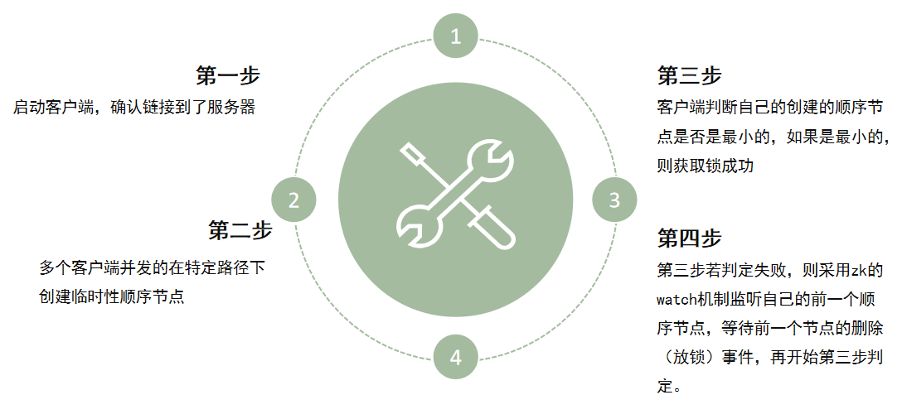

**ZK锁原理**

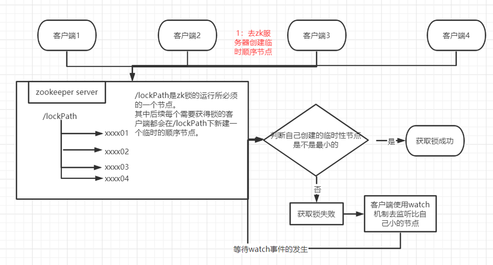

**源码**

这个类是curator实现的可重入公平的排它锁

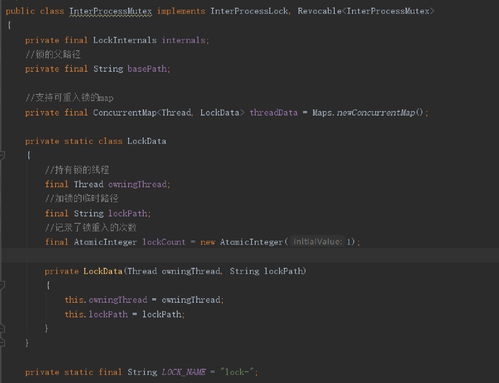

acquire方法是获取锁资源的入口，在java内部为了一些必要的状态：重入的次数等

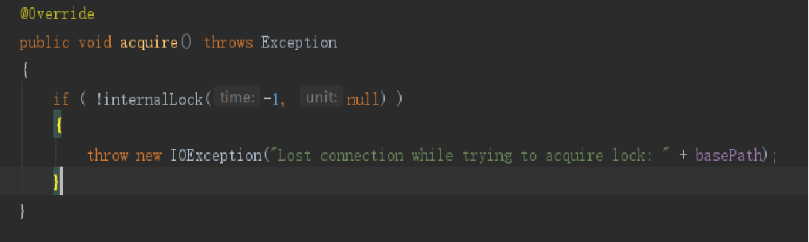

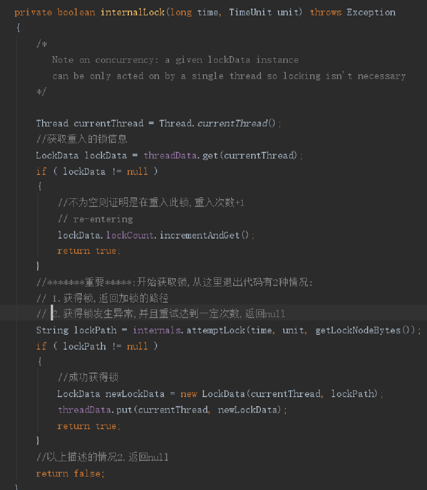

```sh
# 
# 这个方法会去尝试获取锁
org.apache.curator.framework.recipes.locks.LockInternals#attemptLock：
# 创建锁节点
org.apache.curator.framework.recipes.locks.StandardLockInternalsDriver#createsTheLock
# 判定是否获得锁的循环
org.apache.curator.framework.recipes.locks.LockInternals#internalLockLoop
# 获取当前自己创建的节点之前的所有节点，并且进行排序
org.apache.curator.framework.recipes.locks.LockInternals#getSortedChildren
# 从上面的节点里进行判断，看自己的节点是否是最小的，如果是，则获得锁，返回给客户端；		否则返回自己的前一个节点路径：
org.apache.curator.framework.recipes.locks.StandardLockInternalsDriver#getsTheLock

```

**Watch**

1.监听自己的前一个节点路径，其中监听器的回调就是notifyAll，唤醒当前这个对象 sync（this）
2.进行超时判断
3.阻塞等待

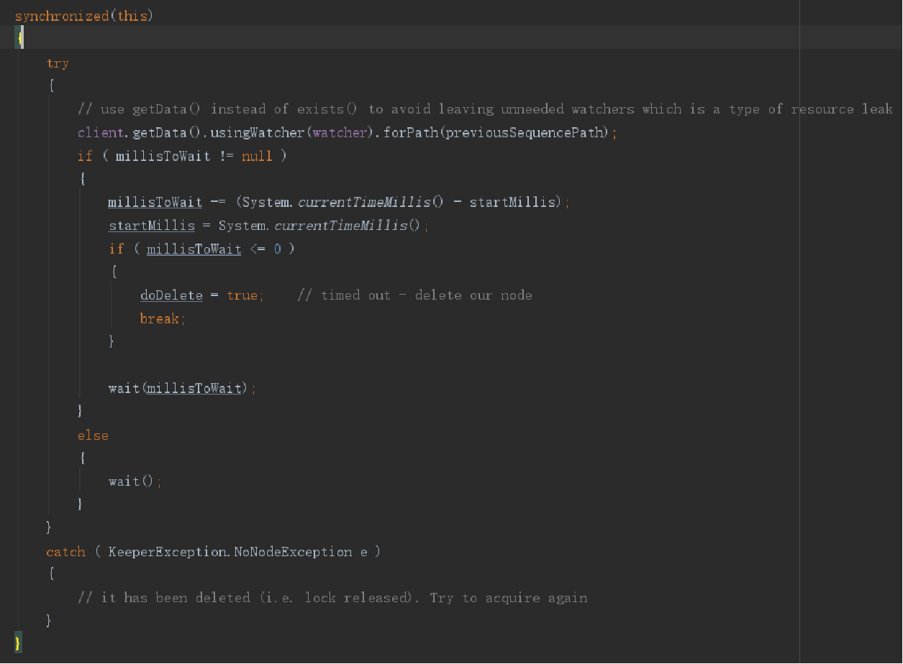

**节点排序**

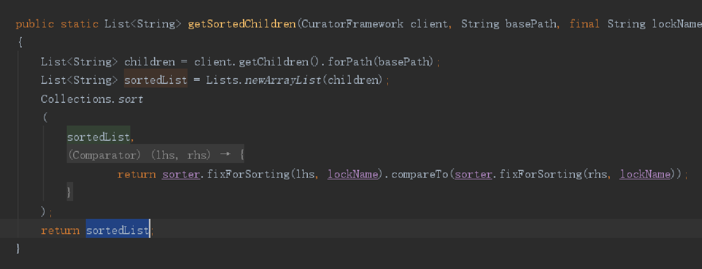

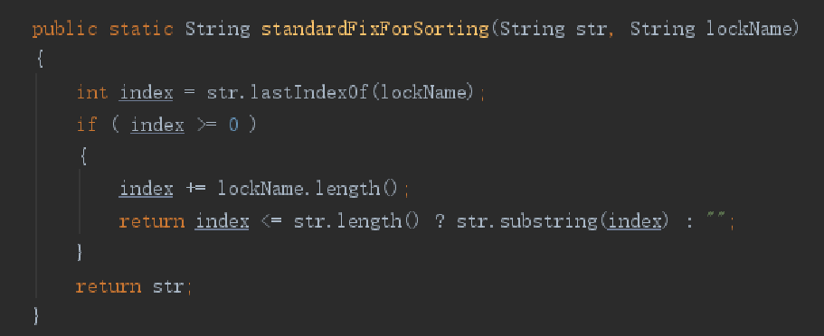


## Etcd

redis虽然有红锁，集群模式，但是redis是ap模型，注重的是可用性，对于锁来讲，一致性比(cp)比可用性(ap)更好。

redis红锁在某个节点宕机之前被客户端获取了锁，然后在主机恢复后，客户端的锁假设还未执行完，那么就可能会让一个新的客户端获取到锁

etcd实现了raft共识算法，一致性强

- Lease机制：租约机制（TTL，Time To Live），Etcd 可以为存储的 key-value 对设置租约，
  当租约到期，key-value 将失效删除；同时也支持续约，通过客户端可以在租约到期之前续约，
  以避免 key-value 对过期失效。Lease 机制可以保证分布式锁的安全性，为锁对应的 key 配置租约，
  即使锁的持有者因故障而不能主动释放锁，锁也会因租约到期而自动释放
-  Revision机制：每个 key 带有一个 Revision 号，每进行一次事务加一，它是全局唯一的，
  通过 Revision 的大小就可以知道进行写操作的顺序。在实现分布式锁时，多个客户端同时抢锁，
  根据 Revision 号大小依次获得锁，可以避免 “羊群效应” ，实现公平锁
- Prefix机制：即前缀机制。例如，一个名为 /etcdlock 的锁，两个争抢它的客户端进行写操作，
  实际写入的 key 分别为：key1="/etcdlock/UUID1"，key2="/etcdlock/UUID2"，
  其中，UUID 表示全局唯一的 ID，确保两个 key 的唯一性。写操作都会成功，但返回的 Revision 不一样，
  那么，如何判断谁获得了锁呢？通过前缀 /etcdlock 查询，返回包含两个 key-value 对的的 KeyValue 列表，
  同时也包含它们的 Revision，通过 Revision 大小，客户端可以判断自己是否获得锁
- Watch机制：即监听机制，Watch 机制支持 Watch 某个固定的 key，也支持 Watch 一个范围（前缀机制），
  当被 Watch 的 key 或范围发生变化，客户端将收到通知；在实现分布式锁时，如果抢锁失败，
  可通过 Prefix 机制返回的 KeyValue 列表获得 Revision 比自己小且相差最小的 key（称为 pre-key），
  对 pre-key 进行监听，因为只有它释放锁，自己才能获得锁，如果 Watch 到 pre-key 的 DELETE 事件，
  则说明 pre-key 已经释放，自己已经持有锁

**原理**

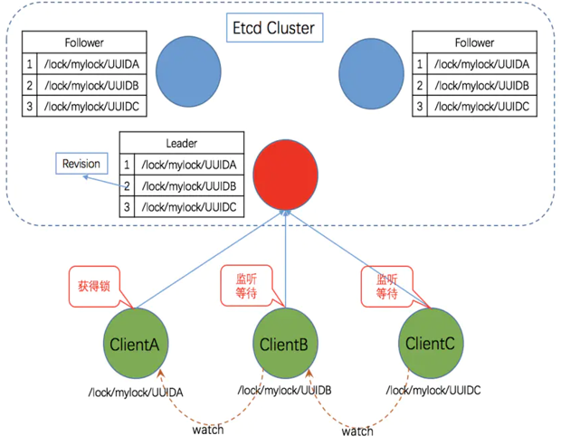

**锁实现流程**

- 建立连接
  客户端连接 Etcd，以 /etcd/lock 为前缀创建全局唯一的 key，
  假设第一个客户端对应的 key="/etcd/lock/UUID1"，第二个为 key="/etcd/lock/UUID2"；
  客户端分别为自己的 key 创建租约 - Lease，租约的长度根据业务耗时确定；
- 创建定时任务作为租约的“心跳”
  当一个客户端持有锁期间，其它客户端只能等待，为了避免等待期间租约失效，
  客户端需创建一个定时任务作为“心跳”进行续约。此外，如果持有锁期间客户端崩溃，
  心跳停止，key 将因租约到期而被删除，从而锁释放，避免死锁
- 客户端将自己全局唯一的 key 写入 Etcd
  执行 put 操作，将步骤 1 中创建的 key 绑定租约写入 Etcd，根据 Etcd 的 Revision 机制，
  假设两个客户端 put 操作返回的 Revision 分别为 1、2，客户端需记录 Revision 用以
  接下来判断自己是否获得锁
- 步骤 4: 客户端判断是否获得锁
  客户端以前缀 /etcd/lock/ 读取 keyValue 列表，判断自己 key 的 Revision 是否为当前列表中
  最小的，如果是则认为获得锁；否则监听列表中前一个 Revision 比自己小的 key 的删除事件，一旦监听到删除事件或者因租约失效而删除的事件，则自己获得锁。
- 步骤 5: 执行业务
  获得锁后，操作共享资源，执行业务代码
- 步骤 6: 释放锁
  完成业务流程后，删除对应的key释放锁

**源码**

io.etcd.jetcd.LockImpl

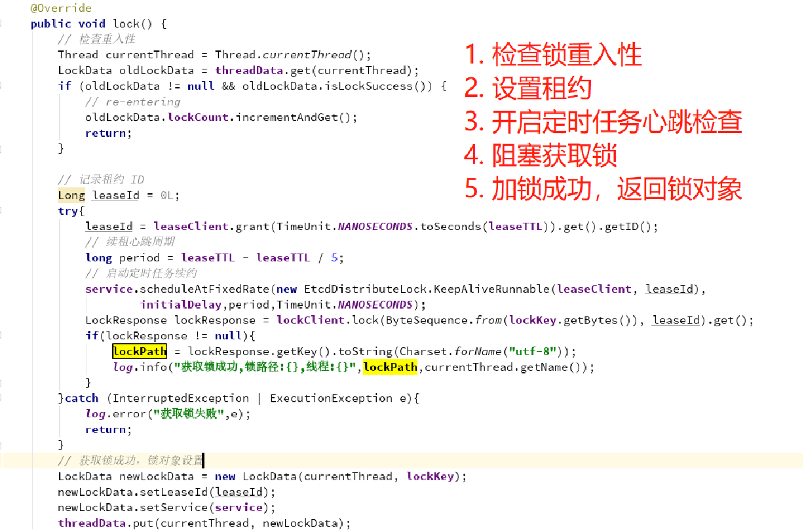

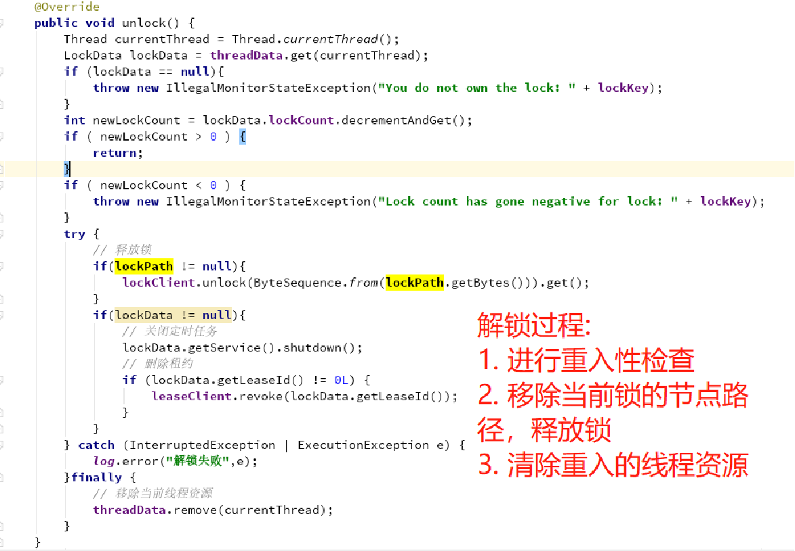


## MySQL

### 乐观锁

版本号控制的原理：

- 为表中加一个 version 字段；
- 当读取数据时，连同这个 version 字段一起读出；
- 数据每更新一次就将此值加一；
- 当提交更新时，判断数据库表中对应记录的当前版本号是否与之前取出来的版本号一致，如果一致则可以直接更新，如果不一致则表示是过期数据需要重试或者做其它操作

```sql
 create table `segment_id`(
	`id` bigint NOT NULL auto_increment,
    `biz_code` varchar(16) NOT NULL comment '业务类型编码',
    `version` bigint NOT NULL comment '版本-乐观锁',
    primary key (`id`)
 ) ENGINE=InnoDB DEFAULT CHARSET=utf8mb4 COMMENT='顺序自增id表' auto_increment 1
 
 -- 修改
 update segment_id set `max_id` = ?, `version` = `version`+ 1 where `biz_code` = ? and `version` = ?
```


### 悲观锁
for update
```sql
-- fu(for update)锁，可重入基于行锁，不支持行锁的无效或锁表，支持阻塞和非阻塞
create table fu_distribute_lock(
 id int unsigned auto_increment primary key,
 lock_name varchar(100) not null,
 unique(lock_name)
) engine=innodb;

-- 
select * from fu_distribute_lock where `lock_name`=? for update

-- 
insert into fu_distribute_lock(lock_name) values(?)
```
