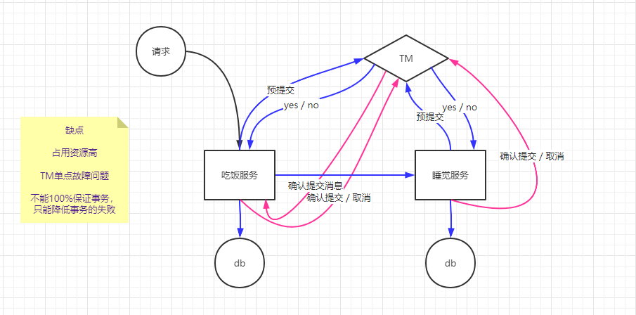
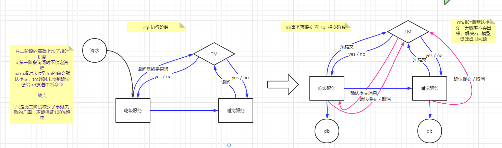
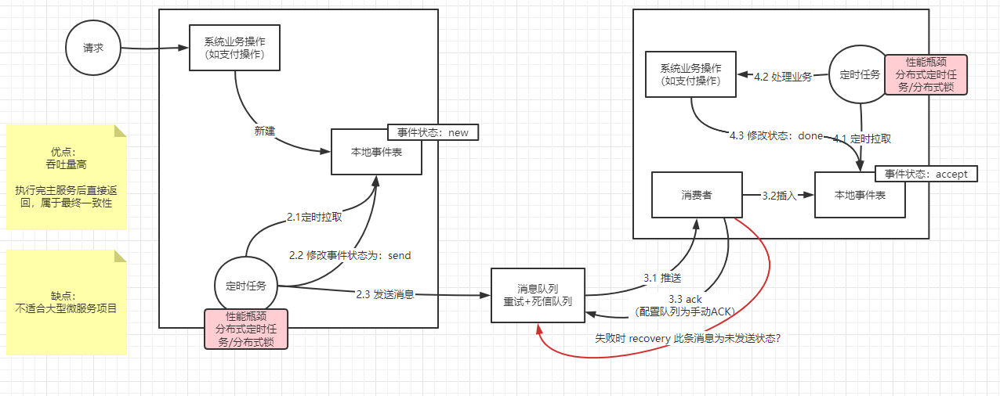
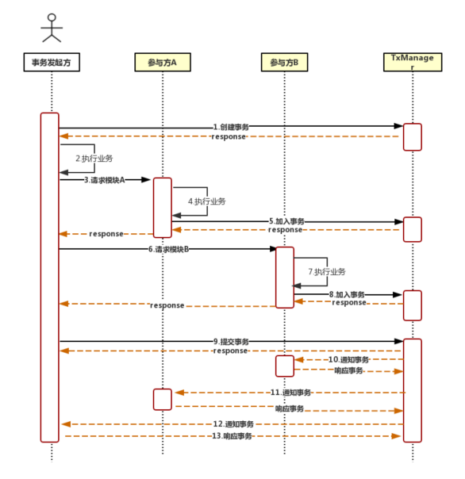
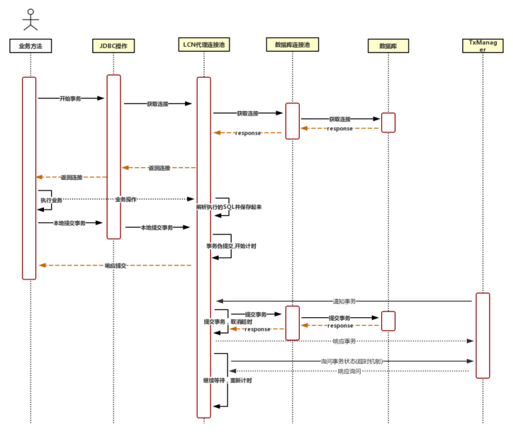
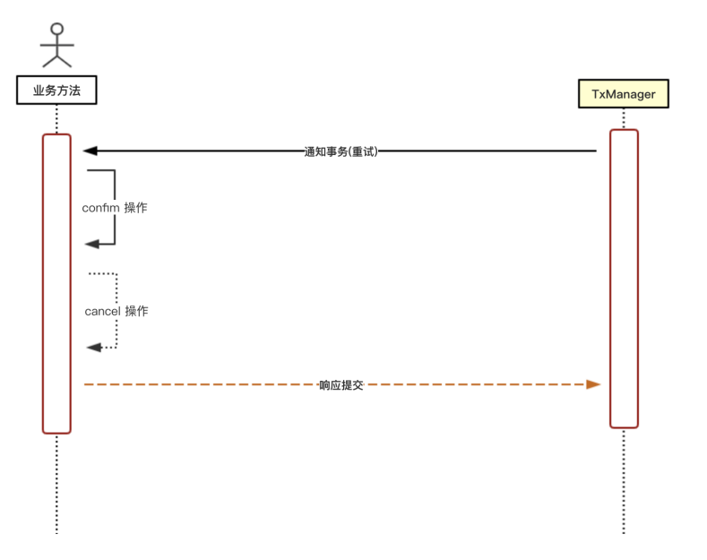

# Distributed Transaction

**不要为了极低概率的事件，增加极大的研发成本**

名词解释： 

- TC:Transaction Client：代表事务客户端，对应流程中是对事务发起⽅与事务参与⽅的泛指
- TM:TransactionManager：也简称为TxManager是事务管理器
## 二阶段提交 （2PC）

不能完全解决分布式事务问题，但是会让出错的概率极低

比如在第二阶段通知各个服务提交的时候，其中某个服务刚好在这个阶段宕机（概率极低）

在二阶段整个流程中，所有的RM内的连接资源要保留，否则就不是一个事务了，所以资源占用高

**流程：假设有服务A、服务B**

- 阶段一：
  1. 事务询问：协调者节点向所有参与者节点询问是否可以执行提交操作(vote)，并开始等待各RM的响应
  2. 执行事务：参与者节点执行询问发起的所有事务操作，并将Undo信息和Redo信息写入日志（注意：若成功这里其实每个TM已经执行了事务）
  3. 反馈询问：RM响应TM发起的询问，如果所有RM成功，TM返回“yes”，如果一个以上TM失败，TM返回"cancel"
- 阶段二：
  - 执行事务提交：当TM返回`yes`，RM开始commit，释放事务期间占用的资源
  - 中止事务提交：当TM返回`cancel`，RM开始rollback，参与节点利用之前的undo信息执行回滚，释放事务期间占用的资源

## 三阶段提交

**流程：假设有服务A、服务B**

1. 程序运行到服务A的分布式事务开启阶段，发送询问消息给TM，看网络是否正常，挂起线程，请求服务B（不占用数据库连接资源）
2. 程序运行到服务B的分布式事务开启阶段，发送询问消息给TM，看网络是否正常
3. TM通知服务A和服务B：yes
4. 服务A收到TM消息，开始运行SQL预提交，并且发送消息给TM（开始占用数据库连接资源）
5. 服务B收到TM消息，开始运行SQL预提交，并且发送消息给TM（开始占用数据库连接资源）
6. TM通知服务A和服务B：docommit
7. 服务A收到TM消息，开始真正SQL提交，并且发送消息给TM
8. 服务B收到TM消息，开始真正SQL提交，并且发送消息给TM

三阶段提交与二阶段提交的差别

1. 三阶段多了超时机制
   - 第二阶段TM超时没收到RM的预提交反馈，TM给RM发中断消息（?? RM怎么给TM反馈）
   - 第三阶段RM超时没收到TM的docommit消息，自动提交
2. 三阶段的第一个阶段解决因个别服务器网络问题而导致的资源占用浪费

## 消息队列+事件表

- **如果解决消费者重复消费？**

  主键冲突来解决幂等，消费端的本地事件表的id使用生产者端事件表的事件id作为唯一主键

- **定时任务是否必须？** 

  不是必须的，按不同的场景分析

  1. 场景1：第三方系统回调时的事务

     通过定时任务的方式，可以让第三方回调的结果不会因消息发生不成功而浪费

  2. 场景2：内部系统间的事务（推荐）

     最好让业务数据、本地事件表数据、消息发送在同一次内部事务中处理，性能比定时任务高，而且开发更简单，也可以通过第三方调用日志表处理第三方回调时事件的消息浪费问题

- **消息队列没收到ACK就挂了**

  由于有主键冲突，所以下次再次消费也不会成功
  
- **定时任务负载部署问题**

  - 定时任务不能放在业务服务内运行，因为业务服务需要多机部署（可以用分布式锁解决，但是性能极差）
  - 为了提高性能可以使用分布式任务调度框架

## LCN

[官网](https://github.com/codingapi/tx-lcn)，⼀种基于Java代理协调技术的分布式事务系统

- Lock：通过获取到资源的控制器，形成对其他访问的排他性、
- Control：通过控制数据的写⼊⽽达到对事务的提交与回滚
- Notify：通过消息来协调控制各节点的数据事务操作

LCN分布式事务系统通过代理数据资源，通过TxManager(事务管理器)协调来完成对事务的统⼀控制，这样的操控⽅式使得框架对业务嵌⼊性⾮常低，在对本地代理资源的同时也通过排它锁防⽌其他⼈的访问，从⽽也保障了事务的隔离性

### LCN原理

**步骤：**

- **1：**事务发起⽅在开始执⾏业务之前将先调⽤TM通知创建事务，事务中包含关键的事务信息如节点信息、全局事务Id标示等信息，发起⽅将等待TM响应数据以后再执⾏步骤2
- **2：**当接受到TM创建的事务消息以后，事务发起⽅则开始执⾏⾃⼰的业务代码，在执⾏业务的过程就会开始对各个参与⽅的调⽤，在调⽤时会将TM创建的事务标示信息传递到参与⽅中
- **3：**事务发起⽅开始发起对事务参与⽅的调⽤， 调⽤时将会把事务标志信息传递给参与⽅（应该是对http请求做了切面处理，添加事务信息）
- **4：**当参与⽅接受到来⾃发起⽅的请求之后就开始执⾏本地的业务。在这⾥执⾏完业务后不会⽴即对本次的本地事务做处理，实际上在系统中是**代理了连接对象**没有对其做真正的事务操作。具体的代理步骤将会在下⾯的代理机制中解释
- **5：**当参与⽅A完成了本地业务的执⾏以后，再请求TM加⼊到本次事务中，提交的主要信息有本地的⽇志标记信息与节点信息，在请求TM前会先开启超时等待任务，然后再发起加⼊事务指令给TM，加⼊事务受系统控制
- **6：**该步骤原理对账3、4、5⼀样，只是参与⽅不 同⽽已
- **9：**当发起⽅完成所有的参与⽅调⽤以后，则根据最终的事务情况来通知TM提交事务，该步骤需要确认TM接受到消息，提交事务分为：commit、rollback两种，当提交完成事务以后也会与参与⽅⼀样开始进⼊等待超时机制。TM通知的流程是会遍历参与⽅逐步通知确认，全部通过后再通知发起⽅，详细原理⻅TM原理介绍
- **10：**TM通知参与⽅节点做事务的commit或rollback操作，对于TM通知成功的原则是需要将消息通知到参与⽅，参与⽅完成事务的执⾏后再将消息反馈给TM，TM接受到消息以后再开始调⽤下⼀个参与⽅的事务通知。这⾥存在超时机制与重试机制和切换模块事务机制，详细介绍可参考下⾯的内容
- **11：**该步骤原理同步骤10⼀样，只是参与⽅ 不同⽽已
- **12：**通知发起⽅事务，该步骤是TM已经完成了对所有参与⽅的通知确认后，再通知发起⽅提交事务的操作步骤，发起⽅根据事务状态完成对事务的操作
- **13：**当发起⽅完成了事务操作则会通知TM事务已提交完成，这时候对于TM来说才是所有事务的完成，该消息⽆需TM有⽆接受到，都将在发送完成以后响应数据给调⽤者。由于事务已提交TM再次发起请求，也会由于SQL⽇志已清理⽽⽆法重复提交

### TC代理控制原理(强⼀致)

**步骤：**

- 业务⽅法(开始事务)

  开始事务是指参与⽅或者发起⽅开始执⾏⾃⼰的业务时开启事务操作，对应JDBC来说就需要去获取Connection连接对象，在这⼀步是将会开始访问JDBC[5]接⼝获取连接对象

- JDBC操作(获取连接)

  这⾥代表的是通过JDBC协议向连接池获取Connection连接对象的请求

- LCN代理连接池(获取连接) 

  这⾥是指通过LCN代理连接池继续将请求传递，向数据库连接池层获取Connection连接对象

- 数据库连接池(获取连接)

  这⾥是数据库连接池继续向数据库层获取连接请求传递

- LCN代理连接池(代理连接)

  代理连接是指LCN将返回的连接对象创建代理对 象，然后在返回给调⽤⽅。代理对象主要是为了获取到实际要执⾏的业务操作和控制数据的“伪提交”代理控制⽅，这⾥是⼀个抽象的接⼝，⽬前代表的是关系型数据库的代理实现

- 业务⽅法(执⾏业务)

  业务⽅法在执⾏业务的时候会对资源做操作，当操作资源的时候就会发送数据给LCN代理的对象。业务⽅法(业务操作)

  随着业务的操作，则将控制数据传递给了LCN代理连接池

- LCN代理连接池(解析执⾏的SQL并保存起来)

  LCN接受到了业务⽅法的操作然后对其做业务解析操作，这⾥由于是关系型数据库，解析得到将是SQL语句。对SQL有两点主要事项：

  1. 所有的赋值对象将通过java来赋值⽽不能直接使⽤数据库函数，就如mysql的now()函数⼀样，那么再对其做补偿业务的情况下时，会出现记录的时间会与实际发⽣时间不⼀致的情况，就违背了幂等性;
  2. 若是insert语句且是数据库主键⾃增类型的得需要获取到插⼊以后的主键key 信息

- 业务⽅法(提交事务) 

  业务⽅法完成了所有的业务操作，开始发起提交本地的事务提交请求

- LCN代理连接池(事务伪提交，开始超时机制)

  LCN代理连接对象接受到提交事务请求时会阻⽌事务的提交，但是会将解析到的业务操作⽇志数据 (SQL)存储到本地，再开始启⽤倒计时等待TM的消息通知，然后再返回提交成功给业务⽅法

- LCN代理连接池(响应提交) 

  LCN代理连接池将响应完提交事务以后将结果反馈给参与业务⽅，业务⽅法再继续执⾏业务，将数据反馈给调⽤者

- TxManager(通知事务) 

  当接受到TM的事务通知时，则会根据事务状态做对应的事务操作

- LCN代理连接池(提交事务) 

  当事务提交操作时，TC则会先创建对本次操作⽇志 步骤的删除操作，对应关系型数据库来说就是对记录 的业务SQL做删除操作，将该操作步骤也加⼊到待提 交的本地事务中，然后⼀同与本地事务提交。

  当接受到的是回滚操作，那么则会将删除操作加⼊到事务中 然后⼀同回滚，这样的⽅式主要是为了在事务的回滚 或提交时都会将删除⽇志操作与本地事务⼀起处理。 注意：在执⾏delete语句的时候会根据实际记录的⽇志数来判断是否执⾏成功，若没有执⾏成功则肯定是 由于⽇志数据没有保存成功导致的影响⾏数不匹配， 此时会继续保存⽇志，若2次尝试后依旧⽆法保存则直 接抛出JDBC异常。当事务正在提交或回滚后也不会出 现重复提交的问题，因为重复提交的执⾏⽇志已经在事务提交是清理了，仅当需要补偿的时候才会保留本地的业务⽇志数据。当执⾏提交事务出现异常的时候 也会重试，若重试依旧⽆法提交事务则直接作为补偿情况，此时将返回给TM事务须补偿的状态，也将取消对本地的超时任务

- LCN代理连接池(响应事务) 

  当LCN事务提交以后就开始响应事务通知给TM，通知TM本次事务已经完成

- LCN代理连接池(询问事务组)

  若TM⻓时间没有请求到LCN代理连接池的话，那 么LCN代理连接池将会触发超时请求机制，则会主动去联系TM，若访问不到TM，则会再重试访问⼀次请求，若还不能访问则会根据TM的集群部署特点，请求其他的TM节点，若全都访问不到，只可能是TM故障或者⽹络故障，这样的情况下LCN代理连接将执⾏回滚事务，但是不删除⽇志数据。当再次联系上TM时可 检测⽇志数据请求状态再做事务提交或回滚请求。若可以联系上TM则TM会响应⼀个继续等待的消息，则TC将继续等待TM通知。因此设置TC的等待超时时间时可以是短暂的，因为在询问到TM若未完成的事务或者没有通知到的事务时TM都将通知TC继续等待

### TC代理控制原理(柔性事物)

柔性事务主要差异的地⽅在于本地事务提交和通知事务的差异上

### TCC

TCC的关键步骤：Try Confim Cancel ，Try操作实际在执⾏业务的时候就已经执⾏了。 Confim与Cancel则是在通知事务的时候由事务发起⽅来决定，当事务需要提交时则会通知所有参与节点提交事务，若事务迟迟不响应时则会重试⼀次，若依旧不能响应则会切换到其负责模块通知，若在超时时间内未能效应则TM会记录事务补偿，然后也会通知给运维。在事 务协调阶段与LCN是⼀致的

**特点**

- 该模式对代码的嵌入性高，要求每个业务需要写三种步骤的操作
- 该模式对有无本地事务控制都可以支持使用面广
  - 文件新增后回滚要删除
  - redis等不支持事务的中间件
- 数据一致性控制几乎完全由开发者控制，对业务开发难度要求高

### 总结

LCN系统在⾮极端场景下（TM宕机、TC宕机、 ⽹络异常、数据库宕机）⽀持事务的幂等性与强⼀致性，理论上其性能相⽐本地事务要逊⾊，但是相⽐逆向SQL⽅式及不可控代理模式来说更有优势。LCN框架可⽀持多种数据源的适配、对各种DB框架、各种数据库的兼容适配，且⽆需针对各种数据库做适配程序，也可⽀持存储过程的执⾏，⽽且可包容TCC、MQ 等其他模式的兼容

## Seata

## 可靠消息服务

## RocketMQ

