# Lock

保障操作的原子性

- 悲观锁：认为这个操作会被别的线程打断 **synchronized **
- 乐观锁：**CAS** = Compare And Set/Swap/Exchange （自旋锁、假无锁）

## CAS

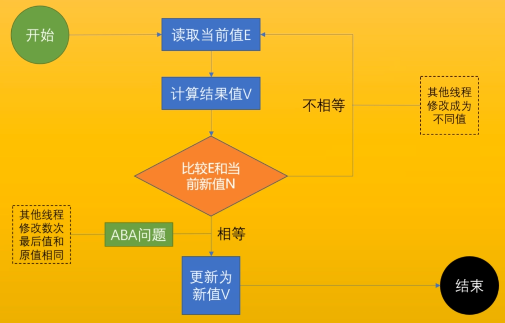

1. 读取E，假设初始值是0
2. 假设每次+1，那么V是1
3. 比较当前E是不是仍然是0，如果是则更新V到E，如果不是则重复1，2

**ABA问题：可能现在得到的E仍然是0，但它有可能经过了：0->8->0的过程，需要注意，如果对程序没影响可以忽略*，决绝这类问题可以增加一个版本(version)判断**

### CAS如何保障旧值和新值的判断、设置新值这两个操作的原子性？

深入Hotspot源码

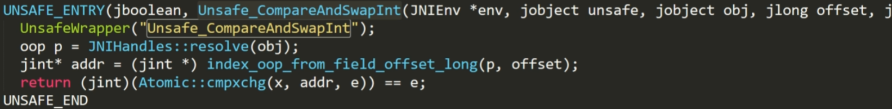

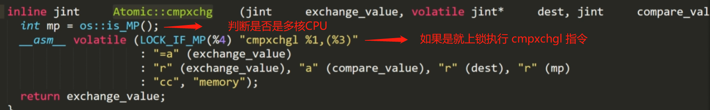

由图可知：cas底层依然是悲观锁，使用的是缓存锁或者总线锁

## 两种锁的效率 

- **悲观锁：临界区执行时间比较长，等的人多**

  线程等待抢锁的时候不消化CPU资源

- **乐观锁：时间短，等的人少**

  等锁期间消耗CPU资源

## Synchronized

JDK早期，synchronized叫做重量级锁，因为申请锁资源必须通过kernel，系统调用

### 用户态和内核态

对于Linux系统，内核态工作在ring0级，用户态工作在ring3级，ring0级拥有所有指令的执行权限

### 一个类在内存中的布局 

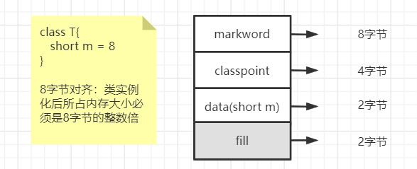

### JOL 工具

Java Object Layout

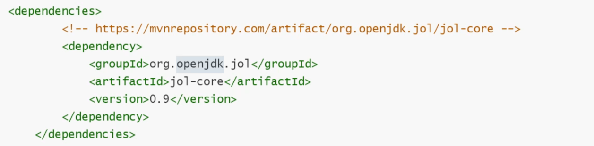

```java
// 测试
Object o = new Object();
System.out.println(ClassLayout.parseInstance(o).toPrintable());
```

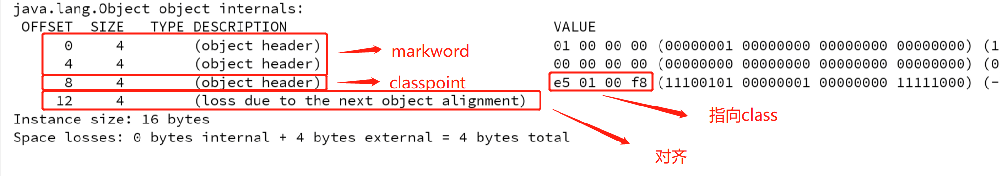

```java
// 锁Object
synchroinzed(o){
    System.out.println(ClassLayout.parseInstance(o).toPrintable());
}
```

发现markword改变了，所以markword记录了synchroinzed(后两位00 )

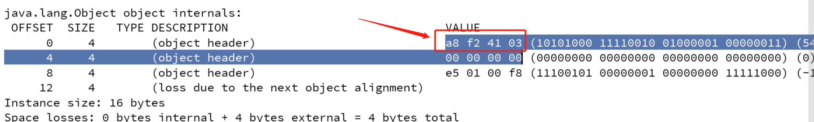

### markword

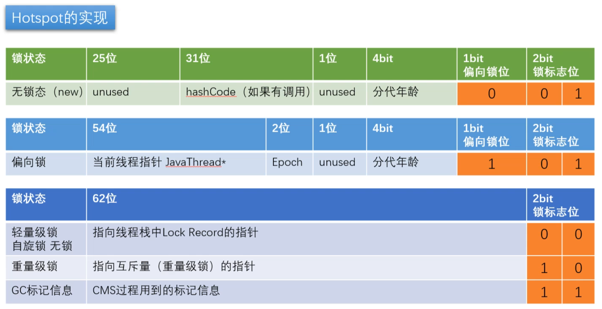

## 锁升级

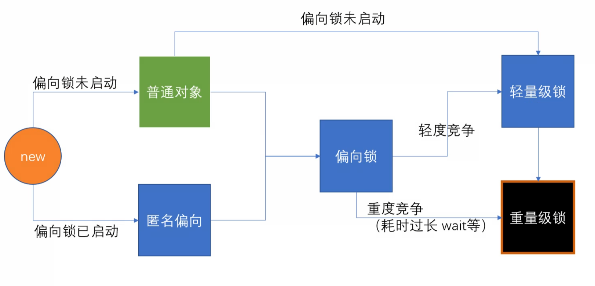

上图来源于CPP源码**InterpreterRuntime::monitorenter**

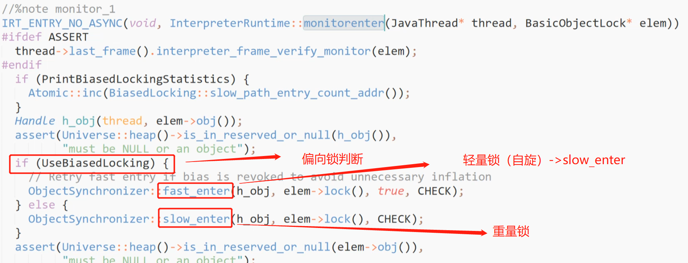

- **偏向锁**
  - 直接用**线程指针/ID**标识在锁对象的markword即可，非常轻量
- **自旋锁**
  - 每个线程在自己的线程栈中生成自己的LR(LockRecord)，将锁的指针指向自己的LR，指向成功则获取锁，其他的自旋抢锁

### 锁升级过程

- 无锁 - 偏向锁 -轻量级锁（自旋锁）-重量级锁
- 偏向锁 - markword 上记录当前线程指针，下次同一个线程加锁的时候，不需要争用，只需要判断线程指针是否同一个，所以，偏向锁，偏向加锁的第一个线程 。hashCode备份在线程栈上 线程销毁，锁降级为无锁
- 有争用 - 锁升级为轻量级锁 - 每个线程有自己的LockRecord在自己的线程栈上，用CAS去争用markword的LR的指针，指针指向哪个线程的LR，哪个线程就拥有锁
- 自旋超过10次，升级为重量级锁 - 如果太多线程自旋 CPU消耗过大，不如升级为重量级锁，进入等待队列（不消耗CPU）-XX:PreBlockSpin
  - 自旋锁在 JDK1.4.2 中引入，使用 -XX:+UseSpinning 来开启。JDK 6 中变为默认开启，并且引入了自适应的自旋锁（适应性自旋锁）
  - 自适应自旋锁意味着自旋的时间（次数）不再固定，而是由前一次在同一个锁上的自旋时间及锁的拥有者的状态来决定。如果在同一个锁对象上，自旋等待刚刚成功获得过锁，并且持有锁的线程正在运行中，那么虚拟机就会认为这次自旋也是很有可能再次成功，进而它将允许自旋等待持续相对更长的时间。如果对于某个锁，自旋很少成功获得过，那在以后尝试获取这个锁时将可能省略掉自旋过程，直接阻塞线程，避免浪费处理器资源。
- 偏向锁由于有锁撤销的过程revoke，会消耗系统资源，所以，在锁争用特别激烈的时候，用偏向锁未必效率高。还不如直接使用轻量级锁。

### 匿名偏向

默认情况 偏向锁有个时延，默认是4秒 why?

因为JVM虚拟机自己有一些默认启动的线程，里面有好多sync代码，这些sync代码启动时就知道肯定会有竞争，如果使用偏向锁，就会造成偏向锁不断的进行锁撤销和锁升级的操作，效率较低。

```shell
# 配置偏向锁延时开启时间
-XX:BiasedLockingStartupDelay=4
```

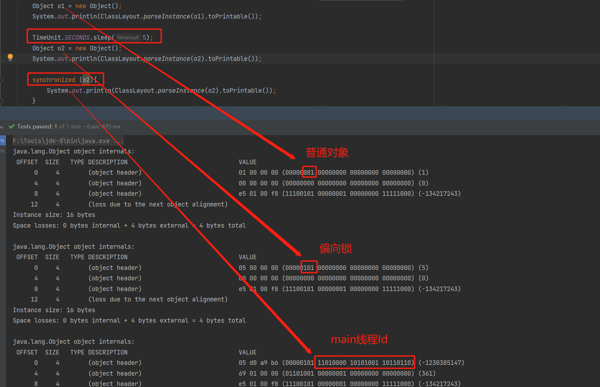

## 锁重入

- synchronized是可重入锁，重入次数必须纪录，因为解锁几次必须对应
- 偏向锁、自旋锁每重入一次线程栈会创建多一个LR