# 线程与进程

- **进程**
  1. 申请资源的单位（CPU、内存、数据空间）
  2. 开销大，CPU需要不停的切换进程，而进程间的切换需要保护现场，消耗大
  3. 系统在运行时给每个进程分配不同的内存区域
- **线程**
  1. 调度和执行的单位，也会申请CPU资源，同一进程内的线程共享进程所申请的资源
  2. 开销小，进程可以看作是轻量进程，同一进程内的线程共享代码和数据空间，每个线程有独立的运行栈和程序计数器（PC）
  3. 除了CPU，系统不会为线程分配其他资源，只能共享所属进程的资源

## 线程的6个状态

1. New 创建未启动

2. Runnable 可运行状态，由线程调度器可以安排执行

3. Timed Waiting 计时等待状态

4. Waiting 等待被唤醒

5. Blocked 阻塞状态（只有synchronized才会有，需要操作系统的介入）

6. Terminated 终止状态

   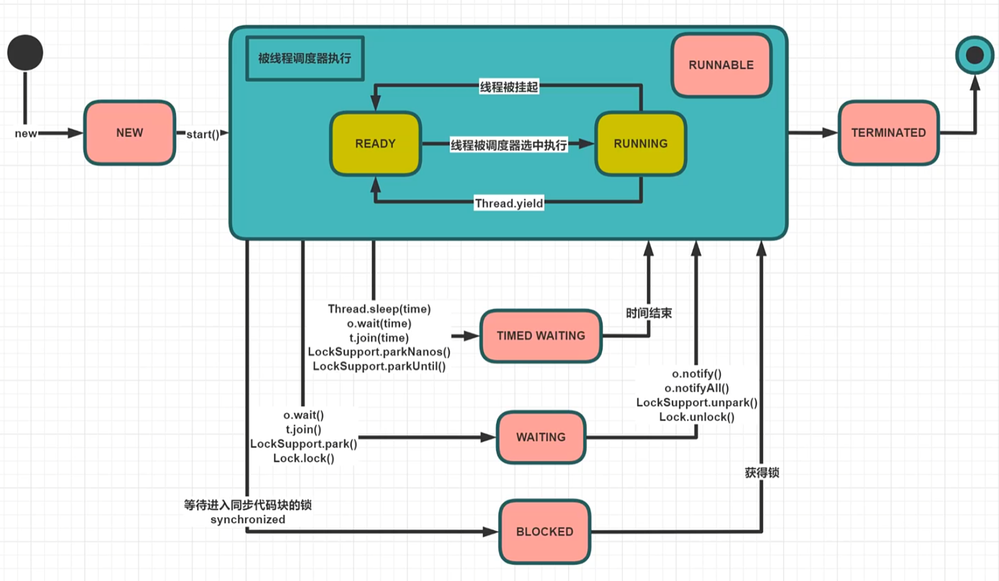

## 创建线程的5种方式


## 线程打断 Interrupt

**优雅的终止线程**

- interrupt()

  不是真正的直接打断线程，而是为线程设置打断标志位，至于大不打断要线程内部处理

- isInterrupted()

  查询某线程是否被打断过（查询标志位）

- interrupted()

  查询某线程是否被打断过，重置标志位

作用：给线程设置标志位，然后线程内部就可以收到通知自己做处理，如结束线程：

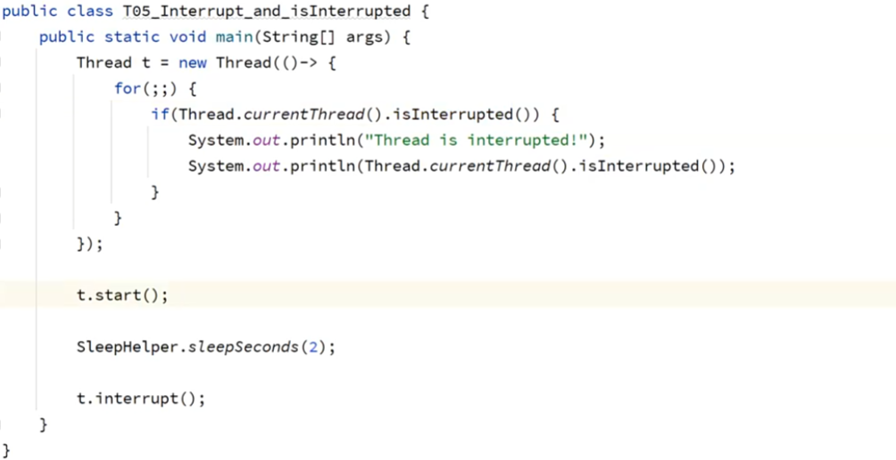

**interrupt和sleep wait join**

sleep()方法在睡眠的时候，正常情况不到时间是不会醒的，这个时候可以用interrupt设置标志位，然后可以通过catch(InterruptedException)来进行处理，wait  join同理

**interrupt和锁**

- synchronized 无法被中断
- ReentrantLock
  - lock 无法被中断
  - lockInterruptibly 可以被中断

## 线程的结束

- **stop** 

  强制停止线程，不建议使用，已经被废弃，因为太粗暴了，容易造成数据不一致

- **suspend**

  暂停线程，不建议使用，已经被废弃

- **resume**

  恢复suspend暂停的线程，不建议使用，已经被废弃，如果忘记使用resume，容易产生死锁

- **volatile**

  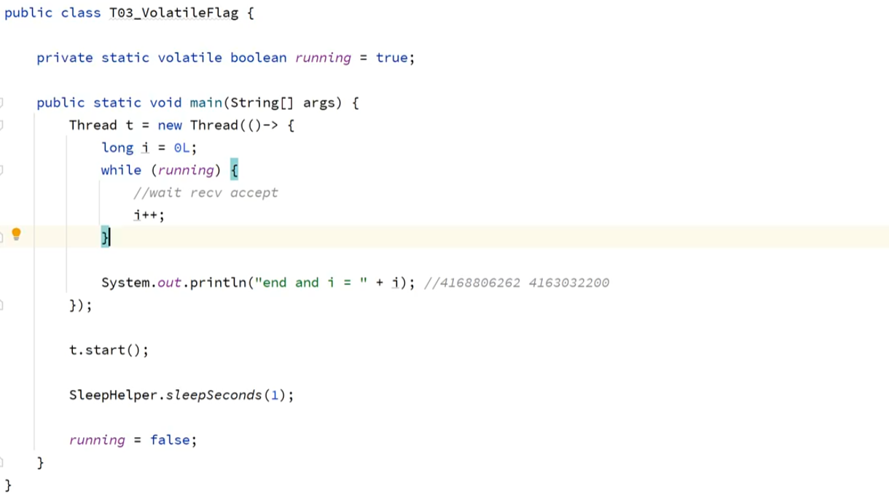

- **interrupt**

## 并发编程三大特性(三要素)

1. **可见性 visibility**

   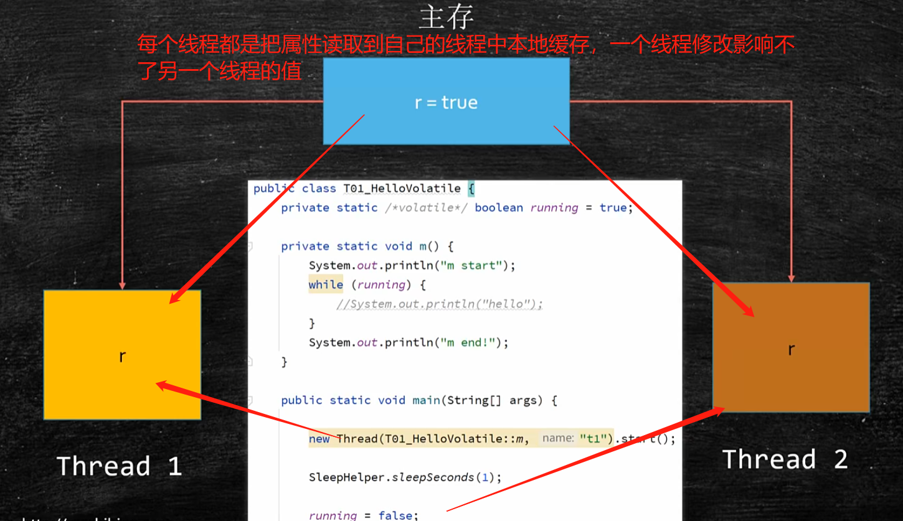

   - **只有用volatile修饰的属性才能在各个线程之间可见**，volatile的作用就是让线程每次都要从主存中来读取，性能差
   - 这时如果在while循环中使用System.out.print()，会让没有被volatile修饰的属性可见，因为前者内部使用了synchronized，**synchronized保障可见性和原子性**
   - volatile修饰的如果是引用类型，那么只能保证对象的引用是可见的，但是引用内部的属性是不可见的

2. **有序性 ordering**

   有一个例子：在这个循环里，最终会因为x、y = 0而结束

   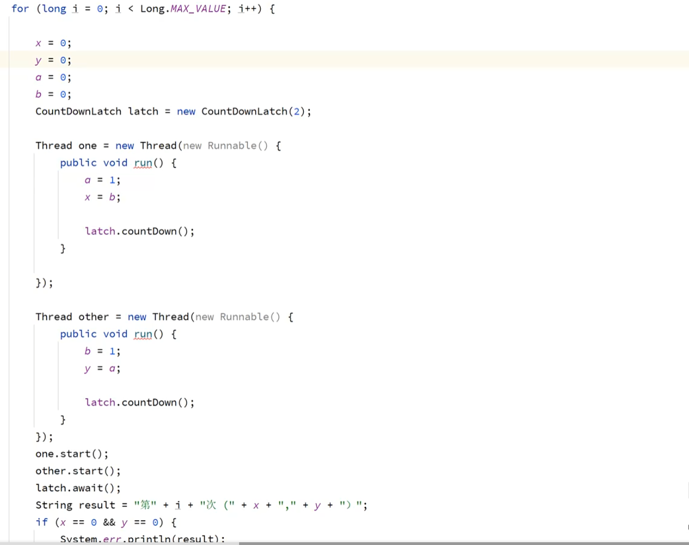

   结果分析：必须是乱序执行的才会出现x、y = 0

   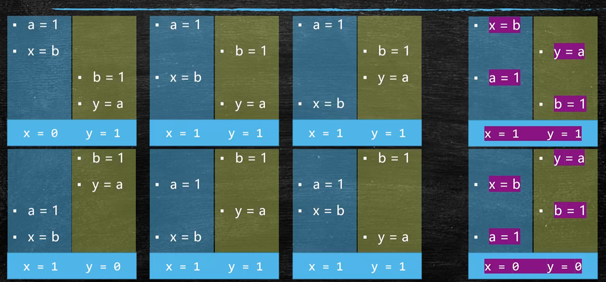

   这么设计是为了提高效率，当然需要指令2不依赖指令1的时候才会

   

   this对象逸出问题：new T的汇编指令会有多条

   1. 0 是创建对象，这时m=0
   2. 4 是初始化对象的属性，这时m=8
   3. 7 是将栈中t关联内存对象

   根据有序性，4，7是有可能会被调换循序的，所以不能直接在对象的构造函数中启动一个线程来使用对象的属性，有可能会得到m=0，确保对象已经实例化好了再启动线程

   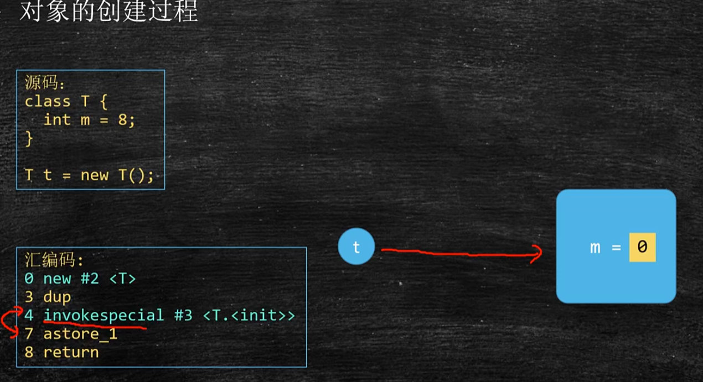

   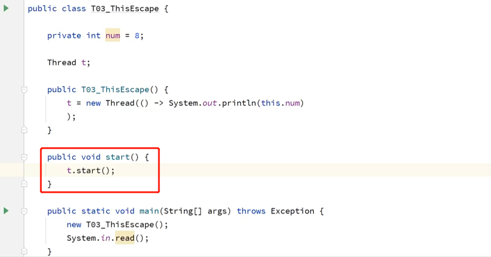

3. **原子性 atomicity**

   - race condition：竞争条件，指多个线程访问共享数据的时候产生竞争
   - unconsistency：数据的不一致，并发访问下产生的不期望出现的结果
   - 线程同步：保障数据的一致
   - 线程运行期间不被其他线程**打断**就可以称为原子操作

   看一个例子：n++

   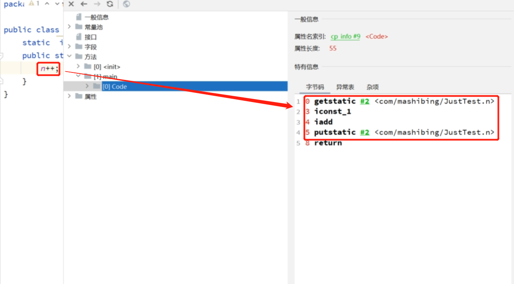

   n++ 会被翻译成多条汇编指令，中间完全有可能被其他线程打断，所以n++不是一个原子性操作，只有**上锁**才能成为原子性操作

   **上锁的本质是把并发编程序列化**

## CPU

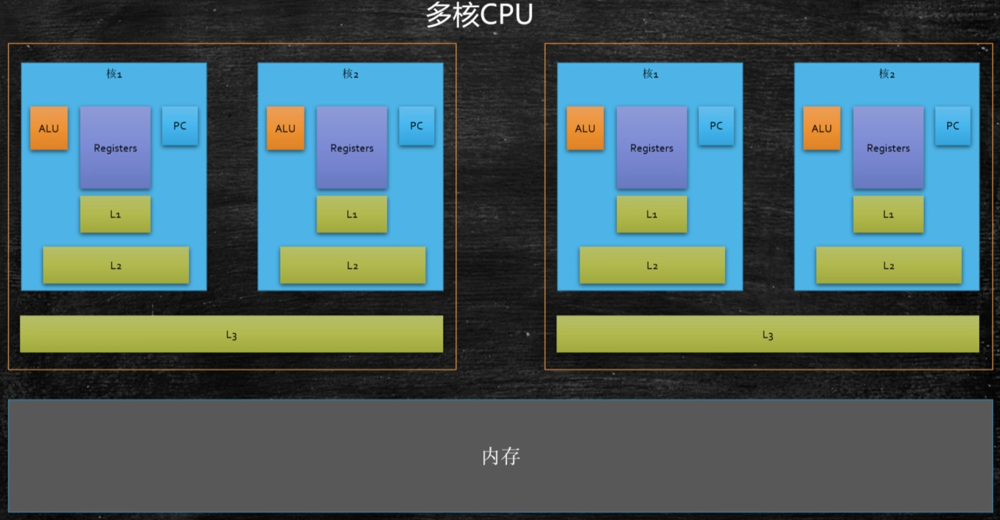

读取数据的方式：L1>L2>L3>内存，这就解释了为什么不用volatile修饰的普通属性是隔离的

## 缓存行

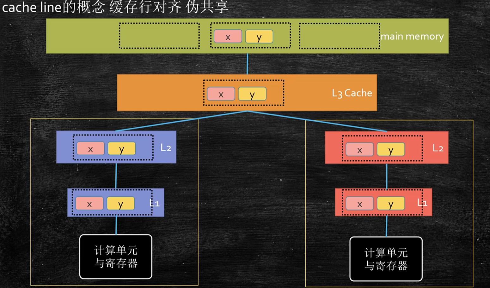

- 按块读取，程序的局部性原理（通常读取数据的，使用相连的值的概率很大），可以提高效率，充分发挥总线CPU针脚等一次读取更多数据的能力

- 一次读取的大小（缓存行）是64字节

- 缓存一致性协议：不同的线程对同一个缓存行需要做数据同步

  有一个数组，数组内有x、y，x和y内部只有一个long类型的属性，那么读取数组的时候大概率x和y在一个缓存航内，由于缓存一致性，一个线程修改x，一个线程修改y，如果他们在一个缓存行中时，会同步两个线程的数据，效率较低，如果将x和y的对象内部放入超过64字节的属性时，那么x和y会被分别读取到不同的缓存行，此时修改彼此的数据不会同步效率较高

  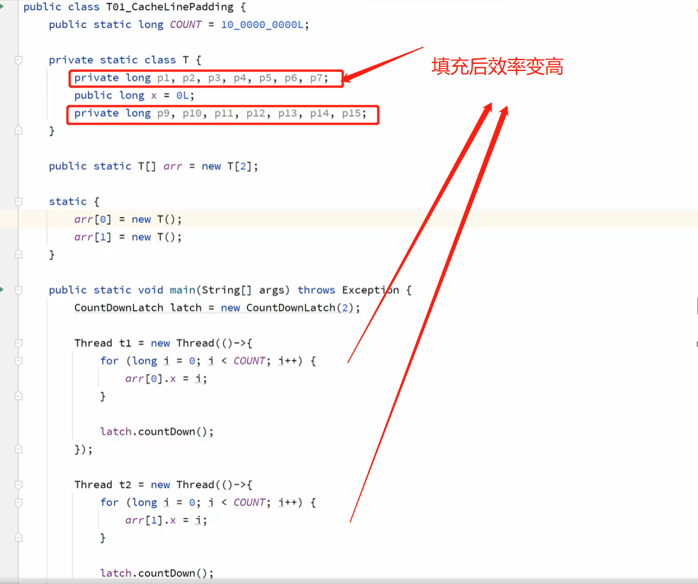

  **这么复杂的写法有人会用吗？答案是有的**

  1. jdk1.7的作者在LinkedBlockingQueue中用到了

  2. disruptor框架，单机最快队列

     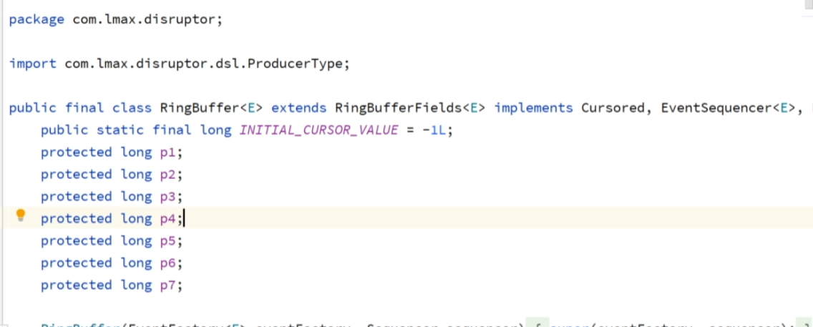

- JDK1.8加入了@Contended注解（需要在jvm中设置-XX:-RestricContended），保证标记的数据不会和其他数据在同一缓存行

1、超线程技术可以让一个核心可以同一时间做两件事，所以市面上目前都是线程是核心数的两倍

## 线程优先级

java 中的线程优先级的范围是1～10，默认的优先级是5, 最高优先级是10。

```java
public static void main(String[] args) {

        System.out.println(Thread.currentThread().getName()
                +"("+Thread.currentThread().getPriority()+ ")");

        Thread t1=new ThreadP("thread1");    // 新建t1
        Thread t2=new ThreadP("thread2");    // 新建t2
        t1.setPriority(5);               // 设置t1的优先级为1
        t2.setPriority(5);              // 设置t2的优先级为10
        t1.start();                      // 启动t1
        t2.start();                      // 启动t2
    }
```