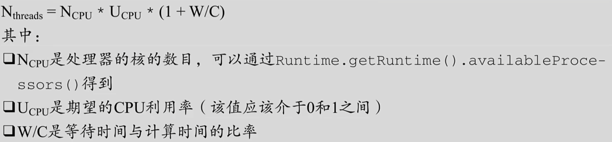
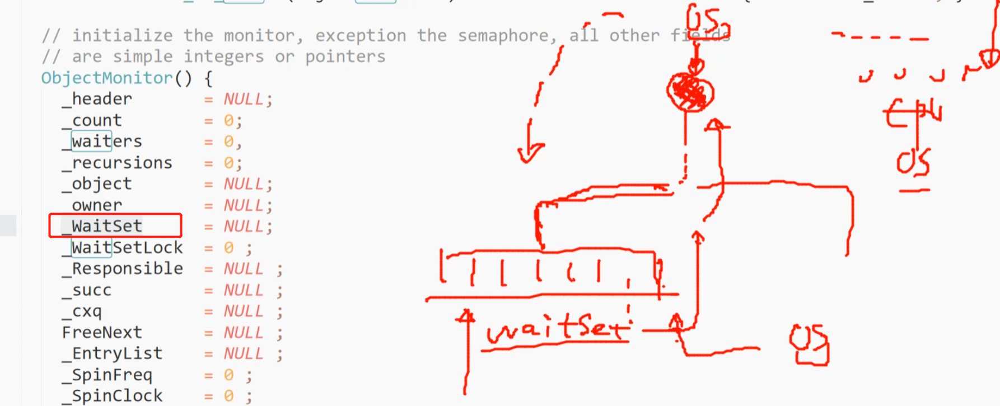

### 什么是进程？

是计算机进行资源分配的基本单位，OS将磁盘中的可执行文件加载到内存中变为进程

### 什么是线程？

程序不同的执行路径，不同的线程共享进程的共享资源，是调度执行的基本单位

### 什么是纤程？				

### 单核CPU设置多线程是否有意义？

1核CPU在同一时间内只能跑一个线程，线程在执行的时候有时候需要等待，比如网络请求，那么这个时候多线程就会充分的利用CPU

### 线程是否越多越好？

线程的切换需要消耗资源，如果线程很多，那么CPU所有的工作的放在线程的切换上了

### 工作线程数（线程池线程数量）应该设多少合适？

通常都要通过压测去得到

下面是一个大概的估算公式

但是如何知道W和C的具体时间？这个通常是也要通过部署到环境，通过一些统计才能科学的知道，提前的任何推算未必能准确，一般通过**Profiler**工具（性能分析工具的统称，java JProfiler，阿里arthas）来测试

### 如何优雅的结束线程？

interrupt、volatile(利用属性可见性，相当于自定义interrupt)

### **为什么有自旋锁还需要重量级锁？**

自旋是消耗CPU资源的，如果锁的时间长，或者自旋线程多，CPU会被大量消耗

重量级锁(ObjectMonitor)有等待队列，所有拿不到锁的进入等待队列(_WaitSet)，不需要消耗CPU资源

### 偏向锁一定比自旋锁效率高？

不一定，在明确知道会有多线程竞争的情况下，偏向锁肯定会涉及锁撤销，这时候直接使用自旋锁

JVM启动过程，会有很多线程竞争（加载数据到内存位置时需要锁），所以默认情况启动时不打开偏向锁，过一段儿时间再打开