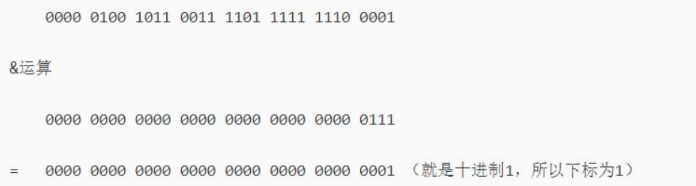
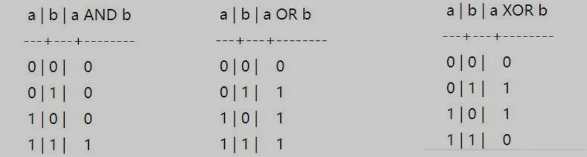
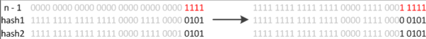
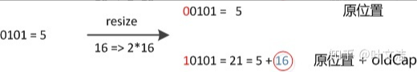

# HashMap

 - Hash表(数组)长度：16
 - 最大Hash表长度：2^31
 - 加载因子：0.75f
 - 链表转树的阈值：8
 - 树转链表的阈值：6
 - 最小的树化的容量：64

## 线程不安全

hashmap多线程操作同时调用put()方法后可能导致get()死循环,从而使CPU使用率达到100%,从而使服务器宕机

多个线程put的时候造成了某个key值Entry key List的死循环，然后再调用put方法操作的时候就会进入链表的死循环内

**解决办法：HashTable、ConcurrentHashMap、Collections.synchronizedMap(hashMap)** 
HashTable和Vector 自带锁，现在都不用，JDK1.0就存在


## JDK1.7

采用头插法，将新元素插入到桶位的头部，将原头部的元素作为新元素的下一个链表元素

### 扩容机制

- 空参数的构造函数：以默认容量、默认负载因子、默认阈值初始化数组。内部数组是**空数组**
- 有参构造函数：根据参数确定容量、负载因子、阈值等
- 第一次put时会初始化数组，其容量变为**不小于指定容量的2的幂数**。然后根据负载因子确定阈值
- 如果不是第一次扩容，则 新容量=旧容量x2，新阈值=旧阈值x负载因子

## JDK1.8

1. 空参数的构造函数：实例化的HashMap默认内部数组是null，即没有实例化。第一次调用put方法时，则会开始第一次初始化扩容，长度为16
2. 有参构造函数：用于指定容量。会根据指定的正整数找到**不小于指定容量的2的幂数**，将这个数设置赋值给**阈值**（threshold）。第一次调用put方法时，会将阈值赋值给容量，然后让 阈值=容量x负载因子 。（因此并不是我们手动指定了容量就一定不会触发扩容，超过阈值后一样会扩容！！）
3. 如果不是第一次扩容，则容量变为原来的2倍，阈值也变为原来的2倍。*（容量和阈值都变为原来的2倍时，负载因子还是不变）*

此外还有几个细节需要注意：

- 首次put时，先会触发扩容（算是初始化），然后存入数据，然后判断是否需要扩容
- 不是首次put，则不再初始化，直接存入数据，然后判断是否需要扩容

### 内部是一个Node数组作为Hash表

```java
transient Node<K,V>[] table;
```

### 2的次方算法

指定一个数，计算出这个数最接近的下个2的次方的数，保证hash表的长度是2的次方

```java
// >>> 无符号右移
static final int tableSizeFor(int cap) {
        int n = cap - 1;
        n |= n >>> 1;
        n |= n >>> 2;
        n |= n >>> 4;
        n |= n >>> 8;
        n |= n >>> 16;
        return (n < 0) ? 1 : (n >= MAXIMUM_CAPACITY) ? MAXIMUM_CAPACITY : n + 1;
}

// in 5 out 8
// in 16 out 16
// in 29 out 32
```

**为什么数组长度一定要2的次方？**

这样做hash寻址的时候，会让数组下标不会超出范围，这样使得直接用求余数的方式找下标更高效

```java
// 数组桶位长度是2^n次方，表示二进制中除了某一位是1，其余都是0
// 8
...0001000
// n-1，表示，1位的右边全部变为0
...0000111
// 这样跟 key的hash做 &运算（同为1才为1）
// 那么任何一个hash值 &上 ...0000111 都不会大于 ...0001000
```


### 构造函数

```java
  public HashMap(int initialCapacity, float loadFactor) {
      	// 参数校验
        if (initialCapacity < 0)
            throw new IllegalArgumentException("Illegal initial capacity: " +
                                               initialCapacity);
        if (initialCapacity > MAXIMUM_CAPACITY)
            initialCapacity = MAXIMUM_CAPACITY;
        if (loadFactor <= 0 || Float.isNaN(loadFactor))
            throw new IllegalArgumentException("Illegal load factor: " +
                                               loadFactor);
        this.loadFactor = loadFactor;
      
        // 让阈值始终是一个2的次方数
        this.threshold = tableSizeFor(initialCapacity);
    }
```

### put方法

```java
public V put(K key, V value) {
    return putVal(hash(key), key, value, false, true);
}

// putVal
// onlyIfAbsent 如果是真则替换旧值
final V putVal(int hash, K key, V value, boolean onlyIfAbsent,
               boolean evict) {
    // p 桶位首节点
    Node<K,V>[] tab; Node<K,V> p; int n, i;
    
    // 新的HashMap第一次put
    if ((tab = table) == null || (n = tab.length) == 0)
        // 创建Hash表，得到初始长度
        n = (tab = resize()).length;
    
    // hash寻址方式 (n - 1) & hash
    // 二进制与：同为1，结果为1
    // 假设hash值：0000 0000 0000 1010 0010 0100 0100 1010
    // n:16 :     0000 0000 0000 0000 0000 0100 0001 0000
    // n-1:       0000 0000 0000 0000 0000 0100 0000 1111
	// &:         0000 0000 0000 0000 0000 0100 0000 1010
    // 这里的关键点是，数组的长度必须是2的次方，这样减1再做与运算，就能限制数组的下标在有效范围内
    if ((p = tab[i = (n - 1) & hash]) == null) // 首节点为空，直接插入
        tab[i] = newNode(hash, key, value, null);
    else { // 首节点不为空，开始处理碰撞
        Node<K,V> e; K k;
        // 如果新key和key.hash == 当前桶位首节点key和key.hash，记录首节点到e
        if (p.hash == hash &&
            ((k = p.key) == key || (key != null && key.equals(k))))
            e = p;
        else if (p instanceof TreeNode) // 判断是否为空黑树的节点，按红黑树方式添加节点e
            e = ((TreeNode<K,V>)p).putTreeVal(this, tab, hash, key, value);
        else { // 首节点是链表
            // 遍历链表，直到尾节点，创建新节点加入到尾部
            for (int binCount = 0; ; ++binCount) {
                if ((e = p.next) == null) {
                    p.next = newNode(hash, key, value, null);
                    // 判断链表长度是否 >= 树化默认值8，是就开始进入转红黑树判断
                    if (binCount >= TREEIFY_THRESHOLD - 1) // -1 for 1st
                        treeifyBin(tab, hash);
                    break;
                }
                
                // 节点遍历时，看当前遍历到的链表节点是否key和key.hash == 新key和key.hash，是就记录到e
                if (e.hash == hash &&
                    ((k = e.key) == key || (key != null && key.equals(k))))
                    break;
                
                // 首节点指针指向后继节点
                p = e;
            }
        }
        
        // 不为null 说明新key在之前已经存在，根据onlyIfAbsent参数看是否需要替换
        if (e != null) { // existing mapping for key
            V oldValue = e.value;
            if (!onlyIfAbsent || oldValue == null)
                e.value = value;
            afterNodeAccess(e);
            return oldValue;
        }
    }
    
    ++modCount;
    // 总元素数量+1，如果大于容量的最大阈值，进行扩容
    if (++size > threshold)
        resize();
    afterNodeInsertion(evict);
    return null;
}
```


### key的hash算法

- 根据 (key == null) ? 0  ：知道HashMap的key可以为null
  - 对比HashTable：HashTable对Key直接hashCode()，如果key为null，会抛出异常
- key != null
  - 先计算key的hashCode
  - 对hashCode进行扰动处理，做异或运算（无进位相加）
  - hashCode向右移动16位：0000000000000000 ...(hasCode高16位)

```java
// key的hash值 异或 key的hash值右移16位
static final int hash(Object key) {
        int h;
        return (key == null) ? 0 : (h = key.hashCode()) ^ (h >>> 16);
}
// 作用：
// 从hash寻址算法中可以看出来，当数组长度比较短的时候（假如是16），无论hash值的高位（二进制的5位往左），如何变都没有影响到计算
// 通过以上的hash()可以让高位参与运算，让key能够在hash表中更散列
```

**为什么是右移16位？**

这个hash最终是要和数组的长度做 &运算 ，而数组的长度大部分时间都不会到达2^16

如果不右移16位，那么key的hashCode可能永远也不会用于 &运算，这样HashMap的桶位可能不够散列



**为什么是做异或运算，不是与运算、或运算？**

看图片

- 与运算，75%的概率是 0，25%的概率是1
- 或运算，25%的概率是0，75%的概率是1
- 异或运算，50%的概率是0，50%的概率是1




### treeifyBin 转红黑树

```java
final void treeifyBin(Node<K,V>[] tab, int hash) {
    int n, index; Node<K,V> e;
    // 先判断table的长度是否小于 64，小于则扩容
    if (tab == null || (n = tab.length) < MIN_TREEIFY_CAPACITY)
        resize();
    else if ((e = tab[index = (n - 1) & hash]) != null) {
        // 数组长度大于64，且当前桶位的链、表大于8，开始转红黑树
        TreeNode<K,V> hd = null, tl = null;
        do {
            TreeNode<K,V> p = replacementTreeNode(e, null);
            if (tl == null)
                hd = p;
            else {
                p.prev = tl;
                tl.next = p;
            }
            tl = p;
        } while ((e = e.next) != null);
        if ((tab[index] = hd) != null)
            hd.treeify(tab);
    }
}
```


### resize方法

```java
// 假设 new HashMap(12,0.75f)  
// oldCap = 0
// threshold = 16

final Node<K,V>[] resize() {
    Node<K,V>[] oldTab = table;
    // 记住扩容前的数组长度、最大容量(扩容阈值)
    int oldCap = (oldTab == null) ? 0 : oldTab.length;
    int oldThr = threshold;
    int newCap, newThr = 0;
    if (oldCap > 0) {
        // 超过java最大容量(1<<30)
        if (oldCap >= MAXIMUM_CAPACITY) {
            threshold = Integer.MAX_VALUE;
            return oldTab;
        }
        // 长度和最大容量都扩容为原来2倍
        else if ((newCap = oldCap << 1) < MAXIMUM_CAPACITY &&
                 oldCap >= DEFAULT_INITIAL_CAPACITY) // 16
            newThr = oldThr << 1; // double threshold
    }
    
    // oldCap == 0
    else if (oldThr > 0) // initial capacity was placed in threshold
        newCap = oldThr;
    
    // oldCap == 0 and oldThr <= 0 
    else {               // zero initial threshold signifies using defaults
        newCap = DEFAULT_INITIAL_CAPACITY;
        newThr = (int)(DEFAULT_LOAD_FACTOR * DEFAULT_INITIAL_CAPACITY);
    }
    
    // 第一次put的时候 newThr == 0
    if (newThr == 0) {
        // ft = 16 * 0.75f = 12
        float ft = (float)newCap * loadFactor;
        // 12
        newThr = (newCap < MAXIMUM_CAPACITY && ft < (float)MAXIMUM_CAPACITY ?
                  (int)ft : Integer.MAX_VALUE);
    }
    
    // 更新扩容阈值
    threshold = newThr;
    
    // 下面是将旧的hash表中的所有元素 重新hash到新的hash表中
    @SuppressWarnings({"rawtypes","unchecked"})
    
    // 按扩容后的长度创建新数组
    Node<K,V>[] newTab = (Node<K,V>[])new Node[newCap];
    table = newTab;
    if (oldTab != null) {
        // 遍历老数组元素
        for (int j = 0; j < oldCap; ++j) {
            Node<K,V> e;
            // 如果老数组对应索引上有元素，e指向链表头
            if ((e = oldTab[j]) != null) {
                oldTab[j] = null;
                // 如果链表只有一个头节点，直接计算新数组中的位置
                if (e.next == null)
                    newTab[e.hash & (newCap - 1)] = e;
                else if (e instanceof TreeNode)
                    // 如果是树结构，需要单独处理，如果有元素移走，那么会退化成链表
                    ((TreeNode<K,V>)e).split(this, newTab, j, oldCap);
                else { // preserve order
                    // 处理存在多个节点的链表(存在哈希冲突的链表)
                    Node<K,V> loHead = null, loTail = null;
                    Node<K,V> hiHead = null, hiTail = null;
                    Node<K,V> next;
                    // 循环处理链表上的节点
                    do {
                        next = e.next;
                        // key.hash和久数组长度 与运算 
                        // == 0 表示放在原索引
                        if ((e.hash & oldCap) == 0) {
                            if (loTail == null)
                                loHead = e;
                            else
                                loTail.next = e;
                            loTail = e;
                        }
                        else {
                            // 放在新索引（原索引+oldCap）
                            if (hiTail == null)
                                hiHead = e;
                            else
                                hiTail.next = e;
                            hiTail = e;
                        }
                    } while ((e = next) != null);
                    if (loTail != null) {
                        loTail.next = null;
                        newTab[j] = loHead;
                    }
                    if (hiTail != null) {
                        hiTail.next = null;
                        newTab[j + oldCap] = hiHead;
                    }
                }
            }
        }
    }
    return newTab;
}
```

**为什么1.8的数组长度扩容时，元素的移动通过判断  e.hash & oldCap？**

```sh
# 旧数组长度假设是8
001000
# 假设key的hash
...010
000111
# 那么桶位就是2
000010

## 1.假设key的第4位是0
..0010
001111  ## 按原来的方式：与扩容后的长度-1 （因为扩容是2的次幂，所以现在是4个1）
000010  ## 可以看出，如果key.hash第4位是0，那么最终在新数组中的桶位不变

## 2.假设key的第4位是1
..1010
001111  
001010  ## 可以看出，最终key.hash会放入 10 = 2 + 8(旧数组长度)的位置

## 那其实旧的位置不需要判断，只需要判断key.hash的下一位是否和原长度本身 与运算后 是否为0 就知道key.hash
## 下一位是否是1：如果结果是0，那就不是1，如果结果不是0，那就是1
## 如果是1，那就用原桶位+旧数组长度
```


### split 红黑树拆分

- 扩容的时候，会迁移元素到新桶位

```java
// 扩容后，红黑树的hash分布，只可能存在于两个位置：原索引位置、原索引+oldCap(旧数组长度)
final void split(HashMap<K,V> map, Node<K,V>[] tab, int index, int bit) {
    TreeNode<K,V> b = this; // 拿到调用次方法的节点（就是红黑树的头节点）
    // Relink into lo and hi lists, preserving order
    TreeNode<K,V> loHead = null, loTail = null; // 存储索引位置：原索引位置 的节点
    TreeNode<K,V> hiHead = null, hiTail = null; // 存储索引位置：新位置 的节点
    int lc = 0, hc = 0;
    // 1.从这个节点开始，遍历后继节点
    for (TreeNode<K,V> e = b, next; e != null; e = next) {
        next = (TreeNode<K,V>)e.next; // 拿到后继节点
        e.next = null; // 将后继节点索引断开，
        // 2.与运算 bit==oldCap
        if ((e.hash & bit) == 0) {
            if ((e.prev = loTail) == null) // 如果loTail为空，头节点
                loHead = e;  // loHead 指向第一个节点
            else
                loTail.next = e;  // 否则将当前节点添加到链表尾节点
            loTail = e; // 并且移动尾指针到当前节点
            ++lc; // 统计原索引位置的节点个数
        }
        else {
            // 这里要放在新索引
            if ((e.prev = hiTail) == null) // 如果hi链表存在尾节点
                hiHead = e; // 将当前节点的前继节点指向hi链表的尾指针
            else
                hiTail.next = e;
            hiTail = e; // 将尾指针指向当前节点
            ++hc; // 统计新索引位置的节点个数
        }
    }
    // 如果lo链表头节点不为空
    if (loHead != null) {
        if (lc <= UNTREEIFY_THRESHOLD) // 判断元素个数，如果小于6
            tab[index] = loHead.untreeify(map); // 链表化
        else {
            tab[index] = loHead; // 将lo链表的头放入桶位，重新构建红黑树
            if (hiHead != null) // (else is already treeified)
                loHead.treeify(tab);
        }
    }
    // 同上
    if (hiHead != null) {
        if (hc <= UNTREEIFY_THRESHOLD)
            tab[index + bit] = hiHead.untreeify(map); // index + bit 就是新桶位
        else {
            tab[index + bit] = hiHead;
            if (loHead != null)
                hiHead.treeify(tab);
        }
    }
}
```


### JDK8的元素迁移

JDK8则因为巧妙的设计，性能有了大大的提升：由于数组的容量是以2的幂次方扩容的，那么一个Entity在扩容时，新的位置要么在**原位置**，要么在**原长度+原位置**的位置。原因如下图：



数组长度变为原来的2倍，表现在二进制上就是**多了一个高位参与数组下标确定**。此时，一个元素通过hash转换坐标的方法计算后，恰好出现一个现象：最高位是0则坐标不变，最高位是1则坐标变为“10000+原坐标”，即“原长度+原坐标”。如下图：



**因此，在扩容时，不需要重新计算元素的hash了，只需要判断最高位是1还是0就好了**