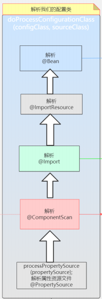

可以结合流程图一起观看更佳：[流程图](https://www.processon.com/view/link/5f18298a7d9c0835d38a57c0)

```java
//执行自定义的BeanFactoryProcessor和内置的BeanFactoryProcessor 
invokeBeanFactoryPostProcessors(beanFactory); 

// 重点代码终于来了，可以说 这句代码是目前为止最重要，也是内容最多的代码了，我们有必要好好分析下： 
protected void invokeBeanFactoryPostProcessors(ConfigurableListableBeanFactory beanFactory) { 
    // getBeanFactoryPostProcessors：一般都为null
    // 直接通过容器 annotationConfigApplicationContext.addBeanFactoryPostProcessor(XXX) 添加的BeanFactoryPostProcessors
    PostProcessorRegistrationDelegate.invokeBeanFactoryPostProcessors(beanFactory, getBeanFactoryPostProcessors()); 
    // Detect a LoadTimeWeaver and prepare for weaving, if found in the meantime 
    // (e.g. through an @Bean method registered by ConfigurationClassPostProcessor) 
    if (beanFactory.getTempClassLoader() == null && beanFactory.containsBean(LOAD_TIME_WEAVER_BEAN_NAME)) { 
        beanFactory.addBeanPostProcessor(new LoadTimeWeaverAwareProcessor(beanFactory)); 
        beanFactory.setTempClassLoader(new ContextTypeMatchClassLoader(beanFactory.getBeanClassLoader())); 
    } 
}
```

invokeBeanFactoryPostProcessors方法：

```java
public static void invokeBeanFactoryPostProcessors( 
    ConfigurableListableBeanFactory beanFactory, List<BeanFactoryPostProcessor> beanFactoryPostProcessors) { 
    // Invoke BeanDefinitionRegistryPostProcessors first, if any. 
    Set<String> processedBeans = new HashSet<>(); 
    //beanFactory是DefaultListableBeanFactory，是BeanDefinitionRegistry的实现类，所以肯定满足if 
    if (beanFactory instanceof BeanDefinitionRegistry) { 
        BeanDefinitionRegistry registry = (BeanDefinitionRegistry) beanFactory;
        //regularPostProcessors 用来存放BeanFactoryPostProcessor， 
        List<BeanFactoryPostProcessor> regularPostProcessors = new ArrayList<>(); 
        //registryProcessors 用来存放BeanDefinitionRegistryPostProcessor 
        //BeanDefinitionRegistryPostProcessor扩展了BeanFactoryPostProcessor 
        List<BeanDefinitionRegistryPostProcessor> registryProcessors = new ArrayList<>(); 
        // 循环传进来的beanFactoryPostProcessors，正常情况下，beanFactoryPostProcessors肯定没有数据 
        // 因为beanFactoryPostProcessors是获得手动添加的，而不是spring扫描的 
        // 只有手动调用annotationConfigApplicationContext.addBeanFactoryPostProcessor(XXX)才会有数据 
        for (BeanFactoryPostProcessor postProcessor : beanFactoryPostProcessors) { 
            // 判断postProcessor是不是BeanDefinitionRegistryPostProcessor，因为BeanDefinitionRegistryPostProcessor
            // 扩展了BeanFactoryPostProcessor，所以这里先要判断是不是BeanDefinitionRegistryPostProcessor 
            // 是的话，直接执行postProcessBeanDefinitionRegistry方法，然后把对象装到registryProcessors里面去 
            if (postProcessor instanceof BeanDefinitionRegistryPostProcessor) { 
                BeanDefinitionRegistryPostProcessor registryProcessor = 
                    (BeanDefinitionRegistryPostProcessor) postProcessor; 
                registryProcessor.postProcessBeanDefinitionRegistry(registry); 
                registryProcessors.add(registryProcessor); 
            } 
            else {
                //不是的话，就装到regularPostProcessors 
                regularPostProcessors.add(postProcessor); 
            } 
        } 
        // Do not initialize FactoryBeans here: We need to leave all regular beans 
        // uninitialized to let the bean factory post‐processors apply to them! 
        // Separate between BeanDefinitionRegistryPostProcessors that implement 
        // PriorityOrdered, Ordered, and the rest. 
        //一个临时变量，用来装载BeanDefinitionRegistryPostProcessor 
        //BeanDefinitionRegistry继承了PostProcessorBeanFactoryPostProcessor 
        List<BeanDefinitionRegistryPostProcessor> currentRegistryProcessors = new ArrayList<>(); 
        // First, invoke the BeanDefinitionRegistryPostProcessors that implement PriorityOrdered.
        // 获得实现BeanDefinitionRegistryPostProcessor接口的类的BeanName:org.springframework.context.annotation.internalConfigurationAnnotationProcessor 
        // 并且装入数组postProcessorNames，我理解一般情况下，只会找到一个 
        // 这里又有一个坑，为什么我自己创建了一个实现BeanDefinitionRegistryPostProcessor接口的类，也打上了@Component注解 
        // 配置类也加上了@Component注解，但是这里却没有拿到 
        // 因为直到这一步，Spring还没有去扫描，扫描是在ConfigurationClassPostProcessor类中完成的，也就是下面的第一个
        // invokeBeanDefinitionRegistryPostProcessors方法 
        String[] postProcessorNames = 
            beanFactory.getBeanNamesForType(BeanDefinitionRegistryPostProcessor.class, true, false); 
        for (String ppName : postProcessorNames) { 
            if (beanFactory.isTypeMatch(ppName, PriorityOrdered.class)) { 
                //获得ConfigurationClassPostProcessor类，并且放到currentRegistryProcessors 
                //ConfigurationClassPostProcessor是很重要的一个类，它实现了BeanDefinitionRegistryPostProcessor接口 
                //BeanDefinitionRegistryPostProcessor接口又实现了BeanFactoryPostProcessor接口 
                //ConfigurationClassPostProcessor是极其重要的类 
                //里面执行了扫描Bean，Import，ImportResouce等各种操作 
                //用来处理配置类（有两种情况 一种是传统意义上的配置类，一种是普通的bean）的各种逻辑 
                currentRegistryProcessors.add(beanFactory.getBean(ppName, BeanDefinitionRegistryPostProcessor.class)); 
                //把name放到processedBeans，后续会根据这个集合来判断处理器是否已经被执行过了 
                processedBeans.add(ppName); 
            } 
        } 
        //处理排序 
        sortPostProcessors(currentRegistryProcessors, beanFactory); 
        //合并Processors，为什么要合并，因为registryProcessors是装载BeanDefinitionRegistryPostProcessor的 
        //一开始的时候，spring只会执行BeanDefinitionRegistryPostProcessor独有的方法 
        //而不会执行BeanDefinitionRegistryPostProcessor父类的方法，即BeanFactoryProcessor的方法 
        //所以这里需要把处理器放入一个集合中，后续统一执行父类的方法 
        registryProcessors.addAll(currentRegistryProcessors); 
        //可以理解为执行ConfigurationClassPostProcessor的postProcessBeanDefinitionRegistry方法 
        //Spring热插播的体现，像ConfigurationClassPostProcessor就相当于一个组件，Spring很多事情就是交给组件去管理 
        //如果不想用这个组件，直接把注册组件的那一步去掉就可以 
        invokeBeanDefinitionRegistryPostProcessors(currentRegistryProcessors, registry); 
        //因为currentRegistryProcessors是一个临时变量，所以需要清除 
        currentRegistryProcessors.clear(); 
        // Next, invoke the BeanDefinitionRegistryPostProcessors that implement Ordered. 
        // 再次根据BeanDefinitionRegistryPostProcessor获得BeanName，看这个BeanName是否已经被执行过了，有没有实现Ordered接口 
        // 如果没有被执行过，也实现了Ordered接口的话，把对象推送到currentRegistryProcessors，名称推送到processedB eans 
        // 如果没有实现Ordered接口的话，这里不把数据加到currentRegistryProcessors，processedBeans中，后续再做处理 
        // 这里才可以获得我们定义的实现了BeanDefinitionRegistryPostProcessor的Bean 
        postProcessorNames = beanFactory.getBeanNamesForType(BeanDefinitionRegistryPostProcessor.class, true, false); 
        for (String ppName : postProcessorNames) { 
            if (!processedBeans.contains(ppName) && beanFactory.isTypeMatch(ppName, Ordered.class)) {
                currentRegistryProcessors.add(beanFactory.getBean(ppName, BeanDefinitionRegistryPostProcessor.class)); 
                processedBeans.add(ppName); 
            } 
        } 

        sortPostProcessors(currentRegistryProcessors, beanFactory); 
        registryProcessors.addAll(currentRegistryProcessors); 
        //执行我们自定义的BeanDefinitionRegistryPostProcessor 
        invokeBeanDefinitionRegistryPostProcessors(currentRegistryProcessors, registry); 
        currentRegistryProcessors.clear(); 
        // Finally, invoke all other BeanDefinitionRegistryPostProcessors until no further ones appear. 
        // 上面的代码是执行了实现了Ordered接口的BeanDefinitionRegistryPostProcessor， 
        // 下面的代码就是执行没有实现Ordered接口的BeanDefinitionRegistryPostProcessor 
        boolean reiterate = true; 
        while (reiterate) { 
            reiterate = false; 
            postProcessorNames = beanFactory.getBeanNamesForType(BeanDefinitionRegistryPostProcessor.class, tru e, false); 
            for (String ppName : postProcessorNames) { 
                if (!processedBeans.contains(ppName)) { 
                    currentRegistryProcessors.add(beanFactory.getBean(ppName, BeanDefinitionRegistryPostProcessor.class)); 
                    processedBeans.add(ppName); 
                    reiterate = true; 
                } 
            } 
            sortPostProcessors(currentRegistryProcessors, beanFactory); 
            registryProcessors.addAll(currentRegistryProcessors); 
            invokeBeanDefinitionRegistryPostProcessors(currentRegistryProcessors, registry); 
            currentRegistryProcessors.clear(); 
        }
        // Now, invoke the postProcessBeanFactory callback of all processors handled so far. 
        //registryProcessors集合装载BeanDefinitionRegistryPostProcessor 
        //上面的代码是执行子类独有的方法，这里需要再把父类的方法也执行一次 
        invokeBeanFactoryPostProcessors(registryProcessors, beanFactory); 
        //regularPostProcessors装载BeanFactoryPostProcessor，执行BeanFactoryPostProcessor的方法 
        //但是regularPostProcessors一般情况下，是不会有数据的，只有在外面手动添加BeanFactoryPostProcessor，才会有数据 
        invokeBeanFactoryPostProcessors(regularPostProcessors, beanFactory); 
    } 
    else { 
        // Invoke factory processors registered with the context instance. 
        invokeBeanFactoryPostProcessors(beanFactoryPostProcessors, beanFactory);
    } 
    // Do not initialize FactoryBeans here: We need to leave all regular beans 
    // uninitialized to let the bean factory post‐processors apply to them! 
    //找到BeanFactoryPostProcessor实现类的BeanName数组 
    String[] postProcessorNames = 
        beanFactory.getBeanNamesForType(BeanFactoryPostProcessor.class, true, false); 
    // Separate between BeanFactoryPostProcessors that implement PriorityOrdered, 
    // Ordered, and the rest. 
    List<BeanFactoryPostProcessor> priorityOrderedPostProcessors = new ArrayList<>(); 
    List<String> orderedPostProcessorNames = new ArrayList<>(); 
    List<String> nonOrderedPostProcessorNames = new ArrayList<>(); 
    //循环BeanName数组 
    for (String ppName : postProcessorNames) { 
        //如果这个Bean被执行过了，跳过 
        if (processedBeans.contains(ppName)) { 
            // skip ‐ already processed in first phase above 
        } 
        //如果实现了PriorityOrdered接口，加入到priorityOrderedPostProcessors 
        else if (beanFactory.isTypeMatch(ppName, PriorityOrdered.class)) { 
            priorityOrderedPostProcessors.add(beanFactory.getBean(ppName, BeanFactoryPostProcessor.class)); 
        } 
        //如果实现了Ordered接口，加入到orderedPostProcessorNames 
        else if (beanFactory.isTypeMatch(ppName, Ordered.class)) { 
            orderedPostProcessorNames.add(ppName); 
        } 
        //如果既没有实现PriorityOrdered，也没有实现Ordered。加入到nonOrderedPostProcessorNames 
        else { 
            nonOrderedPostProcessorNames.add(ppName); 
        } 
    } 
    //排序处理priorityOrderedPostProcessors，即实现了PriorityOrdered接口的BeanFactoryPostProcessor 
    // First, invoke the BeanFactoryPostProcessors that implement PriorityOrdered. 
    sortPostProcessors(priorityOrderedPostProcessors, beanFactory); 
    //执行priorityOrderedPostProcessors 
    invokeBeanFactoryPostProcessors(priorityOrderedPostProcessors, beanFactory); 
    //执行实现了Ordered接口的BeanFactoryPostProcessor 
    // Next, invoke the BeanFactoryPostProcessors that implement Ordered. 
    List<BeanFactoryPostProcessor> orderedPostProcessors = new ArrayList<>(); 
    for (String postProcessorName : orderedPostProcessorNames) { 
        orderedPostProcessors.add(beanFactory.getBean(postProcessorName, BeanFactoryPostProcessor.class)); 
    } 
    sortPostProcessors(orderedPostProcessors, beanFactory); 
    invokeBeanFactoryPostProcessors(orderedPostProcessors, beanFactory); 
    // 执行既没有实现PriorityOrdered接口，也没有实现Ordered接口的BeanFactoryPostProcessor 
    // Finally, invoke all other BeanFactoryPostProcessors. 
    List<BeanFactoryPostProcessor> nonOrderedPostProcessors = new ArrayList<>(); 
    for (String postProcessorName : nonOrderedPostProcessorNames) {
        nonOrderedPostProcessors.add(beanFactory.getBean(postProcessorName, BeanFactoryPostProcessor.class)); 
    } 
    invokeBeanFactoryPostProcessors(nonOrderedPostProcessors, beanFactory); 
    // Clear cached merged bean definitions since the post‐processors might have 
    // modified the original metadata, e.g. replacing placeholders in values... 
    beanFactory.clearMetadataCache(); 
}
```


首先判断beanFactory是不是BeanDefinitionRegistry的实例，当然肯定是的，然后执行如下操作： 

1. 定义了一个Set，装载BeanName，后面会根据这个Set，来判断后置处理器是否被执行过了

2. 定义了两个List，一个是regularPostProcessors，用来装载BeanFactoryPostProcessor，一个是registryProcessors用来装载 BeanDefinitionRegistryPostProcessor，其中BeanDefinitionRegistryPostProcessor扩展了BeanFactoryPostProcessor，BeanDefinitionRegistryPostProcessor有两个方法

   1. 一个是独有的 postProcessBeanDefinitionRegistry方法
   2. 一个是父类的 postProcessBeanFactory方法

3. 循环传进来的beanFactoryPostProcessors，上面已经解释过了，一般情况下，这里永远都是空的，只有手动add beanFactoryPostProcessor，这里才会有数据。我们假设beanFactoryPostProcessors有数据，进入循环，判断postProcessor是不是BeanDefinitionRegistryPostProcessor，因为BeanDefinitionRegistryPostProcessor扩展了BeanFactoryPostProcessor， 所以这里先要判断是不是BeanDefinitionRegistryPostProcessor，是的话，执行postProcessBeanDefinitionRegistry方法，然后把对象装到registryProcessors里面去，不是的话，就装到regularPostProcessors

4.  定义了一个临时变量：currentRegistryProcessors，用来装载BeanDefinitionRegistryPostProcessor

5. getBeanNamesForType，顾名思义，是根据类型查到BeanNames，这里有一点需要注意，就是去哪里找，点开这个方法的话，就知道是循环beanDefinitionNames去找，这个方法以后也会经常看到。这里传了 BeanDefinitionRegistryPostProcessor.class，就是找到类型为BeanDefinitionRegistryPostProcessor的后置处理器，并且赋值给postProcessorNames。一般情况下，只会找到一个，就是 org.springframework.context.annotation.internalConfigurationAnnotationProcessor，也就是 ConfigurationAnnotationProcessor。这个后置处理器在上一节中已经说明过了，十分重要。这里有一个问题，为什么我自己写了个类，实现了BeanDefinitionRegistryPostProcessor接口，也打上了@Component注解，但是这里没有获得，因为直到这一步， Spring还没有完成扫描，扫描是在ConfigurationClassPostProcessor类中完成的，也就是下面第一个invokeBeanDefinitionRegistryPostProcessors方法

6. 循环postProcessorNames，其实也就是 org.springframework.context.annotation.internalConfigurationAnnotationProcessor，判断此后置处理器是否实现了 PriorityOrdered接口（ConfigurationAnnotationProcessor也实现了PriorityOrdered接口）， 如果实现了，把它添加到currentRegistryProcessors这个临时变量中，再放入processedBeans，代表这个后置处理已经被处理过了。当 然现在还没有处理，但是马上就要处理了。。。

   

7. 进行排序，PriorityOrdered是一个排序接口，如果实现了它，就说明此后置处理器是有顺序的，所以需要排序。当然目前这里只有一个后置处理器，就是ConfigurationClassPostProcessor

8. 把currentRegistryProcessors合并到registryProcessors，为什么需要合并？因为一开始spring只会执行 BeanDefinitionRegistryPostProcessor独有的方法，而不会执行BeanDefinitionRegistryPostProcessor父类的方法，即 BeanFactoryProcessor接口中的方法，所以需要把这些后置处理器放入一个集合中，后续统一执行BeanFactoryProcessor接口中的方法。当然目前这里只有一个后置处理器，就是ConfigurationClassPostProcessor

9.  可以理解为执行currentRegistryProcessors中的ConfigurationClassPostProcessor中的postProcessBeanDefinitionRegistry 方法，这就是Spring设计思想的体现了，在这里体现的就是其中的**热插拔**，插件化开发的思想。Spring中很多东西都是交给插件去处理的，这个后置处理器就相当于一个插件，如果不想用了，直接不添加就是了。这个方法特别重要，我们后面会详细说来

   

10. 清空currentRegistryProcessors，因为currentRegistryProcessors是一个临时变量，已经完成了目前的使命，所以需要清空，当然后面还会用到

11. 再次根据BeanDefinitionRegistryPostProcessor获得BeanName，然后进行循环，看这个后置处理器是否被执行过了，如果没 有被执行过，也实现了Ordered接口的话，把此后置处理器推送到currentRegistryProcessors和processedBeans中。这里就可以获得我们定义的，并且打上@Component注解的后置处理器了，因为Spring已经完成了扫描，但是这里需要注意的是，由于ConfigurationClassPostProcessor在上面已经被执行过了，所以虽然可以通过getBeanNamesForType获得，但是并不会加入到currentRegistryProcessors和processedBeans

12. 处理排序

13. 合并Processors，合并的理由和上面是一样的

14. 执行我们自定义的BeanDefinitionRegistryPostProcessor

15. 清空临时变量

16. 在上面的方法中，仅仅是执行了实现了Ordered接口的BeanDefinitionRegistryPostProcessor，这里是执行没有实现Ordered接口的BeanDefinitionRegistryPostProcessor

17. 上面的代码是执行子类独有的方法，这里需要再把父类的方法也执行一次

18. 执行regularPostProcessors中的后置处理器的方法，需要注意的是，在一般情况下，regularPostProcessors是不会有数据 的，只有在外面手动添加BeanFactoryPostProcessor，才会有数据

19. 查找实现了BeanFactoryPostProcessor的后置处理器，并且执行后置处理器中的方法。和上面的逻辑差不多，不再详细说明。 

这就是这个方法中做的主要的事情了，可以说是比较复杂的。但是逻辑还是比较清晰的，在第9步的时候，我说有一个方法会详细说来， 现在就让我们好好看看这个方法究竟做了什么吧

**ConfigurationClassPostProcessor：**


```java
public void processConfigBeanDefinitions(BeanDefinitionRegistry registry) { 
    List<BeanDefinitionHolder> configCandidates = new ArrayList<>(); 
    String[] candidateNames = registry.getBeanDefinitionNames();
    //获得所有的BeanDefinition的Name，放入candidateNames数组 
    //循环candidateNames数组 
    for (String beanName : candidateNames) { 
        BeanDefinition beanDef = registry.getBeanDefinition(beanName);
        //根据beanName获得BeanDefinition 
        // 内部有两个标记位来标记是否已经处理过了 
        // 这里会引发一连串知识盲点：
        // 当我们注册配置类的时候，可以不加Configuration注解，直接使用Component ComponentScan Import ImportResource注解，称之为Lite配置类 
        // 如果加了Configuration注解，就称之为Full配置类 
        // 如果我们注册了Lite配置类，我们getBean这个配置类，会发现它就是原本的那个配置类 
        // 如果我们注册了Full配置类，我们getBean这个配置类，会发现它已经不是原本那个配置类了，而是已经被cgilb代理的类了 
        // 写一个A类，其中有一个构造方法，打印出“你好” 
        // 再写一个配置类，里面有两个bean注解的方法 
        // 其中一个方法new了A类，并且返回A的对象，把此方法称之为getA 
        // 第二个方法又调用了getA方法
        // 如果配置类是Lite配置类，会发现打印了两次“你好”，也就是说A类被new了两次 
        // 如果配置类是Full配置类，会发现只打印了一次“你好”，也就是说A类只被new了一次，因为这个类被cgilb代理了，方法已经被改写 
        if (ConfigurationClassUtils.isFullConfigurationClass(beanDef) || 
            ConfigurationClassUtils.isLiteConfigurationClass(beanDef)) { 
            if (logger.isDebugEnabled()) { 
                logger.debug("Bean definition has already been processed as a configuration class: " + beanDef); 
            } 
        } 
        //判断是否为配置类（有两种情况 一种是传统意义上的配置类，一种是普通的bean）， 
        //在这个方法内部，会做判断，这个配置类是Full配置类，还是Lite配置类，并且做上标记 
        //满足条件，加入到configCandidates 
        else if (ConfigurationClassUtils.checkConfigurationClassCandidate(beanDef, this.metadataReaderFactory)) { 
            configCandidates.add(new BeanDefinitionHolder(beanDef, beanName)); 
        }
    }
    // 如果没有配置类，直接返回 
    // Return immediately if no @Configuration classes were found
    if (configCandidates.isEmpty()) { 
        return; 
    } 
    // Sort by previously determined @Order value, if applicable 
    //处理排序 
    configCandidates.sort((bd1, bd2) ‐> { 
        int i1 = ConfigurationClassUtils.getOrder(bd1.getBeanDefinition()); 
        int i2 = ConfigurationClassUtils.getOrder(bd2.getBeanDefinition()); 
        return Integer.compare(i1, i2); 
    }); 
    // Detect any custom bean name generation strategy supplied through the enclosing application context
    SingletonBeanRegistry sbr = null; 
    // DefaultListableBeanFactory最终会实现SingletonBeanRegistry接口，所以可以进入到这个if 
    if (registry instanceof SingletonBeanRegistry) { 
        sbr = (SingletonBeanRegistry) registry; 
        if (!this.localBeanNameGeneratorSet) { 
            //spring中可以修改默认的bean命名方式，这里就是看用户有没有自定义bean命名方式，虽然一般没有人会这么做 
            BeanNameGenerator generator = (BeanNameGenerator) sbr.getSingleton(CONFIGURATION_BEAN_NAME_GENERATOR); 
            if (generator != null) { 
                this.componentScanBeanNameGenerator = generator; 
                this.importBeanNameGenerator = generator; 
            } 
        } 
    } 
    if (this.environment == null) { 
        this.environment = new StandardEnvironment(); 
    } 
    // Parse each @Configuration class 
    ConfigurationClassParser parser = new ConfigurationClassParser( 
        this.metadataReaderFactory, this.problemReporter, this.environment, 
        this.resourceLoader, this.componentScanBeanNameGenerator, registry); 
    Set<BeanDefinitionHolder> candidates = new LinkedHashSet<>(configCandidates); 
    Set<ConfigurationClass> alreadyParsed = new HashSet<>(configCandidates.size()); 
    do { 
        //解析配置类（传统意义上的配置类或者是普通bean，核心来了）
        parser.parse(candidates); 
        parser.validate(); 
        Set<ConfigurationClass> configClasses = new LinkedHashSet<>(parser.getConfigurationClasses()); 
        configClasses.removeAll(alreadyParsed); 
        // Read the model and create bean definitions based on its content 
        if (this.reader == null) { 
            this.reader = new ConfigurationClassBeanDefinitionReader( 
                registry, this.sourceExtractor, this.resourceLoader, this.environment, 
                this.importBeanNameGenerator, parser.getImportRegistry()); 
        } 
        this.reader.loadBeanDefinitions(configClasses);
        //直到这一步才把Import的类，@Bean @ImportRosource 转换成BeanDefinition 
        alreadyParsed.addAll(configClasses);
        //把configClasses加入到alreadyParsed，代表 
        candidates.clear(); 
        //获得注册器里面BeanDefinition的数量 和 candidateNames进行比较 
        //如果大于的话，说明有新的BeanDefinition注册进来了 
        if (registry.getBeanDefinitionCount() > candidateNames.length) { 
            String[] newCandidateNames = registry.getBeanDefinitionNames();
            //从注册器里面获得BeanDefinitionNames 
            Set<String> oldCandidateNames = new HashSet<>(Arrays.asList(candidateNames));//candidateNames转换set 
            Set<String> alreadyParsedClasses = new HashSet<>(); 
            //循环alreadyParsed。把类名加入到alreadyParsedClasses 
            for (ConfigurationClass configurationClass : alreadyParsed) { 
                alreadyParsedClasses.add(configurationClass.getMetadata().getClassName()); 
            } 
            for (String candidateName : newCandidateNames) { 
                if (!oldCandidateNames.contains(candidateName)) { 
                    BeanDefinition bd = registry.getBeanDefinition(candidateName); 
                    if (ConfigurationClassUtils.checkConfigurationClassCandidate(bd, this.metadataReaderFactory) && 
                        !alreadyParsedClasses.contains(bd.getBeanClassName())) { 
                        candidates.add(new BeanDefinitionHolder(bd, candidateName)); 
                    } 
                } 
            } 
            candidateNames = newCandidateNames; 
        } 
    } 
    while (!candidates.isEmpty()); 
    
    // Register the ImportRegistry as a bean in order to support ImportAware @Configuration classes 
    if (sbr != null && !sbr.containsSingleton(IMPORT_REGISTRY_BEAN_NAME)) { 
        sbr.registerSingleton(IMPORT_REGISTRY_BEAN_NAME, parser.getImportRegistry()); 
    } 
    if (this.metadataReaderFactory instanceof CachingMetadataReaderFactory) { 
        // Clear cache in externally provided MetadataReaderFactory; this is a no‐op 
        // for a shared cache since it'll be cleared by the ApplicationContext. 
        ((CachingMetadataReaderFactory) this.metadataReaderFactory).clearCache(); 
    } 
}
```

在第6步的时候，只是注册了部分Bean，像 @Import @Bean等，是没有被注册的，这里统一对这些进行注册。 

下面是解析配置类的过程

```java
public void parse(Set<BeanDefinitionHolder> configCandidates) { 
    this.deferredImportSelectors = new LinkedList<>(); 
    // 循环传进来的配置类 
    for (BeanDefinitionHolder holder : configCandidates) { 
        BeanDefinition bd = holder.getBeanDefinition();
        // 获得BeanDefinition 
        try { 
            // 如果获得BeanDefinition是AnnotatedBeanDefinition的实例 
            // 我们配置类的BeanDefinition是通过注解配置的AnnotatedBeanDefinition的实例，所以会进入第一个if
            if (bd instanceof AnnotatedBeanDefinition) { 
                parse(((AnnotatedBeanDefinition) bd).getMetadata(), holder.getBeanName()); 
            } else if (bd instanceof AbstractBeanDefinition && ((AbstractBeanDefinition) bd).hasBeanClass()) { 
                parse(((AbstractBeanDefinition) bd).getBeanClass(), holder.getBeanName()); 
            } else { 
                parse(bd.getBeanClassName(), holder.getBeanName()); 
            } 
        } catch (BeanDefinitionStoreException ex) { 
            throw ex; 
        } catch (Throwable ex) { 
            throw new BeanDefinitionStoreException( 
                "Failed to parse configuration class [" + bd.getBeanClassName() + "]", ex); 
        } 
    } 
    //执行DeferredImportSelector 
    processDeferredImportSelectors(); 
}
```

第一个if的parse方法：

```java
protected final void parse(AnnotationMetadata metadata, String beanName) throws IOException { 
    processConfigurationClass(new ConfigurationClass(metadata, beanName)); 
} 

protected void processConfigurationClass(ConfigurationClass configClass) throws IOException { 
    // 根据配置的ConditionalXXX判断是否跳过当前配置类
    if (this.conditionEvaluator.shouldSkip(configClass.getMetadata(), ConfigurationPhase.PARSE_CONFIGURAT ION)) { 
        return;
    } 
    
    // 已经处理过的配置类会放入configurationClasses缓存
    ConfigurationClass existingClass = this.configurationClasses.get(configClass); 
    if (existingClass != null) { 
        if (configClass.isImported()) { 
            if (existingClass.isImported()) { 
                existingClass.mergeImportedBy(configClass); 
            } 
            // Otherwise ignore new imported config class; existing non‐imported class overrides it. 
            return; 
        } else { 
            // Explicit bean definition found, probably replacing an import. 
            // Let's remove the old one and go with the new one. 
            this.configurationClasses.remove(configClass); 
            this.knownSuperclasses.values().removeIf(configClass::equals); 
        } 
    } 
    // Recursively process the configuration class and its superclass hierarchy. 
    // 校验配置类自己的注解
    SourceClass sourceClass = asSourceClass(configClass); 
    do { 
        // 核心
        sourceClass = doProcessConfigurationClass(configClass, sourceClass); 
    } 
    while (sourceClass != null); 
    this.configurationClasses.put(configClass, configClass); 
}
```

重点在于doProcessConfigurationClass方法，需要特别注意，最后一行代码，会把configClass放入一个Map，会在上面第7步中用到



```java
protected final SourceClass doProcessConfigurationClass(ConfigurationClass configClass, SourceClass s ourceClass) throws IOException {
    //递归处理内部类，一般不会写内部类 
    // Recursively process any member (nested) classes first 
    processMemberClasses(configClass, sourceClass); 
    // Process any @PropertySource annotations 
    // 从本类和父类中处理@PropertySource注解，@PropertySource注解用来加载properties文件 
    for (AnnotationAttributes propertySource : AnnotationConfigUtils.attributesForRepeatable( 
        sourceClass.getMetadata(), PropertySources.class, 
        org.springframework.context.annotation.PropertySource.class)) { 
        if (this.environment instanceof ConfigurableEnvironment) { 
            processPropertySource(propertySource); 
        } else { 
            logger.warn("Ignoring @PropertySource annotation on [" + sourceClass.getMetadata().getClassName() + 
                        "]. Reason: Environment must implement ConfigurableEnvironment"); 
        } 
    } 
    // Process any @ComponentScan annotations 
    // 从本类和父类中获得ComponentScan注解具体的内容，包括
    // ComponentScan注解除了最常用的basePackage之外，还有includeFilters，exc ludeFilters等 
    Set<AnnotationAttributes> componentScans = AnnotationConfigUtils.attributesForRepeatable( 
        sourceClass.getMetadata(), ComponentScans.class, ComponentScan.class); 
    //如果没有打上ComponentScan，或者被@Condition条件跳过，就不再进入这个if 
    if (!componentScans.isEmpty() && 
        !this.conditionEvaluator.shouldSkip(sourceClass.getMetadata(), ConfigurationPhase.REGISTER_BEAN)) { 
        // 循环处理componentScans
        for (AnnotationAttributes componentScan : componentScans) { 
            // The config class is annotated with @ComponentScan ‐> perform the scan immediately 
            // componentScan就是@ComponentScan上的具体内容，sourceClass.getMetadata().getClassName()就是配置类的名称 
            Set<BeanDefinitionHolder> scannedBeanDefinitions = 
                this.componentScanParser.parse(componentScan, sourceClass.getMetadata().getClassName()); 
            // Check the set of scanned definitions for any further config classes and parse recursively if need ed 
            // 检查被componentScan扫描的类下面是否是配置类
            for (BeanDefinitionHolder holder : scannedBeanDefinitions) { 
                BeanDefinition bdCand = holder.getBeanDefinition().getOriginatingBeanDefinition(); 
                if (bdCand == null) { 
                    bdCand = holder.getBeanDefinition(); 
                } 
                if (ConfigurationClassUtils.checkConfigurationClassCandidate(bdCand, this.metadataReaderFactory)) { 
                    //递归调用，因为可能组件类有被@Bean标记的方法，或者组件类本身也有ComponentScan等注解 
                    parse(bdCand.getBeanClassName(), holder.getBeanName()); 
                } 
            } 
        } 
    } 
    // Process any @Import annotations 
    //处理@Import注解 
    //@Import注解是spring中很重要的一个注解，Springboot大量应用这个注解 
    //@Import三种类，一种是Import普通类，一种是Import ImportSelector，还有一种是Import ImportBeanDefinitionRegistrar
    //getImports(sourceClass)是获得import的内容，返回的是一个set 
    processImports(configClass, sourceClass, getImports(sourceClass), true); 
    // Process any @ImportResource annotations 
    //处理@ImportResource注解 
    AnnotationAttributes importResource = 
    AnnotationConfigUtils.attributesFor(sourceClass.getMetadata(), ImportResource.class); 
    if (importResource != null) { 
        String[] resources = importResource.getStringArray("locations"); 
        Class<? extends BeanDefinitionReader> readerClass = importResource.getClass("reader"); 
        for (String resource : resources) { 
            String resolvedResource = this.environment.resolveRequiredPlaceholders(resource); 
            configClass.addImportedResource(resolvedResource, readerClass); 
        } 
    } 
    //处理@Bean的方法，可以看到获得了带有@Bean的方法后，不是马上转换成BeanDefinition，而是先用一个set接收 
    // Process individual @Bean methods 
    Set<MethodMetadata> beanMethods = retrieveBeanMethodMetadata(sourceClass); 
    for (MethodMetadata methodMetadata : beanMethods) { 
        configClass.addBeanMethod(new BeanMethod(methodMetadata, configClass)); 
    } 
    // Process default methods on interfaces 
    processInterfaces(configClass, sourceClass); 
    // Process superclass, if any 
    if (sourceClass.getMetadata().hasSuperClass()) { 
        String superclass = sourceClass.getMetadata().getSuperClassName(); 
        if (superclass != null && !superclass.startsWith("java") && 
            !this.knownSuperclasses.containsKey(superclass)) { 
            this.knownSuperclasses.put(superclass, configClass); 
            // Superclass found, return its annotation metadata and recurse 
            return sourceClass.getSuperClass(); 
        } 
    } 
    // No superclass ‐> processing is complete 
    return null; 
}
```


```java
public Set<BeanDefinitionHolder> parse(AnnotationAttributes componentScan, final String declaringClas s) { 
    //扫描器，还记不记在new AnnotationConfigApplicationContext的时候 
    //会调用AnnotationConfigApplicationContext的构造方法 
    //构造方法里面有一句 this.scanner = new ClassPathBeanDefinitionScanner(this); 
    //当时说这个对象不重要，这里就是证明了。常规用法中，实际上执行扫描的只会是这里的scanner对象 
    ClassPathBeanDefinitionScanner scanner = new ClassPathBeanDefinitionScanner(this.registry,     componentScan.getBoolean("useDefaultFilters"), this.environment, this.resourceLoader);
    //判断是否重写了默认的命名规则 
    Class<? extends BeanNameGenerator> generatorClass = componentScan.getClass("nameGenerator"); 
    boolean useInheritedGenerator = (BeanNameGenerator.class == generatorClass); 
    scanner.setBeanNameGenerator(useInheritedGenerator ? this.beanNameGenerator : 
                                 BeanUtils.instantiateClass(generatorClass)); 
    ScopedProxyMode scopedProxyMode = componentScan.getEnum("scopedProxy"); 
    if (scopedProxyMode != ScopedProxyMode.DEFAULT) { 
        scanner.setScopedProxyMode(scopedProxyMode); 
    } 
    else { 
        Class<? extends ScopeMetadataResolver> resolverClass = componentScan.getClass("scopeResolver"); 
        scanner.setScopeMetadataResolver(BeanUtils.instantiateClass(resolverClass)); 
    } 
    scanner.setResourcePattern(componentScan.getString("resourcePattern")); 
    //addIncludeFilter addExcludeFilter,最终是往List<TypeFilter>里面填充数据 
    //TypeFilter是一个函数式接口，函数式接口在java8的时候大放异彩，只定义了一个虚方法的接口被称为函数式接口 
    //当调用scanner.addIncludeFilter scanner.addExcludeFilter 仅仅把 定义的规则塞进去，并么有真正去执行匹配过程
    //处理includeFilters，就是把规则添加到scanner
    for (AnnotationAttributes filter : componentScan.getAnnotationArray("includeFilters")) { 
        // TypeFilter 是函数式接口
        for (TypeFilter typeFilter : typeFiltersFor(filter)) { 
            scanner.addIncludeFilter(typeFilter); 
        } 
    } 
    //处理excludeFilters 
    // @SpringBootApplication注解会添加两个
    for (AnnotationAttributes filter : componentScan.getAnnotationArray("excludeFilters")) { 
        for (TypeFilter typeFilter : typeFiltersFor(filter)) { 
            scanner.addExcludeFilter(typeFilter);

        } 
    } 
    boolean lazyInit = componentScan.getBoolean("lazyInit"); 
    if (lazyInit) { 
        scanner.getBeanDefinitionDefaults().setLazyInit(true); 
    } 
    Set<String> basePackages = new LinkedHashSet<>(); 
    String[] basePackagesArray = componentScan.getStringArray("basePackages"); 
    for (String pkg : basePackagesArray) { 
        String[] tokenized = StringUtils.tokenizeToStringArray(this.environment.resolvePlaceholders(pkg), ConfigurableApplicationContext.CONFIG_LOCATION_DELIMITERS); 
        Collections.addAll(basePackages, tokenized); 
    } 
    // 从下面的代码可以看出ComponentScans指定扫描目标，除了最常用的basePackages，还有两种方式 
    // 1.指定basePackageClasses，就是指定多个类，只要是与这几个类同级的，或者在这几个类下级的都可以被扫描到，这种方式其实是spring比较推荐的 
    // 因为指定basePackages没有IDE的检查，容易出错，但是指定一个类，就有IDE的检查了，不容易出错，经常会用一个空的类来作为basePackageClasses 
    // 2.直接不指定，默认会把与配置类同级，或者在配置类下级的作为扫描目标 
    for (Class<?> clazz : componentScan.getClassArray("basePackageClasses")) { 
        basePackages.add(ClassUtils.getPackageName(clazz)); 
    } 
    if (basePackages.isEmpty()) { 
        basePackages.add(ClassUtils.getPackageName(declaringClass)); 
    } 
    //把规则填充到排除规则：List<TypeFilter>，这里就把 注册类自身当作排除规则，真正执行匹配的时候，会把自身给排除
    scanner.addExcludeFilter(new AbstractTypeHierarchyTraversingFilter(false, false) { 
        @Override 
        protected boolean matchClassName(String className) { 
            return declaringClass.equals(className); 
        } 
    }); 
    //basePackages是一个LinkedHashSet<String>，这里就是把basePackages转为字符串数组的形式 
    return scanner.doScan(StringUtils.toStringArray(basePackages)); 
}
```

这里需要做一个补充说明，添加规则的时候，只是把具体的规则放入规则类的集合中去，规则类是一个函数式接口，只定义了一个虚方法的接口被称为函数式接口，函数式接口在java8的时候大放异彩，这里只是把规则方塞进去，并没有真正执行匹配规则。 

我们来看看到底是怎么执行扫描的

```java
protected Set<BeanDefinitionHolder> doScan(String... basePackages) { 
    Assert.notEmpty(basePackages, "At least one base package must be specified");
    Set<BeanDefinitionHolder> beanDefinitions = new LinkedHashSet<>(); 
    //循环处理basePackages 
    for (String basePackage : basePackages) {
        //根据包名找到符合条件的BeanDefinition集合 
        Set<BeanDefinition> candidates = findCandidateComponents(basePackage); 
        for (BeanDefinition candidate : candidates) { 
            ScopeMetadata scopeMetadata = this.scopeMetadataResolver.resolveScopeMetadata(candidate); 
            candidate.setScope(scopeMetadata.getScopeName()); 
            String beanName = this.beanNameGenerator.generateBeanName(candidate, this.registry); 
            //由findCandidateComponents内部可知，这里的candidate是ScannedGenericBeanDefinition 
            //而ScannedGenericBeanDefinition是AbstractBeanDefinition和AnnotatedBeanDefinition的子类 
            //所以下面的两个if都会进入 
            if (candidate instanceof AbstractBeanDefinition) {
                //内部会设置默认值 
                postProcessBeanDefinition((AbstractBeanDefinition) candidate, beanName); 
            } 
            if (candidate instanceof AnnotatedBeanDefinition) {
                //如果是AnnotatedBeanDefinition，还会再设置一次值 
                AnnotationConfigUtils.processCommonDefinitionAnnotations((AnnotatedBeanDefinition) candidate); 
            } 
            if (checkCandidate(beanName, candidate)) {
                BeanDefinitionHolder definitionHolder = new BeanDefinitionHolder(candidate, beanName); 
                definitionHolder = 
                    AnnotationConfigUtils.applyScopedProxyMode(scopeMetadata, definitionHolder, this.registry); 
                beanDefinitions.add(definitionHolder); 
                registerBeanDefinition(definitionHolder, this.registry); 
            } 
        } 
    } 
    return beanDefinitions; 
}
```

因为basePackages可能有多个，所以需要循环处理，最终会进行Bean的注册。下面再来看看findCandidateComponents方法


```java
public Set<BeanDefinition> findCandidateComponents(String basePackage) { 
    //spring支持component索引技术，需要引入一个组件，因为大部分情况不会引入这个组件 
    //所以不会进入到这个if 
    if (this.componentsIndex != null && indexSupportsIncludeFilters()) { 
        return addCandidateComponentsFromIndex(this.componentsIndex, basePackage); 
    } 
    else { 
        return scanCandidateComponents(basePackage);
    } 
}
```

```java
private Set<BeanDefinition> scanCandidateComponents(String basePackage) { 
    Set<BeanDefinition> candidates = new LinkedHashSet<>(); 
    try { 
        //把传进来的类似 命名空间形式的字符串转换成类似类文件地址的形式，然后在前面加上classpath*: 
        //即：com.xx=>classpath*:com/xx/**/*.class 
        String packageSearchPath = ResourcePatternResolver.CLASSPATH_ALL_URL_PREFIX + 
            resolveBasePackage(basePackage) + '/' + this.resourcePattern; 
        //根据packageSearchPath，获得符合要求的文件 
        Resource[] resources = getResourcePatternResolver().getResources(packageSearchPath);
        boolean traceEnabled = logger.isTraceEnabled(); 
        boolean debugEnabled = logger.isDebugEnabled(); 
        //循环资源 
        for (Resource resource : resources) { 
            if (traceEnabled) { 
                logger.trace("Scanning " + resource); 
            } 
            if (resource.isReadable()) {//判断资源是否可读，并且不是一个目录 
                try { 
                    //metadataReader 元数据读取器，解析resource，也可以理解为描述资源的数据结构 
                    MetadataReader metadataReader = getMetadataReaderFactory().getMetadataReader(resource); 
                    //在isCandidateComponent方法内部会真正执行匹配规则 
                    //注册配置类自身会被排除，不会进入到这个if 
                    if (isCandidateComponent(metadataReader)) { 
                        // 对扫描到的类创建bean定义
                        ScannedGenericBeanDefinition sbd = new ScannedGenericBeanDefinition(metadataReader); 
                        sbd.setResource(resource); 
                        sbd.setSource(resource); 
                        if (isCandidateComponent(sbd)) { 
                            if (debugEnabled) { 
                                logger.debug("Identified candidate component class: " + resource); 
                            } 
                            candidates.add(sbd); 
                        } 
                        else { 
                            if (debugEnabled) { 
                                logger.debug("Ignored because not a concrete top‐level class: " + resource); 
                            } 
                        } 
                    } 
                    else { 
                        if (traceEnabled) { 
                            logger.trace("Ignored because not matching any filter: " + resource); 
                        } 
                    } 
                } 
                catch (Throwable ex) { 
                    throw new BeanDefinitionStoreException( 
                        "Failed to read candidate component class: " + resource, ex); 
                } 
            } 
            else { 
                if (traceEnabled) { 
                    logger.trace("Ignored because not readable: " + resource); 
                } 
            } 
        } 
    } 
    catch (IOException ex) { 
        throw new BeanDefinitionStoreException("I/O failure during classpath scanning", ex); 
    } 
    return candidates; 
}
```


**@Import解析**

直到这里，上面说的4.1中提到的方法终于分析完毕了，让我们再看看上面提到的第5步中的处理@Import注解方法： 


```java
//这个方法内部相当相当复杂，importCandidates是Import的内容，调用这个方法的时候，已经说过可能有三种情况 
//这里再说下，1.Import普通类，2.Import ImportSelector，3.Import ImportBeanDefinitionRegistrar 
//循环importCandidates，判断属于哪种情况 
//如果是普通类，会进到else，调用processConfigurationClass方法 
//这个方法是不是很熟悉，没错，processImports这个方法就是在processConfigurationClass方法中被调用的 
//processImports又主动调用processConfigurationClass方法，是一个递归调用，因为Import的普通类，也有可能被加 了Import注解，@ComponentScan注解 或者其他注解，所以普通类需要再次被解析 
//如果Import ImportSelector就跑到了第一个if中去，首先执行Aware接口方法，所以我们在实现ImportSelector的同 时，还可以实现Aware接口 
//然后判断是不是DeferredImportSelector，DeferredImportSelector扩展了ImportSelector 
//如果不是的话，调用selectImports方法，获得全限定类名数组，在转换成类的数组，然后再调用processImports，又特 么的是一个递归调用...
//可能又有三种情况，一种情况是selectImports的类是一个普通类，第二种情况是selectImports的类是一个ImportBean DefinitionRegistrar类，第三种情况是还是一个ImportSelector类... 
//所以又需要递归调用 
//如果Import ImportBeanDefinitionRegistrar就跑到了第二个if，还是会执行Aware接口方法，这里终于没有递归了， 会把数据放到ConfigurationClass中的Map<ImportBeanDefinitionRegistrar, AnnotationMetadata> importBeanDefini tionRegistrars中去 
private void processImports(ConfigurationClass configClass, SourceClass currentSourceClass,
                            Collection<SourceClass> importCandidates, boolean checkForCircularImports) { 
    if (importCandidates.isEmpty()) { 
        return; 
    }
    if (checkForCircularImports && isChainedImportOnStack(configClass)) { 
        this.problemReporter.error(new CircularImportProblem(configClass, this.importStack)); 
    } else { 
        this.importStack.push(configClass); 
        try { 
            for (SourceClass candidate : importCandidates) { 
                // 处理ImportSelector
                if (candidate.isAssignable(ImportSelector.class)) { 
                    // Candidate class is an ImportSelector ‐> delegate to it to determine imports 
                    Class<?> candidateClass = candidate.loadClass(); 
                    // 实例化selector
                    ImportSelector selector = BeanUtils.instantiateClass(candidateClass, ImportSelector.class); 
                    ParserStrategyUtils.invokeAwareMethods( 
                        selector, this.environment, this.resourceLoader, this.registry);
                    // 是否是DeferredImportSelector（延迟）
                    if (this.deferredImportSelectors != null && selector instanceof DeferredImportSelector) { 
                        // 放入延迟集合
                        this.deferredImportSelectors.add(
                            new DeferredImportSelectorHolder(configClass, (DeferredImportSelector) selector)); 
                    } else { 
                        // 非延迟ImportSelector，直接调用selectImports
                        // springboot就是通过导入AutoConfigurationImportSelector来实现的自动装配
                        String[] importClassNames = selector.selectImports(currentSourceClass.getMetadata()); 
                        Collection<SourceClass> importSourceClasses = asSourceClasses(importClassNames); 
                        // 导入的类直接当作配置类来继续调用当前方法（递归）
                        processImports(configClass, currentSourceClass, importSourceClasses, false); 
                    } 
                } 
                // 处理ImportBeanDefinitionRegistrar
                else if (candidate.isAssignable(ImportBeanDefinitionRegistrar.class)) { 
                    // Candidate class is an ImportBeanDefinitionRegistrar ‐> 
                    // delegate to it to register additional bean definitions 
                    Class<?> candidateClass = candidate.loadClass();
                    ImportBeanDefinitionRegistrar registrar = 
                        BeanUtils.instantiateClass(candidateClass, ImportBeanDefinitionRegistrar.class); 
                    ParserStrategyUtils.invokeAwareMethods( 
                        registrar, this.environment, this.resourceLoader, this.registry); 
                    configClass.addImportBeanDefinitionRegistrar(registrar, currentSourceClass.getMetadata()); 
                } 
                else { 
                    // Candidate class not an ImportSelector or ImportBeanDefinitionRegistrar ‐> 
                    // process it as an @Configuration class 
                    // 开始处理
                    this.importStack.registerImport( 
                        currentSourceClass.getMetadata(), candidate.getMetadata().getClassName());
                    processConfigurationClass(candidate.asConfigClass(configClass)); 
                }
            } 
        } catch (BeanDefinitionStoreException ex) { 
            throw ex; 
        } catch (Throwable ex) {
            throw new BeanDefinitionStoreException( 
                "Failed to process import candidates for configuration class [" + 
                configClass.getMetadata().getClassName() + "]", ex); 
        } finally { 
            this.importStack.pop(); 
        } 
    } 
}
```


这个方法大概的作用已经在注释中已经写明了，就不再重复了

直到这里，才把ConfigurationClassPostProcessor中的processConfigBeanDefinitions方法简单的过了一下

但是这还没有结束，这里只会解析@Import的Bean而已， 不会注册

后续还有个点：processConfigBeanDefinitions是BeanDefinitionRegistryPostProcessor接口中的方法， 

BeanDefinitionRegistryPostProcessor扩展了BeanFactoryPostProcessor，还有postProcessBeanFactory方法没有分析，这个方法是干嘛的，简单的来说，就是判断配置类是Lite配置类，还是Full配置类，如果是配置类，就会被Cglib代理，目的就是保证Bean的作用域

关于这个方法实在是比较复杂


我们来做一个总结，ConfigurationClassPostProcessor中的processConfigBeanDefinitions方法十分重要，主要是完成扫描，最终注册我们定义的Bean