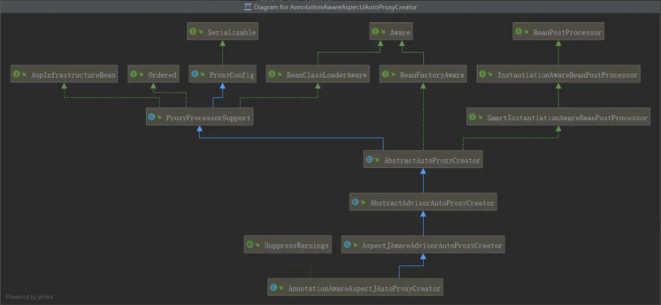

## 前世今生

我们先来把它们的概念和关系说说清楚，我们学习的Spring-AOP其实冰山一角，但是AOP还有很多的相关内容需要了 解

- AOP 要实现的是在我们原来写的代码的基础上，进行一定的包装，如在方法执行前、方法返回后、方法抛出异常后等地方进行一定的拦截处理或者叫增强处理。 
- AOP 的实现并不是因为 Java 提供了什么神奇的钩子，可以把方法的几个生命周期告诉我们，而是我们要实现一个代理，实际运行的实例其实是生成的代理类的实例。 
- 作为 Java 开发者，我们都很熟悉 **AspectJ** 这个词，甚至于我们提到 AOP 的时候，想到的往往就是AspectJ，即使你可能不太懂它是怎么工作的。这里，我们把 AspectJ 和 Spring AOP 做个简单的对比：

### Spring AOP


- **它基于动态代理来实现**。默认地，如果使用接口的，用 JDK 提供的动态代理实现，如果没有接口，使用CGLIB 实现。大家一定要明白背后的意思，包括什么时候会不用 JDK 提供的动态代理，而用 CGLIB 实现
- **Spring 3.2 以后，spring-core 直接就把 CGLIB 和 ASM 的源码包括进来了**，这也是为什么我们不需要显式引入这两个依赖
- Spring 的 IOC 容器和 AOP 都很重要，Spring AOP 需要依赖于 IOC 容器来管理
- Spring AOP 只能作用于 Spring 容器中的 Bean，它是使用纯粹的 Java 代码实现的，只能作用于 bean 的方法
- Spring 提供了 AspectJ 的支持，但只用到的AspectJ的切点解析和匹配
- 很多人会对比 Spring AOP 和 AspectJ 的性能，Spring AOP 是基于代理实现的，在容器启动的时候需要生成代理实例，在方法调用上也会增加栈的深度，使得 Spring AOP 的性能不如 AspectJ 那么好

### AspectJ

- AspectJ 出身也是名门，来自于 Eclipse 基金会，link：https://www.eclipse.org/aspectj
- 属于静态织入，它是通过修改代码来实现的，它的织入时机可以是
  - Compile-time weaving：编译期织入，如类 A 使用 AspectJ 添加了一个属性，类 B 引用了它，这个场景就需要编译期的时候就进行织入，否则没法编译类 B
  - Post-compile weaving：编译后织入，也就是已经生成了 .class 文件，或已经打成 jar 包了，这种情况我们需要增强处理的话，就要用到编译后织入
  - **Load-time weaving**：指的是在加载类的时候进行织入，要实现这个时期的织入，有几种常见的方法
    - 自定义类加载器来干这个，这个应该是最容易想到的办法，在被织入类加载到 JVM 前去对它进行加载，这样就可以在加载的时候定义行为了
    - 在 JVM 启动的时候指定 AspectJ 提供的 agent：-javaagent:xxx/xxx/aspectjweaver.jar
- AspectJ 能干很多 Spring AOP 干不了的事情，它是 **AOP 编程的完全解决方案**。Spring AOP 致力于解决的是企业级开发中最普遍的 AOP 需求（方法织入），而不是力求成为一个像 AspectJ 一样的 AOP 编程完全解决方案
- 因为 AspectJ 在实际代码运行前完成了织入，所以大家会说它生成的类是没有额外运行时开销的


## AOP 术语解释


## Spring AOP的使用

首先要说明的是，这里介绍的 Spring AOP 是纯的 Spring 代码，和 AspectJ 没什么关系，但是 Spring 延用了AspectJ中的概念，包括使用了 AspectJ 提供的 jar 包中的注解，但是不依赖于其实现功能

> 后面介绍的如 *@Aspect*、*@Pointcut*、*@Before*、*@After* 等注解都是来自于 *AspectJ*，但是功能的实现是纯 *Spring AOP*自己实现的

下面我们来介绍 Spring AOP 的使用方法，先从最简单的配置方式开始说起，这样读者想看源码也会比较容易。目前 Spring AOP 一共有三种配置方式，Spring 做到了很好地向下兼容，所以大家可以放心使用

1. Spring 1.2 **基于接口的配置**：最早的 Spring AOP 是完全基于几个接口的，想看源码的同学可以从这里起步
2. Spring 2.0 **schema-based 配置**：Spring 2.0 以后使用 XML 的方式来配置，使用 命名空间 <aop ></aop>
3. Spring 2.0 **@AspectJ** **配置**：使用注解的方式来配置，这种方式感觉是最方便的，还有，这里虽然叫做 @AspectJ，但是这个和 AspectJ 其实没啥关系

### Spring 1.2 中的配置

这节我们将介绍 Spring 1.2 中的配置，这是最古老的配置，但是由于 Spring 提供了很好的向后兼容，以及很多人根本不知道什么配置是什么版本的，以及是否有更新更好的配置方法替代，所以还是会有很多代码是采用这种古老的配置方式的（比如声明式事务），这里说的古老并没有贬义的意思

下面用一个简单的例子来演示怎么使用 Spring 1.2 的配置方式

```java
// 计算类接口 
public interface Calculate { 
    int add(int numA, int numB); 
    int reduce(int numA, int numB); 
    int div(int numA, int numB); 
    int multi(int numA, int numB); 
    int mod(int numA, int numB); 
}
```

```java
// 实现类
@Component 
public class MyCalculate implements Calculate { 
    public int add(int numA, int numB) { 
        System.out.println("执行目标方法:add"); 
        System.out.println(1/0); 
        return numA+numB; 
    } 
    
    public int reduce(int numA, int numB) { 
        System.out.println("执行目标方法:reduce"); 
        return numA‐numB; 
    } 
    
    public int div(int numA, int numB) { 
        System.out.println("执行目标方法:div"); 
        return numA/numB; 
    } 
    
    public int multi(int numA, int numB) { 
        System.out.println("执行目标方法:multi"); 
        return numA*numB; 
    } 
    
    public int mod(int numA,int numB){ 
        System.out.println("执行目标方法:mod"); 
        int retVal = ((Calculate)AopContext.currentProxy()).add(numA,numB); 
        //int retVal = this.add(numA,numB); 
        return retVal%numA; 
        //return numA%numB; 
    }
```

定义 **advice （通知）**：增强的方法 

前置通知

```java
public class LogAdvice implements MethodBeforeAdvice { 
    @Override 
    public void before(Method method, Object[] args, Object target) throws Throwable { 
        String methodName = method.getName(); 
        System.out.println("执行目标方法【"+methodName+"】的<前置通知>,入参"+ Arrays.asList(args)); 
    } 
}
```

环绕通知

```java
public class LogInterceptor implements MethodInterceptor { 
    @Override 
    public Object invoke(MethodInvocation invocation) throws Throwable { 
        System.out.println(getClass()+"调用方法前"); 
        Object ret=invocation.proceed(); 
        System.out.println(getClass()+"调用方法后"); 
        return ret; 
    } 
}
```

配置

```java
public class EalyAopMainConfig{
    // 被代理对象 
    @Bean 
    public Calculate myCalculate() { 
        return new MyCalculate(); 
    } 
    // Advice 方式 
    @Bean 
    public LogAdvice logAdvice(){ 
        return new LogAdvice(); 
    } 
    // Interceptor方式 ， 类似环绕通知 
    @Bean 
    public logInterceptor logInterceptor() { 
        return new logInterceptor(); 
    } 

    /** 
    * ProxyFactoryBean是FactoryBean的实现类
    */ 
    @Bean 
    public ProxyFactoryBean calculateProxy(){ 
        ProxyFactoryBean userService = new ProxyFactoryBean(); 
        // 设置通知
        userService.setInterceptorNames("logAdvice","logInterceptor"); 
        // 管理的bean对象
        userService.setTarget(myCalculate()); 
        return userService; 
    }
}
```

测试

```java
public static void main(String[] args) { 
    AnnotationConfigApplicationContext ctx = new AnnotationConfigApplicationContext(EalyAopMainConfig.class); 
    Calculate calculate = ctx.getBean("calculateProxy",Calculate.class); 
    calculate.div(1,1); 
}
```


从结果可以看到，使用了责任链方式对advice和Interceptor都进行调用。这个例子理解起来应该非常简单，就是通过调用FactoryBean的getObject方法创建一个代理实现

> 代理模式需要一个接口（可选）、一个具体实现类，然后就是定义一个代理类，用来包装实现类，添加自定义逻辑， 在使用的时候，需要用代理类来生成实例

此中方法有个致命的问题，如果我们只能指定单一的Bean的AOP， 如果多个Bean需要创建多个ProxyFactoryBean 。而 且，我们看到，我们的拦截器的粒度只控制到了类级别，类中所有的方法都进行了拦截。接下来，我们看看怎么样**只拦截特定的方法**

在上面的配置中，配置拦截器的时候，interceptorNames 除了指定为 Advice和Interceptor，还可以是Advisor 。

> 这里我们来理解 **Advisor** 的概念，它也比较简单，**它内部需要指定一个 Advice**，Advisor 决定该拦截哪些方法，拦截后需要完成的工作还是内部的 Advice 来做
>
> 它有好几个实现类，这里我们使用实现类 **NameMatchMethodPointcutAdvisor** 来演示，从名字上就可以看出来，它需要我们给它提供方法名字，这样符合该配置的方法才会做拦截

```java
@Bean 
public NameMatchMethodPointcutAdvisor logAspect() { 
    NameMatchMethodPointcutAdvisor advisor = new NameMatchMethodPointcutAdvisor(); 
    // 通知(Advice) ：是我们的通知类 
    // 通知者(Advisor)：是经过包装后的细粒度控制方式。 
    advisor.setAdvice(logAdvice()); 
    // 这里的 mappedNames 配置是可以指定多个的，用逗号分隔，可以是不同类中的方法。
    // 相比直接指定 advice， advisor 实现了更细粒度的控制
    advisor.setMappedNames("div"); 
    return advisor; 
} 

@Bean 
public ProxyFactoryBean calculateProxy(){ 
    ProxyFactoryBean userService=new ProxyFactoryBean(); 
    userService.setInterceptorNames("logAspect"); 
    userService.setTarget(tulingCalculate()); 
    return userService; 
}
```

上面，我们介绍完了 **Advice、Advisor、Interceptor** 三个概念，相信大家应该很容易就看懂它们了。

它们有个共同的问题，那就是我们得为每个 bean 都配置一个代理，之后获取 bean 的时候需要获取这个代理类的 bean实例（如 ctx.getBean("calculateProxy",Calculate.class)），这显然非常不方便，不利于我们之后要使用的自动根据类型注入。下面介绍 autoproxy 的解决方案

**autoproxy**：从名字我们也可以看出来，它是实现自动代理，也就是说当 Spring 发现一个 bean需要被切面织入的时候，Spring 会自动生成这个 bean 的一个代理来拦截方法的执行，确保定义的切面能被执行。 

这里强调**自动**，也就是说 Spring 会自动做这件事，而不用像前面介绍的，我们需要显式地指定代理类的 bean。

我们去掉原来的 **ProxyFactoryBean** 的配置，改为使用 **BeanNameAutoProxyCreator** 来配置

```java
 /** 
 *autoProxy: BeanPostProcessor手动指定Advice方式 BeanNameAutoProxyCreator
 */ 
@Bean
public BeanNameAutoProxyCreator autoProxyCreator() { 
    BeanNameAutoProxyCreator beanNameAutoProxyCreator = new BeanNameAutoProxyCreator(); 
    //设置要创建代理的那些Bean的名字 
    beanNameAutoProxyCreator.setBeanNames("my*"); 
    //设置拦截链名字(这些拦截器是有先后顺序的) 
    beanNameAutoProxyCreator.setInterceptorNames("logInterceptor"); 
    return beanNameAutoProxyCreator; 
}
```

配置很简单，beanNames 中可以使用正则来匹配 bean 的名字来增强多个类。 也就是说不再是配置某个 bean 的代理 了。

> 注意，这里的 *InterceptorNames* 和前面一样，也是可以配置成 *Advisor* 和 *Interceptor* 的

然后我们修改下使用的地方

```java
public static void main(String[] args) { 
    AnnotationConfigApplicationContext ctx = new AnnotationConfigApplicationContext(EalyAopMainConfig.cla ss); 
    Calculate calculate = ctx.getBean("myCalculate",Calculate.class); 
    calculate.div(1,1); 
}
```

发现没有，**我们在使用的时候，完全不需要关心代理了**，直接使用原来的类型就可以了

到这里，是不是发现 BeanNameAutoProxyCreator 非常好用，它需要指定被拦截类名的模式(如 *ServiceImpl)，它可以配置多次，这样就可以用来匹配不同模式的类了

另外，在 BeanNameAutoProxyCreator 同一个包中，还有一个非常有用的类 **DefaultAdvisorAutoProxyCreator**， 比上面的 BeanNameAutoProxyCreator 还要方便。 

之前我们说过，advisor 内部包装了 advice，advisor 负责决定拦截哪些方法，内部 advice 定义拦截后的逻辑。所以，仔细想想其实就是只要让我们的 advisor 全局生效就能实现我们需要的自定义拦截功能、拦截后的逻辑处理

> *BeanNameAutoProxyCreator* 是自己匹配方法，然后交由内部配置 *advice* 来拦截处理； 
>
> 而 *DefaultAdvisorAutoProxyCreator* 是让 *ioc* 容器中的所有 *advisor* 来匹配方法，*advisor* 内部都是有 *advice* 的，让它们内部的 *advice* 来执行拦截处理

1、我们需要再回头看下 Advisor 的配置，上面我们用了 NameMatchMethodPointcutAdvisor 这个类

```java
@Bean 
public NameMatchMethodPointcutAdvisor logAspect() { 
    NameMatchMethodPointcutAdvisor advisor = new NameMatchMethodPointcutAdvisor(); 
    advisor.setAdvice(logAdvice()); 
    advisor.setMappedNames("div"); 
    return advisor; 
} 
```

其实 Advisor 还有一个更加灵活的实现类 **RegexpMethodPointcutAdvisor**，它能实现正则匹配，如：

```java
// RegexpMethodPointcutAdvisor 按正则匹配类 
@Bean 
public RegexpMethodPointcutAdvisor logAspectInterceptor() { 
    RegexpMethodPointcutAdvisor advisor=new RegexpMethodPointcutAdvisor(); 
    advisor.setAdvice(LogInterceptor()); 
    advisor.setPattern("packagename.MyCalculate.*"); 
    return advisor;
}
```

也就是说，我们能通过配置 Advisor，精确定位到需要被拦截的方法，然后使用内部的 Advice 执行逻辑处理。 

2、之后，我们需要配置 DefaultAdvisorAutoProxyCreator，它的配置非常简单，直接使用下面这段配置就可以了，它就会使得**所有的 Advisor 自动生效**，无须其他配置。（记得把之前的autoProxyCreator配置去掉，无需创建2次代理）

```java
 /** 
 * BeanPostProcessor自动扫描Advisor方式 DefaultAdvisorAutoProxyCreator 
 * @return 
 */ 
@Bean 
public DefaultAdvisorAutoProxyCreator autoProxyCreator() { 
    return new DefaultAdvisorAutoProxyCreator(); 
} 

// 然后我们运行一下： 
public static void main(String[] args) { 
    AnnotationConfigApplicationContext ctx = new AnnotationConfigApplicationContext(EalyAopMainConfig.cla ss); 
    Calculate myCalculate = ctx.getBean("myCalculate",Calculate.class); 
    myCalculate.div(1,1); 
}
```

从结果可以看出，create 方法使用了 logArgsAdvisor 进行传参输出，query 方法使用了 logResultAdvisor 进行了返回结果输出

> 读到这里，我想对于很多人来说，就知道怎么去阅读 *Spring AOP* 源码了

### Spring 2.0 中的配置

请参考基础文档：05-SpringAOP的使用详解.note 


### AspectJ编译方式实现AOP

AspectJ方式不多讲，2大核心： 

- 定义了切面表达式的语法和解析机制 
- 提供了强大的织入工具 

它是通过织入的方式：直接将切面在【编译前、后】或【

JVM加载的时候】进行织入到.class代码中。在实际生产中，我们用得最多的还是纯 Spring AOP，因为AspectJ学习成本高， Spring AOP已经能满足日常开发种的需求。 通过本AspectJ大家了解下 Spring Aop只用到了aspectj的设计理念（注解)和切点表达式配对


## Spring AOP源码解析

我们知道，spring中的aop是通过动态代理实现的，那么他具体是如何实现的呢？spring通过一个切面类，在他的类上加入@Aspect注解，定义一个Pointcut方法，最后定义一系列的增强方法。这样就完成一个对象的切面操作。 

那么思考一下，按照上述的基础，要实现我们的aop，大致有以下思路： 

1. 找到所有的切面类
2. 解析出所有的advice并保存
3. 创建一个动态代理类
4. 调用被代理类的方法时，找到他的所有增强器，并增强当前的方法 

那么下面通过源码验证一下我们的猜测：


### 一、切面类的解析

spring通过@EnableAspectJAutoProxy开启aop切面，在注解类上面发现@Import(AspectJAutoProxyRegistrar.class)，AspectJAutoProxyRegistrar实现了ImportBeanDefinitionRegistrar，所以他会通过registerBeanDefinitions方法为我们容器导入beanDefinition



**详细流程图：** https://www.processon.com/view/link/5f1958a35653bb7fd24d0aad 

追踪一下源码可以看到最终导入AnnotationAwareAspectJAutoProxyCreator，我们看一下他的类继承关系图，发现它实现了两个重要的接口，BeanPostProcessor和InstantiationAwareBeanPostProcessor 

首先看InstantiationAwareBeanPostProcessor的postProcessBeforeInstantiation方法 

```java
Object postProcessBeforeInstantiation(Class<?> beanClass, String beanName)（InstantiationAwareBeanPostProcessor） 

//org.springframework.aop.framework.autoproxy.AbstractAutoProxyCreator#postProcessBeforeInstantiation 
//org.springframework.aop.aspectj.autoproxy.AspectJAwareAdvisorAutoProxyCreator#shouldSkip 
//org.springframework.aop.aspectj.annotation.AnnotationAwareAspectJAutoProxyCreator#findCandidateAdvisors 
//org.springframework.aop.aspectj.annotation.BeanFactoryAspectJAdvisorsBuilder#buildAspectJAdvisors 
```

```java
public List<Advisor> buildAspectJAdvisors() { 
    //获取缓存中的aspectBeanNames 
    List<String> aspectNames = this.aspectBeanNames; 
    if (aspectNames == null) { 
        synchronized (this) { 
            aspectNames = this.aspectBeanNames; 
            if (aspectNames == null) { 
                List<Advisor> advisors = new ArrayList<>(); 
                aspectNames = new ArrayList<>(); 
                //获取beanFactory中所有的beanNames 
                String[] beanNames = BeanFactoryUtils.beanNamesForTypeIncludingAncestors( 
                    this.beanFactory, Object.class, true, false); 
                for (String beanName : beanNames) { 
                    if (!isEligibleBean(beanName)) { 
                        continue; 
                    } 
                    // We must be careful not to instantiate beans eagerly as in this case they 
                    // would be cached by the Spring container but would not have been weaved. 
                    Class<?> beanType = this.beanFactory.getType(beanName); 
                    if (beanType == null) { 
                        continue; 
                    } 
                    //找出所有类上面含@Aspect注解的beanName 
                    if (this.advisorFactory.isAspect(beanType)) { 
                        //将找到的beanName放入aspectNames集合 
                        aspectNames.add(beanName); 
                        AspectMetadata amd = new AspectMetadata(beanType, beanName); 
                        if (amd.getAjType().getPerClause().getKind() == PerClauseKind.SINGLETON) { 
                            MetadataAwareAspectInstanceFactory factory = 
                                new BeanFactoryAspectInstanceFactory(this.beanFactory, beanName); 
                            //1.找到切面类的所有但是不包括@Pointcut注解的方法 
                            //2.筛选出来包含@Around, @Before, @After,@ AfterReturning， @AfterThrowing注解的方法 
                            //3.封装为List<Advisor>返回 
                            List<Advisor> classAdvisors = this.advisorFactory.getAdvisors(factory); 
                            if (this.beanFactory.isSingleton(beanName)) { 
                                //将上面找出来的Advisor按照key为beanName，value为List<Advisor>的形式存入advisorsCache 
                                this.advisorsCache.put(beanName, classAdvisors); 
                            } 
                            else { 
                                this.aspectFactoryCache.put(beanName, factory); 
                            }

                            advisors.addAll(classAdvisors); 
                        } 
                        else { 
                            // Per target or per this. 
                            if (this.beanFactory.isSingleton(beanName)) { 
                                throw new IllegalArgumentException("Bean with name '" + beanName + 
                                                                   "' is a singleton, but aspect instantiation model is not singleton"); 
                            } 
                            MetadataAwareAspectInstanceFactory factory = 
                                new PrototypeAspectInstanceFactory(this.beanFactory, beanName); 
                            this.aspectFactoryCache.put(beanName, factory); 
                            advisors.addAll(this.advisorFactory.getAdvisors(factory)); 
                        } 
                    } 
                } 
                this.aspectBeanNames = aspectNames; 
                return advisors; 
            } 
        } 
    } 
    if (aspectNames.isEmpty()) { 
        return Collections.emptyList(); 
    } 
    List<Advisor> advisors = new ArrayList<>(); 
    for (String aspectName : aspectNames) { 
        //当再次进入该方法，会直接从advisorsCache缓存中获取 
        List<Advisor> cachedAdvisors = this.advisorsCache.get(aspectName); 
        if (cachedAdvisors != null) { 
            advisors.addAll(cachedAdvisors); 
        } 
        else { 
            MetadataAwareAspectInstanceFactory factory = this.aspectFactoryCache.get(aspectName); 
            advisors.addAll(this.advisorFactory.getAdvisors(factory)); 
        } 
    } 
    return advisors; 
}
```

流程图


**解析的步骤：**


最终将解析出来的advisor放入缓存，这里思考清楚 advisor和advise的区别


其实就是我们切面中的通知方法：


### 二、创建代理

