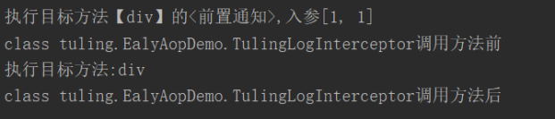

## 前世今生

我们先来把它们的概念和关系说说清楚，我们学习的Spring-AOP其实冰山一角，但是AOP还有很多的相关内容需要了 解

- AOP 要实现的是在我们原来写的代码的基础上，进行一定的包装，如在方法执行前、方法返回后、方法抛出异常后等地方进行一定的拦截处理或者叫增强处理。 
- AOP 的实现并不是因为 Java 提供了什么神奇的钩子，可以把方法的几个生命周期告诉我们，而是我们要实现一个代理，实际运行的实例其实是生成的代理类的实例。 
- 作为 Java 开发者，我们都很熟悉 **AspectJ** 这个词，甚至于我们提到 AOP 的时候，想到的往往就是AspectJ，即使你可能不太懂它是怎么工作的。这里，我们把 AspectJ 和 Spring AOP 做个简单的对比：

### Spring AOP


- **它基于动态代理来实现**。默认地，如果使用接口的，用 JDK 提供的动态代理实现，如果没有接口，使用CGLIB 实现。大家一定要明白背后的意思，包括什么时候会不用 JDK 提供的动态代理，而用 CGLIB 实现
- **Spring 3.2 以后，spring-core 直接就把 CGLIB 和 ASM 的源码包括进来了**，这也是为什么我们不需要显式引入这两个依赖
- Spring 的 IOC 容器和 AOP 都很重要，Spring AOP 需要依赖于 IOC 容器来管理
- Spring AOP 只能作用于 Spring 容器中的 Bean，它是使用纯粹的 Java 代码实现的，只能作用于 bean 的方法
- Spring 提供了 AspectJ 的支持，但只用到的AspectJ的切点解析和匹配
- 很多人会对比 Spring AOP 和 AspectJ 的性能，Spring AOP 是基于代理实现的，在容器启动的时候需要生成代理实例，在方法调用上也会增加栈的深度，使得 Spring AOP 的性能不如 AspectJ 那么好

### AspectJ

- AspectJ 出身也是名门，来自于 Eclipse 基金会，link：https://www.eclipse.org/aspectj
- 属于静态织入，它是通过修改代码来实现的，它的织入时机可以是
  - Compile-time weaving：编译期织入，如类 A 使用 AspectJ 添加了一个属性，类 B 引用了它，这个场景就需要编译期的时候就进行织入，否则没法编译类 B
  - Post-compile weaving：编译后织入，也就是已经生成了 .class 文件，或已经打成 jar 包了，这种情况我们需要增强处理的话，就要用到编译后织入
  - **Load-time weaving**：指的是在加载类的时候进行织入，要实现这个时期的织入，有几种常见的方法
    - 自定义类加载器来干这个，这个应该是最容易想到的办法，在被织入类加载到 JVM 前去对它进行加载，这样就可以在加载的时候定义行为了
    - 在 JVM 启动的时候指定 AspectJ 提供的 agent：-javaagent:xxx/xxx/aspectjweaver.jar
- AspectJ 能干很多 Spring AOP 干不了的事情，它是 **AOP 编程的完全解决方案**。Spring AOP 致力于解决的是企业级开发中最普遍的 AOP 需求（方法织入），而不是力求成为一个像 AspectJ 一样的 AOP 编程完全解决方案
- 因为 AspectJ 在实际代码运行前完成了织入，所以大家会说它生成的类是没有额外运行时开销的


## AOP 术语解释

- Aspect 切面
- Joinpoint 连接点
- Advice 通知
- Target 目标对象
- Pointcut 切点
- Advisor 顾问
- Weaving 织入
- Introductions 引入：作用于类，为类增加行为，但不用修改该类的程序


## Spring AOP的使用

首先要说明的是，这里介绍的 Spring AOP 是纯的 Spring 代码，和 AspectJ 没什么关系，但是 Spring 延用了AspectJ中的概念，包括使用了 AspectJ 提供的 jar 包中的注解，但是不依赖于其实现功能

> 后面介绍的如 *@Aspect*、*@Pointcut*、*@Before*、*@After* 等注解都是来自于 *AspectJ*，但是功能的实现是纯 *Spring AOP*自己实现的

下面我们来介绍 Spring AOP 的使用方法，先从最简单的配置方式开始说起，这样读者想看源码也会比较容易。目前 Spring AOP 一共有三种配置方式，Spring 做到了很好地向下兼容，所以大家可以放心使用

1. Spring 1.2 **基于接口的配置**：最早的 Spring AOP 是完全基于几个接口的，想看源码的同学可以从这里起步
2. Spring 2.0 **schema-based 配置**：Spring 2.0 以后使用 XML 的方式来配置，使用 命名空间 <aop ></aop>
3. Spring 2.0 **@AspectJ** **配置**：使用注解的方式来配置，这种方式感觉是最方便的，还有，这里虽然叫做 @AspectJ，但是这个和 AspectJ 其实没啥关系

### Spring 1.2 中的配置

这节我们将介绍 Spring 1.2 中的配置，这是最古老的配置，但是由于 Spring 提供了很好的向后兼容，以及很多人根本不知道什么配置是什么版本的，以及是否有更新更好的配置方法替代，所以还是会有很多代码是采用这种古老的配置方式的（比如声明式事务），这里说的古老并没有贬义的意思

下面用一个简单的例子来演示怎么使用 Spring 1.2 的配置方式

```java
// 计算类接口 
public interface Calculate { 
    int add(int numA, int numB); 
    int reduce(int numA, int numB); 
    int div(int numA, int numB); 
    int multi(int numA, int numB); 
    int mod(int numA, int numB); 
}
```

```java
// 实现类
@Component 
public class MyCalculate implements Calculate { 
    public int add(int numA, int numB) { 
        System.out.println("执行目标方法:add"); 
        System.out.println(1/0); 
        return numA+numB; 
    } 
    
    public int reduce(int numA, int numB) { 
        System.out.println("执行目标方法:reduce"); 
        return numA‐numB; 
    } 
    
    public int div(int numA, int numB) { 
        System.out.println("执行目标方法:div"); 
        return numA/numB; 
    } 
    
    public int multi(int numA, int numB) { 
        System.out.println("执行目标方法:multi"); 
        return numA*numB; 
    } 
    
    public int mod(int numA,int numB){ 
        System.out.println("执行目标方法:mod"); 
        int retVal = ((Calculate)AopContext.currentProxy()).add(numA,numB); 
        //int retVal = this.add(numA,numB); 
        return retVal%numA; 
        //return numA%numB; 
    }
```

定义 **advice （通知）**：增强的方法 

前置通知

```java
public class LogAdvice implements MethodBeforeAdvice { 
    @Override 
    public void before(Method method, Object[] args, Object target) throws Throwable { 
        String methodName = method.getName(); 
        System.out.println("执行目标方法【"+methodName+"】的<前置通知>,入参"+ Arrays.asList(args)); 
    } 
}
```

环绕通知

```java
public class LogInterceptor implements MethodInterceptor { 
    @Override 
    public Object invoke(MethodInvocation invocation) throws Throwable { 
        System.out.println(getClass()+"调用方法前"); 
        Object ret=invocation.proceed(); 
        System.out.println(getClass()+"调用方法后"); 
        return ret; 
    } 
}
```

配置

```java
public class EalyAopMainConfig{
    // 被代理对象 
    @Bean 
    public Calculate myCalculate() { 
        return new MyCalculate(); 
    } 
    // Advice 方式 
    @Bean 
    public LogAdvice logAdvice(){ 
        return new LogAdvice(); 
    } 
    // Interceptor方式 ， 类似环绕通知 
    @Bean 
    public logInterceptor logInterceptor() { 
        return new logInterceptor(); 
    } 

    /** 
    * ProxyFactoryBean是FactoryBean的实现类
    */ 
    @Bean 
    public ProxyFactoryBean calculateProxy(){ 
        ProxyFactoryBean userService = new ProxyFactoryBean(); 
        // 设置通知
        userService.setInterceptorNames("logAdvice","logInterceptor"); 
        // 管理的bean对象
        userService.setTarget(myCalculate()); 
        return userService; 
    }
}
```

测试

```java
public static void main(String[] args) { 
    AnnotationConfigApplicationContext ctx = new AnnotationConfigApplicationContext(EalyAopMainConfig.class); 
    Calculate calculate = ctx.getBean("calculateProxy",Calculate.class); 
    calculate.div(1,1); 
}
```



从结果可以看到，使用了责任链方式对advice和Interceptor都进行调用。这个例子理解起来应该非常简单，就是通过调用FactoryBean的getObject方法创建一个代理实现

> 代理模式需要一个接口（可选）、一个具体实现类，然后就是定义一个代理类，用来包装实现类，添加自定义逻辑， 在使用的时候，需要用代理类来生成实例

此中方法有个致命的问题，如果我们只能指定单一的Bean的AOP， 如果多个Bean需要创建多个ProxyFactoryBean 。而 且，我们看到，我们的拦截器的粒度只控制到了类级别，类中所有的方法都进行了拦截。接下来，我们看看怎么样**只拦截特定的方法**

在上面的配置中，配置拦截器的时候，interceptorNames 除了指定为 Advice和Interceptor，还可以是Advisor 。

> 这里我们来理解 **Advisor** 的概念，它也比较简单，**它内部需要指定一个 Advice**，Advisor 决定该拦截哪些方法，拦截后需要完成的工作还是内部的 Advice 来做
>
> 它有好几个实现类，这里我们使用实现类 **NameMatchMethodPointcutAdvisor** 来演示，从名字上就可以看出来，它需要我们给它提供方法名字，这样符合该配置的方法才会做拦截

```java
@Bean 
public NameMatchMethodPointcutAdvisor logAspect() { 
    NameMatchMethodPointcutAdvisor advisor = new NameMatchMethodPointcutAdvisor(); 
    // 通知(Advice) ：是我们的通知类 
    // 通知者(Advisor)：是经过包装后的细粒度控制方式。 
    advisor.setAdvice(logAdvice()); 
    // 这里的 mappedNames 配置是可以指定多个的，用逗号分隔，可以是不同类中的方法。
    // 相比直接指定 advice， advisor 实现了更细粒度的控制
    advisor.setMappedNames("div"); 
    return advisor; 
} 

@Bean 
public ProxyFactoryBean calculateProxy(){ 
    ProxyFactoryBean userService=new ProxyFactoryBean(); 
    userService.setInterceptorNames("logAspect"); 
    userService.setTarget(tulingCalculate()); 
    return userService; 
}
```

上面，我们介绍完了 **Advice、Advisor、Interceptor** 三个概念，相信大家应该很容易就看懂它们了。

它们有个共同的问题，那就是我们得为每个 bean 都配置一个代理，之后获取 bean 的时候需要获取这个代理类的 bean实例（如 ctx.getBean("calculateProxy",Calculate.class)），这显然非常不方便，不利于我们之后要使用的自动根据类型注入。下面介绍 autoproxy 的解决方案

**autoproxy**：从名字我们也可以看出来，它是实现自动代理，也就是说当 Spring 发现一个 bean需要被切面织入的时候，Spring 会自动生成这个 bean 的一个代理来拦截方法的执行，确保定义的切面能被执行。 

这里强调**自动**，也就是说 Spring 会自动做这件事，而不用像前面介绍的，我们需要显式地指定代理类的 bean。

我们去掉原来的 **ProxyFactoryBean** 的配置，改为使用 **BeanNameAutoProxyCreator** 来配置

```java
 /** 
 *autoProxy: BeanPostProcessor手动指定Advice方式 BeanNameAutoProxyCreator
 */ 
@Bean
public BeanNameAutoProxyCreator autoProxyCreator() { 
    BeanNameAutoProxyCreator beanNameAutoProxyCreator = new BeanNameAutoProxyCreator(); 
    //设置要创建代理的那些Bean的名字 
    beanNameAutoProxyCreator.setBeanNames("my*"); 
    //设置拦截链名字(这些拦截器是有先后顺序的) 
    beanNameAutoProxyCreator.setInterceptorNames("logInterceptor"); 
    return beanNameAutoProxyCreator; 
}
```

配置很简单，beanNames 中可以使用正则来匹配 bean 的名字来增强多个类。 也就是说不再是配置某个 bean 的代理 了。

> 注意，这里的 *InterceptorNames* 和前面一样，也是可以配置成 *Advisor* 和 *Interceptor* 的

然后我们修改下使用的地方

```java
public static void main(String[] args) { 
    AnnotationConfigApplicationContext ctx = new AnnotationConfigApplicationContext(EalyAopMainConfig.cla ss); 
    Calculate calculate = ctx.getBean("myCalculate",Calculate.class); 
    calculate.div(1,1); 
}
```

发现没有，**我们在使用的时候，完全不需要关心代理了**，直接使用原来的类型就可以了

到这里，是不是发现 BeanNameAutoProxyCreator 非常好用，它需要指定被拦截类名的模式(如 *ServiceImpl)，它可以配置多次，这样就可以用来匹配不同模式的类了

另外，在 BeanNameAutoProxyCreator 同一个包中，还有一个非常有用的类 **DefaultAdvisorAutoProxyCreator**， 比上面的 BeanNameAutoProxyCreator 还要方便。 

之前我们说过，advisor 内部包装了 advice，advisor 负责决定拦截哪些方法，内部 advice 定义拦截后的逻辑。所以，仔细想想其实就是只要让我们的 advisor 全局生效就能实现我们需要的自定义拦截功能、拦截后的逻辑处理

> *BeanNameAutoProxyCreator* 是自己匹配方法，然后交由内部配置 *advice* 来拦截处理； 
>
> 而 *DefaultAdvisorAutoProxyCreator* 是让 *ioc* 容器中的所有 *advisor* 来匹配方法，*advisor* 内部都是有 *advice* 的，让它们内部的 *advice* 来执行拦截处理

1、我们需要再回头看下 Advisor 的配置，上面我们用了 NameMatchMethodPointcutAdvisor 这个类

```java
@Bean 
public NameMatchMethodPointcutAdvisor logAspect() { 
    NameMatchMethodPointcutAdvisor advisor = new NameMatchMethodPointcutAdvisor(); 
    advisor.setAdvice(logAdvice()); 
    advisor.setMappedNames("div"); 
    return advisor; 
} 
```

其实 Advisor 还有一个更加灵活的实现类 **RegexpMethodPointcutAdvisor**，它能实现正则匹配，如：

```java
// RegexpMethodPointcutAdvisor 按正则匹配类 
@Bean 
public RegexpMethodPointcutAdvisor logAspectInterceptor() { 
    RegexpMethodPointcutAdvisor advisor=new RegexpMethodPointcutAdvisor(); 
    advisor.setAdvice(LogInterceptor()); 
    advisor.setPattern("packagename.MyCalculate.*"); 
    return advisor;
}
```

也就是说，我们能通过配置 Advisor，精确定位到需要被拦截的方法，然后使用内部的 Advice 执行逻辑处理。 

2、之后，我们需要配置 DefaultAdvisorAutoProxyCreator，它的配置非常简单，直接使用下面这段配置就可以了，它就会使得**所有的 Advisor 自动生效**，无须其他配置。（记得把之前的autoProxyCreator配置去掉，无需创建2次代理）

```java
 /** 
 * BeanPostProcessor自动扫描Advisor方式 DefaultAdvisorAutoProxyCreator 
 * @return 
 */ 
@Bean 
public DefaultAdvisorAutoProxyCreator autoProxyCreator() { 
    return new DefaultAdvisorAutoProxyCreator(); 
} 

// 然后我们运行一下： 
public static void main(String[] args) { 
    AnnotationConfigApplicationContext ctx = new AnnotationConfigApplicationContext(EalyAopMainConfig.cla ss); 
    Calculate myCalculate = ctx.getBean("myCalculate",Calculate.class); 
    myCalculate.div(1,1); 
}
```

从结果可以看出，create 方法使用了 logArgsAdvisor 进行传参输出，query 方法使用了 logResultAdvisor 进行了返回结果输出

> 读到这里，我想对于很多人来说，就知道怎么去阅读 *Spring AOP* 源码了

### Spring 2.0 中的配置

请参考基础文档：05-SpringAOP的使用详解.note 


### AspectJ编译方式实现AOP

AspectJ方式不多讲，2大核心： 

- 定义了切面表达式的语法和解析机制 
- 提供了强大的织入工具 

它是通过织入的方式：直接将切面在【编译前、后】或【

JVM加载的时候】进行织入到.class代码中。在实际生产中，我们用得最多的还是纯 Spring AOP，因为AspectJ学习成本高， Spring AOP已经能满足日常开发种的需求。 通过本AspectJ大家了解下 Spring Aop只用到了aspectj的设计理念（注解)和切点表达式配对


## Spring AOP源码解析

我们知道，spring中的aop是通过动态代理实现的，那么他具体是如何实现的呢？spring通过一个切面类，在他的类上加入@Aspect注解，定义一个Pointcut方法，最后定义一系列的增强方法。这样就完成一个对象的切面操作。 

那么思考一下，按照上述的基础，要实现我们的aop，大致有以下思路： 

1. 找到所有的切面类
2. 解析出所有的advice并保存
3. 创建一个动态代理类
4. 调用被代理类的方法时，找到他的所有增强器，并增强当前的方法 

那么下面通过源码验证一下我们的猜测：


### 一、入口

以下的三种方式其实都是去创建 AnnotationAwareAspectJAutoProxyCreator Bean定义

**通过配置文件直接配置**

spring mvc 中是在 refresh 中：

```java
ConfigurableListableBeanFactory beanFactory = obtainFreshBeanFactory();
```

ApplicationContext的实现类会重写这里面的模板方法，然后在解析XML文件的时候，逐个读取aop配置信息，创建bean定义


**通过注解配置**


```txt
http\://www.springframework.org/schema/aop=org.springframework.aop.config.AopNamespaceHandler
```

**通过EnableAspectJAutoProxy注解配置**

spring通过@EnableAspectJAutoProxy开启aop切面，在注解类上面发现@Import(AspectJAutoProxyRegistrar.class)，AspectJAutoProxyRegistrar实现了ImportBeanDefinitionRegistrar，所以他会通过registerBeanDefinitions方法为我们容器导入beanDefinition

- proxyTargetClass = fasle：通过jdk基于接口方式进行织入，这时候代理生成的是一个接口对象
- proxyTargetClass = true: 使用 cglib 的动态代理方式，这时候代理生成的是一个继承代理对象

**详细流程图：** https://www.processon.com/view/link/5f1958a35653bb7fd24d0aad 

**在Spring容器的第一个单例Bean被实例化之前，首先要把AOP相关的对象提前准备好，因为无法预测哪些对象需要动态代理**

只有先把AOP相关对象实例化好，才能在创建单例Bean的时候判断这个Bean是否满足被代理的条件，那么哪个扩展点可以让AOP的对象先创建

### 二、注册AOP相关类Bean定义


### 三、实例化AOP相关类

追踪一下源码可以看到最终导入AnnotationAwareAspectJAutoProxyCreator

```java
@Import(AspectJAutoProxyRegistrar.class)
public @interface EnableAspectJAutoProxy {
...
}
```

```java
// 继承了 ImportBeanDefinitionRegistrar 的接口会在某个节点??调用 registerBeanDefinitions 导入bean定义
class AspectJAutoProxyRegistrar implements ImportBeanDefinitionRegistrar {
	@Override
	public void registerBeanDefinitions(
			AnnotationMetadata importingClassMetadata, BeanDefinitionRegistry registry) {

         // 核心：注册了自动代理模式创建器
		AopConfigUtils.registerAspectJAnnotationAutoProxyCreatorIfNecessary(registry);
		...
	}
}
```

```java
public static BeanDefinition registerAspectJAnnotationAutoProxyCreatorIfNecessary(
			BeanDefinitionRegistry registry, @Nullable Object source) {
		// AnnotationAwareAspectJAutoProxyCreator AOP核心类
		return registerOrEscalateApcAsRequired(AnnotationAwareAspectJAutoProxyCreator.class, registry, source);
	}
```

我们看一下他的类继承关系图，发现它实现了两个重要的接口，BeanPostProcessor和InstantiationAwareBeanPostProcessor 


实例化AnnotationAwareAspectJAutoProxyCreator

```java
refresh#registerBeanPostProcessors(beanFactory);
```

首先看InstantiationAwareBeanPostProcessor的postProcessBeforeInstantiation方法 

createBean() ->

org.springframework.beans.factory.support.AbstractAutowireCapableBeanFactory#resolveBeforeInstantiation ->

org.springframework.beans.factory.support.AbstractAutowireCapableBeanFactory#applyBeanPostProcessorsBeforeInstantiation 

```java
// AbstractApplicationContext#refresh
// finishBeanFactoryInitialization

beanFactory.preInstantiateSingletons();

while
getBean();
doGetBean();
createBean();

try {
     // 在任意bean创建的时候就调用 
    // 一：自定义代理是在这里扩展 targetSource
	// 二：通过AnnotationAwareAspectJAutoProxyCreator实例化了所有的AOP相关的类
	Object bean = resolveBeforeInstantiation(beanName, mbdToUse);
	if (bean != null) {
		return bean;
	}
}
catch (Throwable ex) {
	throw new BeanCreationException(mbdToUse.getResourceDescription(), beanName,
			"BeanPostProcessor before instantiation of bean failed", ex);
}
try {
    // AOP相关的所有类都实例化后才开始创建单例Bean
	Object beanInstance = doCreateBean(beanName, mbdToUse, args);
	if (logger.isTraceEnabled()) {
		logger.trace("Finished creating instance of bean '" + beanName + "'");
	}
	return beanInstance;
}
```

```java
protected Object resolveBeforeInstantiation(String beanName, RootBeanDefinition mbd) {
	Object bean = null;
	if (!Boolean.FALSE.equals(mbd.beforeInstantiationResolved)) {
		// Make sure bean class is actually resolved at this point.
		if (!mbd.isSynthetic() && hasInstantiationAwareBeanPostProcessors()) {
			Class<?> targetType = determineTargetType(beanName, mbd);
	 		if (targetType != null) {
                 // 进入
				bean = applyBeanPostProcessorsBeforeInstantiation(targetType, beanName);
				if (bean != null) {
					bean = applyBeanPostProcessorsAfterInitialization(bean, beanName);
				}
			}
		}
		mbd.beforeInstantiationResolved = (bean != null);
	}
	return bean;
}
```

```java
protected Object applyBeanPostProcessorsBeforeInstantiation(Class<?> beanClass, String beanName) {
    // 找到实现了 instantiationAware 接口的后置处理器
    // AbstractAutoProxyCreator
	for (InstantiationAwareBeanPostProcessor bp : getBeanPostProcessorCache().instantiationAware) {
		Object result = bp.postProcessBeforeInstantiation(beanClass, beanName);
		if (result != null) {
			return result;
		}
	}
	return null;
}
```

(AbstractAutoProxyCreator)AnnotationAwareAspectJAutoProxyCreator

```java
public Object postProcessBeforeInstantiation(Class<?> beanClass, String beanName) {
		Object cacheKey = getCacheKey(beanClass, beanName);

		if (!StringUtils.hasLength(beanName) || !this.targetSourcedBeans.contains(beanName)) {
			if (this.advisedBeans.containsKey(cacheKey)) {
				return null;
			}
            
             // 第一次实例化类的时候到这
             // 进入子类的
            // isInfrastructureClass：判断是否是aop内部基础类，或者是aspect切面类，或者是自定义配置的aspect切面类
            // 		如果是aop相关类就不会调用shouldSkip
            // shouldSkip：初次进入会进行切面类的实例化
			if (isInfrastructureClass(beanClass) || shouldSkip(beanClass, beanName)) {
                // advisedBeans key是object类型
				this.advisedBeans.put(cacheKey, Boolean.FALSE);
				return null;
			}
		}

		// Create proxy here if we have a custom TargetSource.
		// Suppresses unnecessary default instantiation of the target bean:
		// The TargetSource will handle target instances in a custom fashion.
    	// 用户自定义的对象代理创建支持
		TargetSource targetSource = getCustomTargetSource(beanClass, beanName);
		if (targetSource != null) {
			if (StringUtils.hasLength(beanName)) {
				this.targetSourcedBeans.add(beanName);
			}
			Object[] specificInterceptors = getAdvicesAndAdvisorsForBean(beanClass, beanName, targetSource);
			Object proxy = createProxy(beanClass, beanName, specificInterceptors, targetSource);
			this.proxyTypes.put(cacheKey, proxy.getClass());
			return proxy;
		}

		return null;
	}
```

子类AspectJAwareAdvisorAutoProxyCreator重写了shouldSkip

```java
@Override
protected boolean shouldSkip(Class<?> beanClass, String beanName) {
	// TODO: Consider optimization by caching the list of the aspect names
    // 重点
	List<Advisor> candidateAdvisors = findCandidateAdvisors();
	for (Advisor advisor : candidateAdvisors) {
		if (advisor instanceof AspectJPointcutAdvisor &&
				((AspectJPointcutAdvisor) advisor).getAspectName().equals(beanName)) {
			return true;
		}
	}
	return super.shouldSkip(beanClass, beanName);
}
```

子类AnnotationAwareAspectJAutoProxyCreator自己的重写

**查询候选的通知器，此时还没有任何的Advisor被实例化，前面都是创建Bean定义，那么findCandidateAdvisors就是实例化Advisor的**

```java
@Override
protected List<Advisor> findCandidateAdvisors() {
    // 分支一
    // 如果配置文件中配置了aop相关的配置，那么在之前的配置文件读取过程中已经将xml中的aop节点转化为了bean定义
	// 那么里面的BeanFactoryUtils.beanNamesForTypeIncludingAncestor会得到aop相关bean定义
    // 开始实例化的AOP相关类
	List<Advisor> advisors = super.findCandidateAdvisors();
	// Build Advisors for all AspectJ aspects in the bean factory.
	if (this.aspectJAdvisorsBuilder != null) {
        // 分支二
        // 解析@Aspectj为bean定义，且实例化
		advisors.addAll(this.aspectJAdvisorsBuilder.buildAspectJAdvisors());
	}
    
    // 那么在spring mvc中 分支一和分支二可以同时配置
    // springboot 中一般都是只配置分支二
	return advisors;
}
```


**分之一：配置文件**


开始实例化AOP相关类

```java
protected List<Advisor> findCandidateAdvisors() {
	Assert.state(this.advisorRetrievalHelper != null, "No BeanFactoryAdvisorRetrievalHelper available");
    // 进入
	return this.advisorRetrievalHelper.findAdvisorBeans();
}
```

```java
public List<Advisor> findAdvisorBeans() {
	// Determine list of advisor bean names, if not cached already.
    // 找到当前容器中已经存在的Advisor
    // 首次进入肯定是没有的
	String[] advisorNames = this.cachedAdvisorBeanNames;
	if (advisorNames == null) {
		// Do not initialize FactoryBeans here: We need to leave all regular beans
		// uninitialized to let the auto-proxy creator apply to them!
        // 找出所有实现了Advisor接口的bean的名称
        // 自定义配置Advisor，每个advice都会用一个Advisor包装，所以这里是找到自定义的所有advice
		advisorNames = BeanFactoryUtils.beanNamesForTypeIncludingAncestors(
				this.beanFactory, Advisor.class, true, false);
        // 放入缓存
		this.cachedAdvisorBeanNames = advisorNames;
	}
	if (advisorNames.length == 0) {
		return new ArrayList<>();
	}
	List<Advisor> advisors = new ArrayList<>();
	for (String name : advisorNames) {
        // 默认都是true，可能是为了留给用户自己扩展实现过滤
		if (isEligibleBean(name)) {
			if (this.beanFactory.isCurrentlyInCreation(name)) {
				if (logger.isTraceEnabled()) {
					logger.trace("Skipping currently created advisor '" + name + "'");
				}
			}
			else {
				try {
                    // 在这里实例化advisor 并且把对象放入advisors
                    // 本身我们是实例化logUtil这个切面类进入这里的，
                    // 现在实例化advisor的时候发现又会调用，但是会被isInfrastructureClass阻挡，不会再进入这个方法了
					advisors.add(this.beanFactory.getBean(name, Advisor.class));
				}
				catch (BeanCreationException ex) {
					Throwable rootCause = ex.getMostSpecificCause();
					if (rootCause instanceof BeanCurrentlyInCreationException) {
						BeanCreationException bce = (BeanCreationException) rootCause;
						String bceBeanName = bce.getBeanName();
						if (bceBeanName != null && this.beanFactory.isCurrentlyInCreation(bceBeanName)) {
							if (logger.isTraceEnabled()) {
								logger.trace("Skipping advisor '" + name +
										"' with dependency on currently created bean: " + ex.getMessage());
							}
							// Ignore: indicates a reference back to the bean we're trying to advise.
							// We want to find advisors other than the currently created bean itself.
							continue;
						}
					}
					throw ex;
				}
			}
		}
	}
	return advisors;
}
```

自定义配置的advice都会被用一个advisor包装起来

在构造advice的bean定义的时候，已经把advice构造函数需要的3个参数的Bean定义都准备好了


由于bean定义设置了有参构造函数的参数，那么实例化advisor的时候会选择有参构造函数，那么实例化的流程就变成 advice的构造函数参数，adivce，advisor


实例化advice第一个参数


实例化advice第二个参数


实例化advice第三个参数


实例化advice


实例化advisor

**分之二：EnableAspectJAutoProxy**

回到 findCandidateAdvisors

```java
public List<Advisor> buildAspectJAdvisors() { 
    //获取缓存中的aspectBeanNames 
    List<String> aspectNames = this.aspectBeanNames; 
    if (aspectNames == null) { 
        // 双重检查
        synchronized (this) { 
            aspectNames = this.aspectBeanNames; 
            if (aspectNames == null) { 
                List<Advisor> advisors = new ArrayList<>(); 
                aspectNames = new ArrayList<>(); 
               /**
                 * AOP在这里传入的是 Object.class ，表示获取容器中所有的组件名称
                 * 然后再遍历，这个过程十分消耗性能，所以spring会在这里加入了保存切面信息的缓存
                 *
                 * 但是事务功能不一样，事务模块的功能是直接去容器中获取advisor类型，选择范围小，且不消耗性能
                 * 所以spring在事务模块中没有加入缓存来保存我们事务相关的advisor
                 */
                String[] beanNames = BeanFactoryUtils.beanNamesForTypeIncludingAncestors( 
                    this.beanFactory, Object.class, true, false); 
                // 开始遍历
                for (String beanName : beanNames) { 
                    // 判断是否要过滤
                    if (!isEligibleBean(beanName)) { 
                        continue; 
                    } 
                    // We must be careful not to instantiate beans eagerly as in this case they 
                    // would be cached by the Spring container but would not have been weaved. 
                    // 通过beanname 获取class
                    Class<?> beanType = this.beanFactory.getType(beanName); 
                    if (beanType == null) { 
                        continue; 
                    } 
                    // 判断当前bean是否使用了 @Aspect
                    if (this.advisorFactory.isAspect(beanType)) { 
                        //将找到的beanName放入aspectNames集合 
                        aspectNames.add(beanName); 
                        // 对于使用了@Aspectj的bean，将其封装为AspectMetadata
                        // 这里在封装的过程中会解析@Aspect注解上的参数指定的切面类型，如perthis、pertarget等
                        AspectMetadata amd = new AspectMetadata(beanType, beanName); 
                        // 判断@Aspectj注解中标注的是否是单例，默认切面类都是单例
                        if (amd.getAjType().getPerClause().getKind() == PerClauseKind.SINGLETON) { 
                            // 将beanFactory和当前bean封装成MetadataAwareAspectInstanceFactory
                            // 
                            MetadataAwareAspectInstanceFactory factory = 
                                new BeanFactoryAspectInstanceFactory(this.beanFactory, beanName); 
                            //1.找到切面类的所有但是不包括@Pointcut注解的方法 
                            //2.筛选出来包含@Around, @Before, @After,@ AfterReturning， @AfterThrowing注解的方法 
                            //3.封装为List<Advisor>返回 
                            List<Advisor> classAdvisors = this.advisorFactory.getAdvisors(factory); 
                            if (this.beanFactory.isSingleton(beanName)) { 
                                //将上面找出来的Advisor按照key为beanName，value为List<Advisor>的形式存入advisorsCache 
                                this.advisorsCache.put(beanName, classAdvisors); 
                            } 
                            else { 
                                this.aspectFactoryCache.put(beanName, factory); 
                            }

                            advisors.addAll(classAdvisors); 
                        } 
                        else { 
                            // Per target or per this. 
                            if (this.beanFactory.isSingleton(beanName)) { 
                                throw new IllegalArgumentException("Bean with name '" + beanName + 
                                                                   "' is a singleton, but aspect instantiation model is not singleton"); 
                            } 
                            MetadataAwareAspectInstanceFactory factory = 
                                new PrototypeAspectInstanceFactory(this.beanFactory, beanName); 
                            this.aspectFactoryCache.put(beanName, factory); 
                            advisors.addAll(this.advisorFactory.getAdvisors(factory)); 
                        } 
                    } 
                } 
                this.aspectBeanNames = aspectNames; 
                return advisors; 
            } 
        } 
    } 
    ...
    return advisors; 
}
```

流程图


**解析的步骤：**


最终将解析出来的advisor放入缓存，这里思考清楚 advisor和advise的区别


其实就是我们切面中的通知方法：


### 四、创建代理

**进入创建代理的过程：** [视频](https://ke.qq.com/webcourse/index.html#cid=398381&term_id=102978903&taid=10081860202140717&type=1024&vid=5285890811497724954)


postProcessAfterInitialization是在bean创建完成之后执行的 


**详细流程图：** 

https://www.processon.com/view/link/5f1e93f25653bb7fd2549b7c 

**1.获取advisors:**创建代理之前首先要判断当前bean是否满足被代理， 所以需要**将advisor从之前的缓存中拿出来**和当前bean

根据**表达式**进行匹配：


```java
//org.springframework.aop.framework.autoproxy.AbstractAutoProxyCreator#postProcessAfterInitialization 
//wrapIfNecessary
```

上述代码的链路最终到了findCandidateAdvisors，我们发现在postProcessBeforeInstantiation方法中对查找到的Advisors做了缓存，所以这里只需要从缓存中取就好了 

```java
protected Object wrapIfNecessary(Object bean, String beanName, Object cacheKey) {
	if (StringUtils.hasLength(beanName) && this.targetSourcedBeans.contains(beanName)) {
		return bean;
	}
	// 过滤切面类、已经代理过的类
	if (Boolean.FALSE.equals(this.advisedBeans.get(cacheKey))) {
		return bean;
	}
	if (isInfrastructureClass(bean.getClass()) || shouldSkip(bean.getClass(), beanName)) {
		this.advisedBeans.put(cacheKey, Boolean.FALSE);
		return bean;
	}
	// Create proxy if we have advice.
    // 匹配满足条件的advisor
	Object[] specificInterceptors = getAdvicesAndAdvisorsForBean(bean.getClass(), beanName, null);
	if (specificInterceptors != DO_NOT_PROXY) {
		this.advisedBeans.put(cacheKey, Boolean.TRUE);
        // 开始创建代理对象
		Object proxy = createProxy(
				bean.getClass(), beanName, specificInterceptors, new SingletonTargetSource(bean));
		this.proxyTypes.put(cacheKey, proxy.getClass());
		return proxy;
	}
	this.advisedBeans.put(cacheKey, Boolean.FALSE);
	return bean;
}
```

getAdvicesAndAdvisorsForBean#findEligibleAdvisors

```java
protected List<Advisor> findEligibleAdvisors(Class<?> beanClass, String beanName) {
    // 找到所有的advisor
	List<Advisor> candidateAdvisors = findCandidateAdvisors();
    // 匹配表达式，看是否匹配当前bean，从而得到最终需要应用的Advisor 
	List<Advisor> eligibleAdvisors = findAdvisorsThatCanApply(candidateAdvisors, beanClass, beanName);
    // 内部添加了一个ThreadLocal.mi(methodInvocation)，让后续的拦截器链在任何地方都能通过静态方法获取到当前的methodInvocation
	extendAdvisors(eligibleAdvisors);
	if (!eligibleAdvisors.isEmpty()) {
        // 排序代理的链路
        // 图论算法排序
		eligibleAdvisors = sortAdvisors(eligibleAdvisors);
	}
	return eligibleAdvisors;
}
```

最后创建代理类，并将Advisors赋予代理类，缓存当前的代理类

**2.匹配:**根据advisors和当前的bean根据切点表达式进行匹配，看是否符合


```java
//org.springframework.aop.framework.autoproxy.AbstractAdvisorAutoProxyCreator#findAdvisorsThatCanApply 
//findAdvisorsThatCanApply 
//canApply(org.springframework.aop.Advisor, java.lang.Class<?>, boolean)
// 拿到PointCut 
//canApply(org.springframework.aop.Pointcut, java.lang.Class<?>, boolean) 
// 粗筛
//matches  
// 精筛
//matches 
```

```java
public static boolean canApply(Pointcut pc, Class<?> targetClass, boolean hasIntroductions) {
	Assert.notNull(pc, "Pointcut must not be null");
	if (!pc.getClassFilter().matches(targetClass)) {
		return false;
	}
	MethodMatcher methodMatcher = pc.getMethodMatcher();
	if (methodMatcher == MethodMatcher.TRUE) {
		// No need to iterate the methods if we're matching any method anyway...
		return true;
	}
	IntroductionAwareMethodMatcher introductionAwareMethodMatcher = null;
	if (methodMatcher instanceof IntroductionAwareMethodMatcher) {
		introductionAwareMethodMatcher = (IntroductionAwareMethodMatcher) methodMatcher;
	}
	Set<Class<?>> classes = new LinkedHashSet<>();
	if (!Proxy.isProxyClass(targetClass)) {
        // 把当前bean加入集合
		classes.add(ClassUtils.getUserClass(targetClass));
	}
    // 获取当前bean所实现的接口
	classes.addAll(ClassUtils.getAllInterfacesForClassAsSet(targetClass));
    // 循环class集合
	for (Class<?> clazz : classes) {
        // 获取当前bean的所有方法，循环匹配
		Method[] methods = ReflectionUtils.getAllDeclaredMethods(clazz);
		for (Method method : methods) {
            // 只要一个方法能匹配到就返回true
            // 这里就会有一个问题：因为在一个目标中可能会有很多方法存在，有些方法满足规则，有些不满足
            // 所以在运行时进行方法拦截的时候还会有一次运行时的方法切点规则匹配
            // 因为这里只是判断这个advisor是否需要在这个类中被使用
			if (introductionAwareMethodMatcher != null ?
					introductionAwareMethodMatcher.matches(method, targetClass, hasIntroductions) :
                	 // 通过方法匹配器进行匹配
					methodMatcher.matches(method, targetClass)) {
				return true;
			}
		}
	}
	return false;
}
```


**3.创建代理:**找到了 和当前Bean匹配的advisor说明满足创建动态代理的条件：


```java
protected Object createProxy(Class<?> beanClass, @Nullable String beanName,
		@Nullable Object[] specificInterceptors, TargetSource targetSource) {
    // 给bean定义设置暴露属性
	if (this.beanFactory instanceof ConfigurableListableBeanFactory) {
		AutoProxyUtils.exposeTargetClass((ConfigurableListableBeanFactory) this.beanFactory, beanName, beanClass);
	}
    // 创建代理工厂
	ProxyFactory proxyFactory = new ProxyFactory();
    // 将AnnotationAwareAspectJAutoProxyCreator的属性放入代理工厂
	proxyFactory.copyFrom(this);
	if (proxyFactory.isProxyTargetClass()) {
		// Explicit handling of JDK proxy targets (for introduction advice scenarios)
		if (Proxy.isProxyClass(beanClass)) {
			// Must allow for introductions; can't just set interfaces to the proxy's interfaces only.
			for (Class<?> ifc : beanClass.getInterfaces()) {
				proxyFactory.addInterface(ifc);
			}
		}
	}
	else {
		// No proxyTargetClass flag enforced, let's apply our default checks...
        // 判断使用jdk/cglib
        // proxy-target-class 决定是基于接口还是基于类的代理被创建, true 表示使用cglib
		if (shouldProxyTargetClass(beanClass, beanName)) {
			proxyFactory.setProxyTargetClass(true);
		}
		else {
            // 评估代理接口
            // 1. 获取类的所有接口
            // 2. 判断接口是否满足
            // 3. 有满足条件的接口-> jdk
            // 4. 否则 proxyFactory.setProxyTargetClass(true);
			evaluateProxyInterfaces(beanClass, proxyFactory);
		}
	}
    
    // 获取之前实例化好的advisor
	Advisor[] advisors = buildAdvisors(beanName, specificInterceptors);
	proxyFactory.addAdvisors(advisors);
	proxyFactory.setTargetSource(targetSource);
	customizeProxyFactory(proxyFactory);
	proxyFactory.setFrozen(this.freezeProxy);
	if (advisorsPreFiltered()) {
		proxyFactory.setPreFiltered(true);
	}
	// Use original ClassLoader if bean class not locally loaded in overriding class loader
	ClassLoader classLoader = getProxyClassLoader();
	if (classLoader instanceof SmartClassLoader && classLoader != beanClass.getClassLoader()) {
		classLoader = ((SmartClassLoader) classLoader).getOriginalClassLoader();
	}
    
    // 真正创建代理
	return proxyFactory.getProxy(classLoader);
}
```

getProxy # createAopProxy # createAopProxy

```java
public AopProxy createAopProxy(AdvisedSupport config) throws AopConfigException {
    // config.isProxyTargetClass() 是否使用cglib 默认false
	if (!NativeDetector.inNativeImage() &&
			(config.isOptimize() || config.isProxyTargetClass() || hasNoUserSuppliedProxyInterfaces(config))) {
		Class<?> targetClass = config.getTargetClass();
		if (targetClass == null) {
			throw new AopConfigException("TargetSource cannot determine target class: " +
					"Either an interface or a target is required for proxy creation.");
		}
        // 目标类是接口 || 目标类是Proxy类型
		if (targetClass.isInterface() || Proxy.isProxyClass(targetClass)) {
            // jdk动态代理
			return new JdkDynamicAopProxy(config);
		}
        // 配置了只使用cglib 或者 目标类无接口
        // cglib动态代理
		return new ObjenesisCglibAopProxy(config);
	}
	else {
		return new JdkDynamicAopProxy(config);
	}
}
```

getProxy # getProxy

**JDK**

```java

```

**CGLIB**

```java
public Object getProxy(@Nullable ClassLoader classLoader) {
	if (logger.isTraceEnabled()) {
		logger.trace("Creating CGLIB proxy: " + this.advised.getTargetSource());
	}
	try {
		Class<?> rootClass = this.advised.getTargetClass();
		Assert.state(rootClass != null, "Target class must be available for creating a CGLIB proxy");
		Class<?> proxySuperClass = rootClass;
		if (rootClass.getName().contains(ClassUtils.CGLIB_CLASS_SEPARATOR)) {
			proxySuperClass = rootClass.getSuperclass();
			Class<?>[] additionalInterfaces = rootClass.getInterfaces();
			for (Class<?> additionalInterface : additionalInterfaces) {
				this.advised.addInterface(additionalInterface);
			}
		}
		// Validate the class, writing log messages as necessary.
		validateClassIfNecessary(proxySuperClass, classLoader);
		// Configure CGLIB Enhancer...
         // 这里就是CGLIB的代码了。。。
		Enhancer enhancer = createEnhancer();
		if (classLoader != null) {
			enhancer.setClassLoader(classLoader);
			if (classLoader instanceof SmartClassLoader &&
					((SmartClassLoader) classLoader).isClassReloadable(proxySuperClass)) {
				enhancer.setUseCache(false);
			}
		}
		enhancer.setSuperclass(proxySuperClass);
		enhancer.setInterfaces(AopProxyUtils.completeProxiedInterfaces(this.advised));
		enhancer.setNamingPolicy(SpringNamingPolicy.INSTANCE);
		enhancer.setStrategy(new ClassLoaderAwareGeneratorStrategy(classLoader));
		Callback[] callbacks = getCallbacks(rootClass);
		Class<?>[] types = new Class<?>[callbacks.length];
		for (int x = 0; x < types.length; x++) {
			types[x] = callbacks[x].getClass();
		}
		// fixedInterceptorMap only populated at this point, after getCallbacks call above
		enhancer.setCallbackFilter(new ProxyCallbackFilter(
				this.advised.getConfigurationOnlyCopy(), this.fixedInterceptorMap, this.fixedInterceptorOffset));
		enhancer.setCallbackTypes(types);
		// Generate the proxy class and create a proxy instance.
		return createProxyClassAndInstance(enhancer, callbacks);
	}
	catch (CodeGenerationException | IllegalArgumentException ex) {
		throw new AopConfigException("Could not generate CGLIB subclass of " + this.advised.getTargetClass() +
				": Common causes of this problem include using a final class or a non-visible class",
				ex);
	}
	catch (Throwable ex) {
		// TargetSource.getTarget() failed
		throw new AopConfigException("Unexpected AOP exception", ex);
	}
}
```


理解了上面两个重要的方法，我们只需要将他与创建bean的流程联系起来就可以知道代理对象创建的整个流程了，在before和after方法分别放置断点，我们可以看到他的整个调用链路

### 五、代理类的调用

前面的分析可知，spring将找到的增强器Advisors赋予了代理类，那么在执行只要将这些增强器应用到被代理的类上面就可以了，那么 spring具体是怎么实现的呢

动态代理类中的add方法：


代理后的对象实例


CglibAopProxy 内部的静态类 DynamicAdvisedInterceptor # intercept

```java
public Object intercept(Object proxy, Method method, Object[] args, MethodProxy methodProxy) throws Throwable {
	Object oldProxy = null;
	boolean setProxyContext = false;
	Object target = null;
	TargetSource targetSource = this.advised.getTargetSource();
	try {
		if (this.advised.exposeProxy) {
			// Make invocation available if necessary.
			oldProxy = AopContext.setCurrentProxy(proxy);
			setProxyContext = true;
		}
		// Get as late as possible to minimize the time we "own" the target, in case it comes from a pool...
		target = targetSource.getTarget();
		Class<?> targetClass = (target != null ? target.getClass() : null);
        // 核心：责任链模式
		List<Object> chain = this.advised.getInterceptorsAndDynamicInterceptionAdvice(method, targetClass);
		Object retVal;
		// Check whether we only have one InvokerInterceptor: that is,
		// no real advice, but just reflective invocation of the target.
		if (chain.isEmpty() && CglibMethodInvocation.isMethodProxyCompatible(method)) {
			// We can skip creating a MethodInvocation: just invoke the target directly.
			// Note that the final invoker must be an InvokerInterceptor, so we know
			// it does nothing but a reflective operation on the target, and no hot
			// swapping or fancy proxying.
			Object[] argsToUse = AopProxyUtils.adaptArgumentsIfNecessary(method, args);
			try {
				retVal = methodProxy.invoke(target, argsToUse);
			}
			catch (CodeGenerationException ex) {
				CglibMethodInvocation.logFastClassGenerationFailure(method);
				retVal = AopUtils.invokeJoinpointUsingReflection(target, method, argsToUse);
			}
		}
		else {
			// We need to create a method invocation...
            // 开始调用
			retVal = new CglibMethodInvocation(proxy, target, method, args, targetClass, chain, methodProxy).proceed();
		}
		retVal = processReturnType(proxy, target, method, retVal);
		return retVal;
	}
	finally {
		if (target != null && !targetSource.isStatic()) {
			targetSource.releaseTarget(target);
		}
		if (setProxyContext) {
			// Restore old proxy.
			AopContext.setCurrentProxy(oldProxy);
		}
	}
}
```

getInterceptorsAndDynamicInterceptionAdvice

```java
public List<Object> getInterceptorsAndDynamicInterceptionAdvice(
		Advised config, Method method, @Nullable Class<?> targetClass) {
	// This is somewhat tricky... We have to process introductions first,
	// but we need to preserve order in the ultimate list.
	AdvisorAdapterRegistry registry = GlobalAdvisorAdapterRegistry.getInstance();
	Advisor[] advisors = config.getAdvisors();
	List<Object> interceptorList = new ArrayList<>(advisors.length);
	Class<?> actualClass = (targetClass != null ? targetClass : method.getDeclaringClass());
	Boolean hasIntroductions = null;
    
    // 前面在实例化advisor的时候已经匹配过一次了，不过是模糊匹配，只要某个类的某个方法满足aspect中的一个advisor就直接匹配了
	// 循环目标方法匹配的所有advisor
	for (Advisor advisor : advisors) {
		if (advisor instanceof PointcutAdvisor) {
			// Add it conditionally.
			PointcutAdvisor pointcutAdvisor = (PointcutAdvisor) advisor;
             // 先匹配类
			if (config.isPreFiltered() || pointcutAdvisor.getPointcut().getClassFilter().matches(actualClass)) {
                  // 开始判断当前advisor能否匹配目标方法
				MethodMatcher mm = pointcutAdvisor.getPointcut().getMethodMatcher();
				boolean match;
				if (mm instanceof IntroductionAwareMethodMatcher) {
					if (hasIntroductions == null) {
						hasIntroductions = hasMatchingIntroductions(advisors, actualClass);
					}
					match = ((IntroductionAwareMethodMatcher) mm).matches(method, actualClass, hasIntroductions);
				}
				else {
					match = mm.matches(method, actualClass);
				}
				if (match) {
					MethodInterceptor[] interceptors = registry.getInterceptors(advisor);
					if (mm.isRuntime()) {
						// Creating a new object instance in the getInterceptors() method
						// isn't a problem as we normally cache created chains.
						for (MethodInterceptor interceptor : interceptors) {
							interceptorList.add(new InterceptorAndDynamicMethodMatcher(interceptor, mm));
						}
					}
					else {
						interceptorList.addAll(Arrays.asList(interceptors));
					}
				}
			}
		}
		else if (advisor instanceof IntroductionAdvisor) {
			IntroductionAdvisor ia = (IntroductionAdvisor) advisor;
			if (config.isPreFiltered() || ia.getClassFilter().matches(actualClass)) {
				Interceptor[] interceptors = registry.getInterceptors(advisor);
				interceptorList.addAll(Arrays.asList(interceptors));
			}
		}
		else {
			Interceptor[] interceptors = registry.getInterceptors(advisor);
			interceptorList.addAll(Arrays.asList(interceptors));
		}
	}
	return interceptorList;
}
```

[视频有详细读](https://ke.qq.com/webcourse/index.html#cid=398381&term_id=102978903&taid=10774797340775469&type=1024&vid=5285890812063914682)

通过上面代码可知，将增强器转换为方法拦截器链，最终包装为ReflectiveMethodInvocation执行它的proceed方法，那么我们就来看下具体如何执行

```java

```

这样一看会感觉很蒙，其实追踪一下源码就很好理解了 

org.springframework.aop.interceptor.ExposeInvocationInterceptor#invoke

```java

```

org.springframework.aop.aspectj.AspectJAfterThrowingAdvice#invoke 

异常拦截器，当方法调用异常会被执行 

```java

```

org.springframework.aop.framework.adapter.AfterReturningAdviceInterceptor#invoke 

返回拦截器，方法执行失败，不会调用

```java

```

org.springframework.aop.aspectj.AspectJAfterAdvice#invoke 

后置拦截器，总是执行

```java

```

org.springframework.aop.framework.adapter.MethodBeforeAdviceInterceptor#invoke 

前置拦截器

```java

```

这里用了责任链的设计模式，递归调用排序好的拦截器链

advice的调用顺序：

around  before  after  一起用，after可能会乱序


around start -> before -> after -> around end
