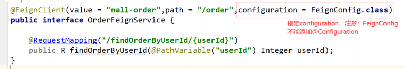
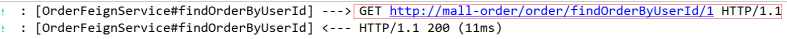
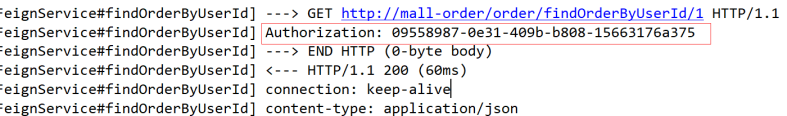
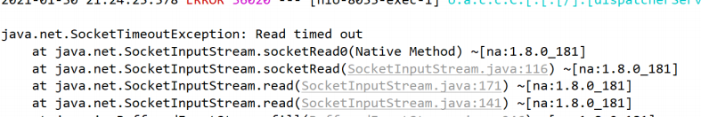

## 接口调用组件有哪些

- **HttpURLConnection**

  HttpURLConnection 是 Java 的标准类，它继承自 URLConnection，可用于向指定网站发送 GET 请求、POST 请求。HttpURLConnection 使用比较复杂

- **Httpclient**

  HttpClient 是 Apache Jakarta Common 下的子项目，用来提供高效的、最新的、功能丰富的支持 Http 协议的客户端编程工具包，并且它支持 HTTP 协议最新版本和建议。HttpClient 相比传统 JDK 自带的URLConnection，提升了易用性和灵活性，使客户端发送 HTTP 请求变得容易，提高了开发的效率

- **Okhttp**

  一个处理网络请求的开源项目，是安卓端最火的轻量级框架，由 Square 公司贡献，用于替代HttpUrlConnection 和 Apache HttpClient。OkHttp 拥有简洁的 API、高效的性能，并支持多种协议（HTTP/2 和 SPDY）

- **RestTemplate**

  RestTemplate 是 Spring 提供的用于访问 Rest 服务的客户端，RestTemplate 提供了多种便捷访问远程HTTP 服务的方法，能够大大提高客户端的编写效率

上面介绍的是最常见的几种调用接口的方法，我们下面要介绍的方法比上面的更简单、方便，它就是**Feign**


## 简介

Feign是Netflix开发的声明式、模板化的HTTP客户端，其灵感来自Retrofit、JAXRS-2.0以及WebSocket，Feign可帮助我们更加便捷、优雅地调用HTTP API

Feign支持多种注解，例如Feign自带的注解或者JAX-RS注解等。

**Spring Cloud openfeign对Feign进行了增强，使其支持Spring MVC注解，另外还整合了Ribbon和Eureka，从而使得Feign的使用更加方便**

### 优势

Feign可以做到使用 HTTP 请求远程服务时就像调用本地方法一样的体验，开发者完全感知不到这是远程方法，更感知不到这是个 HTTP 请求。它像 Dubbo 一样，consumer 直接调用接口方法来调用 provider，而不需要通过常规的 HttpClient 构造请求再解析返回数据。它解决了让开发者调用远程接口就跟调用本地方法一样，无需关注与远程的交互细节，更无需关注分布式环境开发

## 架构


## 使用

一个Feign接口

```java
@FeignClient(value = "mall‐order",path = "/order") 
public interface OrderFeignService { 
    @RequestMapping("/findOrderByUserId/{userId}") 
    public R findOrderByUserId(@PathVariable("userId") Integer userId); 
}
```

调用Feign接口的方法

```java
@Autowired 
OrderFeignService orderFeignService; 
//feign调用 
R result = orderFeignService.findOrderByUserId(id);
```

### Spring Cloud Alibaba整合Feign 

**引入依赖**

```xml
<!‐‐ openfeign 远程调用 ‐‐> 
<dependency> 
    <groupId>org.springframework.cloud</groupId>
    <artifactId>spring‐cloud‐starter‐openfeign</artifactId> 
</dependency>
```

**编写调用接口+@FeignClient注解**

```java
@FeignClient(value = "mall‐order",path = "/order") 
public interface OrderFeignService { 
    @RequestMapping("/findOrderByUserId/{userId}") 
    public R findOrderByUserId(@PathVariable("userId") Integer userId); 
}
```

**调用端在启动类上添加@EnableFeignClients注解**

```java
@SpringBootApplication
@EnableFeignClients
```

提示： Feign 的继承特性可以让服务的接口定义单独抽出来，作为公共的依赖，以方便使用

## 配置

Feign 提供了很多的扩展机制，让用户可以更加灵活的使用

```java
// @Configuration
// 此处配置@Configuration注解就会全局生效，如果想指定对应微服务生效，就不能配置
public class FeignConfig {
    
}
```

通过源码可以看到日志等级有 4 种，分别是： 

- **NONE**【性能最佳，适用于生产】：不记录任何日志（默认值）
- **BASIC**【适用于生产环境追踪问题】：仅记录请求方法、URL、响应状态代码以及执行时间
- **HEADERS**：记录BASIC级别的基础上，记录请求和响应的header
- **FULL**【比较适用于开发及测试环境定位问题】：记录请求和响应的header、body和元数据

**局部配置**



也可以在配置文件中配置

对应属性配置类：org.springframework.cloud.openfeign.FeignClientProperties.FeignClientConfiguration

```yaml
feign: 
  client: 
   config: 
     server-order: #对应微服务 
       loggerLevel: FULL
```


### 日志配置

有时候我们遇到 Bug，比如接口调用失败、参数没收到等问题，或者想看看调用性能，就需要配置 Feign 的日志了，以此让 Feign 把请求信息输出来

```java
@Configuration
public class FeignConfig {
    @Bean
    public Logger.Level feignLoggerLevel() {
        return Logger.Level.FULL;
    }
}
```

**在yml配置文件中执行 Client 的日志级别才能正常输出日志，格式是"logging.level.feign接口包路径=debug"**

```yaml
logging:
  level: 
    com.va.order.demo.feign: debug
```

测试：BASIC级别日志




### 契约配置

Spring Cloud 在 Feign 的基础上做了扩展，可以让 Feign 支持 Spring MVC 的注解来调用。原生的 Feign 是不支持 Spring MVC 注解的，如果你想在 Spring Cloud 中使用原生的注解方式来定义客户端也是 可以的，通过配置契约来改变这个配置，Spring Cloud 中默认的是 SpringMvcContract

1. 修改契约配置，支持Feign原生的注解

   ```java
   @Bean 
   public Contract feignContract() { 
       return new Contract.Default(); 
   }
   ```

2. OrderFeignService 中配置使用Feign原生的注解

   ```java
   @FeignClient(value = "mall‐order",path = "/order") 
   public interface OrderFeignService { 
       @RequestLine("GET /findOrderByUserId/{userId}") 
       public R findOrderByUserId(@Param("userId") Integer userId); 
   }
   ```

3. 补充，也可以通过yml配置契约

   ```properties
   feign.client.config.微服务.contract=feign.Contract.Default
   ```

   

### 通过拦截器实现认证

通常我们调用的接口都是有权限控制的，很多时候可能认证的值是通过参数去传递的，还有就是通过请求头去传递认证信息，比如 Basic 认证方式

每次 feign 发起http调用之前，会去执行拦截器中的逻辑

```java
public interface RequestInterceptor {
    void apply(RequestTemplate template);
}
```

**自定义拦截器实现认证逻辑** 

```java
public class MyAuthRequestInterceptor implements RequestInterceptor {
    @Override
    public void apply(RequestTemplate template) {
        // todo 用当前请求的用户信息构建access_token
        String access_token = UUID.randomUUID().toString();
        template.header("Authorization",access_token);
    }
}

@Bean
public MyAuthRequestInterceptor myAuthRequestInterceptor(){
    return new MyAuthRequestInterceptor();
}
```

测试



**补充：可以在yml中配置** 

```properties
feign.client.config.服务.requestInterceptors=package.MyAuthRequestInterceptor
```

### 超时时间配置

通过 Options 可以配置连接超时时间和读取超时时间，Options 的第一个参数是连接的超时时间（ms），默认值是 2s；第二个是请求处理的超时时间（ms），默认值是 5s

**全局配置**

```java
@Configuration 
public class FeignConfig { 
    @Bean 
    public Request.Options options() { 
        return new Request.Options(5000, 10000); 
    } 
}
```

**局部配置**

```properties
feign.client.config.服务.connectTimeout=5000
feign.client.config.服务.readTimeout=10000
```

**补充说明： Feign的底层用的是Ribbon，但超时时间以Feign配置为准**

测试超时情况



### 客户端组件配置

Feign 中默认使用 JDK 原生的 URLConnection 发送 HTTP 请求，我们可以集成别的组件来替换掉URLConnection，比如 Apache HttpClient，OkHttp

Feign发起调用真正执行逻辑：**feign.Client#execute （扩展点）**


**配置Apache HttpClient** 

1. 引入依赖

   ```xml
   <!‐‐ Apache HttpClient ‐‐>
   <dependency> 
       <groupId>org.apache.httpcomponents</groupId> 
       <artifactId>httpclient</artifactId> 
       <version>4.5.7</version> 
   </dependency> 
   <dependency>
       <groupId>io.github.openfeign</groupId> 
       <artifactId>feign‐httpclient</artifactId> 
       <version>10.1.0</version> 
   </dependency>
   ```

2. 然后修改yml配置，将 Feign 的 Apache HttpClient启用

   ```properties
   # 默认开启
   feign.httpclient.enabled=true
   ```

关于配置可参考源码： org.springframework.cloud.openfeign.FeignAutoConfiguration

测试：调用会进入feign.okhttp.OkHttpClient#execute