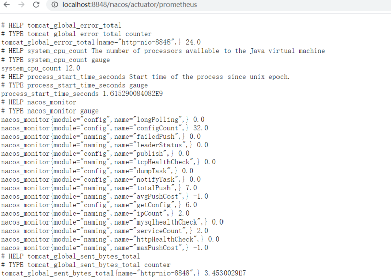

官方文档： https://nacos.io/zh-cn/docs/what-is-nacos.html

Nacos 致力于帮助您发现、配置和管理微服务。Nacos 提供了一组简单易用的特性集，帮助您快速实现动态服务发现、服务配置、服务元数据及流量管理

Nacos 的关键特性包括: 

- 服务发现和服务健康监测 
- 动态配置服务 
- 动态 DNS 服务 
- 服务及其元数据管理

## **Nacos** 架构

- **NamingService**: 命名服务，注册中心核心接口 
- **ConfigService**：配置服务，配置中心核心接口

[OpenAPI文档](https://nacos.io/zh­cn/docs/open­api.html )


## Nacos Server部署

**1.下载源码编译** 

源码下载地址：https://github.com/alibaba/nacos/ 

```sh
cd nacos/
mvn ‐Prelease‐nacos clean install ‐U
cd nacos/distribution/target/
```

**2.下载安装包** 

下载地址：https://github.com/alibaba/Nacos/releases 

### 单机模式部署

[官方文档](https://nacos.io/zh­cn/docs/deployment.html )

```sh
# 解压，进入nacos目录

#单机启动nacos，执行命令
bin/startup.sh ‐m standalone
```

也可以修改默认启动方式

```sh
vi bin/startup.sh
```


访问nocas的管理端：http://IP:8848/nacos ，默认的用户名密码是 nocas/nocas


### 集群模式部署

[官网文档](https://nacos.io/zh­cn/docs/cluster­mode­quick­start.html )

**集群部署架构图**


**步骤**

1. 单机搭建伪集群，复制nacos安装包，修改为nacos8849，nacos8850，nacos8851

2. 以nacos8849为例，进入nacos8849目录

   1. 修改conf\application.properties的配置，使用外置数据源

      ```properties
      #使用外置mysql数据源 
      spring.datasource.platform=mysql 
      ### Count of DB: 
      db.num=1
      ### Connect URL of DB: 
      db.url.0=jdbc:mysql://127.0.0.1:3306/nacos?characterEncoding=utf8&connectTimeout=1000&socketTimeout=3000&autoReconnect=true&useUnicode=true&useSSL=false&serverTimezone=UTC 
      db.user.0=root
      db.password.0=root
      ```

   2. 将 conf\cluster.conf.example 修改为 cluster.conf ，添加节点配置

      ```properties
      # ip:port 
      192.168.3.14:8849 
      192.168.3.14:8850 
      192.168.3.14:8851
      ```

      nacos8850，nacos8851 按同样的方式配置

3. 创建mysql数据库，sql文件位置：conf\nacos­mysql.sql

4. 修改启动脚本（bin\startup.sh）的jvm参数

   

5. 分别启动nacos8849，nacos8850，nacos8851

   ```sh
   bin/startup.sh
   ```

6. 官方推荐，nginx反向代理

   

### prometheus+grafana监控Nacos

https://nacos.io/zh-cn/docs/monitor-guide.html 

Nacos 0.8.0版本完善了监控系统，支持通过暴露metrics数据接入第三方监控系统监控Nacos运行状态

**步骤**

1. nacos暴露metrics数据

   ```properties
   management.endpoints.web.exposure.include=*
   ```

   测试： http://localhost:8848/nacos/actuator/prometheus

   

2. prometheus采集Nacos metrics数据 

   启动prometheus服务 

   ```sh
    prometheus.exe ‐‐config.file=prometheus.yml
   ```

   测试：http://localhost:9090/graph

   

3. grafana展示metrics数据

   测试： http://localhost:3000/

   


## NamingService 注册中心

### 注册中心演变及其设计思想


### Nacos注册中心架构 


### 核心功能

- **服务注册**：Nacos Client会通过发送REST请求的方式向Nacos Server注册自己的服务，提供自身的元数据，比如ip地址、端口等信息。Nacos Server接收到注册请求后，就会把这些元数据信息存储在一个双层的内存Map中
- **服务心跳**：在服务注册后，Nacos Client会维护一个定时心跳来持续通知Nacos Server，说明服务一直处于可用状态，防止被剔除。默认5s发送一次心跳
- **服务同步**：Nacos Server集群之间会互相同步服务实例，用来保证服务信息的一致性
- **服务发现**：服务消费者（Nacos Client）在调用服务提供者的服务时，会发送一个REST请求给Nacos Server，获取上面注册的服务清单，并且缓存在Nacos Client本地，同时会在Nacos Client本地开启一个定时任务定时拉取服务端最新的注册表信息更新到本地缓存 
- **服务健康检查**：Nacos Server会开启一个定时任务用来检查注册服务实例的健康情况，对于超过15s没有收到客户端心跳的实例会将它的healthy属性置为false(客户端服务发现时不会发现)，如果某个实例超过30秒没有收到心跳，直接剔除该实例(被剔除的实例如果恢复发送心跳则会重新注册) 

### 服务注册表结构 


### 服务领域模型


### 服务实例数据


## NacosClient

### 基础搭建

1. 父Pom

   ```xml
   <dependencyManagement> 
       <dependencies> 
           <!‐‐引入springcloud的版本‐‐> 
           <dependency> 
               <groupId>org.springframework.cloud</groupId> 
               <artifactId>spring‐cloud‐dependencies</artifactId> 
               <version>Hoxton.SR3</version> 
               <type>pom</type> 
               <scope>import</scope> 
           </dependency> 
           <dependency> 
               <groupId>com.alibaba.cloud</groupId> 
               <artifactId>spring‐cloud‐alibaba‐dependencies</artifactId> 
               <version>2.2.1.RELEASE</version> 
               <type>pom</type> 
               <scope>import</scope> 
           </dependency> 
       </dependencies> 
   </dependencyManagement>
   ```

2. 项目Pom

   ```xml
   <dependency> 
       <groupId>com.alibaba.cloud</groupId>
       <artifactId>spring‐cloud‐starter‐alibaba‐nacos‐discovery</artifactId> 
   </dependency>
   ```

3. application.properties中配置

   ```properties
   server.port=8002 
   #微服务名称 
   spring.application.name=service‐user
   #配置 Nacos server 的地址 
   spring.cloud.nacos.discovery.server‐addr=localhost:8848
   ```

4. 启动springboot应用，nacos管理端界面查看是否成功注册

   

5. 测试

   使用RestTemplate进行服务调用，使用微服务名称

   ```java
   String url = "http://service‐order/order/findOrderByUserId/"+id; 
   List<Order> orderList = restTemplate.getForObject(url, List.class);
   ```

   注意：需要添加@LoadBalanced注解

   ```java
   @Bean 
   @LoadBalanced
   public RestTemplate restTemplate() { 
       return new RestTemplate(); 
   }
   ```


## ConfigService 配置中心

Nacos 提供用于存储配置和其他元数据的 key/value 存储，为分布式系统中的外部化配置提供服务器端和客户端支持。使 用 Spring Cloud Alibaba Nacos Config，您可以在 Nacos Server 集中管理你 Spring Cloud 应用的外部属性配置


### 快速开始

准备配置，nacos server中新建nacos­config.properties


### 搭建nacos-config服务

通过 Nacos Server 和 spring-cloud-starter-alibaba-nacos-config 实现配置的动态变更

1. 引入依赖

   ```xml
   <dependency> 
       <groupId>com.alibaba.cloud</groupId> 
       <artifactId>spring‐cloud‐starter‐alibaba‐nacos‐config</artifactId> 
   </dependency>
   ```

2. 添加bootstrap.properties

   ```properties
   spring.application.name=nacos‐config
   # 配置中心地址
   spring.cloud.nacos.config.server‐addr=127.0.0.1:8848 
   # dataid 为 yaml 的文件扩展名配置方式
   # `${spring.application.name}.${file‐extension:properties}` 
   spring.cloud.nacos.config.file‐extension=yaml
   #profile粒度的配置 `${spring.application.name}‐${profile}.${file‐extension:properties}` 
   spring.profiles.active=prod
   ```

3. 启动服务，测试微服务是否使用配置中心的配置

   ```java
   @SpringBootApplication 
   public class NacosConfigApplication { 
       public static void main(String[] args) { 
           ConfigurableApplicationContext applicationContext = SpringApplication.run(NacosConfigApplication.class, args); 
           String userName = applicationContext.getEnvironment().getProperty("user.name"); 
           String userAge = applicationContext.getEnvironment().getProperty("user.age"); 
           System.out.println("user name :"+userName+"; age: "+userAge); 
       } 
   }
   ```

   

### Config相关配置

Nacos 数据模型 Key 由三元组唯一确定, Namespace默认是空串，公共命名空间（public），分组默认是DEFAULT_GROUP 


- **配置的动态更新**

  ```java
  @SpringBootApplication 
  public class NacosConfigApplication { 
      public static void main(String[] args) throws InterruptedException { 
          ConfigurableApplicationContext applicationContext = SpringApplication.run(NacosConfigApplication.class, args); 
          
          //当动态配置刷新时，会更新到 Enviroment中，因此这里每隔一秒中从Enviroment中获取配置 
          while(true) { 
              String userName = applicationContext.getEnvironment().getProperty("user.name"); 
              String userAge = applicationContext.getEnvironment().getProperty("user.age"); 
              System.err.println("user name :" + userName + "; age: " + userAge); 
              TimeUnit.SECONDS.sleep(1); 
          } 
      } 
  }
  ```

  

- **profile粒度配置**

  在加载配置的时候，不仅仅加载了以 dataid 为${spring.application.name}.${file-extension} 为前缀的基础配置，还加载了dataid为${spring.application.name}-${profile}.${file-extension} 的基础配置。在日常开发中如果遇到多套环境下的不同配置，可以通过Spring 提供的 ${spring.profiles.active} 这个配置项来配置

  

- **自定义 namespace 的配置**

  用于进行租户粒度的配置隔离。

  不同的命名空间下，可以存在相同的 Group 或 Data ID 的配置。

  Namespace 的常用场景之一是不同环境的配置的区分隔离，例如开发测试环境和生产环境的资源（如配置、服务）隔离等。 

  在没有明确指定 ${spring.cloud.nacos.config.namespace} 配置的情况下， 默认使用的是 Nacos 上 Public 这个 namespace。如果需要使用自定义的命名空间，可以通过以下配置来实现：

  ```properties
  spring.cloud.nacos.config.namespace=71bb9785‐231f‐4eca‐b4dc‐6be446e12ff8
  ```

  

- **自定义 Group 的配置**

  Group是组织配置的维度之一。通过一个有意义的字符串（如 Buy 或 Trade ）对配置集进行分组，从而区分 Data ID 相同的配置集。当您在 Nacos 上创建一个配置时，如果未填写配置分组的名称，则配置分组的名称默认采用 DEFAULT_GROUP 。

  配置分组的常见场景：不同的应用或组件使用了相同的配置类型，如 database_url 配置和 MQ_topic 配置

  在没有明确指定 ${spring.cloud.nacos.config.group} 配置的情况下，默认是DEFAULT_GROUP 。如果需要自定义自己的Group，可以通过以下配置来实现

  ```properties
   spring.cloud.nacos.config.group=DEVELOP_GROUP
  ```

  

- **自定义扩展的 Data Id 配置**

  通过自定义扩展的 Data Id 配置，既可以解决多个应用间配置共享的问题，又可以支持一个应用有多个配置文件

  ```properties
  # 自定义 Data Id 的配置 
  #不同工程的通用配置 支持共享的 DataId 
  spring.cloud.nacos.config.sharedConfigs[0].data‐id= common.yaml 
  spring.cloud.nacos.config.sharedConfigs[0].group=REFRESH_GROUP
  spring.cloud.nacos.config.sharedConfigs[0].refresh=true 
  # config external configuration 
  # 支持一个应用多个 DataId 的配置 
  spring.cloud.nacos.config.extensionConfigs[0].data‐id=ext‐config‐common01.properties 
  spring.cloud.nacos.config.extensionConfigs[0].group=REFRESH_GROUP 
  spring.cloud.nacos.config.extensionConfigs[0].refresh=true
  spring.cloud.nacos.config.extensionConfigs[1].data‐id=ext‐config‐common02.properties 
  spring.cloud.nacos.config.extensionConfigs[1].group=REFRESH_GROUP 
  spring.cloud.nacos.config.extensionConfigs[1].refresh=true
  ```

  

### 配置优先级

目前提供了三种从 Nacos 拉取相关的配置。 

- A: 通过内部相关规则(应用名、应用名+ Profile )自动生成相关的 Data Id 配置
- B: 通过 spring.cloud.nacos.config.ext-config 的方式支持多个扩展 Data Id 的配置 
- C: 通过 spring.cloud.nacos.config.shared-configs 支持多个共享 Data Id 的配置 

**优先级关系是:A > B > C** 

**优先级从高到低：**

1.  nacos­config­product.yaml 精准配置
2.  nacos­config.yaml 同工程不同环境的通用配置
3.  ext­config: 不同工程 扩展配置
4. shared­dataids 不同工程通用配置

### @RefreshScope

@Value注解可以获取到配置中心的值，但是无法动态感知修改后的值，需要利用@RefreshScope注解

```java
@RestController 
@RefreshScope 
public class TestController { 
    @Value("${common.age}")
    private String age; 
    @GetMapping("/common") 
    public String hello() { 
        return age; 
    } 
}
```

