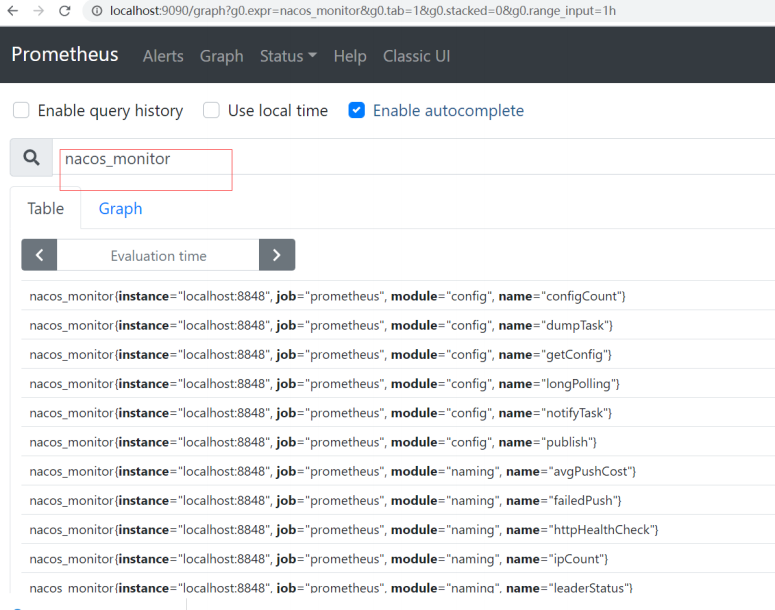

官方文档： https://nacos.io/zh-cn/docs/what-is-nacos.html

Nacos 致力于帮助您发现、配置和管理微服务。Nacos 提供了一组简单易用的特性集，帮助您快速实现动态服务发现、服务配置、服务元数据及流量管理

Nacos 的关键特性包括: 

- 服务发现和服务健康监测 
- 动态配置服务 
- 动态 DNS 服务 
- 服务及其元数据管理

## **Nacos** 架构

- **NamingService**: 命名服务，注册中心核心接口 
- **ConfigService**：配置服务，配置中心核心接口

[OpenAPI文档](https://nacos.io/zh­cn/docs/open­api.html )


## Nacos Server部署

**1.下载源码编译** 

源码下载地址：https://github.com/alibaba/nacos/ 

```sh
cd nacos/
mvn ‐Prelease‐nacos clean install ‐U
cd nacos/distribution/target/
```

**2.下载安装包** 

下载地址：https://github.com/alibaba/Nacos/releases 

### 单机模式部署

[官方文档](https://nacos.io/zh­cn/docs/deployment.html )

```sh
# 解压，进入nacos目录

#单机启动nacos，执行命令
bin/startup.sh ‐m standalone
```

也可以修改默认启动方式

```sh
vi bin/startup.sh
```


访问nocas的管理端：http://IP:8848/nacos ，默认的用户名密码是 nocas/nocas


### 集群模式部署

[官网文档](https://nacos.io/zh­cn/docs/cluster­mode­quick­start.html )

**集群部署架构图**


**步骤**

1. 单机搭建伪集群，复制nacos安装包，修改为nacos8849，nacos8850，nacos8851

2. 以nacos8849为例，进入nacos8849目录

   1. 修改conf\application.properties的配置，使用外置数据源

      ```properties
      #使用外置mysql数据源 
      spring.datasource.platform=mysql 
      ### Count of DB: 
      db.num=1
      ### Connect URL of DB: 
      db.url.0=jdbc:mysql://127.0.0.1:3306/nacos?characterEncoding=utf8&connectTimeout=1000&socketTimeout=3000&autoReconnect=true&useUnicode=true&useSSL=false&serverTimezone=UTC 
      db.user.0=root
      db.password.0=root
      ```

   2. 将 conf\cluster.conf.example 修改为 cluster.conf ，添加节点配置

      ```properties
      # ip:port 
      192.168.3.14:8849 
      192.168.3.14:8850 
      192.168.3.14:8851
      ```

      nacos8850，nacos8851 按同样的方式配置

3. 创建mysql数据库，sql文件位置：conf\nacos­mysql.sql

4. 修改启动脚本（bin\startup.sh）的jvm参数

   

5. 分别启动nacos8849，nacos8850，nacos8851

   ```sh
   bin/startup.sh
   ```

6. 官方推荐，nginx反向代理

   

### prometheus+grafana监控Nacos

https://nacos.io/zh-cn/docs/monitor-guide.html 

Nacos 0.8.0版本完善了监控系统，支持通过暴露metrics数据接入第三方监控系统监控Nacos运行状态

**步骤**

1. nacos暴露metrics数据

   ```properties
   management.endpoints.web.exposure.include=*
   ```

   测试： http://localhost:8848/nacos/actuator/prometheus

   

2. prometheus采集Nacos metrics数据 

   启动prometheus服务 

   ```sh
    prometheus.exe ‐‐config.file=prometheus.yml
   ```

   测试：http://localhost:9090/graph

   

3. grafana展示metrics数据

   测试： http://localhost:3000/

   


## NamingService 注册中心

### 注册中心演变及其设计思想


### Nacos注册中心架构 


### 核心功能

- **服务注册**：Nacos Client会通过发送REST请求的方式向Nacos Server注册自己的服务，提供自身的元数据，比如ip地址、端口等信息。Nacos Server接收到注册请求后，就会把这些元数据信息存储在一个双层的内存Map中
- **服务心跳**：在服务注册后，Nacos Client会维护一个定时心跳来持续通知Nacos Server，说明服务一直处于可用状态，防止被剔除。默认5s发送一次心跳
- **服务同步**：Nacos Server集群之间会互相同步服务实例，用来保证服务信息的一致性
- **服务发现**：服务消费者（Nacos Client）在调用服务提供者的服务时，会发送一个REST请求给Nacos Server，获取上面注册的服务清单，并且缓存在Nacos Client本地，同时会在Nacos Client本地开启一个定时任务定时拉取服务端最新的注册表信息更新到本地缓存 
- **服务健康检查**：Nacos Server会开启一个定时任务用来检查注册服务实例的健康情况，对于超过15s没有收到客户端心跳的实例会将它的healthy属性置为false(客户端服务发现时不会发现)，如果某个实例超过30秒没有收到心跳，直接剔除该实例(被剔除的实例如果恢复发送心跳则会重新注册) 

### 服务注册表结构 


### 服务领域模型


### 服务实例数据


## ConfigService 配置中心


## NacosClient

### 基础搭建

1. 父Pom

   ```xml
   <dependencyManagement> 
       <dependencies> 
           <!‐‐引入springcloud的版本‐‐> 
           <dependency> 
               <groupId>org.springframework.cloud</groupId> 
               <artifactId>spring‐cloud‐dependencies</artifactId> 
               <version>Hoxton.SR3</version> 
               <type>pom</type> 
               <scope>import</scope> 
           </dependency> 
           <dependency> 
               <groupId>com.alibaba.cloud</groupId> 
               <artifactId>spring‐cloud‐alibaba‐dependencies</artifactId> 
               <version>2.2.1.RELEASE</version> 
               <type>pom</type> 
               <scope>import</scope> 
           </dependency> 
       </dependencies> 
   </dependencyManagement>
   ```

2. 项目Pom

   ```xml
   <dependency> 
       <groupId>com.alibaba.cloud</groupId>
       <artifactId>spring‐cloud‐starter‐alibaba‐nacos‐discovery</artifactId> 
   </dependency>
   ```

3. application.properties中配置

   ```properties
   server.port=8002 
   #微服务名称 
   spring.application.name=service‐user
   #配置 Nacos server 的地址 
   spring.cloud.nacos.discovery.server‐addr=localhost:8848
   ```

4. 启动springboot应用，nacos管理端界面查看是否成功注册

   

5. 测试

   使用RestTemplate进行服务调用，使用微服务名称

   ```java
   String url = "http://service‐order/order/findOrderByUserId/"+id; 
   List<Order> orderList = restTemplate.getForObject(url, List.class);
   ```

   注意：需要添加@LoadBalanced注解

   ```java
   @Bean 
   @LoadBalanced
   public RestTemplate restTemplate() { 
       return new RestTemplate(); 
   }
   ```

