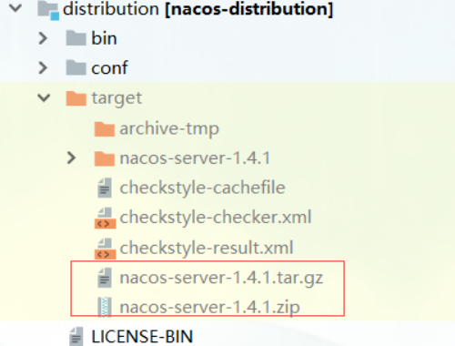
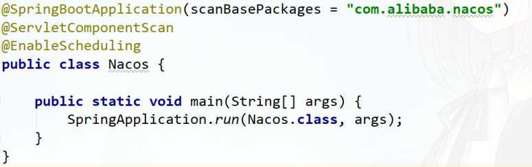
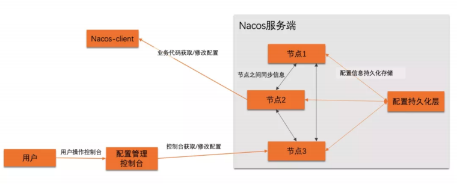
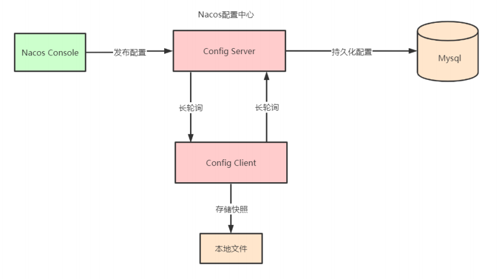
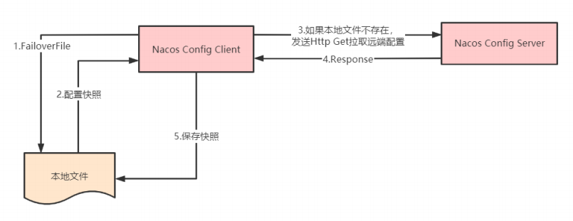
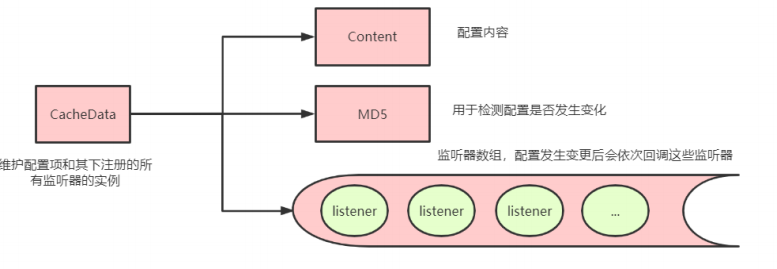
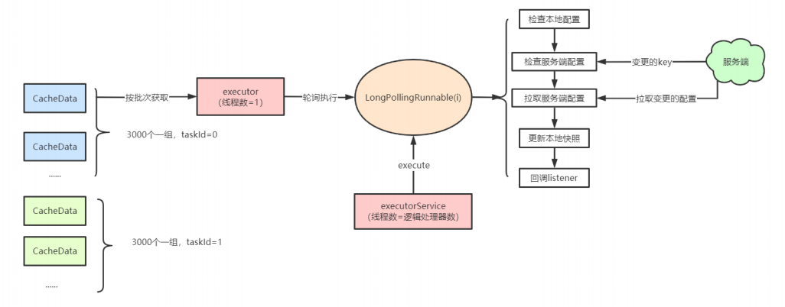
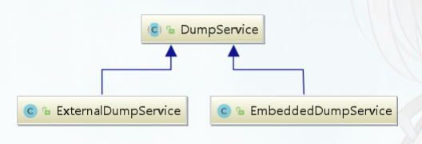
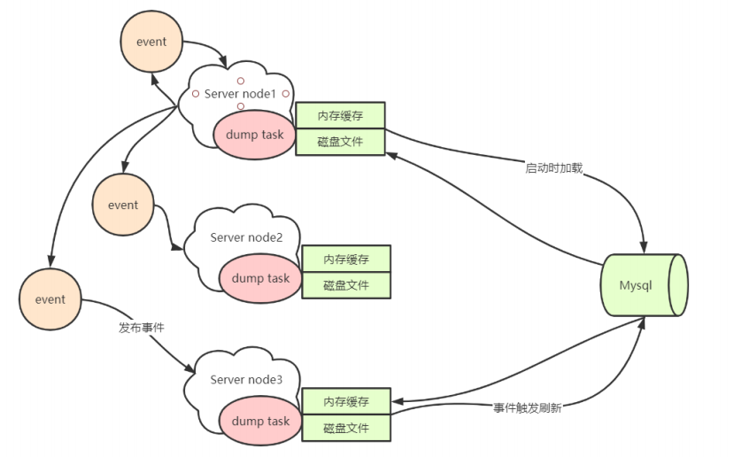
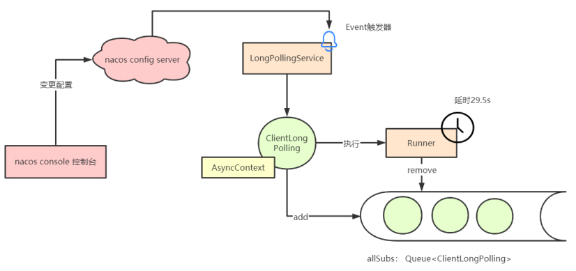

## Nacos源码编译

源码下载地址： https://github.com/alibaba/nacos/ 

版本： Nacos 1.4.1

1. 进入nacos目录，执行编译命令

   ```sh
   # -P: profiles
   # -D: properties
   # 	‐Drat.skip=true：跳过licensing检查
   #	‐Dmaven.test.skip=true：跳过测试
   # ‐U: 强制刷新本地仓库不存在release版和所有的snapshots版本。
   mvn ‐Prelease‐nacos ‐Dmaven.test.skip=true ‐Drat.skip=true clean install ‐U
   ```

   编译成功后会在distribution/target目录下生成nacos-server-1.4.1.tar.gz

   

2. 配置数据库

   创建nacos_config数据库（distribution/conf/nacos­mysql.sql）

   在application.properties中开启mysql配置 

   ```properties
   ### If use MySQL as datasource: 
   spring.datasource.platform=mysql 
   ### Count of DB: 
   db.num=1 
   ### Connect URL of DB: 
   db.url.0=jdbc:mysql://127.0.0.1:3306/nacos?characterEncoding=utf8&connectTimeout=1000&soc ketTimeout=3000&autoReconnect=true&useUnicode=true&useSSL=false&serverTimezone=UTC 
   db.user.0=root 
   db.password.0=root
   ```

   

3. 启动nacos

   进入console模块，找到启动类 com.alibaba.nacos.Nacos，执行main方法

   

4. 进入http://localhost:8848/nacos，用户名和密码默认nacos

## Nacos服务注册发现原理


## Nacos置中心原理

[源码流程图](https://www.processon.com/view/link/603f3d2fe401fd641adb51f1)

### 配置中心架构





### 配置中心使用demo

```java
public class ConfigServerDemo { 
    public static void main(String[] args) throws NacosException, InterruptedException { 
        String serverAddr = "localhost"; 
        String dataId = "nacos‐config‐demo.yaml"; 
        String group = "DEFAULT_GROUP";
        Properties properties = new Properties(); 
        properties.put(PropertyKeyConst.SERVER_ADDR, serverAddr); 
        //获取配置服务 
        ConfigService configService = NacosFactory.createConfigService(properties);
        //获取配置
        String content = configService.getConfig(dataId, group, 5000);
        System.out.println(content);
        //注册监听器
        configService.addListener(dataId, group, new Listener() {
            @Override 
            public void receiveConfigInfo(String configInfo) {
                System.out.println("===recieve:" + configInfo);
            }
            
            @Override
            public Executor getExecutor() {
                return null;
            }
        });
        
        //发布配置 
        //boolean isPublishOk = configService.publishConfig(dataId, group, "content"); 
        //System.out.println(isPublishOk); 
        //发送properties格式 
        
        configService.publishConfig(dataId,group,"user.age=30", ConfigType.PROPERTIES.getType());
        Thread.sleep(3000);
        content = configService.getConfig(dataId, group, 5000);
        System.out.println(content);
        
        // boolean isRemoveOk = configService.removeConfig(dataId, group); 
        // System.out.println(isRemoveOk); 
        // Thread.sleep(3000); 
        
        // content = configService.getConfig(dataId, group, 5000); 
        // System.out.println(content); 
        // Thread.sleep(300000); 
    } 
}
```

**核心接口：ConfigService**


### 配置中心客户端原理

#### 获取配置

获取配置的主要方法是 NacosConfigService 类的 getConfig 方法，通常情况下该方法直接从本地文件中取得配置的值，如果本地文件不存在或者内容为空，则再通过 HTTP GET 方法从远端拉取配置，并保存到本地快照中

当通过 HTTP 获取远端配置Nacos 提供了两种熔断策略：

1. 超时时间
2. 最大重试次数，默认重试三次



#### 注册监听器

配置中心客户端会通过对配置项注册监听器达到在配置项变更的时候执行回调的功能，通过以下方式注册：

- NacosConfigService # getConfigAndSignListener 
- ConfigService # addListener

它们内部的实现均是调用 ClientWorker 类的 addCacheDataIfAbsent。其中 CacheData 是一个维护配置项和其下注册的所有监听器的实例，所有的 CacheData 都保存在 ClientWorker 类中的原子 cacheMap 中，其内部的核心成员有：



#### 长轮询

ClientWorker 通过其下的两个线程池完成配置长轮询的工作

第一个单线程的 executor，每隔 10ms 按照每 3000 个配置项为一批次捞取待轮询的 cacheData 实例，将其包装成为一个 LongPollingTask 提交进入第二个线程池 executorService 处理




### 配置中心服务端原理

#### 配置dump



服务端启动时就会依赖 DumpService 的 init 方法，从数据库中 load 配置存储在本地磁盘上，并将一些重要的元信 、息例如 MD5 值缓存在内存中。服务端会根据心跳文件中保存的最后一次心跳时间，来判断到底是从数据库 dump 全量配置数据还是部分增量配置数据（如果机器上次心跳间隔是 6h 以内的话）

全量 dump 当然先清空磁盘缓存，然后根据主键 ID 每次捞取一千条配置刷进磁盘和内存。

增量 dump 就是捞取最近六小时的新增配置（包括更新的和删除的），先按照这批数据刷新一遍内存和文件，再根据内存里所有的数据全量去比对一遍数据库，如果有改变的再同步一次，相比于全量 dump 的话会减少一定的数据库 IO 和磁盘 IO 次数

#### 配置发布

ConfigController # publishConfig。

集群部署，请求一开始也只会打到一台机器，这台机器将配置插入Mysql中进行持久化。服务端并不是针对每次配置查询都去访问 MySQL ，而是会依赖 dump 功能在本地文件中将配置缓存起来。因此当单台机器保存完毕配置之后，需要通知其他机器刷新内存和本地磁盘中的文件内容，因此它会发布一个名为 ConfigDataChangeEvent 的事件，这个事件会通过 HTTP 调用通知所有集群节点（包括自身），触发本地文件和内存的刷新



#### 处理长轮询

客户端会有一个长轮询任务，拉取服务端的配置变更，服务端处理逻辑在LongPollingService类中，其中有一个 Runnable 任务名为ClientLongPolling，服务端会将受到的轮询请求包装成一个 ClientLongPolling 任务，该任务持有一个 AsyncContext 响应对象，通过定时线程池延后 29.5s 执行。比客户端 30s 的超时时间提前 500ms 返回是为了最大程度上保证客户端不会因为网络延时造成超时

