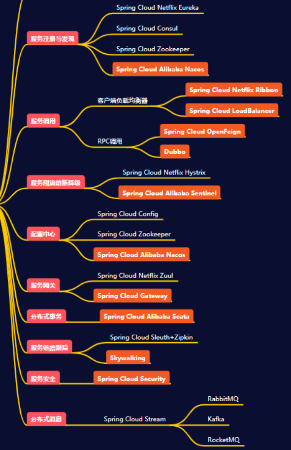
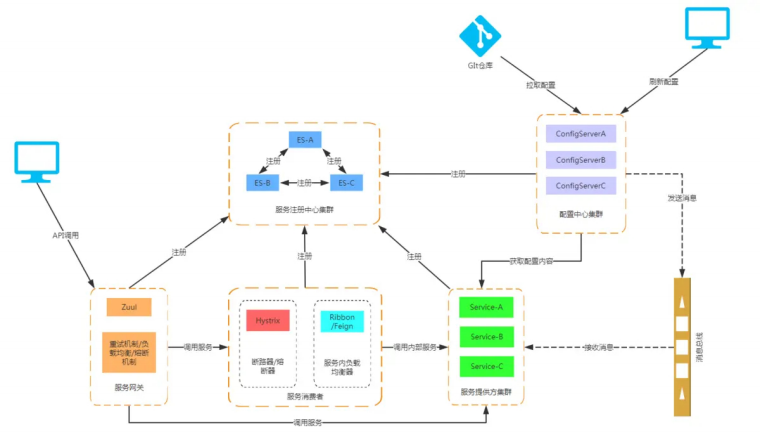
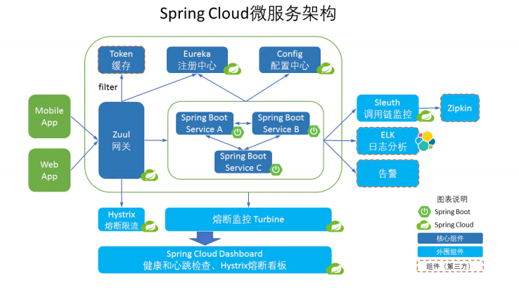
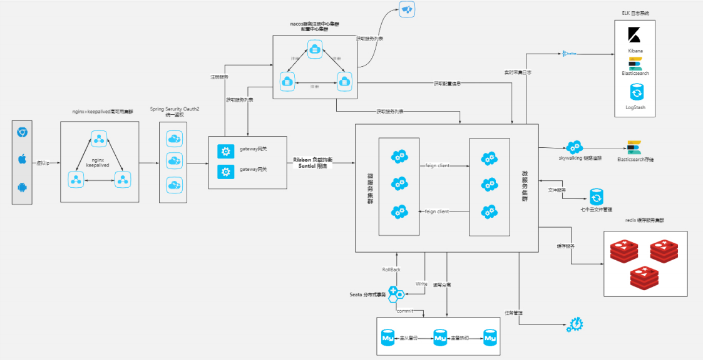

## Spring Cloud 微服务技术栈

Spring Cloud是分布式微服务架构的一站式解决方案，是多种微服务架构落地技术的集合体，俗称微服务全家桶

Spring Cloud为开发人员提供了快速构建分布式系统中的一些常见模式的工具(例如配置管理、服务发现、断路器、智能路由、微代理、控制总线、一次性令牌、全局锁、领导选举、分布式会话、集群状态)

官网： https://spring.io/projects/spring-cloud 

中文文档： https://www.springcloud.cc/ 

Spring Cloud中国社区：http://springcloud.cn/ 

### 架构生态图

### Spring Cloud Netflix

- Eureka，服务注册和发现，它提供了一个服务注册中心、服务发现的客户端，还有一个方便的查看所有注册的服务的界面。 所有的服务使用Eureka的服务发现客户端来将自己注册到Eureka的服务器上。 
- Zuul，网关，所有的客户端请求通过这个网关访问后台的服务。他可以使用一定的路由配置来判断某一个URL由哪个服务来处理。并从Eureka获取注册的服务来转发请求。 
- Ribbon，即负载均衡，Zuul网关将一个请求发送给某一个服务的应用的时候，如果一个服务启动了多个实例，就会通过Ribbon来通过一定的负载均衡策略来发送给某一个服务实例。 
- Feign，服务客户端，服务之间如果需要相互访问，可以使用RestTemplate，也可以使用Feign客户端访问。它默认会使用Ribbon来实现负载均衡。 
- Hystrix，监控和断路器。我们只需要在服务接口上添加Hystrix标签，就可以实现对这个接口的监控和断路器功能。 
- Hystrix Dashboard，监控面板，他提供了一个界面，可以监控各个服务上的服务调用所消耗的时间等。 
- Turbine，监控聚合，使用Hystrix监控，我们需要打开每一个服务实例的监控信息来查看。而Turbine可以帮助我们把所有的服务实例的监控信息聚合到一个地方统一查看。这样就不需要挨个打开一个个的页面一个个查看

### Spring Cloud Alibaba

[仓库地址](https://github.com/alibaba/spring-cloud-alibaba/blob/2021.x/README-zh.md)

[各组件使用大纲](https://www.processon.com/view/link/60519545f346fb348a97c9d5#map)

Spring Cloud Alibaba 也是一套微服务解决方案，包含开发分布式应用微服务的必需组件

依托 Spring Cloud Alibaba，您只需要添加一些注解和少量配置，就可以将 Spring Cloud 应用接入阿里微服务解决方案，通过阿里中间件来迅速搭建分布式应用系统

作为 Spring Cloud 体系下的新实现，Spring Cloud Alibaba 跟官方的组件或其它的第三方实现如Netflix, Consul，Zookeeper 等对比，具备了更多的功能

| 组件           | Spring Cloud Netflix | Spring Cloud           | Spring Cloud Zookeeper | Spring Cloud Consul | Spring Cloud Kubernetes | Spring Cloud Alibaba |
| -------------- | -------------------- | ---------------------- | ---------------------- | ------------------- | ----------------------- | -------------------- |
| 分布式配置中心 | Archaius             | Spring Cloud Config    | Zookeeper              | Consul              | ConfigMap               | Nacos                |
| 服务注册/发现  | Eureka               |                        | Zookeeper              | Consul              | Api Server              | Nacos                |
| 服务熔断       | Hystrix              |                        |                        |                     |                         | Sentinel             |
| 服务调用       | Feign                | OpenFeign RestTemplate |                        |                     |                         | Dubbo RPC            |
| 服务路由       | Zuul                 | Spring Cloud Gateway   |                        |                     |                         | Dubbo PROXY          |
| 分布式消息     |                      | SCS RabbitMQ           |                        |                     |                         | SCS RocketMQ         |
| 负载均衡       | Ribbon               |                        |                        |                     |                         | Dubbo LB             |
| 分布式事务     |                      |                        |                        |                     |                         | Seata                |

- 开源组件：
  - Nacos：一个更易于构建云原生应用的动态服务发现、配置管理和服务管理平台。 
  - Sentinel：把流量作为切入点，从流量控制、熔断降级、系统负载保护等多个维度保护服务的稳定性。 
  - RocketMQ：开源的分布式消息系统，基于高可用分布式集群技术，提供低延时的、高可靠的消息发布与订阅服务。 
  - Dubbo：在国内应用非常广泛的一款高性能 Java RPC 框架。 Seata：阿里巴巴开源产品，一个易于使用的高性能微服务分布式事务解决方案。 
  - Arthas：开源的Java动态追踪工具，基于字节码增强技术，功能非常强大。
- 商业组件：
  - Alibaba Cloud ACM：一款在分布式架构环境中对应用配置进行集中管理和推送的应用配置中心产品
  - Alibaba Cloud OSS：阿里云对象存储服务（Object Storage Service，简称 OSS），是阿里云提供的云存储服务
  - Alibaba Cloud SchedulerX：阿里中间件团队开发的一款分布式任务调度产品，提供秒级、精准的定时（基于 Cron 表达式）任务调度服务

**Spring Cloud Alibaba版本选择**

[官方推荐](https://github.com/alibaba/spring-cloud-alibaba/wiki/%E7%89%88%E6%9C%AC%E8%AF%B4%E6%98%8E)

