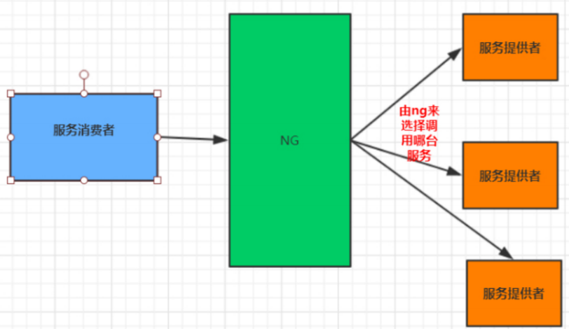
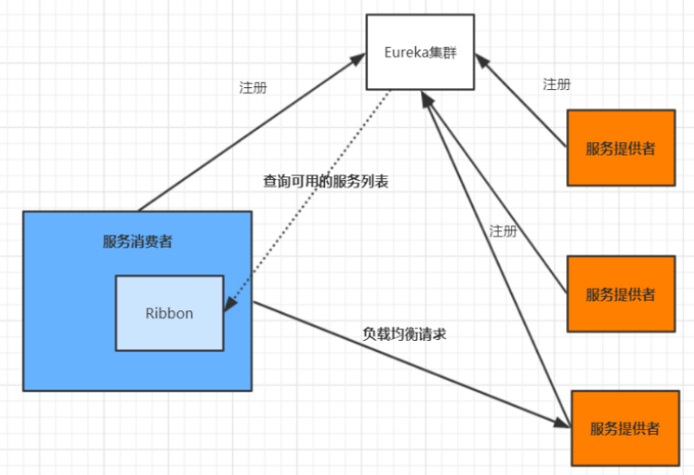
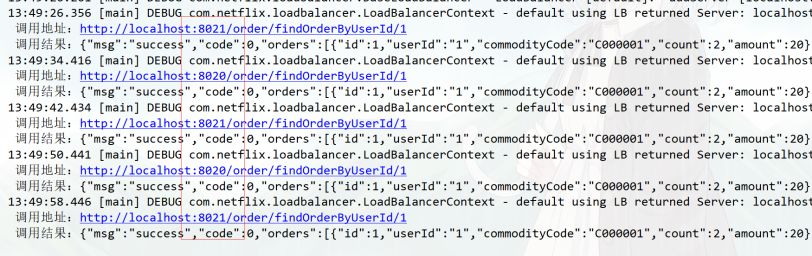
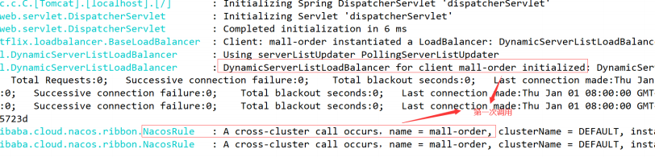

## 简介

目前主流的负载方案分为以下两种： 

- 集中式负载均衡，在消费者和服务提供方中间使用独立的代理方式进行负载，有硬件的（比如F5），也有软件的（比如 Nginx）
- 客户端负载均衡，Ribbon 就属于客户端自己做负载均衡

Spring Cloud Ribbon是基于Netflix Ribbon 实现的一套客户端的负载均衡工具，Ribbon客户端组件提供一系列的完善的配置，如超时，重试等。通过Load Balancer获取到服务提供的所有机器实例，Ribbon会自动基于某种规则(轮询，随机)去调用这些服务。Ribbon也可以实现我们自己的负载均衡算法

### 集中式负载均衡

例如Nginx，通过Nginx进行负载均衡，nginx配置负载均衡算法，在多个服务器之间选择一个进行访问



### 客户端负载均衡

客户端会有一个服务器地址列表，在发送请求前通过负载均衡算法选择一个服务器，然后进行访问，这是客户端负载均衡



## 常见负载均衡算法

- 随机：随机选择服务器，较少使用
- 轮训：默认的负载算法，需要排队(同步)处理到达的请求
- 加权轮训：根据服务器的性能、网络不同分配不同的权重
- 地址hash：对发起请求的客户端的IP进行hash后再取模，实现同一个客户端调用固定服务器
- 最小连接数：即使请求均衡了，压力不一定均衡，最小连接数算法是根据服务器的情况，比如请求积压数等参数，将请求分配到当前压力最小的服务器上

## Ribbon模块

| 模块                | 说明                                                         |
| ------------------- | ------------------------------------------------------------ |
| ribbon-loadbalancer | 负载均衡模块，可独立使用，也可以和别的模块一起使用           |
| Ribbon              | 内置的负载均衡算法都实现在其中                               |
| ribbon-eureka       | 基于 Eureka 封装的模块，能够快速、方便地集成 Eureka          |
| ribbon-transport    | 基于 Netty 实现多协议的支持，比如 HTTP、Tcp、Udp 等          |
| ribbon-httpclient   | 基于 Apache HttpClient 封装的 REST 客户端，集成了负载均衡模块，可以直接在项目中使 |
| ribbon-example      | Ribbon 使用代码示例，通过这些示例能够让你的学习事半功倍      |
| ribbon-core         | 些比较核心且具有通用性的代码，客户端 API 的一些配置和其他 API 的定义 |

## 单独使用

客户端示例代码：

```java
public class RibbonDemo { 
    public static void main(String[] args) { 
        // 服务列表 
        List<Server> serverList = Lists.newArrayList( 
            new Server("localhost", 8020), 
            new Server("localhost", 8021)); 
        // 构建负载实例 
        ILoadBalancer loadBalancer = LoadBalancerBuilder.newBuilder() 
            .buildFixedServerListLoadBalancer(serverList); 
        // 调用 5 次来测试效果 
        for (int i = 0; i < 5; i++) { 
            String result = LoadBalancerCommand.<String>builder() 
                .withLoadBalancer(loadBalancer).build() 
                .submit(new ServerOperation<String>() { 
                    @Override 
                    public Observable<String> call(Server server) { 
                        String addr = "http://" + server.getHost() + ":" + 
                            server.getPort() + "/order/findOrderByUserId/1"; 
                        System.out.println(" 调用地址：" + addr); 
                        URL url = null; 
                        try { 
                            url = new URL(addr); 
                            HttpURLConnection conn = (HttpURLConnection) url.openConnection(); 
                            conn.setRequestMethod("GET"); 
                            conn.connect(); 
                            InputStream in = conn.getInputStream(); 
                            byte[] data = new byte[in.available()]; 
                            in.read(data); 
                            return Observable.just(new String(data)); 
                        } catch (Exception e) { 
                            e.printStackTrace(); 
                        } 
                        return null; 
                    } 
                }).toBlocking().first(); 
            System.out.println(" 调用结果：" + result); 
        } 
    } 
}
```

上述这个例子主要演示了 Ribbon 如何去做负载操作，调用接口用的最底层的 HttpURLConnection



## SpringCloud整合Ribbon

添加依赖

```xml
<!--spring cloud version 2.2.6.RELEASE-->
<spring-cloud.version>Hoxton.SR9</spring-cloud.version>
<!--包含了org.springframework.cloud:spring-cloud-starter-netflix-ribbon:2.2.6.RELEASE-->
<dependency>
    <groupId>org.springframework.cloud</groupId>
    <artifactId>spring-cloud-starter-netflix-eureka-client</artifactId>
</dependency>
```

添加@LoadBalanced注解

```java
@Bean
@LoadBalanced
public RestTemplate getRestTemplate(){
    return new RestTemplate();
}
```

改造Controller

```java
@RestController
@RequestMapping("order")
public class OrderController {

    @Resource
    RestTemplate restTemplate;

    @PostMapping("grabOrder")
    public String grabOrder(@RequestParam("orderId") int orderId,@RequestParam("driverId") int driverId){
        HttpHeaders headers = new HttpHeaders();
        headers.setContentType(MediaType.APPLICATION_FORM_URLENCODED);

        MultiValueMap<String, Object> map= new LinkedMultiValueMap<>();
        map.add("orderId",orderId);
        map.add("driverId", driverId);
        HttpEntity<MultiValueMap<String, Object>> request = new HttpEntity<>(map, headers);
        // 直接写服务的名字server-order
        ResponseEntity<String> forEntity = restTemplate.postForEntity("http://server-order/order/grabOrder",request,String.class);

        return forEntity.getBody();
    }
}
```

自定义实现一个Ribbon通过服务名按算法获取IP端口

```java
import org.springframework.cloud.client.ServiceInstance;
import org.springframework.cloud.client.discovery.DiscoveryClient;

@Autowired
private DiscoveryClient discoveryClient;

private String getServerAddress(String serverName){
    List<ServiceInstance> instances = discoveryClient.getInstances(serverName);
    if (instances == null || instances.isEmpty()) {
        return null;
    }
    int serviceSize = instances.size();
    // 轮训
    int serverIndex = rotation(serviceSize);
    return instances.get(serverIndex).getUri().toString();
}

AtomicInteger nextIndex = new AtomicInteger(0);
private int rotation(int modulo){
    int i = nextIndex.getAndAdd(1);
    // modulo = 3
    // 0%3=0
    // 1%3=1
    // 2%3=2
    // 3%3=0
    return i%modulo;
}

@RestController
@RequestMapping("order")
public class OrderController {

    @Resource
    RestTemplate restTemplate;

    @PostMapping("grabOrder")
    public String grabOrder(@RequestParam("orderId") int orderId,@RequestParam("driverId") int driverId){
        ...
            
        // 直接写服务的名字server-order
        ResponseEntity<String> forEntity = restTemplate
            .postForEntity("http://"+getServerAddress(server-order)+"/order/grabOrder",request,String.class);
       

        return forEntity.getBody();
    }
}
```

## 配置负载均衡策略

### Ribbon负载均衡策略

1. **RandomRule**： 随机选择一个Server
2. **RetryRule**： 对选定的负载均衡策略机上重试机制，在一个配置时间段内当选择Server不成功，则一直尝试使用subRule的方式选择一个可用的server
3. **RoundRobinRule**： 轮询选择， 轮询index，选择index对应位置的Server
4. **AvailabilityFilteringRule**： 过滤掉一直连接失败的被标记为circuit tripped的后端Server，并过滤掉那些高并发的后端Server或者使用一个AvailabilityPredicate来包含过滤server的逻辑，其实就是检查status里记录的各个Server的运行状态
5. **BestAvailableRule**： 选择一个最小的并发请求的Server，逐个考察Server，如果Server被tripped了，则跳过
6. **WeightedResponseTimeRule**： 根据响应时间加权，响应时间越长，权重越小，被选中的可能性越低
7. **ZoneAvoidanceRule**： 默认的负载均衡策略，即复合判断Server所在区域的性能和Server的可用性选择Server，在没有区域的环境下，类似于轮询(RandomRule) 
8. **NacosRule:** 同集群优先调用

### 全局配置

调用其他微服务，一律使用指定的负载均衡算法

```java
@Configuration 
public class RibbonConfig { 
    /** 
    * 全局配置 
    * 指定负载均衡策略 
    * @return 
    */ 
    @Bean 
    public IRule() { 
        // 指定使用Nacos提供的负载均衡策略（优先调用同一集群的实例，基于随机权重） 
        return new NacosRule(); 
    } 
}
```

### 局部配置

调用指定微服务提供的服务时，使用对应的负载均衡算法

```yml
# 被调用的微服务名 
mall‐order: 
    ribbon: 
        # 指定使用Nacos提供的负载均衡策略（优先调用同一集群的实例，基于随机&权重） 
        NFLoadBalancerRuleClassName: com.alibaba.cloud.nacos.ribbon.NacosRule
```

### 自定义负载均衡策略

通过实现 IRule 接口可以自定义负载策略，主要的选择服务逻辑在 choose 方法中

1. 创建负载均衡策略：基于Nacos权重的负载均衡

   ```java
   public class NacosRandomWithWeightRule extends AbstractLoadBalancerRule{
       @Autowired 
       private NacosDiscoveryProperties nacosDiscoveryProperties;
       
       @Override 
       public Server choose(Object key) {
           DynamicServerListLoadBalancer loadBalancer = (DynamicServerListLoadBalancer)getLoadBalancer();
           // 找到需要负载的服务名称
           String serviceName = loadBalancer.getName();
           NamingService namingService = nacosDiscoveryProperties.namingServiceInstance();
           try{
               // 直接调用Nacos已实现的负载算法
               Instance instance = namingService.selectOneHealthyInstance(serviceName);
               return new NacosServer(instance);
           }catch (NacosException e) {
               e.printStackTrace();
           }
       }
       
       @Override 
       public void initWithNiwsConfig(IClientConfig clientConfig) { }
   }
   ```

2. 配置自定义的策略

   ```yml
   # 被调用的微服务名 
   mall‐order: 
       ribbon: 
           NFLoadBalancerRuleClassName: com.alibaba.cloud.nacos.ribbon.NacosRule
   ```

## 饥饿加载

在进行服务调用的时候，如果网络情况不好，第一次调用会超时

Ribbon默认懒加载，意味着只有在发起调用的时候才会创建客户端



开启饥饿加载，解决第一次调用慢的问题

```yml
ribbon:
    eager‐load: 
        # 开启ribbon饥饿加载 
        enabled: true 
        # 配置mall‐user使用ribbon饥饿加载，多个使用逗号分隔
        clients: mall‐order
```

