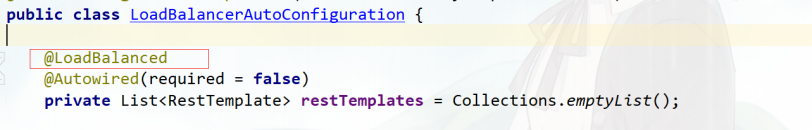
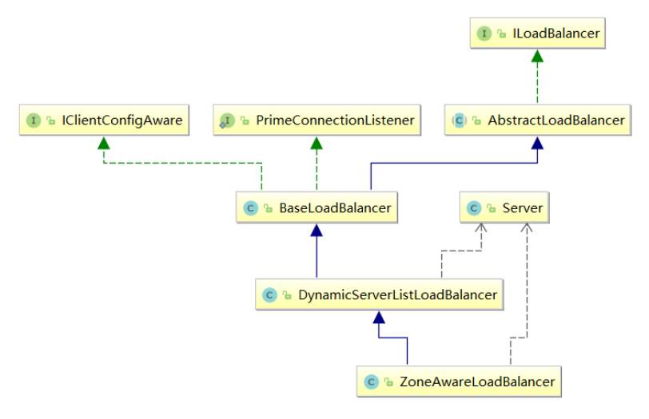

## 负载均衡自动装配

参考源码： org.springframework.cloud.client.loadbalancer.LoadBalancerAutoConfiguration

**首先看看@Qualifier的作用：**

和@Bean一起使用时

```java
@Bean("myExample1")
@Qualifier
public MyExample getRestTemplate(){
    return new MyExample();
}

@Bean("myExample2")
@Qualifier
public MyExample getRestTemplate(){
    return new MyExample();
}

@Qualifier //获取spring容器中，所有MyExample对象的创建有使用Qualifier注解标记的集合。
@Autowired
List<MyExample> mysExampleList= Collections.emptyList();

// myExample1, myExample2
```

**LoadBalanced注解类使用了@Qualifier注解**

@LoadBalanced利用@Qualifier作为restTemplates注入的筛选条件，筛选出具有负载均衡标识的RestTemplate



被@LoadBalanced标注的restTemplate会被定制，添加LoadBalancerInterceptor拦截器

 @Configuration和@Bean会在bean定义解析的时候被解析和创建

```java
 @Configuration(
     proxyBeanMethods = false
 )
 // 当然是在系统没有配置RetryTemplate实例的时候才会执行
 @ConditionalOnMissingClass({"org.springframework.retry.support.RetryTemplate"})
 static class LoadBalancerInterceptorConfig {
     LoadBalancerInterceptorConfig() {
     }
     // 创建拦截器实例
     @Bean
     public LoadBalancerInterceptor loadBalancerInterceptor(LoadBalancerClient loadBalancerClient, LoadBalancerRequestFactory requestFactory) {
         return new LoadBalancerInterceptor(loadBalancerClient, requestFactory);
     }
     
     @Bean
     @ConditionalOnMissingBean // 当缺少 RestTemplateCustomizer 实例对象时执行
     public RestTemplateCustomizer restTemplateCustomizer(final LoadBalancerInterceptor loadBalancerInterceptor) {
         return (restTemplate) -> {
             List<ClientHttpRequestInterceptor> list = new ArrayList(restTemplate.getInterceptors());
             // 添加拦截器实例
             list.add(loadBalancerInterceptor);
             restTemplate.setInterceptors(list);
         };
     }
 }
```

## Ribbon相关接口

参考： **org.springframework.cloud.netflix.ribbon.RibbonClientConfiguration** 

- **IClientConfig**：Ribbon的客户端配置，默认采用**DefaultClientConfigImpl**实现
- **IRule**：Ribbon的负载均衡策略，默认采用**ZoneAvoidanceRule**实现，该策略能够在多区域环境下选出最佳区域的实例进行访问
- **IPing**：Ribbon的实例检查策略，默认采用**DummyPing**实现，该检查策略是一个特殊的实现，实际上它并不会检查实例是否可用，而是始终返回true，默认认为所有服务实例都是可用的
- **ServerList**：服务实例清单的维护机制，默认采用**ConfigurationBasedServerList**实现
- **ServerListFilter**：服务实例清单过滤机制，默认采**ZonePreferenceServerListFilter**，该策略能够优先过滤出与请求方处于同区域的服务实例
- **ILoadBalancer**：负载均衡器，默认采用**ZoneAwareLoadBalancer**实现，它具备了区域感知的能力

