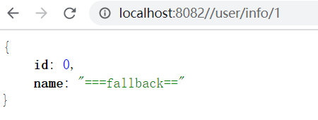

## **前言** 

思考： 

1. 当服务访问量达到一定程度，流量扛不住的时候，该如何处理？ 
2. 服务之间相互依赖，当服务A出现响应时间过长，影响到服务B的响应，进而产生连锁反应，直至影响整个依赖链上的所有服务，该如何处理？ 

这是分布式、微服务开发不可避免的问题

### 分布式系统遇到的问题

在一个高度服务化的系统中,我们实现的一个业务逻辑通常会依赖多个服务,比如商品详情展示服务会依赖商品服务、价格服务、商品评论服务。如图所示：


调用三个依赖服务会共享商品详情服务的线程池，如果其中的商品评论服务不可用，就会出现线程池里所有线程都因等待 响应而被阻塞，从而造成服务雪崩。如图所示：


服务雪崩效应：因服务提供者的不可用导致服务调用者的不可用,并将不可用逐渐放大的过程，就叫服务雪崩效应

导致服务不可用的原因： 

- 程序Bug
- 大流量请求：在秒杀和大促开始前，如果准备不充分，瞬间大量请求会造成服务提供者的不可用
- 硬件故障：可能为硬件损坏造成的服务器主机宕机，网络硬件故障造成的服务提供者的不可访问
- 缓存击穿：一般发生在缓存应用重启，缓存失效时高并发，所有缓存被清空时，以及短时间内大量缓存失效时。大量的缓存不命中, 使请求直击后端，造成服务提供者超负荷运行，引起服务不可用

在服务提供者不可用的时候，会出现大量重试的情况（用户重试、代码逻辑重试），这些重试最终导致：进一步加大请求流量。

所以归根结底导致雪崩效应的最根本原因是：**大量请求线程同步等待造成的资源耗尽。当服务调用者使用同步调用时, 会产生大量的等待线程占用系统资源。一旦线程资源被耗尽,服务调用者提供的服务也将处于不可用状态, 于是服务雪崩效应产生了**

### 解决方案

#### 超时机制

在不做任何处理的情况下，服务提供者不可用会导致消费者请求线程强制等待，而造成系统资源耗尽。加入超时机制，一旦超时，就释放资源。由于释放资源速度较快，一定程度上可以抑制资源耗尽的问题

#### 服务限流(资源隔离)

限制请求核心服务提供者的流量，使大流量拦截在核心服务之外，这样可以更好的保证核心服务提供者不出问题，对于一些出问题的服务可以限制流量访问，只分配固定线程资源访问，这样能使整体的资源不至于被出问题的服务耗尽，进而整个系统雪崩。那么服务之间怎么限流，怎么资源隔离？例如可以通过线程池+队列的方式、通过信号量的方式。

如下图所示，当商品评论服务不可用时，即使商品服务独立分配的20个线程全部处于同步等待状态，也不会影响其他依赖服务的调用


#### 服务熔断

**远程服务不稳定或网络抖动时暂时关闭，就叫服务熔断**

现实世界的断路器大家肯定都很了解，断路器实时监控电路的情况，如果发现电路电流异常，就会跳闸，从而防止电路 被烧毁。 

软件世界的断路器可以这样理解：实时监测应用，如果发现在一定时间内失败次数/失败率达到一定阈值，就“跳闸”，断路器打开——此时，请求直接返回，而不去调用原本调用的逻辑。跳闸一段时间后（例如10秒），断路器会进入半开状态，这是一个瞬间态，此时允许一次请求调用该调的逻辑，如果成功，则断路器关闭，应用正常调用；如果调用依然不成功，断路器继续回到打开状态，过段时间再进入半开状态尝试——通过”跳闸“，应用可以保护自己，而且避免浪费资源；而通过半开的设计，可实现应用的“自我修复“。 

所以，同样的道理，当依赖的服务有大量超时时，在让新的请求去访问根本没有意义，只会无畏的消耗现有资源。比如我们设置了超时时间为1s,如果短时间内有大量请求在1s内都得不到响应，就意味着这个服务出现了异常，此时就没有必要再让其他的请求去访问这个依赖了，这个时候就应该使用断路器避免资源浪费


#### 服务降级

**有服务熔断，必然要有服务降级**

所谓降级，就是当某个服务熔断之后，服务将不再被调用，此时客户端可以自己准备一个本地的fallback（回退）回调，返回一个缺省值。 例如：(备用接口/缓存/mock数据) 。这样做，虽然服务水平下降，但好歹可用，比直接挂掉要强，当然这也要看适合的业务场景


## Sentinel是什么

随着微服务的流行，服务和服务之间的稳定性变得越来越重要。Sentinel 是面向分布式服务架构的流量控制组件，主要以 流量为切入点，从限流、流量整形、熔断降级、系统负载保护、热点防护等多个维度来帮助开发者保障微服务的稳定性

源码地址：https://github.com/alibaba/Sentinel 

官方文档：https://github.com/alibaba/Sentinel/wiki 

Sentinel具有以下特征: 

- **丰富的应用场景**： Sentinel 承接了阿里巴巴近 10 年的双十一大促流量的核心场景，例如秒杀（即突发流量控制在系统容量可以承受的范围）、消息削峰填谷、实时熔断下游不可用应用等
- **完备的实时监控**： Sentinel 同时提供实时的监控功能。您可以在控制台中看到接入应用的单台机器秒级数据，甚至 500 台以下规模的集群的汇总运行情况
- **广泛的开源生态**： Sentinel 提供开箱即用的与其它开源框架/库的整合模块，例如与 Spring Cloud、Dubbo、gRPC 的整合。您只需要引入相应的依赖并进行简单的配置即可快速地接入 Sentine
- **完善的** **SPI** **扩展点**： Sentinel 提供简单易用、完善的 SPI 扩展点。您可以通过实现扩展点，快速的定制逻辑。例如定制规则管理、适配数据源等

阿里云提供了 企业级的 Sentinel 服务，**应用高可用服务 AHAS**


[Sentinel和Hystrix对比](https://github.com/alibaba/Sentinel/wiki/Sentinel­%E4%B8%8E­Hystrix­%E7%9A%84%E5%AF%B9%E6%AF%94)


## Sentinel使用

### 基本概念

- **资源**：

  资源是 Sentinel 的关键概念。它可以是 Java 应用程序中的任何内容，例如，由应用程序提供的服务，或由应用程序调用的其它应用提供的服务，甚至可以是一段代码。在接下来的文档中，我们都会用资源来描述代码块

  只要通过 Sentinel API 定义的代码，就是资源，能够被 Sentinel 保护起来。大部分情况下，可以使用方法签名、URL，甚至服务名称作为资源名来标示资源

- **规则**：

  围绕资源的实时状态设定的规则，可以包括流量控制规则、熔断降级规则以及系统保护规则。所有规则可以动态实时调整

### 工作流程

[官方文档](https://github.com/alibaba/Sentinel/wiki/Sentinel%E5%B7%A5%E4%BD%9C%E4%B8%BB%E6%B5%81%E7%A8%8B)

在 Sentinel 里面，所有的资源都对应一个资源名称（resourceName），每次资源调用都会创建一个 Entry 对象。Entry 可以通过对主流框架的适配自动创建，也可以通过注解的方式或调用 SphU API 显式创建。Entry 创建的时候，同时也会创建一系列功能插槽（slot chain），这些插槽有不同的职责，例如:

- NodeSelectorSlot 负责收集资源的路径，并将这些资源的调用路径，以树状结构存储起来，用于根据调用路径来限流降级
- ClusterBuilderSlot 则用于存储资源的统计信息以及调用者信息，例如该资源的 RT, QPS, thread count 等等，这些信息将用作为多维度限流，降级的依据
- StatisticSlot 则用于记录、统计不同纬度的 runtime 指标监控信息
- FlowSlot 则用于根据预设的限流规则以及前面 slot 统计的状态，来进行流量控制
- DegradeSlot 则通过统计信息以及预设的规则，来做熔断降级
- AuthoritySlot 则根据配置的黑白名单和调用来源信息，来做黑白名单控制
- SystemSlot 则通过系统的状态，例如 load1 等，来控制总的入口流量


### 快速开始

定义的Sentinel进行资源保护的几个步骤：

1. 定义资源
2. 定义规则
3. 校验规则是否生效

```java
Entry entry = null; 
// 务必保证 finally 会被执行
try { 
    // 资源名可使用任意有业务语义的字符串 
    entry = SphU.entry("自定义资源名"); 
    // 被保护的业务逻辑 
    // do something... 
} catch (BlockException ex) { 
    // 资源访问阻止，被限流或被降级 
    // 进行相应的处理操作 
} catch (Exception ex) { 
    // 若需要配置降级规则，需要通过这种方式记录业务异常 
    Tracer.traceEntry(ex, entry); 
} finally { 
    // 务必保证 exit，务必保证每个 entry 与 exit 配对 
    if (entry != null) { 
        entry.exit(); 
    }
```

#### API方式保护资源

引入资源

```xml
<dependency>
    <groupId>com.alibaba.csp</groupId>
    <artifactId>sentinel-core</artifactId>
    <version>1.8.3</version>
</dependency>
```

编写测试逻辑

```java
@RestController 
@Slf4j 
public class HelloController { 
    private static final String RESOURCE_NAME = "hello";

    @RequestMapping(value = "/hello") 
    public String hello() { 
        Entry entry = null; 
        try { 
            // 资源名可使用任意有业务语义的字符串，比如方法名、接口名或其它可唯一标识的字符串。 
            entry = SphU.entry(RESOURCE_NAME); 
            // 被保护的业务逻辑 
            String str = "hello world"; 
            log.info("====="+str); 
            return str; 
        } catch (BlockException e1) { 
            // 资源访问阻止，被限流或被降级 
            // 进行相应的处理操作 
            log.info("block!"); 
        } catch (Exception ex) { 
            // 若需要配置降级规则，需要通过这种方式记录业务异常 
            Tracer.traceEntry(ex, entry); 
        } finally { 
            if (entry != null) { 
                entry.exit(); 
            } 
        } 
        return null; 
    } 
    /** 
    * 定义流控规则 
    */ 
    @PostConstruct 
    private static void initFlowRules(){ 
        List<FlowRule> rules = new ArrayList<>(); 
        FlowRule rule = new FlowRule(); 
        //设置受保护的资源 
        rule.setResource(RESOURCE_NAME); 
        // 设置流控规则 QPS 
        rule.setGrade(RuleConstant.FLOW_GRADE_QPS); 
        // 设置受保护的资源阈值 
        // Set limit QPS to . 
        rule.setCount(1); 
        rules.add(rule); 
        // 加载配置好的规则 
        FlowRuleManager.loadRules(rules); 
    } 
}
```

测试效果：


缺点：

- 业务侵入性很强，需要在controller中写入非业务代码
- 配置不灵活 若需要添加新的受保护资源 需要手动添加 init方法来添加流控规则 

#### @SentinelResource保护资源

@SentinelResource 注解用来标识资源是否被限流、降级

- blockHandler: 定义当资源内部发生了BlockException应该进入的方法（捕获的是Sentinel定义的异常）
- fallback: 定义的是资源内部发生了Throwable应该进入的方法
- exceptionsToIgnore：配置fallback可以忽略的异常

源码入口：com.alibaba.csp.sentinel.annotation.aspectj.SentinelResourceAspect

1. 引入资源

   ```xml
   <dependency>
       <groupId>com.alibaba.csp</groupId>
       <artifactId>sentinel-annotation-aspectj</artifactId>
       <version>1.8.3</version>
   </dependency>
   ```

2. 配置切面支持

   ```java
   @Configuration 
   public class SentinelAspectConfiguration { 
       @Bean 
       public SentinelResourceAspect sentinelResourceAspect() {
           return new SentinelResourceAspect(); 
       } 
   }
   ```

3. UserController中编写测试逻辑，添加@SentinelResource，并配置blockHandler和fallback

   ```java
   @RestController()
   @RequestMapping("user")
   public class UserController {
       
       private static final String RESOURCE_NAME = "user.get";
   
       @GetMapping("/{userId}")
       @SentinelResource(value = "user.get",
               fallback = "fallback",fallbackClass = ExceptionUtil.class,
               blockHandler = "handleException",blockHandlerClass = ExceptionUtil.class)
       public Long get(@PathVariable Long userId){
   
           if(userId==2){
               throw new IllegalArgumentException("非法参数异常");
           }
   
           return userId;
       }
       
       // 流控规则设置
       @PostConstruct
       private void initFlowRules(){
           List<FlowRule> rules = new ArrayList<>();
           FlowRule rule = new FlowRule();
           rule.setResource(RESOURCE_NAME);
           rule.setGrade(RuleConstant.FLOW_GRADE_QPS);
           rule.setCount(1);
           rules.add(rule);
           FlowRuleManager.loadRules(rules);
       }
   }
   
   ```

4. 编写ExceptionUtil，注意如果指定了class，方法必须是static方法

   ```java
   public class ExceptionUtil {
       // 注意这里前面的参数要跟控制器的参数一致，以 Throwable 参数结尾
       public static String fallback(Long id,Throwable e){
           return "===被异常降级啦===";
       }
   
       // 以 BlockException 参数结尾
       public static String handleException(Long id,BlockException e){
           return "===被限流啦===";
       }
   }
   ```

5. 流控规则通过Sentinel dashboard配置

   客户端需要引入 Transport 模块来与 Sentinel 控制台进行通信

   ```xml
   <dependency>
       <groupId>com.alibaba.csp</groupId>
       <artifactId>sentinel-transport-simple-http</artifactId>
       <version>1.8.3</version>
   </dependency>
   ```

6. 启动 Sentinel 控制台

   下载控制台 jar 包并在本地启动：

   ```sh
   java ‐jar sentinel‐dashboard‐1.8.0.jar
   ```

   用户可以通过如下参数进行配置：

   - -Dsentinel.dashboard.auth.username=sentinel 用于指定控制台的登录用户名为 sentinel
   - -Dsentinel.dashboard.auth.password=123456 用于指定控制台的登录密码为 123456；如果省略这两个参数，默认用户和密码均为sentinel
   - -Dserver.servlet.session.timeout=7200 用于指定 Spring Boot 服务端 session 的过期时间，如 7200 表示 7200 秒；60m 表示 60 分钟，默认为 30 分钟

   访问http://localhost:8080/#/login ,默认用户名密码： sentinel/sentinel

   Sentinel 会在客户端首次调用的时候进行初始化，开始向控制台发送心跳包，所以要确保客户端有访问量

   

   

#### Spring Cloud Alibaba整合Sentinel

1. 引入依赖

   ```xml
   <dependency> 
       <groupId>com.alibaba.cloud</groupId> 
       <artifactId>spring‐cloud‐starter‐alibaba‐sentinel</artifactId>
   </dependency> 
   <dependency> 
       <groupId>org.springframework.boot</groupId> 
       <artifactId>spring‐boot‐starter‐actuator</artifactId> 
   </dependency>
   ```

2. 添加yml配置，为微服务设置sentinel控制台地址

   添加Sentinel后，需要暴露/actuator/sentinel端点，而Springboot默认是没有暴露该端点的，所以需要设置

   ```yaml
   server:
     port: 8080
     
   spring:
     application:
       name: server-order
     cloud:
       nacos:
         discovery:
           server‐addr: 127.0.0.1:8848
           
   sentinel: 
     transport: 
       # 添加sentinel的控制台地址 
       dashboard: 127.0.0.1:8989 
       # 指定应用与Sentinel控制台交互的端口，应用本地会起一个该端口占用的HttpServer 
       # port: 8719
   
   #暴露actuator端点
   management:
     endpoints:
       web:
         exposure:
           include: '*'
   ```

3. 在sentinel控制台中设置流控规则

   - **资源名**: 接口的API 
   - **针对来源**: 默认是default，当多个微服务都调用这个资源时，可以配置微服务名来对指定的微服务设置阈值 
   - **阈值类型**: 分为QPS和线程数 假设阈值为10 
   - **QPS类型**: 只得是每秒访问接口的次数>10就进行限流 
   - **线程数**: 为接受请求该资源分配的线程数>10就进行限流

   

   测试： 因为QPS是1，所以1秒内多次访问会出现如下情形

   

   访问http://localhost:8800/actuator/sentinel， 可以查看flowRules

   

#### 统一异常处理

springwebmvc接口资源限流入口在**HandlerInterceptor**的实现类**AbstractSentinelInterceptor**的preHandle方法中，对异常的处理是**BlockExceptionHandler**的实现类 

> **sentinel 1.7.1 引入了**sentinel-spring-webmvc-adapter.jar 

自定义BlockExceptionHandler的实现类统一处理BlockException

```java
@Component
public class MyBlockExceptionHandler implements BlockExceptionHandler {
    @Override
    public void handle(HttpServletRequest httpServletRequest, HttpServletResponse response, BlockException e) throws Exception {
        System.out.println("BlockExceptionHandler BlockException================");

        String result = "";
        if (e instanceof FlowException) {
            result = "接口限流了";
        } else if (e instanceof DegradeException) {
            result = "服务降级了";
        } else if (e instanceof ParamFlowException) {
            result = "热点参数限流了";
        } else if (e instanceof SystemBlockException) {
            result = "触发系统保护规则了";
        } else if (e instanceof AuthorityException) {
            result = "授权规则不通过";
        }

        response.setStatus(500);
        response.setCharacterEncoding("utf-8");
        response.setContentType(MediaType.TEXT_HTML_VALUE);
        response.getWriter().write(result);
    }
}
```

接口

```java
@RestController()
@RequestMapping("user")
public class UserController {
    private static final String RESOURCE_NAME1 = "/user/getList";

    @GetMapping("/getList")
    // 不要加@SentinelResource，加了就需要指定处理限流异常的方法和处理类
//    @SentinelResource(value = "user.getList")
    public String getList(Long userId){

        if(userId!=null && userId==2){
            throw new IllegalArgumentException("非法参数异常");
        }

        return "asd";
    }

    @PostConstruct
    private void initFlowRules(){
        FlowRule rule1 = new FlowRule();
        //设置受保护的资源
        rule1.setResource(RESOURCE_NAME1);
        // 设置流控规则 QPS
        rule1.setGrade(RuleConstant.FLOW_GRADE_QPS);
        // 设置受保护的资源阈值
        // Set limit QPS to 20.
        rule1.setCount(2);
        rules.add(rule1);

        FlowRuleManager.loadRules(rules);
    }
}
```


## 微服务和Sentinel控制台通信原理

Sentinel控制台与微服务端之间，实现了一套服务发现机制，集成了Sentinel的微服务都会将元数据传递给Sentinel控制台，架构图如下所示


## RestTemplate整合Sentinel

Spring Cloud Alibaba Sentinel 支持对 RestTemplate 的服务调用使用 Sentinel 进行保护，在构造 RestTemplate bean的时候需要加上 @SentinelRestTemplate 注解。

 @SentinelRestTemplate 注解的属性支持限流(blockHandler, blockHandlerClass)和降级(fallback, fallbackClass)的处理。

1. 引入依赖

   ```xml
   <!‐‐加入nocas‐client‐‐> 
   <dependency> 
       <groupId>com.alibaba.cloud</groupId> 
       <artifactId>spring‐cloud‐alibaba‐nacos‐discovery</artifactId> 
   </dependency> 
   <!‐‐加入sentinel‐‐> 
   <dependency> 
       <groupId>com.alibaba.cloud</groupId> 
       <artifactId>spring‐cloud‐starter‐alibaba‐sentinel</artifactId> 
   </dependency> 
   <!‐‐加入actuator‐‐> 
   <dependency> 
       <groupId>org.springframework.boot</groupId> 
       <artifactId>spring‐boot‐starter‐actuator</artifactId> 
   </dependency>
   ```

2. RestTemplate添加@SentinelRestTemplate注解

   ```java
   @Bean
   @LoadBalanced
   @SentinelRestTemplate(
       // 全局熔断降级处理
       blockHandler = "handleException",blockHandlerClass = GlobalExceptionHandler.class, 
       // 全局限流处理
       fallback = "fallback",fallbackClass = GlobalExceptionHandler.class 
   )
   public RestTemplate restTemplate() {
       return new RestTemplate();
   }
   ```

   异常处理类定义需要注意的是该方法的参数和返回值跟org.springframework.http.client.ClientHttpRequestInterceptor#interceptor 方法一致，其中参数多出了一个 BlockException 参数用于获取 Sentinel 捕获的异常

   > 源码跟踪: 
   >
   > com.alibaba.cloud.sentinel.custom.SentinelBeanPostProcessor 
   >
   > com.alibaba.cloud.sentinel.custom.SentinelProtectInterceptor#intercept 

3. 异常处理器和控制器

   ```java
   // UserController.java 
   @RequestMapping(value = "/findOrderByUserId/{id}") 
   // @SentinelResource(value = "findOrderByUserId", 
   // fallback = "fallback",fallbackClass = ExceptionUtil.class, 
   // blockHandler = "handleException",blockHandlerClass = ExceptionUtil.class 
   // ) 
   public R findOrderByUserId(@PathVariable("id") Integer id) { 
       //ribbon实现
       String url = "http://mall‐order/order/findOrderByUserId/"+id; 
       R result = restTemplate.getForObject(url,R.class); 
       return result; 
   } 
   
   public class GlobalExceptionUtil { 
       /** 
       * 注意： static修饰，参数类型不能出错 
       * @param request org.springframework.http.HttpRequest 
       * @param body 
       * @param execution 
       * @param ex 
       * @return 
       */ 
       public static SentinelClientHttpResponse handleException(HttpRequest request,byte[] body, ClientHttpRequestExecution execution, BlockException ex) {
           R r = R.error(‐1, "===被限流啦==="); 
           try { 
               return new SentinelClientHttpResponse(new ObjectMapper().writeValueAsString(r)); 
           } catch (JsonProcessingException e) { 
               e.printStackTrace(); 
           } 
           return null; 
       }
   
       public static SentinelClientHttpResponse fallback(HttpRequest request,byte[] body, ClientHttpRequestExecution execution, BlockException ex) {
           R r = R.error(‐2, "===被异常降级啦==="); 
           try { 
               return new SentinelClientHttpResponse(new ObjectMapper().writeValueAsString(r)); 
           } catch (JsonProcessingException e) { 
               e.printStackTrace(); 
           } 
           return null; 
       }
   }
   ```

4. 添加yml配置

   ```properties
   server: 
     port: 8801 
   spring: 
     application: 
       name: mall‐user‐sentinel‐ribbon‐demo #微服务名称 
     #配置nacos注册中心地址 
     cloud: 
       nacos: 
         discovery: 
           server‐addr: 127.0.0.1:8848 
       sentinel: 
         transport: 
           # 添加sentinel的控制台地址 
           dashboard: 127.0.0.1:8080 
           # 指定应用与Sentinel控制台交互的端口，应用本地会起一个该端口占用的HttpServer 
           port: 8719 
   #暴露actuator端点 http://localhost:8800/actuator/sentinel 
   management: 
     endpoints: 
       web: 
         exposure: 
           include: '*' 
   #true开启sentinel对resttemplate的支持，false则关闭 默认true 
   resttemplate: 
     sentinel:
       enabled: true
   ```

Sentinel RestTemplate 限流的资源规则提供两种粒度：

- httpmethod:schema://host:port/path：协议、主机、端口和路径
- httpmethod:schema://host:port：协议、主机和端口


测试限流


测试降级


修改服务提供者

```java
@RequestMapping("/findOrderByUserId/{userId}") 
public R findOrderByUserId(@PathVariable("userId") Integer userId) { 
    //模拟异常
    if(userId==5){ 
        throw new IllegalArgumentException("非法参数异常"); 
    } 
    log.info("根据userId:"+userId+"查询订单信息"); 
    List<OrderEntity> orderEntities = orderService.listByUserId(userId); 
    return R.ok().put("orders", orderEntities); 
}
```


## OpenFeign整合Sentinel

Sentinel 适配了 Feign 组件。如果想使用，除了引入 spring­cloud ­starter ­alibaba­ sentinel 的依赖外还需要 2 个步骤：

1. 配置文件打开 Sentinel 对 Feign 的支持：feign.sentinel.enabled=true
2. 加入 spring­cloud ­starter ­openfeign 依赖使 Sentinel starter 中的自动化配置类生效：

```xml
<dependency>
    <groupId>org.springframework.cloud</groupId> 
    <artifactId>spring‐cloud‐starter‐openfeign</artifactId> 
</dependency>
```

在Feign的声明式接口上添加fallback属性

```java
@FeignClient(value = "mall‐order",path = "/order",fallback = FeignClientFallback.class) 
public interface OrderFeignService { 
    @RequestMapping("/findOrderByUserId/{userId}") 
    public R findOrderByUserId(@PathVariable("userId") Integer userId); 
}

@Component // 必须交给spring 管理 
public class FallbackOrderFeignService implements OrderFeignService { 
    @Override
    public R findOrderByUserId(Integer userId) { 
        return R.error(‐1,"=======服务降级了========"); 
    } 
}
```

添加fallbackFactory属性

```java
@Component 
public class FallbackOrderFeignServiceFactory implements FallbackFactory<OrderFeignService> { 
    @Override 
    public OrderFeignService create(Throwable throwable) { 
        return new OrderFeignService() { 
            @Override 
            public R findOrderByUserId(Integer userId) { 
                return R.error(‐1,"=======服务降级了========"); 
            } 
        }; 
    } 
}
```

UserController

```java
@Autowired
OrderFeignService orderFeignService; 

@RequestMapping(value = "/findOrderByUserId/{id}")
public R findOrderByUserId(@PathVariable("id") Integer id) { 
    //feign调用 
    R result = orderFeignService.findOrderByUserId(id); 
    return result; 
}
```

注意：主启动类上加上@EnableFeignClients注解，开启Feign支持

测试

关闭order服务，访问http://localhost:8801/user/findOrderByUserId/4自动降级了


## Sentinel整合Dubbo实战

Sentinel 提供 Dubbo 的相关适配 Sentinel Dubbo Adapter，主要包括针对 Service Provider 和 Service Consumer 实现的 Filter。相关模块：

- sentinel-apache-dubbo-adapter（兼容 Apache Dubbo 2.7.x 及以上版本，自 Sentinel 1.5.1 开始支持） 
- sentinel-dubbo-adapter（兼容 Dubbo 2.6.x 版本）

引入此依赖后，Dubbo 的服务接口和方法（包括调用端和服务端）就会成为 Sentinel 中的资源，在配置了规则后就可以自动享受到Sentinel 的防护能力。 Sentinel Dubbo Adapter 还支持配置全局的 fallback 函数，可以在 Dubbo 服务被限流/降级/负载保护的时候进行相应的 fallback 处理。用户只需要实现自定义的 DubboFallback 接口，并通过 DubboAdapterGlobalConfig注册即可。默认情况会直接将 BlockException 包装后抛出。同时，我们还可以配合 Dubbo 的 fallback 机制 来为降级的服务提供替代的实现

### Provider端

对服务提供方的流量控制可分为**服务提供方的自我保护能力**和**服务提供方对服务消费方的请求分配能力**两个维度

Provider 用于向外界提供服务，处理各个消费者的调用请求。为了保护 Provider 不被激增的流量拖垮影响稳定性，可以给 Provider 配置 **QPS** **模式**的限流，这样当每秒的请求量超过设定的阈值时会自动拒绝多的请求。限流粒度可以是 服务接口 和 服务方法两种粒度。若希望整个服务接口的 QPS 不超过一定数值，则可以为对应服务接口资源 （resourceName 为**接口全限定名**）配置 QPS 阈值；若希望服务的某个方法的 QPS不超过一定数值，则可以为对应服务方法资源（resourceName 为接口全限定名:方法签名）配置 QPS 阈值

限流粒度可以是服务接口和服务方法两种粒度：

- 服务接口：resourceName 为 接口全限定名，如com.tuling.mall.service.UserService
- 服务方法：resourceName 为 接口全限定名:方法签名，如com.tuling.mall.service.UserService:getById(java.lang.Integer) 

### Consumer端 

对服务提供方的流量控制可分为**控制并发线程数**和**服务降级**两个维度

**控制并发线程数** 

Service Consumer 作为客户端去调用远程服务。每一个服务都可能会依赖几个下游服务，若某个服务 A 依赖的下游服务 B 出现了不稳定的情况，服务 A 请求 服务 B 的响应时间变长，从而服务 A 调用服务 B 的线程就会产生堆积，最终可能耗尽服务 A 的线程数。我们通过用并发线程数来控制对下游服务 B 的访问，来保证下游服务不可靠的时候，不会拖垮服务自身。基于这种场景，推荐给 Consumer 配置**线程数模式**的限流，来保证自身不被不稳定服务所影响。采用基于线程数的限流模式后，我们不需要再显式地去进行线程池隔离，Sentinel 会控制资源的线程数，超出的请求直接拒绝，直到堆积的线程处理完成，可以达到**信号量隔离**的效果

**服务降级** 

当服务依赖于多个下游服务，而某个下游服务调用非常慢时，会严重影响当前服务的调用。这里我们可以利用 Sentinel 熔断降级的功能，为调用端配置基于平均 RT 的降级规则。这样当调用链路中某个服务调用的平均 RT 升高，在一定的次数内超过配置的 RT阈值，Sentinel 就会对此调用资源进行降级操作，接下来的调用都会立刻拒绝，直到过了一段设定的时间后才恢复，从而保护服务不被调用端短板所影响。同时可以配合fallback 功能使用，在被降级的时候提供相应的处理逻辑

1. 引入依赖

   ```xml
   <dependency> 
       <groupId>com.alibaba.cloud</groupId> 
       <artifactId>spring‐cloud‐starter‐alibaba‐sentinel</artifactId>
   </dependency> 
   <!‐‐Sentinel 对 Dubbo的适配 Apache Dubbo 2.7.x 及以上版本‐‐> 
   <dependency> 
       <groupId>com.alibaba.csp</groupId> 
       <artifactId>sentinel‐apache‐dubbo‐adapter</artifactId> 
   </dependency>
   ```

2. 接入sentinel dashboard，yml中增加配置

3. consumer端配置流控规则测试

   ```java
   @RequestMapping("/info/{id}") 
   public User info(@PathVariable("id") Integer id) {
       User user = null; 
       try { 
           user = userService.getById(id); 
       } catch (Exception e) { 
           e.printStackTrace();
       } 
       return user; 
   } 
   
   @PostConstruct 
   public void init() { 
       DubboAdapterGlobalConfig.setConsumerFallback( 
           (invoker, invocation, ex) ‐> AsyncRpcResult.newDefaultAsyncResult( 
               new User(0,"===fallback=="), invocation)); 
   }
   ```

   

   测试： http://localhost:8082/user/info/1

   

4. provider端配置流控规则测试 

   

   ```java
   @RequestMapping("/getById/{id}")
   @SentinelResource("getById")
   public User getById(@PathVariable("id") Integer id) { 
       User user = null; 
       try { 
           user = userMapper.getById(id); 
       } catch (Exception e) {
           e.printStackTrace();
       }
       return user;
   }
   
   @PostConstruct 
   public void init() { 
       DubboAdapterGlobalConfig.setProviderFallback((invoker, invocation, ex) ‐> AsyncRpcResult.newDefaultAsyncResult(new User(0,"= ==provider fallback=="), invocation)); 
   }
   ```

   

5. consumer中配置mock实现，关闭provider服务，测试mock降级

   ```java
   @DubboReference(mock = "com.tuling.mall.user.mock.UserServiceDubboMock") 
   private UserService userService;
   
   public class UserServiceDubboMock implements UserService {
       @Override 
       public List<User> list() { 
           return null;
       }
       
       @Override 
       public User getById(Integer id) { 
           return new User(0,"====mock==="); 
       }
   }
   ```

   

##  Sentinel规则持久化模式

Sentinel规则的推送有下面三种模式:

| 推送模式  | 说明                                                         | 优点                         | 缺点                                                         |
| --------- | ------------------------------------------------------------ | ---------------------------- | ------------------------------------------------------------ |
| 原始模式  | API 将规则推送至客户端并直接更新到内存中，扩展写数据源（WritableDataSource） | 简单，无任何依赖             | 不保证一致性；规则保存在内存中，重启即消失。严重不建议用于生产环境 |
| Pull 模式 | 扩展写数据源（WritableDataSource）， 客户端主动向某个规则管理中心定期轮询拉取规则，这个规则中心可以是 RDBMS、文件 等 | 简单，无任何依赖；规则持久化 | 不保证一致性；实时性不保证，拉取过于频繁也可能会有性能问题   |
| Push 模式 | 扩展读数据源（ReadableDataSource），规则中心统一推送，客户端通过注册监听器的方式时刻监听变化，比如使用 Nacos、Zookeeper 等配置中心。这种方式有更好的实时性和一致性保证。生产环境下一般采用 push 模式的数据源 | 规则持久化；一致性；快速     | 引入第三方依赖                                               |

### 原始模式

如果不做任何修改，Dashboard 的推送规则方式是通过 API 将规则推送至客户端并直接更新到内存中：


这种做法的好处是简单，无依赖；坏处是应用重启规则就会消失，仅用于简单测试，不能用于生产环境

### Pull模式

pull 模式的数据源（如本地文件、RDBMS 等）一般是可写入的。使用时需要在客户端注册数据源：将对应的读数据源注册至对应的 RuleManager，将写数据源注册至 transport 的 WritableDataSourceRegistry 中


首先 Sentinel 控制台通过 API 将规则推送至客户端并更新到内存中，接着注册的写数据源会将新的规则保存到本地的文件中。使用 pull 模式的数据源时一般不需要对 Sentinel 控制台进行改造。这种实现方法好处是简单，坏处是无法保证监控数据的一致性

官方demo: sentinel­-demo/sentinel-­demo­-dynamic­-file­-rule 

引入依赖

```xml
<dependency> 
    <groupId>com.alibaba.csp</groupId> 
    <artifactId>sentinel‐datasource‐extension</artifactId> 
    <version>1.8.0</version>
</dependency>
```

核心代码：

```java
// FileRefreshableDataSource 会周期性的读取文件以获取规则，当文件有更新时会及时发现，并将规则更新到内存中。 
ReadableDataSource<String, List<FlowRule>> ds = new FileRefreshableDataSource<>( 
    flowRulePath, source ‐> JSON.parseObject(source, new TypeReference<List<FlowRule>>() {}) 
); 
// 将可读数据源注册至 FlowRuleManager. 
FlowRuleManager.register2Property(ds.getProperty()); 
WritableDataSource<List<FlowRule>> wds = new FileWritableDataSource<>(flowRulePath, this::encodeJson); 
// 将可写数据源注册至 transport 模块的 WritableDataSourceRegistry 中. 
// 这样收到控制台推送的规则时，Sentinel 会先更新到内存，然后将规则写入到文件中. 
WritableDataSourceRegistry.registerFlowDataSource(wds);
```

### Pull模式改造

实现InitFunc接口，在init中处理DataSource初始化逻辑，并利用spi机制实现加载


其中部分核心代码

```java
 public class FileDataSourceInit implements InitFunc {
     @Override
     public void init() throws Exception { 
         //创建文件存储目录 
         RuleFileUtils.mkdirIfNotExits(PersistenceRuleConstant.storePath); 
         //创建规则文件 
         RuleFileUtils.createFileIfNotExits(PersistenceRuleConstant.rulesMap); 
         //处理流控规则逻辑 
         dealFlowRules(); 
         // 处理降级规则 
         dealDegradeRules(); 
         // 处理系统规则 
         dealSystemRules(); 
         // 处理热点参数规则 
         dealParamFlowRules(); 
         // 处理授权规则 
         dealAuthRules(); 
     } 
     
     private void dealFlowRules() throws FileNotFoundException { 
         String ruleFilePath = PersistenceRuleConstant.rulesMap.get(PersistenceRuleConstant.FLOW_RULE_PATH).toString(); 
         //创建流控规则的可读数据源 
         ReadableDataSource<String, List<FlowRule>> flowRuleRDS = new FileRefreshableDataSource( 
             ruleFilePath, RuleListConverterUtils.flowRuleListParser 
         ); 
         // 将可读数据源注册至FlowRuleManager 这样当规则文件发生变化时，就会更新规则到内存 
         FlowRuleManager.register2Property(flowRuleRDS.getProperty()); 
         WritableDataSource<List<FlowRule>> flowRuleWDS = new FileWritableDataSource<List<FlowRule>>( 
             ruleFilePath, RuleListConverterUtils.flowFuleEnCoding 
         ); 
         // 将可写数据源注册至 transport 模块的 WritableDataSourceRegistry 中. 
         // 这样收到控制台推送的规则时，Sentinel 会先更新到内存，然后将规则写入到文件中. 
         WritableDataSourceRegistry.registerFlowDataSource(flowRuleWDS); 
     } 
     
     private void dealDegradeRules() throws FileNotFoundException { 
         //讲解规则文件路径 
         String degradeRuleFilePath = PersistenceRuleConstant.rulesMap.get(PersistenceRuleConstant.DEGRAGE_RULE_PATH).toStr ing(); 
         //创建流控规则的可读数据源 
         ReadableDataSource<String, List<DegradeRule>> degradeRuleRDS = new FileRefreshableDataSource( 
             degradeRuleFilePath, RuleListConverterUtils.degradeRuleListParse 
         ); 
         // 将可读数据源注册至FlowRuleManager 这样当规则文件发生变化时，就会更新规则到内存 
         DegradeRuleManager.register2Property(degradeRuleRDS.getProperty()); 
         WritableDataSource<List<DegradeRule>> degradeRuleWDS = new FileWritableDataSource<>( 
             degradeRuleFilePath, RuleListConverterUtils.degradeRuleEnCoding 
         ); 
         // 将可写数据源注册至 transport 模块的 WritableDataSourceRegistry 中. 
         // 这样收到控制台推送的规则时，Sentinel 会先更新到内存，然后将规则写入到文件中.
         WritableDataSourceRegistry.registerDegradeDataSource(degradeRuleWDS); 
     } 
     private void dealSystemRules() throws FileNotFoundException { 
         //讲解规则文件路径 
         String systemRuleFilePath = PersistenceRuleConstant.rulesMap.get(PersistenceRuleConstant.SYSTEM_RULE_PATH).toStrin g(); 
         //创建流控规则的可读数据源 
         ReadableDataSource<String, List<SystemRule>> systemRuleRDS = new FileRefreshableDataSource( 
             systemRuleFilePath, RuleListConverterUtils.sysRuleListParse 
         ); 
         // 将可读数据源注册至FlowRuleManager 这样当规则文件发生变化时，就会更新规则到内存 
         SystemRuleManager.register2Property(systemRuleRDS.getProperty()); 
         WritableDataSource<List<SystemRule>> systemRuleWDS = new FileWritableDataSource<>( 
             systemRuleFilePath, RuleListConverterUtils.sysRuleEnCoding 
         ); 
         // 将可写数据源注册至 transport 模块的 WritableDataSourceRegistry 中. 
         // 这样收到控制台推送的规则时，Sentinel 会先更新到内存，然后将规则写入到文件中. 
         WritableDataSourceRegistry.registerSystemDataSource(systemRuleWDS); 
     } 
     
     private void dealParamFlowRules() throws FileNotFoundException { 
         //讲解规则文件路径 
         String paramFlowRuleFilePath = PersistenceRuleConstant.rulesMap.get(PersistenceRuleConstant.HOT_PARAM_RULE).toStri ng(); 
         //创建流控规则的可读数据源 
         ReadableDataSource<String, List<ParamFlowRule>> paramFlowRuleRDS = new FileRefreshableDataSource( 
             paramFlowRuleFilePath, RuleListConverterUtils.paramFlowRuleListParse 
         ); 
         // 将可读数据源注册至FlowRuleManager 这样当规则文件发生变化时，就会更新规则到内存 
         ParamFlowRuleManager.register2Property(paramFlowRuleRDS.getProperty()); 
         WritableDataSource<List<ParamFlowRule>> paramFlowRuleWDS = new FileWritableDataSource<>( 
             paramFlowRuleFilePath, RuleListConverterUtils.paramRuleEnCoding 
         ); 
         // 将可写数据源注册至 transport 模块的 WritableDataSourceRegistry 中. 
         // 这样收到控制台推送的规则时，Sentinel 会先更新到内存，然后将规则写入到文件中. 
         ModifyParamFlowRulesCommandHandler.setWritableDataSource(paramFlowRuleWDS); 
     }
     
     private void dealAuthRules() throws FileNotFoundException { 
         //讲解规则文件路径 
         String authFilePath = PersistenceRuleConstant.rulesMap.get(PersistenceRuleConstant.AUTH_RULE_PATH).toString();
         //创建流控规则的可读数据源 
         ReadableDataSource<String, List<AuthorityRule>> authRuleRDS = new FileRefreshableDataSource( 
             authFilePath, RuleListConverterUtils.authorityRuleParse 
         );
         // 将可读数据源注册至FlowRuleManager 这样当规则文件发生变化时，就会更新规则到内存 
         AuthorityRuleManager.register2Property(authRuleRDS.getProperty()); 
         WritableDataSource<List<AuthorityRule>> authRuleWDS = new FileWritableDataSource<>( 
             authFilePath, RuleListConverterUtils.authorityEncoding 
         );
         // 将可写数据源注册至 transport 模块的 WritableDataSourceRegistry 中. 
         // 这样收到控制台推送的规则时，Sentinel 会先更新到内存，然后将规则写入到文件中. 
         WritableDataSourceRegistry.registerAuthorityDataSource(authRuleWDS); 
     } 
 }
```


### Push模式

生产环境下一般更常用的是 push 模式的数据源。对于 push 模式的数据源,如远程配置中心（ZooKeeper, Nacos, Apollo等等），推送的操作不应由 Sentinel 客户端进行，而应该经控制台统一进行管理，直接进行推送，数据源仅负责获取配置中心推送的配置并更新到本地。因此推送规则正确做法应该是 **配置中心控制台/Sentinel 控制台** **→** **配置中心** **→** **Sentinel数据源** **→ Sentinel**，而不是经 Sentinel 数据源推送至配置中心。这样的流程就非常清晰了：


#### 基于Nacos配置中心控制台实现推送

官方demo: sentinel­-demo­-nacos­-datasource 

1. 引入依赖

   ```xml
   <dependency> 
        <groupId>com.alibaba.csp</groupId> 
       <artifactId>sentinel‐datasource‐nacos</artifactId> 
       <version>1.8.0</version> 
   </dependency>
   ```

2. 核心代码

   ```java
   // nacos server ip 
   private static final String remoteAddress = "localhost:8848";
   // nacos group 
   private static final String groupId = "Sentinel:Demo"; 
   // nacos dataId
   private static final String dataId = "com.alibaba.csp.sentinel.demo.flow.rule";
   ReadableDataSource<String, List<FlowRule>> flowRuleDataSource = new NacosDataSource<>(remoteAddress, groupId, dataId,source ‐> JSON.parseObject(source, new TypeReference<List<FlowRule>>() {})); 
   FlowRuleManager.register2Property(flowRuleDataSource.getProperty());
   ```

3. nacos配置中心中配置流控规则 

   ```json
   [
       { 
           "resource": "TestResource", 
           "controlBehavior": 0, 
           "count": 10.0, 
           "grade": 1, 
           "limitApp": "default", 
           "strategy": 0 
       } 
   ]
   ```

   

#### 微服务中通过yml配置实现

SentinelProperties 内部提供了 TreeMap 类型的 datasource 属性用于配置数据源信息

1. 引入依赖

   ```xml
   <!‐‐sentinel持久化 采用 Nacos 作为规则配置数据源‐‐> 
   <dependency> 
       <groupId>com.alibaba.csp</groupId> 
       <artifactId>sentinel‐datasource‐nacos</artifactId> 
   </dependency>
   ```

2. yml中配置 

   ```yaml
   spring:
     application:
       name: mall‐user‐sentinel‐demo
     cloud:
       nacos:
         discovery:
           server‐addr: 127.0.0.1:8848
     sentinel:
       transport:
         # 添加sentinel的控制台地址
         dashboard: 127.0.0.1:8080
         # 指定应用与Sentinel控制台交互的端口，应用本地会起一个该端口占用的HttpServer
         port: 8719
         datasource:
           ds1:
             nacos:
               server‐addr: 127.0.0.1:8848
               dataId: ${spring.application.name}
               groupId: DEFAULT_GROUP
               data‐type: json
               rule‐type: flow
   ```

3. 