## 简介

网关作为流量的入口，常用的功能包括路由转发，权限校验，限流等。Spring Cloud Gateway 是Spring Cloud官方推出的第二代网关框架，定位于取代 Netflix Zuul。相比 Zuul 来说，Spring Cloud Gateway 提供更优秀的性能，更强大的功能。 

Spring Cloud Gateway 是由 WebFlux + Netty + Reactor 实现的响应式的 API 网关。**它不能在传统的 servlet 容器中工作，也不能构建成war包**

Spring Cloud Gateway 旨在为微服务架构提供一种简单且有效的 API 路由的管理方式，并基于 Filter 的方式提供网关的基本功能，例如说安全认证、监控、限流等等

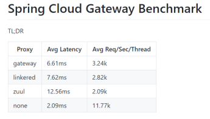

[官网文档](https://docs.spring.io/spring-cloud-gateway/docs/current/reference/html/#gateway-request-predicates-factories)

### 核心概念

- 路由(route): 路由是网关中最基础的部分，路由信息包括一个ID、一个目的URI、一组断言工厂、一组Filter组成。如果断言为真，则说明请求的URL和配置的路由匹配
- 断言(predicates): Java8中的断言函数，SpringCloud Gateway中的断言函数类型是Spring5.0框架中的ServerWebExchange。断言函数允许开发者去定义匹配Http request中的任何信息，比如请求头和参数等
- 过滤器(Filter): SpringCloud Gateway中的filter分为Gateway FilIer和Global Filter。Filter可以对请求和响应进行处理

### 工作原理

Spring Cloud Gateway 的工作原理跟 Zuul 的差不多，最大的区别就是 Gateway 的 Filter 只有 pre 和 post 两种

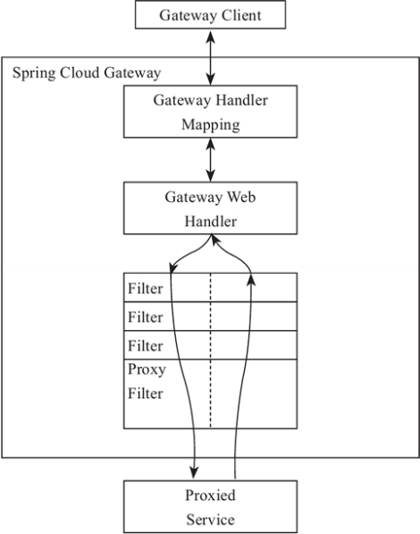

客户端向 Spring Cloud Gateway 发出请求，如果请求与网关程序定义的路由匹配，则该请求就会被发送到网关Web 处理程序，此时处理程序运行特定的请求过滤器链

过滤器之间用虚线分开的原因是过滤器可能会在发送代理请求的前后执行逻辑。所有 pre 过滤器逻辑先执行，然后执行代理请求；代理请求完成后，执行 post 过滤器逻辑

## 快速开始

### 环境搭建

1. 引入依赖

   ```xml
   <dependency>
       <groupId>com.alibaba.cloud</groupId>
       <artifactId>spring-cloud-starter-alibaba-nacos-discovery</artifactId>
   </dependency>
   <dependency>
       <groupId>org.springframework.cloud</groupId>
       <artifactId>spring-cloud-starter-gateway</artifactId>
   </dependency>
   ```

2. 编写yml配置文件

   ```properties
   server:
     port: 7001
   spring:
     application:
       name: spring-cloud-gateway
     cloud:
       # Nacos帮助文档: https://nacos.io/zh-cn/docs/concepts.html
       nacos:
         discovery:
           server-addr: mse-6d50f4f0-p.nacos-ans.mse.aliyuncs.com:8848
           username: nacos
           password: nacos
           # 注册到 nacos 的指定 namespace，默认为 public
           namespace: public
       gateway:
         enabled: true
         discovery:
           # 默认为false，设为true开启通过微服务创建路由的功能，即可以通过微服务名访问服务
           locator:
             enabled: true
   ```

3. 测试

   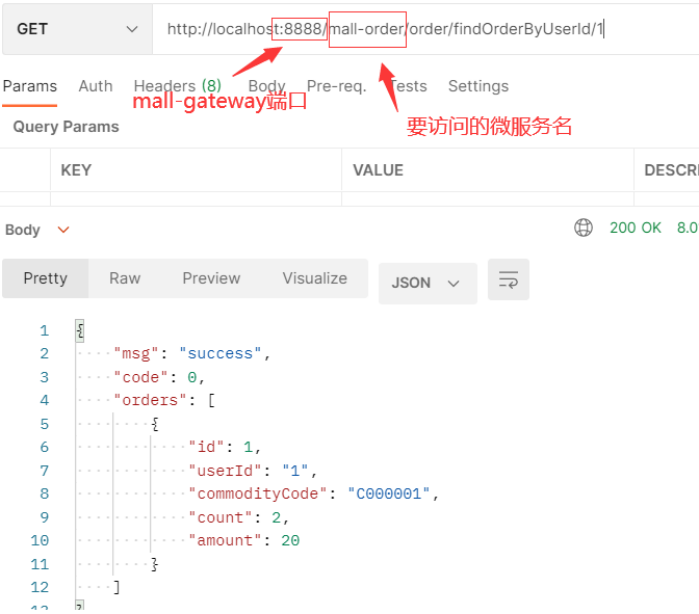

### 路由断言工厂配置

[Route Predicate Factories 配置文档](https://docs.spring.io/spring-cloud-gateway/docs/current/reference/html/#gateway-request-predicates-factories)

网关启动日志： 

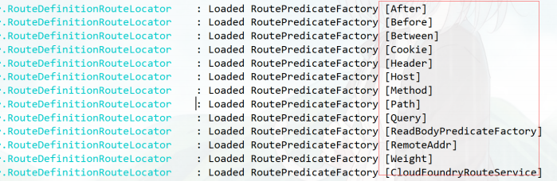

#### 时间匹配

可以用在限时抢购的一些场景中

访问网关：http://localhost:7001/order/findOrderByUserId/1

如果匹配成功，网关内部转发：http://localhost:8020/order/findOrderByUserId/1

```yaml
spring:
  cloud:
    gateway:
      routes:
      - id: order_route  #路由ID，全局唯一
        uri:  http://localhost:8020  #目标微服务的请求地址和端口
        predicates:
        - After=2022-04-24T15:02:42.379+08:00[Asia/Shanghai]
```

通过ZonedDateTime得到时间格式

```java
ZonedDateTime time = ZonedDateTime.now(ZoneId.of("Asia/Shanghai"));
```

设置时间之前发起请求：

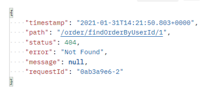

超过设置时间之后再次请求：

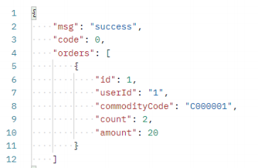

#### Cookie匹配

cookie中包含username=vansama的请求

```yaml
spring:
  cloud:
    gateway:
      routes:
      - id: order_route 
        uri:  http://localhost:8020 
        predicates:
        - Cookie=username, vansama
```

postman测试

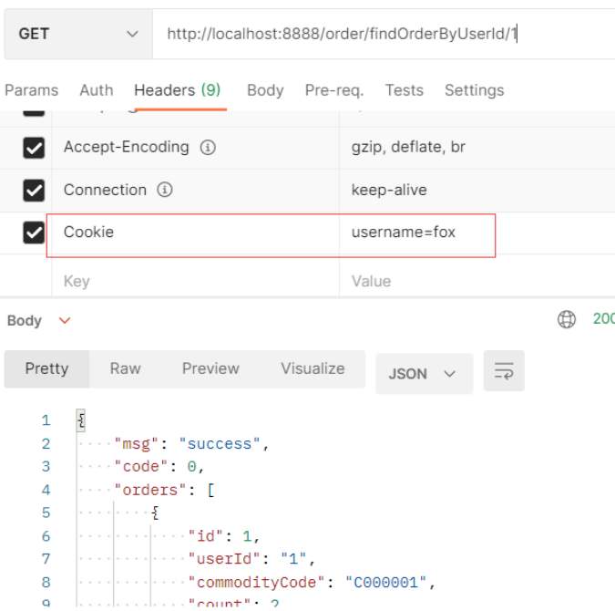

curl测试

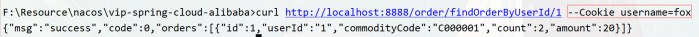

#### Header匹配

请求中带有请求头名为 x‐request‐id，其值与 \d+ 正则表达式匹配

```yaml
spring:
  cloud:
    gateway:
      routes:
      - id: order_route 
        uri:  http://localhost:8020 
        predicates:
        - Header=X‐Request‐Id, \d+
```

测试

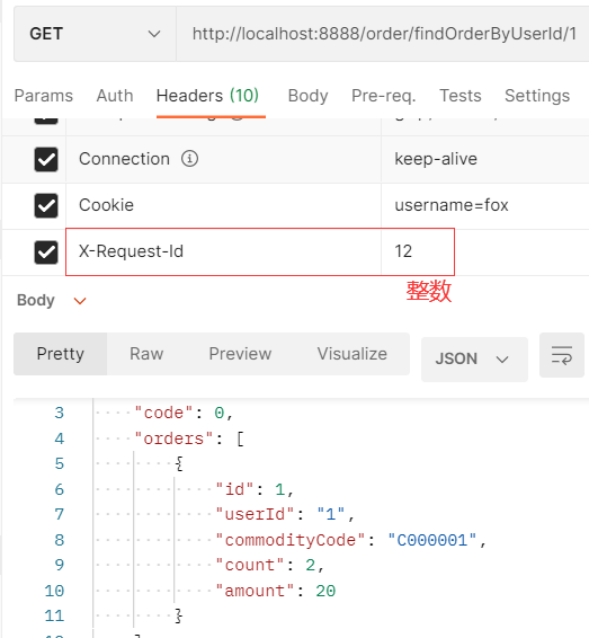

#### 路径匹配

Path路径匹配

```yaml
spring:
  cloud:
    gateway:
      routes:
      - id: order_route 
        uri:  http://localhost:8020 
        predicates:
        - Path=/order/**
```

#### 自定义路由断言工厂

自定义路由断言工厂需要继承 AbstractRoutePredicateFactory 类，重写 apply 方法的逻辑。在 apply 方法中可以通过 exchange.getRequest() 拿到 ServerHttpRequest 对象，从而可以获取到请求的参数、请求方式、请求头等信息

>  注意： 命名需要以 RoutePredicateFactory 结尾

```java
@Component 
@Slf4j 
public class CheckAuthRoutePredicateFactory extends AbstractRoutePredicateFactory<CheckAuthRoutePredicateFactory.Config> { 
    public CheckAuthRoutePredicateFactory() { 
        super(Config.class); 
    } 
    
    @Override 
    public Predicate<ServerWebExchange> apply(Config config) { 
        return new GatewayPredicate() { 
            @Override
            public boolean test(ServerWebExchange serverWebExchange) { 
                log.info("调用CheckAuthRoutePredicateFactory" + config.getName()); 
                if(config.getName().equals("vansama")){ 
                    return true; 
                } 
                
                return false; 
            } 
        }; 
    } 
    
    /** 
    * 快捷配置 
    * @return 
    */ 
    @Override 
    public List<String> shortcutFieldOrder() { 
        return Collections.singletonList("name"); 
    } 
    
    public static class Config { 
        private String name; 
        public String getName() { 
            return name; 
        } 
        public void setName(String name) { 
            this.name = name; 
        } 
    } 
}
```

yml中配置 

```yaml
spring:
  cloud:
    gateway:
      routes:
      - id: order_route 
        uri:  http://localhost:8020 
        predicates:
        - CheckAuth=vansama
```

### 过滤器工厂配置

[**GatewayFilter Factories**](https://docs.spring.io/spring-cloud-gateway/docs/current/reference/html/#gatewayfilter-factories)：Spring Cloud Gateway 内置了很多的过滤器工厂，我们通过一些过滤器工厂可以进行一些业务逻辑处理器，比如添加剔除响应头，添加去除参数等

**过滤器**：对成功匹配到路由的请求，在向后端服务转发前和返回结果后的处理

#### 添加请求头

```yaml
spring:
  cloud:
    gateway:
      routes:
      - id: order_route 
        uri:  http://localhost:8020 
        filters:
        - AddRequestHeader=X‐Request‐color, red
```

测试 localhost:8888/order/testgateway 

```java
// 8082 服务的接口

@GetMapping("/testgateway") 
public String testGateway(HttpServletRequest request) throws Exception { 
    log.info("gateWay获取请求头X‐Request‐color：" 
             +request.getHeader("X‐Request‐color")); 
    return "success"; 
}

@GetMapping("/testgateway2") 
public String testGateway(@RequestHeader("X‐Request‐color") String color) throws Exception { 
    log.info("gateWay获取请求头X‐Request‐color："+color); 
    return "success"; 
}
```

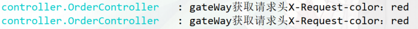

#### 添加请求参数

```yaml
spring:
  cloud:
    gateway:
      routes:
      - id: order_route 
        uri:  http://localhost:8020 
        filters:
        - AddRequestParameter=color, blue # 添加请求参数
```

测试 localhost:8888/order/testgateway3 

```java
@GetMapping("/testgateway3") 
public String testGateway3(@RequestParam("color") String color) throws Exception { 
    log.info("gateWay获取请求参数color:"+color); 
    return "success"; 
}
```

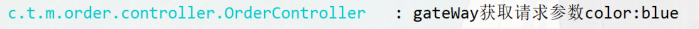

#### 为匹配的路由统一添加前缀

```yaml
spring:
  cloud:
    gateway:
      routes:
      - id: order_route 
        uri:  http://localhost:8020 
        filters:
        - PrefixPath=/server‐order # 添加前缀 对应微服务需要配置context‐path
```

测试：localhost:8888/order/findOrderByUserId/1 ====》 http://localhost:8020/server-order/order/findOrderByUserId/1

#### 重定向操作

```yaml
spring:
  cloud:
    gateway:
      routes:
      - id: order_route 
        uri:  http://localhost:8020 
        filters:
        - RedirectTo=302, http://baidu.com #重定向到百度
```

#### 自定义过滤器工厂

继承AbstractNameValueGatewayFilterFactory且我们的自定义名称必须要以GatewayFilterFactory结尾并交给spring管理

```java
@Component 
@Slf4j 
public class CheckAuthGatewayFilterFactory extends AbstractNameValueGatewayFilterFactory { 
    @Override 
    public GatewayFilter apply(NameValueConfig config) { 
        return (exchange, chain) ‐> { 
            log.info("调用CheckAuthGatewayFilterFactory===" 
                     + config.getName() + ":" + config.getValue()); 
            return chain.filter(exchange); 
        }; 
    } 
}
```

配置自定义工厂

```yaml
spring:
  cloud:
    gateway:
      routes:
      - id: order_route 
        uri:  http://localhost:8020 
        filters:
        ‐ CheckAuth=fox,男
```

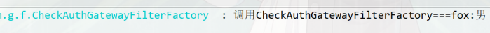

### 全局过滤器配置

Global Filters

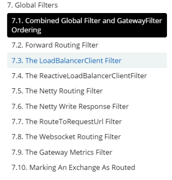

GlobalFilter 接口和 GatewayFilter 有一样的接口定义，只不过， GlobalFilter 会作用于所有路由。官方声明：GlobalFilter的接口定义以及用法在未来的版本可能会发生变化