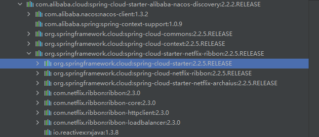
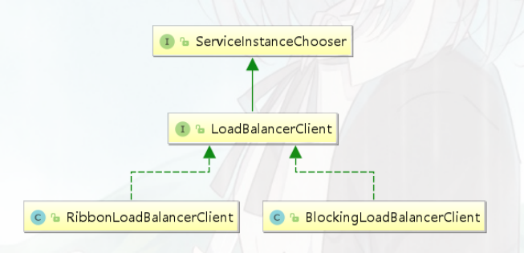

## 介绍

Spring Cloud LoadBalancer是Spring Cloud官方自己提供的客户端负载均衡器, 用来替代Ribbon

Spring官方提供了两种负载均衡的客户端

- **RestTemplate**：RestTemplate是Spring提供的用于访问Rest服务的客户端，RestTemplate提供了多种便捷访问远程Http服务的方法，能够大大提高客户端的编写效率。默认情况下，RestTemplate默认依赖jdk的HTTP连接工具
- **WebClient**：WebClient是从Spring WebFlux 5.0版本开始提供的一个非阻塞的基于响应式编程的进行Http请求的客户端工具。它的响应式编程的基于Reactor的。WebClient中提供了标准Http请求方式对应的get、post、put、delete等方法，可以用来发起相应的请求

## RestTemplate整合LoadBalancer

**导入依赖**

```xml
<dependency> 
    <groupId>org.springframework.cloud</groupId> 
    <artifactId>spring‐cloud‐starter‐loadbalancer</artifactId> 
</dependency>

<!‐‐ 提供了RestTemplate支持 ‐‐> 
<dependency> 
    <groupId>org.springframework.boot</groupId> 
    <artifactId>spring‐boot‐starter‐web</artifactId> 
</dependency>

<!‐‐ nacos服务注册与发现 移除ribbon支持‐‐>
<dependency>
    <groupId>com.alibaba.cloud</groupId>
    <artifactId>spring-cloud-starter-alibaba-nacos-discovery</artifactId>
    <exclusions>
    	<exclusion>
        	<groupId>org.springframework.cloud</groupId>
            <artifactId>spring‐cloud‐starter‐netflix‐ribbon</artifactId>
        </exclusion>
    </exclusions>
</dependency>
```

Nacos客户端依赖Ribbon，所以需要手动排除



如果不在pom排除，也可以在配置文件中不适用ribbon

```yaml
spring: 
  application: 
    name: mall‐user‐loadbalancer‐demo 
  cloud: 
    nacos: 
      discovery: 
        server‐addr: 127.0.0.1:8848 
        # 不使用ribbon 
        loadbalancer: 
          ribbon: 
            enabled: false
```

原理：默认情况下，如果同时拥有RibbonLoadBalancerClient和BlockingLoadBalancerClient，为了保持向后兼容性，将使用RibbonLoadBalancerClient。要覆盖它，可以设置以上配置



**配置RestTemplate** 

```java
@Bean
@LoadBalanced
public RestTemplate restTemplate() {
    return new RestTemplate();
}
```

**使用方式跟ribbon一样**

## WebClient整合LoadBalancer

**导入依赖**

```xml
<!‐‐ 提供了WebClient支持 ‐‐> 
<dependency> 
    <groupId>org.springframework.boot</groupId> 
    <!--替换spring‐boot‐starter‐web-->
    <artifactId>spring‐boot‐starter‐webflux</artifactId> 
</dependency>
```

**配置**

```java
@LoadBalanced
@Bean 
WebClient.Builder webClientBuilder() { 
    return WebClient.builder();
}

@Bean 
WebClient webClient() { 
    return webClientBuilder().build(); 
}
```

**使用**

```java
@Autowired 
private WebClient webClient; 

@RequestMapping(value = "/findOrderByUserId2/{id}") 
public Mono<R> findOrderByUserIdWithWebClient(@PathVariable("id") Integer id) {
    String url = "http://mall‐order/order/findOrderByUserId/"+id;
    //基于WebClient
    Mono<R> result = webClient.get().uri(url)
        .retrieve().bodyToMono(R.class);
    return result;
}
```

原理： 底层会使用ReactiveLoadBalancer