# Spring IOC 加载流程

Spring 最重要的概念是 IOC 和 AOP，其中IOC又是Spring中的根基：

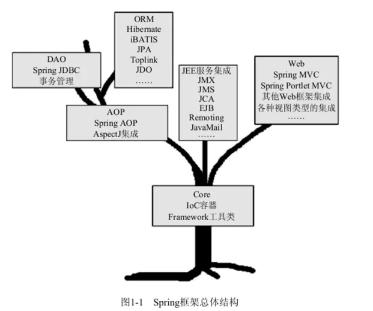

本文要说的 IOC 总体来说有两处地方最重要，一个是创建 Bean 容器，一个是初始化 Bean

**Demo**

配置类 MainConfig.java： 

```java
@Configuration 
@ComponentScan(basePackages = {"com.tuling.iocbeanlifecicle"}) 
public class MainConfig { 
}
```

Bean Car.java：

```java
@Component
public class Car { 
    private String name; 
    @Autowired 
    private Tank tank; 
    public void setTank(Tank tank) { 
        this.tank = tank; 
    } 
    public Tank getTank() {
        return tank; 
    }
    public String getName() { 
        return name; 
    } 
    public void setName(String name) {
        this.name = name; 
    } 
    public Car() { 
        System.out.println("car加载...."); 
    } 
}
```

Bean MainStart.java： 

```java
public static void main(String[] args) { 
    // 加载spring上下文 
    AnnotationConfigApplicationContext context = new AnnotationConfigApplicationContext(MainConfig.class); 
    Car car = context.getBean("car",Car.class); 
    System.out.println(car.getName()); 
}
```

## Spring IoC容器的加载过程

### 1.实例化容器：AnnotationConfigApplicationContext

AnnotationConfigApplicationContext的结构关系

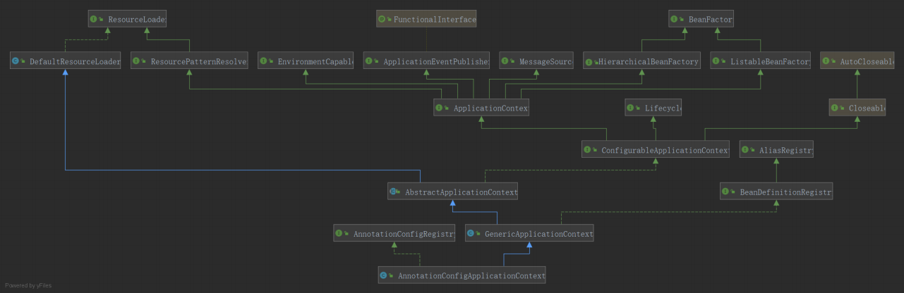

创建AnnotationConfigApplicationContext对象

```java
//根据参数类型可以知道，其实可以传入多个annotatedClasses，但是这种情况出现的比较少 
public AnnotationConfigApplicationContext(Class<?>... annotatedClasses) { 
    //调用无参构造函数，会先调用父类GenericApplicationContext的构造函数 
    //父类的构造函数里面就是初始化DefaultListableBeanFactory，并且赋值给beanFactory 
    //本类的构造函数里面，初始化了一个读取器：AnnotatedBeanDefinitionReader read，一个扫描器ClassPathBeanDefi nitionScanner scanner 
    //scanner的用处不是很大，它仅仅是在我们外部手动调用 .scan 等方法才有用，常规方式是不会用到scanner对象的 
    this(); 
    //把传入的类进行注册，这里有两个情况， 
    //传入传统的配置类 
    //传入bean（虽然一般没有人会这么做 
    //看到后面会知道spring把传统的带上@Configuration的配置类称之为FULL配置类，不带@Configuration的称之为Lite配 置类 
    //但是我们这里先把带上@Configuration的配置类称之为传统配置类，不带的称之为普通bean 
    register(annotatedClasses); 
    //刷新 
    refresh(); 
}
```

我们先来为构造方法做一个简单的说明： 

1. 这是一个有参的构造方法，可以接收多个配置类，不过一般情况下，只会传入一个配置类

2. 这个配置类有两种情况

   1. 一种是传统意义上的带上@Configuration注解的配置类，Spring内部称为Full配置类

   2. 一种是没有带上@Configuration，但是带有@Component，@Import，@ImportResouce，@Service，@ComponentScan等注解的配置类，在，Spring内部称为Lite配置类。

      在本源码分析中，有些地方也把Lite配置类称为**普通Bean**

使用断点调试，通过this()调用此类无参的构造方法，代码到下面：

```java
public class AnnotationConfigApplicationContext extends GenericApplicationContext implements AnnotationConfigRegistry { 
    //注解bean定义读取器，主要作用是用来读取被注解的了bean 
    private final AnnotatedBeanDefinitionReader reader; 
    //扫描器，它仅仅是在我们外部手动调用 .scan 等方法才有用，常规方式是不会用到scanner对象的 
    private final ClassPathBeanDefinitionScanner scanner; 
    /**
    * Create a new AnnotationConfigApplicationContext that needs to be populated 
    * through {@link #register} calls and then manually {@linkplain #refresh refreshed}. 
    */ 
    public AnnotationConfigApplicationContext() { 
        //会隐式调用父类的构造方法，初始化DefaultListableBeanFactory 
        //初始化一个Bean读取器 
        this.reader = new AnnotatedBeanDefinitionReader(this); 
        //初始化一个扫描器，它仅仅是在我们外部手动调用 .scan 等方法才有用，常规方式是不会用到scanner对象的 
        this.scanner = new ClassPathBeanDefinitionScanner(this); 
    } 
}
```

**AnnotationConfigApplicationContext类是有继承关系的，会隐式调用父类的构造方法：** 


### 2.实例化工厂：DefaultListableBeanFactory 

```java
public class GenericApplicationContext extends AbstractApplicationContext implements BeanDefinitionRegistry { 
    private final DefaultListableBeanFactory beanFactory; 
    @Nullable 
    private ResourceLoader resourceLoader; 
    private boolean customClassLoader = false; 
    private final AtomicBoolean refreshed = new AtomicBoolean(); 
    /** 
    * Create a new GenericApplicationContext. 
    * @see #registerBeanDefinition 
    * @see #refresh 
    */ 
    public GenericApplicationContext() { 
        this.beanFactory = new DefaultListableBeanFactory(); 
    } 
}
```

DefaultListableBeanFactory的关系图

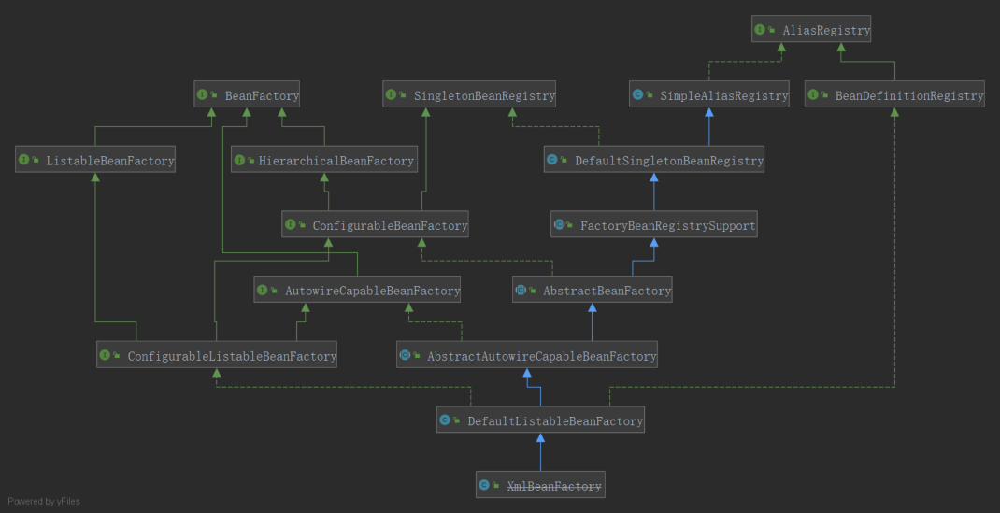

DefaultListableBeanFactory是相当重要的，从字面意思就可以看出它是一个Bean的工厂，什么是Bean的工厂？当然就是用来生产和获得Bean的

### 3.实例化建BeanDefinition读取器： AnnotatedBeanDefinitionReader

其主要做了2件事情 

1. 注册内置BeanPostProcessor
2. 注册相关的BeanDefinition 

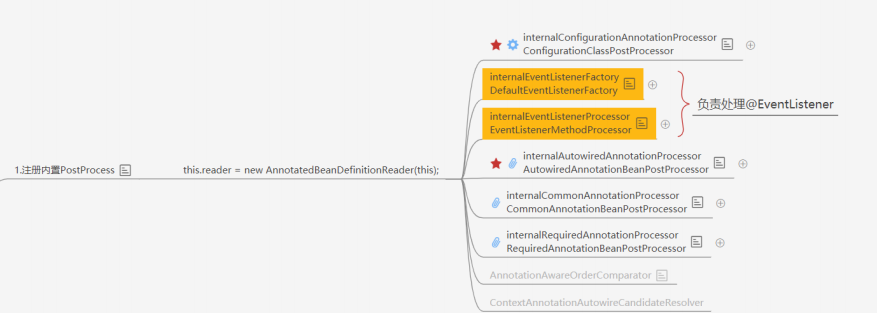

让我们把目光回到AnnotationConfigApplicationContext的无参构造方法，让我们看看Spring在初始化 AnnotatedBeanDefinitionReader的时候做了什么

```java
public AnnotatedBeanDefinitionReader(BeanDefinitionRegistry registry) { 
    // 这里的BeanDefinitionRegistry当然就是AnnotationConfigApplicationContext的实例了
    // 这里又直接调用了此类其他的构造方法
    this(registry, getOrCreateEnvironment(registry)); 
}
```

```java
public AnnotatedBeanDefinitionReader(BeanDefinitionRegistry registry, Environment environment) { 
    Assert.notNull(registry, "BeanDefinitionRegistry must not be null"); 
    Assert.notNull(environment, "Environment must not be null"); 
    this.registry = registry; 
    this.conditionEvaluator = new ConditionEvaluator(registry, environment, null); 
    // 进入registerAnnotationConfigProcessors方法
    AnnotationConfigUtils.registerAnnotationConfigProcessors(this.registry);
}
```

```java
public static void registerAnnotationConfigProcessors(BeanDefinitionRegistry registry) { 
    registerAnnotationConfigProcessors(registry, null); 
}
```

这又是一个门面方法，再点进去，这个方法的返回值Set，但是上游方法并没有去接收这个返回值，所以这个方法的返回值也不是很重要了，当然方法内部给这个返回值赋值也不重要了。由于这个方法内容比较多，这里就把最核心的贴出来，这个方法的核心就是注册Spring内置的多个Bean：

```java
Set<BeanDefinitionHolder> beanDefs = new LinkedHashSet<>(8);
// "org.springframework.context.annotation.internalConfigurationAnnotationProcessor"
if (!registry.containsBeanDefinition(CONFIGURATION_ANNOTATION_PROCESSOR_BEAN_NAME)) { 
    RootBeanDefinition def = new RootBeanDefinition(ConfigurationClassPostProcessor.class); 
    def.setSource(source); 
    beanDefs.add(registerPostProcessor(registry, def, CONFIGURATION_ANNOTATION_PROCESSOR_BEAN_NAME));  }

...
```

1. 判断容器中是否已经存在了ConfigurationClassPostProcessor Bean 
2. 如果不存在（当然这里肯定是不存在的），就通过RootBeanDefinition的构造方法获得 ConfigurationClassPostProcessor的BeanDefinition，RootBeanDefinition是BeanDefinition的子类
3. 执行registerPostProcessor方法，registerPostProcessor方法内部就是注册Bean，当然这里注册其他Bean也是一样的流程

### **BeanDefiniti**BeanDefinition是什么?

BeanDefinition联系图

**向上**

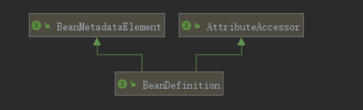

- **BeanMetadataElement接口**：BeanDefinition元数据，返回该Bean的来源 
- **AttributeAccessor接口**：提供对BeanDefinition属性操作能力

**向下**

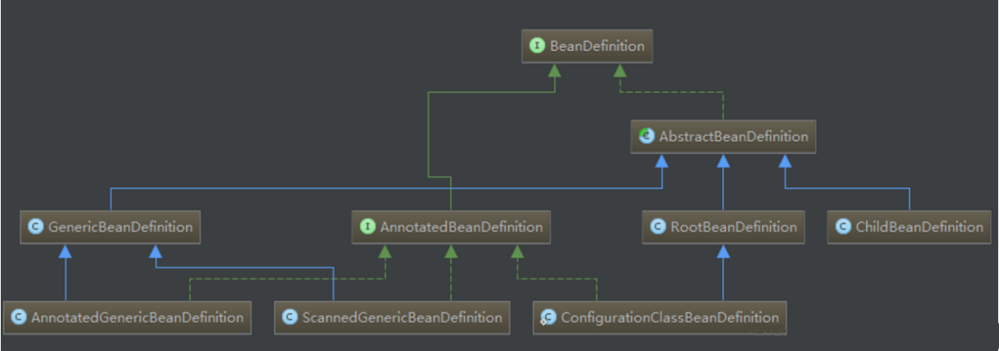

它是用来描述Bean的，里面存放着关于Bean的一系列信息，比如Bean的作用域，Bean所对应的Class，是否懒加载，是否Primary等等，这个BeanDefinition也相当重要，我们以后会常常和它打交道。

registerPostProcessor方法：

```java
private static BeanDefinitionHolder registerPostProcessor( 
    BeanDefinitionRegistry registry, RootBeanDefinition definition, String beanName) { 
    // 为BeanDefinition设置了一个Role，ROLE_INFRASTRUCTURE代表这是spring内部的，并非用户定义的
    definition.setRole(BeanDefinition.ROLE_INFRASTRUCTURE); 
    // 再点进去，你会发现它是一个接口，没办法直接点进去了
    // 首先要知道registry实现类是什么，是 DefaultListableBeanFactory
    registry.registerBeanDefinition(beanName, definition); 
    return new BeanDefinitionHolder(definition, beanName); 
}
```

DefaultListableBeanFactory：

```java
public void registerBeanDefinition(String beanName, BeanDefinition beanDefinition) throws BeanDefinitionStoreException {
     Assert.hasText(beanName, "Bean name must not be empty");
     Assert.notNull(beanDefinition, "BeanDefinition must not be null");
    
    ...
    //beanDefinitionMap是Map<String, BeanDefinition>， 
    //这里就是把beanName作为key，ScopedProxyMode作为value，推到map里面 
    this.beanDefinitionMap.put(beanName, beanDefinition); 
    
    ...
    //beanDefinitionNames就是一个List<String>,这里就是把beanName放到List中去 
    this.beanDefinitionNames.add(beanName);
}
```

从这里可以看出DefaultListableBeanFactory就是我们所说的容器了，里面放着beanDefinitionMap， beanDefinitionNames，beanDefinitionMap是一个hashMap，beanName作为Key,beanDefinition作为Value，beanDefinitionNames是一个集合，里面存放了beanName。打个断点，第一次运行到这里，监视这两个变量:

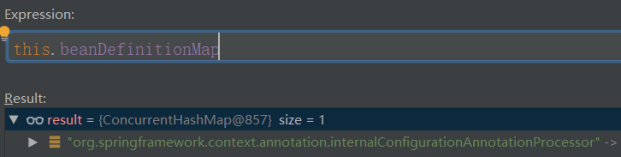


**DefaultListableBeanFactory中的beanDefinitionMap，beanDefinitionNames也是相当重要的，以后会经常看到它，最好看到它，第一时间就可以反应出它里面放了什么数据** 

这里仅仅是注册，可以简单的理解为把一些原料放入工厂，工厂还没有真正的去生产。 

上面已经介绍过，这里会一连串注册好几个Bean，在这其中最重要的一个Bean（没有之一）就是 BeanDefinitionRegistryPostProcessor

**ConfigurationClassPostProcessor实现BeanDefinitionRegistryPostProcessor接口，BeanDefinitionRegistryPostProcessor接口又扩展了BeanFactoryPostProcessor接口，BeanFactoryPostProcessor是Spring的扩展点之一，ConfigurationClassPostProcessor是Spring极为重要的一个类，必须牢牢的记住上面所说的这个类和它的继承关系**

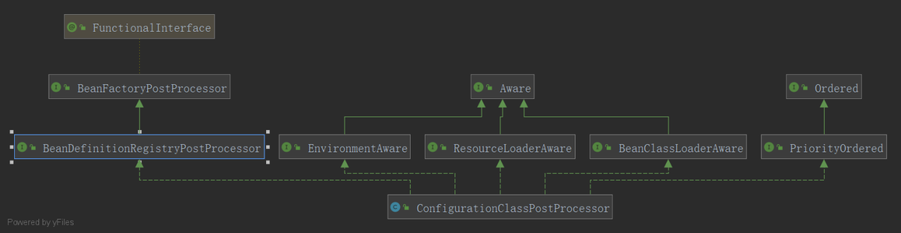

除了注册了ConfigurationClassPostProcessor，还注册了其他Bean，其他Bean也都实现了其他接口，比如BeanPostProcessor等。 

**BeanPostProcessor接口也是Spring的扩展点之一。** 

至此，实例化AnnotatedBeanDefinitionReader reader分析完毕


### 4.创建BeanDefinition扫描器:ClassPathBeanDefinitionScanner

由于常规使用方式是不会用到AnnotationConfigApplicationContext里面的scanner的，这里的scanner仅仅是为了程序员可以手动调用AnnotationConfigApplicationContext对象的scan方法。所以这里就不看scanner是如何被实例化的了


### 5.注册配置类为BeanDefinition： register(annotatedClasses)

把目光回到最开始，再分析第二行代码：

```java
register(annotatedClasses);
```

这里传进去的是一个数组，最终会循环调用如下方法：

```java
<T> void doRegisterBean(Class<T> annotatedClass, @Nullable Supplier<T> instanceSupplier, @Nullable St ring name,@Nullable Class<? extends Annotation>[] qualifiers, BeanDefinitionCustomizer... definitionCustomizers) { 
    //AnnotatedGenericBeanDefinition可以理解为一种数据结构，是用来描述Bean的，这里的作用就是把传入的标记了注解的类 
    //转为AnnotatedGenericBeanDefinition数据结构，里面有一个getMetadata方法，可以拿到类上的注解 
    AnnotatedGenericBeanDefinition abd = new AnnotatedGenericBeanDefinition(annotatedClass); 
    //判断是否需要跳过注解，spring中有一个@Condition注解，当不满足条件，这个bean就不会被解析 
    if (this.conditionEvaluator.shouldSkip(abd.getMetadata())) { 
        return; 
    } 
    abd.setInstanceSupplier(instanceSupplier); 
    //解析bean的作用域，如果没有设置的话，默认为单例 
    ScopeMetadata scopeMetadata = this.scopeMetadataResolver.resolveScopeMetadata(abd); 
    abd.setScope(scopeMetadata.getScopeName()); 
    //获得beanName
    String beanName = (name != null ? name : this.beanNameGenerator.generateBeanName(abd, this.registry)); 
    //解析通用注解，填充到AnnotatedGenericBeanDefinition，解析的注解为Lazy，Primary，DependsOn，Role，Description 
    AnnotationConfigUtils.processCommonDefinitionAnnotations(abd); 
    //限定符处理，不是特指@Qualifier注解，也有可能是Primary,或者是Lazy，或者是其他（理论上是任何注解，这里没有判断注解的有效性），如果我们在外面，以类似这种 
    //AnnotationConfigApplicationContext annotationConfigApplicationContext = new AnnotationConfigApplic ationContext(Appconfig.class);常规方式去初始化spring， 
    //qualifiers永远都是空的，包括上面的name和instanceSupplier都是同样的道理 
    //但是spring提供了其他方式去注册bean，就可能会传入了
    if (qualifiers != null) { 
        //可以传入qualifier数组，所以需要循环处理 
        for (Class<? extends Annotation> qualifier : qualifiers) { 
            //Primary注解优先 
            if (Primary.class == qualifier) { 
                abd.setPrimary(true); 
            } 
            //Lazy注解 
            else if (Lazy.class == qualifier) { 
                abd.setLazyInit(true); 
            } 
            //其他，AnnotatedGenericBeanDefinition有个Map<String,AutowireCandidateQualifier>属性，直接push进去 
            else { 
                abd.addQualifier(new AutowireCandidateQualifier(qualifier)); 
            } 
        } 
    } 
    for (BeanDefinitionCustomizer customizer : definitionCustomizers) { 
        customizer.customize(abd); 
    } 
    //这个方法用处不大，就是把AnnotatedGenericBeanDefinition数据结构和beanName封装到一个对象中 
    BeanDefinitionHolder definitionHolder = new BeanDefinitionHolder(abd, beanName); 
    definitionHolder = AnnotationConfigUtils.applyScopedProxyMode(scopeMetadata, definitionHolder, this.registry); 
    //注册，最终会调用DefaultListableBeanFactory中的registerBeanDefinition方法去注册， 
    //DefaultListableBeanFactory维护着一系列信息，比如beanDefinitionNames，beanDefinitionMap 
    //beanDefinitionNames是一个List<String>,用来保存beanName 
    //beanDefinitionMap是一个Map,用来保存beanName和beanDefinition 
    BeanDefinitionReaderUtils.registerBeanDefinition(definitionHolder, this.registry); 
}
```

在这里又要说明下，以常规方式去注册配置类，此方法中除了第一个参数，其他参数都是默认值。 

1. 通过AnnotatedGenericBeanDefinition的构造方法，获得配置类的BeanDefinition，这里是不是似曾相似，在注册ConfigurationClassPostProcessor类的时候，也是通过构造方法去获得BeanDefinition的，只不过当时是通过RootBeanDefinition去获得，现在是通过AnnotatedGenericBeanDefinition去获得
2. 判断需不需要跳过注册，Spring中有一个@Condition注解，如果不满足条件，就会跳过这个类的注册
3. 然后是解析作用域，如果没有设置的话，默认为单例
4. 获得BeanName
5. 解析通用注解，填充到AnnotatedGenericBeanDefinition，解析的注解为Lazy，Primary，DependsOn，Role，Description
6. 限定符处理，不是特指@Qualifier注解，也有可能是Primary，或者是Lazy，或者是其他（理论上是任何注解，这里没有判断注解的有效性）
7. 把AnnotatedGenericBeanDefinition数据结构和beanName封装到一个对象中（这个不是很重要，可以简单的理解为方便传参）
8. 注册，最终会调用DefaultListableBeanFactory中的registerBeanDefinition方法去注册：

```java
public static void registerBeanDefinition(
    BeanDefinitionHolder definitionHolder, BeanDefinitionRegistry registry)
    throws BeanDefinitionStoreException { 
    //获取beanName 
    // Register bean definition under primary name. 
    String beanName = definitionHolder.getBeanName(); 
    //注册bean 
    registry.registerBeanDefinition(beanName, definitionHolder.getBeanDefinition()); 
    //Spring支持别名 
    // Register aliases for bean name, if any. 
    String[] aliases = definitionHolder.getAliases(); 
    if (aliases != null) { 
        for (String alias : aliases) { 
            registry.registerAlias(beanName, alias); 
        } 
    } 
}
```

这个registerBeanDefinition是不是又有一种似曾相似的感觉，没错，在上面注册Spring内置的Bean的时候，已经解析过这个方法了，这里就不重复了，此时，让我们再观察下beanDefinitionMap和beanDefinitionNames两个变量，除了Spring内置的Bean，还有我们传进来的Bean，这里的Bean当然就是我们的配置类了：

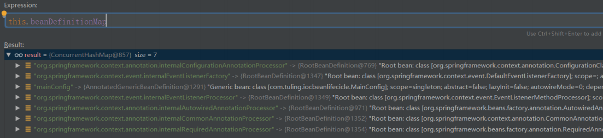

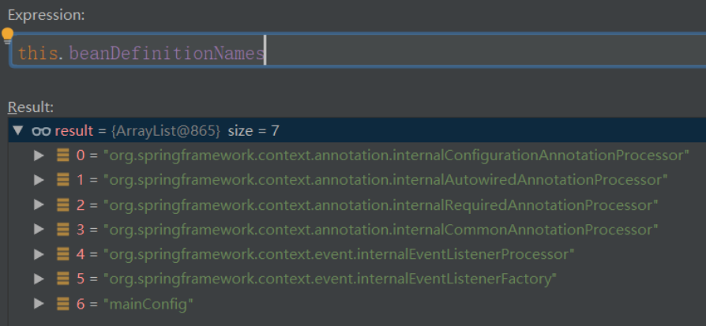

到这里注册配置类也分析完毕了

### 6. refresh

大家可以看到其实到这里，Spring还没有进行扫描，只是实例化了一个工厂，注册了一些内置的Bean和我们传进去的配置类，真正的大头是在第三行代码： 

```java
refresh();
```

这个方法做了很多事情，让我们点开这个方法：

```java
public void refresh() throws BeansException, IllegalStateException { 
    synchronized (this.startupShutdownMonitor) { 
        // Prepare this context for refreshing. 
        //刷新预处理，和主流程关系不大，就是保存了容器的启动时间，启动标志等 
        prepareRefresh(); 
        //DefaultListableBeanFactory 
        // Tell the subclass to refresh the internal bean factory. 
        //和主流程关系也不大，最终获得了DefaultListableBeanFactory， 
        // DefaultListableBeanFactory实现了ConfigurableListableBeanFactory 
        ConfigurableListableBeanFactory beanFactory = obtainFreshBeanFactory(); 
        // Prepare the bean factory for use in this context. 
        //还是一些准备工作，添加了两个后置处理器：ApplicationContextAwareProcessor，ApplicationListenerDetector 
        //还设置了 忽略自动装配 和 允许自动装配 的接口,如果不存在某个bean的时候，spring就自动注册singleton bean 
        //还设置了bean表达式解析器 等 
        prepareBeanFactory(beanFactory); 
        try { 
            // Allows post‐processing of the bean factory in context subclasses. 
            //这是一个空方法 
            postProcessBeanFactory(beanFactory); 
            // Invoke factory processors registered as beans in the context. 
            //执行自定义的BeanFactoryProcessor和内置的BeanFactoryProcessor 
            invokeBeanFactoryPostProcessors(beanFactory); 
            // Register bean processors that intercept bean creation. 
            // 注册BeanPostProcessor
            registerBeanPostProcessors(beanFactory); 
            // Initialize message source for this context. 
            initMessageSource(); 
            // Initialize event multicaster for this context. 
            initApplicationEventMulticaster(); 
            // Initialize other special beans in specific context subclasses. 
            // 空方法 
            onRefresh(); 
            // Check for listener beans and register them. 
            registerListeners(); 
            // Instantiate all remaining (non‐lazy‐init) singletons. 
            finishBeanFactoryInitialization(beanFactory); 
            // Last step: publish corresponding event. 
            finishRefresh(); 
        } 
        catch (BeansException ex) { 
            if (logger.isWarnEnabled()) { 
                logger.warn("Exception encountered during context initialization ‐ " + 
                            "cancelling refresh attempt: " + ex); 
            } 
            // Destroy already created singletons to avoid dangling resources. 
            destroyBeans(); 
            // Reset 'active' flag. 
            cancelRefresh(ex); 
            // Propagate exception to caller. 
            throw ex; 
        } 
        finally { 
            // Reset common introspection caches in Spring's core, since we 
            // might not ever need metadata for singleton beans anymore... 
            resetCommonCaches(); 
        } 
    } 
}
```

### 6.1 prepareRefresh

从命名来看，就知道这个方法主要做了一些刷新前的准备工作，和主流程关系不大，主要是保存了容器的启动时间，启动标志等

### 6.2 ConfigurableListableBeanFactory beanFactory = obtainFreshBeanFactory()

这个方法和主流程关系也不是很大，可以简单的认为，就是把beanFactory取出来而已。XML模式下会在这里读取BeanDefinition

### 6.3 prepareBeanFactory

```java
//还是一些准备工作，添加了两个后置处理器：ApplicationContextAwareProcessor，ApplicationListenerDetector 
//还设置了 忽略自动装配 和 允许自动装配 的接口,如果不存在某个bean的时候，spring就自动注册singleton bean
//还设置了bean表达式解析器 等 
prepareBeanFactory(beanFactory);
```


这代码相比前面两个就比较重要了：

```java
protected void prepareBeanFactory(ConfigurableListableBeanFactory beanFactory) { 
    // Tell the internal bean factory to use the context's class loader etc. 
    beanFactory.setBeanClassLoader(getClassLoader());//设置类加载器 
    //设置bean表达式解析器 
    beanFactory.setBeanExpressionResolver(new StandardBeanExpressionResolver(beanFactory.getBeanClassLoad er())); 
    //属性编辑器支持 
    beanFactory.addPropertyEditorRegistrar(new ResourceEditorRegistrar(this, getEnvironment())); 
    // Configure the bean factory with context callbacks. 
    //添加一个后置处理器：ApplicationContextAwareProcessor，此后置处理处理器实现了BeanPostProcessor接口 
    beanFactory.addBeanPostProcessor(new ApplicationContextAwareProcessor(this)); 
    //以下接口，忽略自动装配 
    beanFactory.ignoreDependencyInterface(EnvironmentAware.class); 
    beanFactory.ignoreDependencyInterface(EmbeddedValueResolverAware.class); 
    beanFactory.ignoreDependencyInterface(ResourceLoaderAware.class); 
    beanFactory.ignoreDependencyInterface(ApplicationEventPublisherAware.class); 
    beanFactory.ignoreDependencyInterface(MessageSourceAware.class); 
    beanFactory.ignoreDependencyInterface(ApplicationContextAware.class); 
    // BeanFactory interface not registered as resolvable type in a plain factory. 
    // MessageSource registered (and found for autowiring) as a bean. 
    //以下接口，允许自动装配,第一个参数是自动装配的类型，，第二个字段是自动装配的值 
    beanFactory.registerResolvableDependency(BeanFactory.class, beanFactory); 
    beanFactory.registerResolvableDependency(ResourceLoader.class, this); 
    beanFactory.registerResolvableDependency(ApplicationEventPublisher.class, this); 
    beanFactory.registerResolvableDependency(ApplicationContext.class, this); 
    // Register early post‐processor for detecting inner beans as ApplicationListeners. 
    //添加一个后置处理器：ApplicationListenerDetector，此后置处理器实现了BeanPostProcessor接口 
    beanFactory.addBeanPostProcessor(new ApplicationListenerDetector(this)); 
    // Detect a LoadTimeWeaver and prepare for weaving, if found. 
    if (beanFactory.containsBean(LOAD_TIME_WEAVER_BEAN_NAME)) { 
        beanFactory.addBeanPostProcessor(new LoadTimeWeaverAwareProcessor(beanFactory)); 
        // Set a temporary ClassLoader for type matching. 
        beanFactory.setTempClassLoader(new ContextTypeMatchClassLoader(beanFactory.getBeanClassLoader())); 
    } 
    //如果没有注册过bean名称为XXX，spring就自己创建一个名称为XXX的singleton bean 
    //Register default environment beans. 
    if (!beanFactory.containsLocalBean(ENVIRONMENT_BEAN_NAME)) { 
        beanFactory.registerSingleton(ENVIRONMENT_BEAN_NAME, getEnvironment()); 
    } 
    if (!beanFactory.containsLocalBean(SYSTEM_PROPERTIES_BEAN_NAME)) { 
        beanFactory.registerSingleton(SYSTEM_PROPERTIES_BEAN_NAME, getEnvironment().getSystemProperties()); 
    } 
    if (!beanFactory.containsLocalBean(SYSTEM_ENVIRONMENT_BEAN_NAME)) { 
        beanFactory.registerSingleton(SYSTEM_ENVIRONMENT_BEAN_NAME, getEnvironment().getSystemEnvironment()); 
    } 
}
```

主要做了如下的操作： 

1. 设置了一个类加载器 
2. 设置了bean表达式解析器 
3. 添加了属性编辑器的支持 
4. 添加了一个后置处理器：ApplicationContextAwareProcessor，此后置处理器实现了BeanPostProcessor接口 
5. 设置了一些忽略自动装配的接口 
6. 设置了一些允许自动装配的接口，并且进行了赋值操作 
7. 在容器中还没有XX的bean的时候，帮我们注册beanName为XX的singleton bean

### 6.4 postProcessBeanFactory(beanFactory)

```java
//这是一个空方法，在其他框架中会被重写
postProcessBeanFactory(beanFactory);
```

### [6.5-invokeBeanFactoryPostProcessors(beanFactory)](invokeBeanFactoryPostProcessors.md)

### 6.6-registerBeanPostProcessors(beanFactory)

实例化和注册beanFactory中扩展了BeanPostProcessor的bean

例如:

- AutowiredAnnotationBeanPostProcessor(处理被@Autowired注解修饰的bean并注入) 
- RequiredAnnotationBeanPostProcessor(处理被@Required注解修饰的方法) 
- CommonAnnotationBeanPostProcessor(处理@PreDestroy、@PostConstruct、@Resource等多个注解的作用)等


### 6.7-initMessageSource()

// 初始化国际化资源处理器. 不是主线代码忽略，没什么学习价值。 

initMessageSource();

### 6.8-initApplicationEventMulticaster()

// 创建事件多播器 

事件相关会单独讲解：Spring事件监听机制

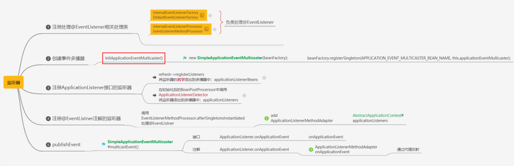

### 6.9-onRefresh()

模板方法，在容器刷新的时候可以自定义逻辑，不同的Spring容器做不同的事情

### 6.10-registerListeners()

注册监听器，广播early application events 

事件相关会单独讲解：Spring事件监听机制

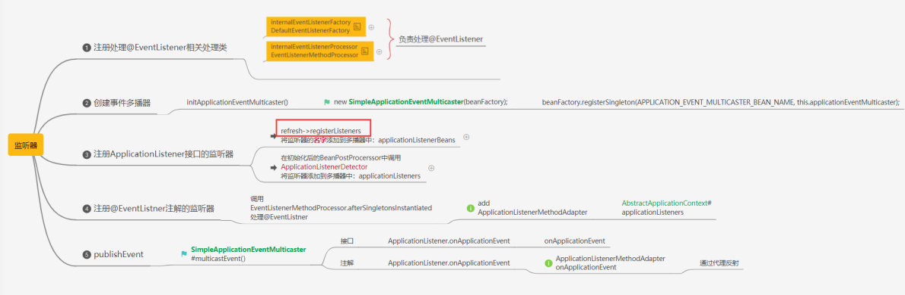

### 6-11-finishBeanFactoryInitialization(beanFactory)

实例化所有剩余的（非懒加载）单例 

比如invokeBeanFactoryPostProcessors方法中根据各种注解解析出来的类，在这个时候都会被初始化。 

实例化的过程各种BeanPostProcessor开始起作用。 

这个方法是用来实例化懒加载单例Bean的，也就是我们的Bean都是在这里被创建出来的（当然我这里说的的是绝大部分情况是这样的）： 

```java
finishBeanFactoryInitialization(beanFactory);
```

我们再进入finishBeanFactoryInitialization这方法，里面有一个beanFactory.preInstantiateSingletons() 方法：

```java
//初始化所有的非懒加载单例
beanFactory.preInstantiateSingletons();
```

我们尝试再点进去，这个时候你会发现这是一个接口，好在它只有一个实现类，所以可以我们来到了他的唯一实现，实现类就是org.springframework.beans.factory.support.DefaultListableBeanFactory，这里面是一个循环，我们的Bean就是循环被创建出来的，我们找到其中的getBean方法：

```java
getBean(beanName);
```

这里有一个分支，如果Bean是FactoryBean，如何如何，如果Bean不是FactoryBean如何如何，好在不管 是不是FactoryBean，最终还是会调用getBean方法，所以我们可以毫不犹豫的点进去，点进去之后，你会发现，这是一个门面方法，直接调用了doGetBean方法

```java
return doGetBean(name, null, null, false);
```

再进去，不断的深入，接近我们要寻找的东西。 

这里面的比较复杂，但是有我在，我可以直接告诉你，下一步我们要进入哪里，我们要进入

```java
if (mbd.isSingleton()) { 
    //getSingleton中的第二个参数类型是ObjectFactory<?>，是一个函数式接口，不会立刻执行，而是在 
    //getSingleton方法中，调用ObjectFactory的getObject，才会执行createBean 
    sharedInstance = getSingleton(beanName, () ‐> { 
        try { 
            return createBean(beanName, mbd, args); 
        } 
        catch (BeansException ex) { 
            destroySingleton(beanName); 
            throw ex; 
        } 
    }); 
    bean = getObjectForBeanInstance(sharedInstance, name, beanName, mbd); 
}
```

这里面的createBean方法，再点进去啊，但是又点不进去了，这是接口啊，但是别慌，这个接口又只有一个实现类，所以说没事，就是干，这个实现类为 org.springframework.beans.factory.support.AbstractAutowireCapableBeanFactory。 这个实现的方法里面又做了很多事情，我们就不去看了，我就是带着大家找到那几个生命周期的回调到底定义在哪里就OK了

```java
Object beanInstance = doCreateBean(beanName, mbdToUse, args);//创建bean，核心 
if (logger.isDebugEnabled()) { 
    logger.debug("Finished creating instance of bean '" + beanName + "'"); 
} 
return beanInstance;
```

再继续深入doCreateBean方法，这个方法又做了一堆一堆的事情，但是值得开心的事情就是 我们已经找到了我们要寻找的东西了

**创建实例** 

首先是创建实例，位于：

```java
instanceWrapper = createBeanInstance(beanName, mbd, args);//创建bean的实例。核心
```

这个方法在解析bean的有参构造函数的时候很复杂，具体可以看这个视频：[从44分钟开始](https://ke.qq.com/webcourse/index.html#cid=398381&term_id=102978903&taid=10081855907173421&type=1024&vid=5285890811411657963)

```java
protected BeanWrapper createBeanInstance(String beanName, RootBeanDefinition mbd, @Nullable Object[] args) {
	// Make sure bean class is actually resolved at this point.
	Class<?> beanClass = resolveBeanClass(mbd, beanName);
	if (beanClass != null && !Modifier.isPublic(beanClass.getModifiers()) && !mbd.isNonPublicAccessAllowed()) {
		throw new BeanCreationException(mbd.getResourceDescription(), beanName,
				"Bean class isn't public, and non-public access not allowed: " + beanClass.getName());
	}
	// 通过实现BeanFactoryPostProcessor接口，然后在方法里面获取到bean定义，设置supplier属性
	// 实际效果类似FactoryBean
	Supplier<?> instanceSupplier = mbd.getInstanceSupplier();
	if (instanceSupplier != null) {
		return obtainFromSupplier(instanceSupplier, beanName);
	}
	// 工厂方法： bean标签里面的factory-method，实现了静态工厂和实例工厂，实际上很少用
	// 里面包含了如何解析泪的方法的反射代码，比如重载方法如何获取，静态方法如何调用，实例方法如何调用等
	if (mbd.getFactoryMethodName() != null) {
		return instantiateUsingFactoryMethod(beanName, mbd, args);
	}
	// Shortcut when re-creating the same bean...
	// 原型bean创建构造器缓存，由于原型bean在创建时需要解析找到合适的构造函数，为了避免每次解析的性能消耗，这里做了个缓存
	boolean resolved = false;
	boolean autowireNecessary = false;
	if (args == null) {
		synchronized (mbd.constructorArgumentLock) {
			if (mbd.resolvedConstructorOrFactoryMethod != null) {
				resolved = true;
				autowireNecessary = mbd.constructorArgumentsResolved;
			}
		}
	}
	if (resolved) {
		if (autowireNecessary) {
			return autowireConstructor(beanName, mbd, null, null);
		}
		else {
			return instantiateBean(beanName, mbd);
		}
	}
	// Candidate constructors for autowiring?
	// 以下情况符合其一即可进入
	// 1.存在可选的构造方法
	// 2.自动装配模型为构造函数自动装配
	// 3.给BeanDefinition中设置了构造参数值
	// 4.有参与构造函数参数列表的参数
	Constructor<?>[] ctors = determineConstructorsFromBeanPostProcessors(beanClass, beanName);
	if (ctors != null || mbd.getResolvedAutowireMode() == AUTOWIRE_CONSTRUCTOR ||
			mbd.hasConstructorArgumentValues() || !ObjectUtils.isEmpty(args)) {
		return autowireConstructor(beanName, mbd, ctors, args);
	}
	// Preferred constructors for default construction?
	// 找出最合适的默认构造方法
	ctors = mbd.getPreferredConstructors();
	if (ctors != null) {
		return autowireConstructor(beanName, mbd, ctors, null);
	}
	// No special handling: simply use no-arg constructor.
	// 使用默认无参构造函数创建对象
	return instantiateBean(beanName, mbd);
}
```

**填充属性** 

其次是填充属性，位于：

```java
populateBean(beanName, mbd, instanceWrapper);//填充属性，炒鸡重要
```

在填充属性下面有一行代码：初始化bean

```java
exposedObject = initializeBean(beanName, exposedObject, mbd);
```

继续深入进去initializeBean方法。 

**aware系列接口的回调** 

aware系列接口的回调位于initializeBean中的invokeAwareMethods方法：

```java
invokeAwareMethods(beanName, bean); 
private void invokeAwareMethods(final String beanName, final Object bean) { 
    if (bean instanceof Aware) {
        if (bean instanceof BeanNameAware) { 
            ((BeanNameAware) bean).setBeanName(beanName);
        }
        if (bean instanceof BeanClassLoaderAware) {
            ClassLoader bcl = getBeanClassLoader(); 
            if (bcl != null) { 
                ((BeanClassLoaderAware) bean).setBeanClassLoader(bcl); 
            } 
        } 
        if (bean instanceof BeanFactoryAware) { 
            ((BeanFactoryAware) bean).setBeanFactory(AbstractAutowireCapableBeanFactory.this); 
        } 
    } 
}
```

**BeanPostProcessor的postProcessBeforeInitialization方法** 

BeanPostProcessor的postProcessBeforeInitialization方法位于initializeBean的

```java
if (mbd == null || !mbd.isSynthetic()) { 
    wrappedBean = applyBeanPostProcessorsBeforeInitialization(wrappedBean, beanName); 
} 

@Override
public Object applyBeanPostProcessorsBeforeInitialization(Object existingBean, String beanName) 
    throws BeansException { 
    Object result = existingBean; 
    for (BeanPostProcessor processor : getBeanPostProcessors()) { 
        Object current = processor.postProcessBeforeInitialization(result, beanName); 
        if (current == null) {
            return result; 
        } 
        result = current; 
    } 
    return result; 
}
```

**afterPropertiesSet init-method** 

afterPropertiesSet init-method位于initializeBean中的 

```java
invokeInitMethods(beanName, wrappedBean, mbd);
```

这里面调用了两个方法，一个是afterPropertiesSet方法，一个是init-method方法：

```java
((InitializingBean) bean).afterPropertiesSet(); 
invokeCustomInitMethod(beanName, bean, mbd);
```

**BeanPostProcessor的postProcessAfterInitialization方法** 

BeanPostProcessor的postProcessAfterInitialization方法位于initializeBean的

```java
if (mbd == null || !mbd.isSynthetic()) { 
    wrappedBean = applyBeanPostProcessorsAfterInitialization(wrappedBean, beanName); 
} 

public Object applyBeanPostProcessorsAfterInitialization(Object existingBean, String beanName) 
    throws BeansException { 
    Object result = existingBean; 
    for (BeanPostProcessor processor : getBeanPostProcessors()) { 
        Object current = processor.postProcessAfterI nitialization(result, beanName); 
        if (current == null) { 
            return result; 
        } 
        result = current; 
    } 
    return result; 
}
```

当然在实际的开发中，应该没人会去销毁Spring的应用上下文把，所以剩余的两个销毁的回调就不去找了

**Spring Bean的生命周期** 

Spring In Action以及市面上流传的大部分博客是这样的： 

1. 实例化Bean对象，这个时候Bean的对象是非常低级的，基本不能够被我们使用，因为连最基本的属性都没有设置，可以理解为连Autowired注解都是没有解析的； 
2. 填充属性，当做完这一步，Bean对象基本是完整的了，可以理解为Autowired注解已经解析完毕，依赖注入完成了； 
3. 如果Bean实现了BeanNameAware接口，则调用setBeanName方法； 
4. 如果Bean实现了BeanClassLoaderAware接口，则调用setBeanClassLoader方法； 
5.  如果Bean实现了BeanFactoryAware接口，则调用setBeanFactory方法； 
6. 调用BeanPostProcessor的postProcessBeforeInitialization方法； 
7. 如果Bean实现了InitializingBean接口，调用afterPropertiesSet方法； 
8. 如果Bean定义了init-method方法，则调用Bean的init-method方法； 
9.  调用BeanPostProcessor的postProcessAfterInitialization方法；当进行到这一步，Bean已经被准备就绪了，一直停留在应用的上下文中，直到被销毁； 
10. 如果应用的上下文被销毁了，如果Bean实现了DisposableBean接口，则调用destroy方法，如果Bean定义了destory-method声明了销毁方法也会被调用

### 6-12-finishRefresh()

refresh做完之后需要做的其他事情。 

清除上下文资源缓存（如扫描中的ASM元数据） 

初始化上下文的生命周期处理器，并刷新（找出Spring容器中实现了Lifecycle接口的bean并执行start()方法）。 

发布ContextRefreshedEvent事件告知对应的ApplicationListener进行响应的操作

```java
protected void finishRefresh() {
    // Initialize lifecycle processor for this context. 
    // 1.为此上下文初始化生命周期处理器 
    initLifecycleProcessor(); 
    // Propagate refresh to lifecycle processor first.
    // 2.首先将刷新完毕事件传播到生命周期处理器（触发isAutoStartup方法返回true的SmartLifecycle的start方法） 
    getLifecycleProcessor().onRefresh(); 
    // Publish the final event. 
    // 3.推送上下文刷新完毕事件到相应的监听器 
    publishEvent(new ContextRefreshedEvent(this)); 
    // Participate in LiveBeansView MBean, if active. 
    LiveBeansView.registerApplicationContext(this);
```

这里单独介绍下publishEvent

```java
@Override 
public void publishEvent(ApplicationEvent event) { 
    publishEvent(event, null); 
} 
protected void publishEvent(Object event, ResolvableType eventType) { 
    Assert.notNull(event, "Event must not be null"); 
    if (logger.isTraceEnabled()) { 
        logger.trace("Publishing event in " + getDisplayName() + ": " + event); 
    } 
    // Decorate event as an ApplicationEvent if necessary 
    // 1.如有必要，将事件装饰为ApplicationEvent 
    ApplicationEvent applicationEvent; 
    if (event instanceof ApplicationEvent) { 
        applicationEvent = (ApplicationEvent) event; 
    } else { 
        applicationEvent = new PayloadApplicationEvent<Object>(this, event); 
        if (eventType == null) { 
            eventType = ((PayloadApplicationEvent) applicationEvent).getResolvableType(); 
        } 
    } 
    // Multicast right now if possible ‐ or lazily once the multicaster is initialized 
    if (this.earlyApplicationEvents != null) { 
        this.earlyApplicationEvents.add(applicationEvent); 
    } else { 
        // 2.使用事件广播器广播事件到相应的监听器 
        getApplicationEventMulticaster().multicastEvent(applicationEvent, eventType); 
    } 
    // Publish event via parent context as well... 
    // 3.同样的，通过parent发布事件...... 
    if (this.parent != null) { 
        if (this.parent instanceof AbstractApplicationContext) { 
            ((AbstractApplicationContext) this.parent).publishEvent(event, eventType); 
        } else {
            this.parent.publishEvent(event); 
        } 
    } 
}
```

2.使用事件广播器广播事件到相应的监听器**multicastEvent**

```java
@Override 
public void multicastEvent(final ApplicationEvent event, ResolvableType eventType) { 
    ResolvableType type = (eventType != null ? eventType : resolveDefaultEventType(event)); 
    // 1.getApplicationListeners：返回与给定事件类型匹配的应用监听器集合 
    for (final ApplicationListener<?> listener : getApplicationListeners(event, type)) { 
        // 2.返回此广播器的当前任务执行程序 
        Executor executor = getTaskExecutor(); 
        if (executor != null) {
            executor.execute(new Runnable() { 
                @Override 
                public void run() { 
                    // 3.1 executor不为null，则使用executor调用监听器 
                    invokeListener(listener, event); 
                } 
            }); 
        } else { 
            // 3.2 否则，直接调用监听器 
            invokeListener(listener, event); 
        } 
    } 
}
```

3调用监听器**invokeListener**

```java
protected void invokeListener(ApplicationListener<?> listener, ApplicationEvent event) { 
    // 1.返回此广播器的当前错误处理程序 
    ErrorHandler errorHandler = getErrorHandler(); 
    if (errorHandler != null) { 
        try { 
            // 2.1 如果errorHandler不为null，则使用带错误处理的方式调用给定的监听器 
            doInvokeListener(listener, event); 
        } catch (Throwable err) { 
            errorHandler.handleError(err); 
        } 
    } else { 
        // 2.2 否则，直接调用调用给定的监听器 
        doInvokeListener(listener, event); 
    } 
} 
private void doInvokeListener(ApplicationListener listener, ApplicationEvent event) { 
    try { 
        // 触发监听器的onApplicationEvent方法，参数为给定的事件 
        listener.onApplicationEvent(event); 
    } catch (ClassCastException ex) { 
        String msg = ex.getMessage(); 
        if (msg == null || msg.startsWith(event.getClass().getName())) { 
            // Possibly a lambda‐defined listener which we could not resolve the generic event type for 
            Log logger = LogFactory.getLog(getClass());
            if (logger.isDebugEnabled()) { 
                logger.debug("Non‐matching event type for listener: " + listener, ex); 
            } 
        } else { 
            throw ex; 
        } 
    } 
}
```

这样，当 Spring 执行到 finishRefresh 方法时，就会将 ContextRefreshedEvent 事件推送到MyRefreshedListener 中。 

跟 ContextRefreshedEvent 相似的还有：ContextStartedEvent、ContextClosedEvent、 ContextStoppedEvent，有兴趣的可以自己看看这几个事件的使用场景。 

当然，我们也可以自定义监听事件，只需要继承 ApplicationContextEvent 抽象类即可