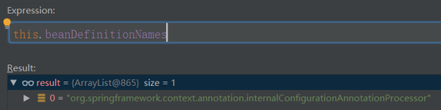

Spring 最重要的概念是 IOC 和 AOP，其中IOC又是Spring中的根基：


本文要说的 IOC 总体来说有两处地方最重要，一个是创建 Bean 容器，一个是初始化 Bean

**Demo**

配置类 MainConfig.java： 

```java
@Configuration 
@ComponentScan(basePackages = {"com.tuling.iocbeanlifecicle"}) 
public class MainConfig { 
}
```

Bean Car.java：

```java
@Component
public class Car { 
    private String name; 
    @Autowired 
    private Tank tank; 
    public void setTank(Tank tank) { 
        this.tank = tank; 
    } 
    public Tank getTank() {
        return tank; 
    }
    public String getName() { 
        return name; 
    } 
    public void setName(String name) {
        this.name = name; 
    } 
    public Car() { 
        System.out.println("car加载...."); 
    } 
}
```

Bean MainStart.java： 

```java
public static void main(String[] args) { 
    // 加载spring上下文 
    AnnotationConfigApplicationContext context = new AnnotationConfigApplicationContext(MainConfig.class); 
    Car car = context.getBean("car",Car.class); 
    System.out.println(car.getName()); 
}
```

## Spring IoC容器的加载过程

### 1.实例化容器：AnnotationConfigApplicationContext

AnnotationConfigApplicationContext的结构关系


创建AnnotationConfigApplicationContext对象

```java
//根据参数类型可以知道，其实可以传入多个annotatedClasses，但是这种情况出现的比较少 
public AnnotationConfigApplicationContext(Class<?>... annotatedClasses) { 
    //调用无参构造函数，会先调用父类GenericApplicationContext的构造函数 
    //父类的构造函数里面就是初始化DefaultListableBeanFactory，并且赋值给beanFactory 
    //本类的构造函数里面，初始化了一个读取器：AnnotatedBeanDefinitionReader read，一个扫描器ClassPathBeanDefi nitionScanner scanner 
    //scanner的用处不是很大，它仅仅是在我们外部手动调用 .scan 等方法才有用，常规方式是不会用到scanner对象的 
    this(); 
    //把传入的类进行注册，这里有两个情况， 
    //传入传统的配置类 
    //传入bean（虽然一般没有人会这么做 
    //看到后面会知道spring把传统的带上@Configuration的配置类称之为FULL配置类，不带@Configuration的称之为Lite配 置类 
    //但是我们这里先把带上@Configuration的配置类称之为传统配置类，不带的称之为普通bean 
    register(annotatedClasses); 
    //刷新 
    refresh(); 
}
```

我们先来为构造方法做一个简单的说明： 

1. 这是一个有参的构造方法，可以接收多个配置类，不过一般情况下，只会传入一个配置类

2. 这个配置类有两种情况

   1. 一种是传统意义上的带上@Configuration注解的配置类，Spring内部称为Full配置类

   2. 一种是没有带上@Configuration，但是带有@Component，@Import，@ImportResouce，@Service，@ComponentScan等注解的配置类，在，Spring内部称为Lite配置类。

      在本源码分析中，有些地方也把Lite配置类称为**普通Bean**

使用断点调试，通过this()调用此类无参的构造方法，代码到下面：

```java
public class AnnotationConfigApplicationContext extends GenericApplicationContext implements AnnotationConfigRegistry { 
    //注解bean定义读取器，主要作用是用来读取被注解的了bean 
    private final AnnotatedBeanDefinitionReader reader; 
    //扫描器，它仅仅是在我们外部手动调用 .scan 等方法才有用，常规方式是不会用到scanner对象的 
    private final ClassPathBeanDefinitionScanner scanner; 
    /**
    * Create a new AnnotationConfigApplicationContext that needs to be populated 
    * through {@link #register} calls and then manually {@linkplain #refresh refreshed}. 
    */ 
    public AnnotationConfigApplicationContext() { 
        //会隐式调用父类的构造方法，初始化DefaultListableBeanFactory 
        //初始化一个Bean读取器 
        this.reader = new AnnotatedBeanDefinitionReader(this); 
        //初始化一个扫描器，它仅仅是在我们外部手动调用 .scan 等方法才有用，常规方式是不会用到scanner对象的 
        this.scanner = new ClassPathBeanDefinitionScanner(this); 
    } 
}
```

**AnnotationConfigApplicationContext类是有继承关系的，会隐式调用父类的构造方法：** 


### 2.实例化工厂：DefaultListableBeanFactory 

```java
public class GenericApplicationContext extends AbstractApplicationContext implements BeanDefinitionRegistry { 
    private final DefaultListableBeanFactory beanFactory; 
    @Nullable 
    private ResourceLoader resourceLoader; 
    private boolean customClassLoader = false; 
    private final AtomicBoolean refreshed = new AtomicBoolean(); 
    /** 
    * Create a new GenericApplicationContext. 
    * @see #registerBeanDefinition 
    * @see #refresh 
    */ 
    public GenericApplicationContext() { 
        this.beanFactory = new DefaultListableBeanFactory(); 
    } 
}
```

DefaultListableBeanFactory的关系图


DefaultListableBeanFactory是相当重要的，从字面意思就可以看出它是一个Bean的工厂，什么是Bean的工厂？当然就是用来生产和获得Bean的

### 3.实例化建BeanDefinition读取器： AnnotatedBeanDefinitionReader

其主要做了2件事情 

1. 注册内置BeanPostProcessor
2. 注册相关的BeanDefinition 


让我们把目光回到AnnotationConfigApplicationContext的无参构造方法，让我们看看Spring在初始化 AnnotatedBeanDefinitionReader的时候做了什么

```java
public AnnotatedBeanDefinitionReader(BeanDefinitionRegistry registry) { 
    // 这里的BeanDefinitionRegistry当然就是AnnotationConfigApplicationContext的实例了
    // 这里又直接调用了此类其他的构造方法
    this(registry, getOrCreateEnvironment(registry)); 
}
```

```java
public AnnotatedBeanDefinitionReader(BeanDefinitionRegistry registry, Environment environment) { 
    Assert.notNull(registry, "BeanDefinitionRegistry must not be null"); 
    Assert.notNull(environment, "Environment must not be null"); 
    this.registry = registry; 
    this.conditionEvaluator = new ConditionEvaluator(registry, environment, null); 
    // 进入registerAnnotationConfigProcessors方法
    AnnotationConfigUtils.registerAnnotationConfigProcessors(this.registry);
}
```

```java
public static void registerAnnotationConfigProcessors(BeanDefinitionRegistry registry) { 
    registerAnnotationConfigProcessors(registry, null); 
}
```

这又是一个门面方法，再点进去，这个方法的返回值Set，但是上游方法并没有去接收这个返回值，所以这个方法的返回值也不是很重要了，当然方法内部给这个返回值赋值也不重要了。由于这个方法内容比较多，这里就把最核心的贴出来，这个方法的核心就是注册Spring内置的多个Bean：

```java
Set<BeanDefinitionHolder> beanDefs = new LinkedHashSet<>(8);
// "org.springframework.context.annotation.internalConfigurationAnnotationProcessor"
if (!registry.containsBeanDefinition(CONFIGURATION_ANNOTATION_PROCESSOR_BEAN_NAME)) { 
    RootBeanDefinition def = new RootBeanDefinition(ConfigurationClassPostProcessor.class); 
    def.setSource(source); 
    beanDefs.add(registerPostProcessor(registry, def, CONFIGURATION_ANNOTATION_PROCESSOR_BEAN_NAME));  }

...
```

1. 判断容器中是否已经存在了ConfigurationClassPostProcessor Bean 
2. 如果不存在（当然这里肯定是不存在的），就通过RootBeanDefinition的构造方法获得 ConfigurationClassPostProcessor的BeanDefinition，RootBeanDefinition是BeanDefinition的子类
3. 执行registerPostProcessor方法，registerPostProcessor方法内部就是注册Bean，当然这里注册其他Bean也是一样的流程

### **BeanDefiniti**BeanDefinition是什么?

BeanDefinition联系图

**向上**


- **BeanMetadataElement接口**：BeanDefinition元数据，返回该Bean的来源 
- **AttributeAccessor接口**：提供对BeanDefinition属性操作能力

**向下**


它是用来描述Bean的，里面存放着关于Bean的一系列信息，比如Bean的作用域，Bean所对应的Class，是否懒加载，是否Primary等等，这个BeanDefinition也相当重要，我们以后会常常和它打交道。

registerPostProcessor方法：

```java
private static BeanDefinitionHolder registerPostProcessor( 
    BeanDefinitionRegistry registry, RootBeanDefinition definition, String beanName) { 
    // 为BeanDefinition设置了一个Role，ROLE_INFRASTRUCTURE代表这是spring内部的，并非用户定义的
    definition.setRole(BeanDefinition.ROLE_INFRASTRUCTURE); 
    // 再点进去，你会发现它是一个接口，没办法直接点进去了
    // 首先要知道registry实现类是什么，是 DefaultListableBeanFactory
    registry.registerBeanDefinition(beanName, definition); 
    return new BeanDefinitionHolder(definition, beanName); 
}
```

DefaultListableBeanFactory：

```java
public void registerBeanDefinition(String beanName, BeanDefinition beanDefinition) throws BeanDefinitionStoreException {
     Assert.hasText(beanName, "Bean name must not be empty");
     Assert.notNull(beanDefinition, "BeanDefinition must not be null");
    
    ...
    //beanDefinitionMap是Map<String, BeanDefinition>， 
    //这里就是把beanName作为key，ScopedProxyMode作为value，推到map里面 
    this.beanDefinitionMap.put(beanName, beanDefinition); 
    
    ...
    //beanDefinitionNames就是一个List<String>,这里就是把beanName放到List中去 
    this.beanDefinitionNames.add(beanName);
}
```

从这里可以看出DefaultListableBeanFactory就是我们所说的容器了，里面放着beanDefinitionMap， beanDefinitionNames，beanDefinitionMap是一个hashMap，beanName作为Key,beanDefinition作为Value，beanDefinitionNames是一个集合，里面存放了beanName。打个断点，第一次运行到这里，监视这两个变量:




**DefaultListableBeanFactory中的beanDefinitionMap，beanDefinitionNames也是相当重要的，以后会经常看到它，最好看到它，第一时间就可以反应出它里面放了什么数据** 

这里仅仅是注册，可以简单的理解为把一些原料放入工厂，工厂还没有真正的去生产。 

上面已经介绍过，这里会一连串注册好几个Bean，在这其中最重要的一个Bean（没有之一）就是 BeanDefinitionRegistryPostProcessor

**ConfigurationClassPostProcessor实现BeanDefinitionRegistryPostProcessor接口，BeanDefinitionRegistryPostProcessor接口又扩展了BeanFactoryPostProcessor接口，BeanFactoryPostProcessor是Spring的扩展点之一，ConfigurationClassPostProcessor是Spring极为重要的一个类，必须牢牢的记住上面所说的这个类和它的继承关系**


除了注册了ConfigurationClassPostProcessor，还注册了其他Bean，其他Bean也都实现了其他接口，比如BeanPostProcessor等。 

**BeanPostProcessor接口也是Spring的扩展点之一。** 

至此，实例化AnnotatedBeanDefinitionReader reader分析完毕


### 4.创建BeanDefinition扫描器:ClassPathBeanDefinitionScanner

由于常规使用方式是不会用到AnnotationConfigApplicationContext里面的scanner的，这里的scanner仅仅是为了程序员可以手动调用AnnotationConfigApplicationContext对象的scan方法。所以这里就不看scanner是如何被实例化的了


### 5.注册配置类为BeanDefinition： register(annotatedClasses)

把目光回到最开始，再分析第二行代码：

```java
register(annotatedClasses);
```

这里传进去的是一个数组，最终会循环调用如下方法：

```java

```

