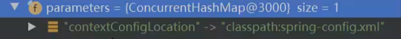
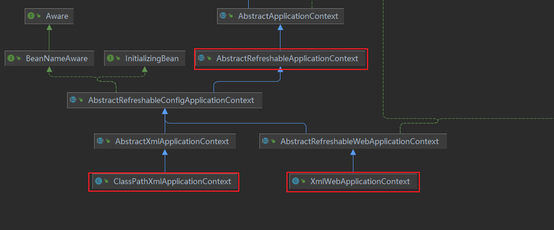
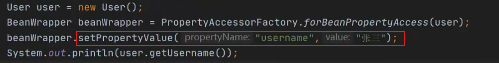
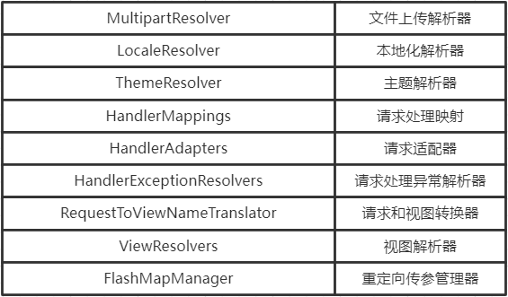
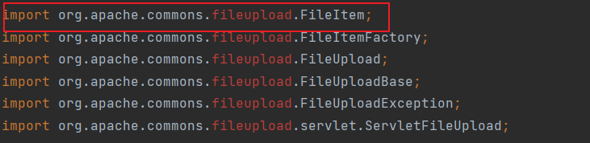
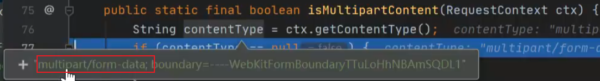

# Spring MVC

[官方文档](https://docs.spring.io/spring-framework/docs/current/reference/html/web.html#spring-web)


**web.xml**

```xml
<?xml version="1.0" encoding="UTF-8"?>
<web-app xmlns="http://xmlns.jcp.org/xml/ns/javaee"
         xmlns:xsi="http://www.w3.org/2001/XMLSchema-instance"
         xsi:schemaLocation="http://xmlns.jcp.org/xml/ns/javaee http://xmlns.jcp.org/xml/ns/javaee/web-app_4_0.xsd"
         version="4.0">
    <!--通过tomcat监听器 构建和启动spring容器-->
    <listener>
        <listener-class>org.springframework.web.context.ContextLoaderListener</listener-class>
    </listener>

    <!--post时中文乱码处理-->
    <filter>
        <filter-name>CharacterEncodingFilter</filter-name>
        <filter-class>org.springframework.web.filter.CharacterEncodingFilter</filter-class>
        <init-param>
            <param-name>encoding</param-name>
            <param-value>UTF-8</param-value>
        </init-param>
    </filter>
    <filter-mapping>
        <filter-name>CharacterEncodingFilter</filter-name>
        <servlet-name>app</servlet-name>
    </filter-mapping>
    <!--servlet添加支持delete, put等-->
    <filter>
        <filter-name>HiddenHttpMethodFilter</filter-name>
        <filter-class>org.springframework.web.filter.HiddenHttpMethodFilter</filter-class>
    </filter>
    <filter-mapping>
        <filter-name>HiddenHttpMethodFilter</filter-name>
        <servlet-name>app</servlet-name>
    </filter-mapping>

    <!--spring容器配置文件-->
    <context-param>
        <param-name>contextConfigLocation</param-name>
        <param-value>/WEB-INF/app-context.xml</param-value>
    </context-param>

    <servlet>
        <servlet-name>app</servlet-name>
        <servlet-class>org.springframework.web.servlet.DispatcherServlet</servlet-class>
        <!--spring mvc容器配置文件-->
        <init-param>
            <param-name>contextConfigLocation</param-name>
            <param-value>/WEB-INF/app-context.xml</param-value>
        </init-param>
        <!--spring mvc容器会在tomcat初始化的时候就准备好，优化首批请求-->
        <load-on-startup>1</load-on-startup>
    </servlet>

    <servlet-mapping>
        <servlet-name>app</servlet-name>
        <url-pattern>/</url-pattern>
    </servlet-mapping>
</web-app>
```


## 源码入口

前置知识：tomcat源码

```java
public class ContextLoaderListener extends ContextLoader implements ServletContextListener {
	public ContextLoaderListener(WebApplicationContext context) {
		super(context);
	}
    
	/**
	 * Initialize the root web application context.
	 * 监听器监听到tomcat初始化完后执行
	 */
	@Override
	public void contextInitialized(ServletContextEvent event) {
         // event 获取servlet上下文
		initWebApplicationContext(event.getServletContext());
	}

	/**
	 * Close the root web application context.
	 * 监听器监听到tomcat上下文销毁后执行
	 */
	@Override
	public void contextDestroyed(ServletContextEvent event) {
		closeWebApplicationContext(event.getServletContext());
		ContextCleanupListener.cleanupAttributes(event.getServletContext());
	}
}
```

servlet上下文中有spring容器的配置文件



## 创建Spring根容器

```java
public WebApplicationContext initWebApplicationContext(ServletContext servletContext) {
     // WebApplicationContext.class.getName() + ".ROOT"
	...
	try {
		// Store context in local instance variable, to guarantee that
		// it is available on ServletContext shutdown.
		if (this.context == null) {
             // 创建spring容器对象：Root WebApplicationContext
			this.context = createWebApplicationContext(servletContext);
		}
         // 默认根容器是子类
		if (this.context instanceof ConfigurableWebApplicationContext) {
			ConfigurableWebApplicationContext cwac = (ConfigurableWebApplicationContext) this.context;
             // 非启动状态下
			if (!cwac.isActive()) {
				// The context has not yet been refreshed -> provide services such as
				// setting the parent context, setting the application context id, etc
                // 根容器没有parent
				if (cwac.getParent() == null) {
					// The context instance was injected without an explicit parent ->
					// determine parent for root web application context, if any.
					ApplicationContext parent = loadParentContext(servletContext);
					cwac.setParent(parent);
				}
                 // 配合和调用容器的refresh方法
                 // 通过ServletContext获取到配置的contextConfigLocation，为容器指定配置文件
				configureAndRefreshWebApplicationContext(cwac, servletContext);
			}
		}
         // 准备好了spring根容器
		servletContext.setAttribute(WebApplicationContext.ROOT_WEB_APPLICATION_CONTEXT_ATTRIBUTE, this.context);
		ClassLoader ccl = Thread.currentThread().getContextClassLoader();
		if (ccl == ContextLoader.class.getClassLoader()) {
			currentContext = this.context;
		}
		else if (ccl != null) {
			currentContextPerThread.put(ccl, this.context);
		}
		if (logger.isInfoEnabled()) {
			long elapsedTime = System.currentTimeMillis() - startTime;
			logger.info("Root WebApplicationContext initialized in " + elapsedTime + " ms");
		}
		return this.context;
	}
	catch (RuntimeException | Error ex) {
		logger.error("Context initialization failed", ex);
		servletContext.setAttribute(WebApplicationContext.ROOT_WEB_APPLICATION_CONTEXT_ATTRIBUTE, ex);
		throw ex;
	}
}
```

 初始化spring根容器 createWebApplicationContext

```java
protected WebApplicationContext createWebApplicationContext(ServletContext sc) {
    // 获取spring applicationContext
	Class<?> contextClass = determineContextClass(sc);
    // 如果自定义实现了一个spring applicationContext 必须符合接口规范
	if (!ConfigurableWebApplicationContext.class.isAssignableFrom(contextClass)) {
		throw new ApplicationContextException("Custom context class [" + contextClass.getName() +
				"] is not of type [" + ConfigurableWebApplicationContext.class.getName() + "]");
	}
    // 反射初始化applicationContext
	return (ConfigurableWebApplicationContext) BeanUtils.instantiateClass(contextClass);
}
```

获取spring容器的实现类 determineContextClass，这个类有一个静态代码块、

```java
package org.springframework.web.context;

static {
	// Load default strategy implementations from properties file.
	// This is currently strictly internal and not meant to be customized
	// by application developers.
	try {
        // 加载类路径资源
        // DEFAULT_STRATEGIES_PATH = "ContextLoader.properties"
        // 根据当前类的package路径，到指定的目录找ContextLoader.properties文件
        // org.springframework.web.context.WebApplicationContext=org.springframework.web.context.support.XmlWebApplicationContext
		ClassPathResource resource = new ClassPathResource(DEFAULT_STRATEGIES_PATH, ContextLoader.class);
		defaultStrategies = PropertiesLoaderUtils.loadProperties(resource);
	}
	catch (IOException ex) {
		throw new IllegalStateException("Could not load 'ContextLoader.properties': " + ex.getMessage());
	}
}
```

```java
protected Class<?> determineContextClass(ServletContext servletContext) {
    // 自定义applicationContext
	String contextClassName = servletContext.getInitParameter(CONTEXT_CLASS_PARAM);
	if (contextClassName != null) {
		...
	}
	else {
        // 默认是 org.springframework.web.context.support.XmlWebApplicationContext
		contextClassName = defaultStrategies.getProperty(WebApplicationContext.class.getName());
		try {
             // 反射获取类对象
			return ClassUtils.forName(contextClassName, ContextLoader.class.getClassLoader());
		}
		...
	}
}
```

## Refresh

XmlWebApplicationContext继承关系



```java
public void refresh() throws BeansException, IllegalStateException {
	synchronized (this.startupShutdownMonitor) {
		// Prepare this context for refreshing.
		prepareRefresh();
		// Tell the subclass to refresh the internal bean factory.
         // XmlWebApplicationContext 继承了 AbstractRefreshableApplicationContext
         // AbstractRefreshableApplicationContext 实现了obtainFreshBeanFactory # refreshBeanFactory
         // 所以会在里面创建BeanFactory(DefaultListableBeanFactory)，并且读取Xml配置文件构建Bean定义
		ConfigurableListableBeanFactory beanFactory = obtainFreshBeanFactory();
		// Prepare the bean factory for use in this context.
		prepareBeanFactory(beanFactory);
		try {
			// Allows post-processing of the bean factory in context subclasses.
             // 此时这里也有了实现 AbstractRefreshableWebApplicationContext
             // 加载了一个重要的后置处理器
			postProcessBeanFactory(beanFactory);
			// Invoke factory processors registered as beans in the context.
			invokeBeanFactoryPostProcessors(beanFactory);
			// Register bean processors that intercept bean creation.
			registerBeanPostProcessors(beanFactory);
			// Initialize message source for this context.
			initMessageSource();
			// Initialize event multicaster for this context.
			initApplicationEventMulticaster();
			// Initialize other special beans in specific context subclasses.
             // 此时这里也有了实现 AbstractRefreshableWebApplicationContext
             // 主题相关
			onRefresh();
			// Check for listener beans and register them.
			registerListeners();
			// Instantiate all remaining (non-lazy-init) singletons.
			finishBeanFactoryInitialization(beanFactory);
			// Last step: publish corresponding event.
			finishRefresh();
		}
		...
	}
}
```

子类对refresh的模板方法实现：AbstractRefreshableWebApplicationContext # postProcessBeanFactory

```java
protected void postProcessBeanFactory(ConfigurableListableBeanFactory beanFactory) {
    // 注入BeanPostProcessor
    // 如果bean实现了 ServletContextAware ServletConfigAware 接口
    // 那么会在实例化bean的时候会调用接口，bean可以获取ServletContext
	beanFactory.addBeanPostProcessor(new ServletContextAwareProcessor(this.servletContext, this.servletConfig));
    // 那么通过属性注入就会被忽视
	beanFactory.ignoreDependencyInterface(ServletContextAware.class);
	beanFactory.ignoreDependencyInterface(ServletConfigAware.class);
    // 注册spring mvc 独有的 scope : request session
	WebApplicationContextUtils.registerWebApplicationScopes(beanFactory, this.servletContext);
	WebApplicationContextUtils.registerEnvironmentBeans(beanFactory, this.servletContext, this.servletConfig);
}
```

## 创建SpringMvc容器

tomcat解析完监听器后，开始解析Servlet

开始转到web.xml中配置的org.springframework.web.servlet.DispatcherServlet，其父类HttpServletBean实现了tomcat的HttpServlet # init

**那么tomcat会调用DispatcherServlet的构造方法，然后调用生命周期的init方法**

```java
public final void init() throws ServletException {
	// Set bean properties from init parameters.
    // 将init-param参数封装到pvs
	PropertyValues pvs = new ServletConfigPropertyValues(getServletConfig(), this.requiredProperties);
	if (!pvs.isEmpty()) {
		try {
			BeanWrapper bw = PropertyAccessorFactory.forBeanPropertyAccess(this);
			ResourceLoader resourceLoader = new ServletContextResourceLoader(getServletContext());
             // 注册自定义属性编辑器
			bw.registerCustomEditor(Resource.class, new ResourceEditor(resourceLoader, getEnvironment()));
             // ioc doCreateBean # createInstance中也有
			initBeanWrapper(bw);
			bw.setPropertyValues(pvs, true);
		}
		catch (BeansException ex) {
			if (logger.isErrorEnabled()) {
				logger.error("Failed to set bean properties on servlet '" + getServletName() + "'", ex);
			}
			throw ex;
		}
	}
	// Let subclasses do whatever initialization they like.
	initServletBean();
}
```

**扩展：BeanWrapper**

通过属性字符串反射设置属性



准备创建spring mvc容器

```java
protected final void initServletBean() throws ServletException {
	...
	try {
        // 开始创建和初始化容器
		this.webApplicationContext = initWebApplicationContext();
		initFrameworkServlet();
	}
	catch (ServletException | RuntimeException ex) {
		logger.error("Context initialization failed", ex);
		throw ex;
	}
	if (logger.isDebugEnabled()) {
		String value = this.enableLoggingRequestDetails ?
				"shown which may lead to unsafe logging of potentially sensitive data" :
				"masked to prevent unsafe logging of potentially sensitive data";
		logger.debug("enableLoggingRequestDetails='" + this.enableLoggingRequestDetails +
				"': request parameters and headers will be " + value);
	}
	if (logger.isInfoEnabled()) {
		logger.info("Completed initialization in " + (System.currentTimeMillis() - startTime) + " ms");
	}
}
```

```java
protected WebApplicationContext initWebApplicationContext() {
    // 获取根容器
	WebApplicationContext rootContext =
			WebApplicationContextUtils.getWebApplicationContext(getServletContext());
	WebApplicationContext wac = null;
    // this = DispatcherServlet ，所以默认是null 
    // servlet3.0开始可以直接传入
	if (this.webApplicationContext != null) {
		// A context instance was injected at construction time -> use it
		wac = this.webApplicationContext;
		if (wac instanceof ConfigurableWebApplicationContext) {
			ConfigurableWebApplicationContext cwac = (ConfigurableWebApplicationContext) wac;
			if (!cwac.isActive()) {
				// The context has not yet been refreshed -> provide services such as
				// setting the parent context, setting the application context id, etc
				if (cwac.getParent() == null) {
					// The context instance was injected without an explicit parent -> set
					// the root application context (if any; may be null) as the parent
					cwac.setParent(rootContext);
				}
				configureAndRefreshWebApplicationContext(cwac);
			}
		}
	}
	if (wac == null) {
		// No context instance was injected at construction time -> see if one
		// has been registered in the servlet context. If one exists, it is assumed
		// that the parent context (if any) has already been set and that the
		// user has performed any initialization such as setting the context id
		wac = findWebApplicationContext();
	}
    // 默认会到这 **************************
	if (wac == null) {
		// No context instance is defined for this servlet -> create a local one
         // 开始创建
		wac = createWebApplicationContext(rootContext);
	}
	if (!this.refreshEventReceived) {
		// Either the context is not a ConfigurableApplicationContext with refresh
		// support or the context injected at construction time had already been
		// refreshed -> trigger initial onRefresh manually here.
		synchronized (this.onRefreshMonitor) {
			onRefresh(wac);
		}
	}
	if (this.publishContext) {
		// Publish the context as a servlet context attribute.
		String attrName = getServletContextAttributeName();
		getServletContext().setAttribute(attrName, wac);
	}
	return wac;
}
```

```java
protected WebApplicationContext createWebApplicationContext(@Nullable ApplicationContext parent) {
	...
     // 这个容器的名字也叫Root Appli... 是因为这个默认是由父类设置的
	ConfigurableWebApplicationContext wac =
			(ConfigurableWebApplicationContext) BeanUtils.instantiateClass(contextClass);
	wac.setEnvironment(getEnvironment());
    // 设置spring容器
	wac.setParent(parent);
	String configLocation = getContextConfigLocation();
	if (configLocation != null) {
		wac.setConfigLocation(configLocation);
	}
    // 开始配置和refresh
	configureAndRefreshWebApplicationContext(wac);
	return wac;
}
```

```java
protected void configureAndRefreshWebApplicationContext(ConfigurableWebApplicationContext wac) {
   ...
   // spring 全局上下文，包含全局配置
   wac.setServletContext(getServletContext());
   // servlet自身的配置
   wac.setServletConfig(getServletConfig());
   wac.setNamespace(getNamespace());
   // 添加了一个监听器 SourceFilteringListener 里面真正会调用 ContextRefreshListener
   // refresh 中将该监听器往 prepareRefresh # earlyApplicationListeners 中放
   wac.addApplicationListener(new SourceFilteringListener(wac, new ContextRefreshListener()));
   // The wac environment's #initPropertySources will be called in any case when the context
   // is refreshed; do it eagerly here to ensure servlet property sources are in place for
   // use in any post-processing or initialization that occurs below prior to #refresh
   ConfigurableEnvironment env = wac.getEnvironment();
   if (env instanceof ConfigurableWebEnvironment) {
      ((ConfigurableWebEnvironment) env).initPropertySources(getServletContext(), getServletConfig());
   }
   // 模板方法
   postProcessWebApplicationContext(wac);
   // 处理web.xml中的servlet配置参数中的globalInitializerClasses参数
   // 自定义初始化器来对wac做初始化
   applyInitializers(wac);
   // 关键点在 finishRefresh # publishEvent(new ContextRefreshedEvent(this)) 会被上面注册的监听器监听到
   wac.refresh();
}
```


## 初始化SpringMvc九大组件

监听器监听到事件，开始执行监听器的方法：SourceFilteringListener # onApplicationEvent # ContextRefreshListener # onApplicationEvent # FrameworkServlet.this.onApplicationEvent(event) # onRefresh

```java
protected void onRefresh(ApplicationContext context) {
	initStrategies(context);
}

protected void initStrategies(ApplicationContext context) {
    // 处理文件上传 
    // multipartResolver
    // 默认是没有处理器的
	initMultipartResolver(context);
    // 处理国际化，基于URL参数的配置，基于session的配置，基于cookie的配置
    // localeResolver
    // 有默认的处理器，根据默认策略获取，跟创建spring容器时一样
	initLocaleResolver(context);
    // 设置主题
	initThemeResolver(context);
    // 映射器，用来将对应的request跟controller进行对应
    // 可以有多个，但是最终使用优先级高的一个
	initHandlerMappings(context);
    // 处理适配器，主要包括http请求处理适配器，简单控制器处理器配置，注解方法处理器适配器
	initHandlerAdapters(context);
    // 基于HandlerExceptionResolver接口的异常处理
	initHandlerExceptionResolvers(context);
    // 当controller处理器方法没有返回一个view对象或逻辑视图处理器名称，并且该方法中没有直接往response的输出流里面写数据的时候
	initRequestToViewNameTranslator(context);
    // 将ModelAndView选择合适的视图进行渲染的处理器
	initViewResolvers(context);
    // 提供请求存储属性，可供其他请求使用
	initFlashMapManager(context);
}
```



spring mvc包中的默认策略 DispatcherServlet.properties

```properties
# Default implementation classes for DispatcherServlet's strategy interfaces.
# Used as fallback when no matching beans are found in the DispatcherServlet context.
# Not meant to be customized by application developers.

org.springframework.web.servlet.LocaleResolver=org.springframework.web.servlet.i18n.AcceptHeaderLocaleResolver

org.springframework.web.servlet.ThemeResolver=org.springframework.web.servlet.theme.FixedThemeResolver

org.springframework.web.servlet.HandlerMapping=org.springframework.web.servlet.handler.BeanNameUrlHandlerMapping,\
	org.springframework.web.servlet.mvc.method.annotation.RequestMappingHandlerMapping,\
	org.springframework.web.servlet.function.support.RouterFunctionMapping

org.springframework.web.servlet.HandlerAdapter=org.springframework.web.servlet.mvc.HttpRequestHandlerAdapter,\
	org.springframework.web.servlet.mvc.SimpleControllerHandlerAdapter,\
	org.springframework.web.servlet.mvc.method.annotation.RequestMappingHandlerAdapter,\
	org.springframework.web.servlet.function.support.HandlerFunctionAdapter


org.springframework.web.servlet.HandlerExceptionResolver=org.springframework.web.servlet.mvc.method.annotation.ExceptionHandlerExceptionResolver,\
	org.springframework.web.servlet.mvc.annotation.ResponseStatusExceptionResolver,\
	org.springframework.web.servlet.mvc.support.DefaultHandlerExceptionResolver

org.springframework.web.servlet.RequestToViewNameTranslator=org.springframework.web.servlet.view.DefaultRequestToViewNameTranslator

org.springframework.web.servlet.ViewResolver=org.springframework.web.servlet.view.InternalResourceViewResolver

org.springframework.web.servlet.FlashMapManager=org.springframework.web.servlet.support.SessionFlashMapManager
```

**扩展点：根据以上配置文件，那我们可以自己写自定义默认处理器，替换以上文件中的默认处理器**

1. 在自己项目中的resources文件夹中创建org/springframework/web/servlet目录
2. 创建DispatcherServlet.properties
3. 复制spring mvc原本的内容到自定义的文件上
4. 替换自己创建的其中某些处理器


## SpringMVC是如何处理请求的

当有请求过来，如果匹配到web.xml中所配置的servlet-mapping，那么根据servlet规范，会调用servlet的service接口

DispatcherServlet @ FrameworkServlet  # service

```java
protected void service(HttpServletRequest request, HttpServletResponse response)
		throws ServletException, IOException {
    // 获得请求方法
	HttpMethod httpMethod = HttpMethod.resolve(request.getMethod());
    // 处理patch请求
	if (httpMethod == HttpMethod.PATCH || httpMethod == null) {
		processRequest(request, response);
	}
	else {
        // 非patch类型的请求：调用HttpServlet的service逻辑，按请求类型调用对应的doXXX模板方法
		super.service(request, response);
	}
}
```

doXXX方法都统一调用了 FrameworkServlet # processRequest

```java
protected final void processRequest(HttpServletRequest request, HttpServletResponse response)
		throws ServletException, IOException {
	long startTime = System.currentTimeMillis();
    // 处理过程中的异常
	Throwable failureCause = null;
    // 国际化处理
	LocaleContext previousLocaleContext = LocaleContextHolder.getLocaleContext();
	LocaleContext localeContext = buildLocaleContext(request);
    // 获取请求参数
	RequestAttributes previousAttributes = RequestContextHolder.getRequestAttributes();
    // 构建ServletRequestAttributes
	ServletRequestAttributes requestAttributes = buildRequestAttributes(request, response, previousAttributes);
	WebAsyncManager asyncManager = WebAsyncUtils.getAsyncManager(request);
	asyncManager.registerCallableInterceptor(FrameworkServlet.class.getName(), new RequestBindingInterceptor());
    // 初始化，设置上面的两个属性
	initContextHolders(request, localeContext, requestAttributes);
	try {
        // 执行真正逻辑
		doService(request, response);
	}
	catch (ServletException | IOException ex) {
		failureCause = ex;
		throw ex;
	}
	catch (Throwable ex) {
		failureCause = ex;
		throw new NestedServletException("Request processing failed", ex);
	}
	finally {
		resetContextHolders(request, previousLocaleContext, previousAttributes);
		if (requestAttributes != null) {
			requestAttributes.requestCompleted();
		}
		logResult(request, response, failureCause, asyncManager);
		publishRequestHandledEvent(request, response, startTime, failureCause);
	}
}
```

```java
protected void doService(HttpServletRequest request, HttpServletResponse response) throws Exception {
	...
	// Make framework objects available to handlers and view objects.
    // DispatcherServlet.class.getName() + ".CONTEXT"
	request.setAttribute(WEB_APPLICATION_CONTEXT_ATTRIBUTE, getWebApplicationContext());
	request.setAttribute(LOCALE_RESOLVER_ATTRIBUTE, this.localeResolver);
	request.setAttribute(THEME_RESOLVER_ATTRIBUTE, this.themeResolver);
	request.setAttribute(THEME_SOURCE_ATTRIBUTE, getThemeSource());
    // falshMap相关，redirect转发的时候，传递参数
	if (this.flashMapManager != null) {
		FlashMap inputFlashMap = this.flashMapManager.retrieveAndUpdate(request, response);
		if (inputFlashMap != null) {
             // DispatcherServlet.class.getName() + ".INPUT_FLASH_MAP"
			request.setAttribute(INPUT_FLASH_MAP_ATTRIBUTE, Collections.unmodifiableMap(inputFlashMap));
		}
		request.setAttribute(OUTPUT_FLASH_MAP_ATTRIBUTE, new FlashMap());
		request.setAttribute(FLASH_MAP_MANAGER_ATTRIBUTE, this.flashMapManager);
	}
	try {
         // 开始分发
		doDispatch(request, response);
	}
	finally {
		if (!WebAsyncUtils.getAsyncManager(request).isConcurrentHandlingStarted()) {
			// Restore the original attribute snapshot, in case of an include.
			if (attributesSnapshot != null) {
				restoreAttributesAfterInclude(request, attributesSnapshot);
			}
		}
	}
}
```

**doDispatch**

```java
protected void doDispatch(HttpServletRequest request, HttpServletResponse response) throws Exception {
	HttpServletRequest processedRequest = request;
    // 处理请求的处理器链，interceptor
	HandlerExecutionChain mappedHandler = null;
    // 是否是上传请求
	boolean multipartRequestParsed = false;
	WebAsyncManager asyncManager = WebAsyncUtils.getAsyncManager(request);
	try {
         // 封装Model和View的容器
		ModelAndView mv = null;
         // 处理请求中的异常，但是不包括渲染过程中的异常
		Exception dispatchException = null;
		try {
             // 如果是上传请求，需要特殊处理：转为 MultipartHttpServletRequest
			processedRequest = checkMultipart(request);
             // 判断和设置上传请求标识
			multipartRequestParsed = (processedRequest != request);
			// Determine handler for the current request.
             // 获取请求对应的HandlerExcutionChain对象 (HandlerMethod 和 拦截器)
             // Handler = controller
             // 控制器的定义方式有三种：@Controller、
			mappedHandler = getHandler(processedRequest);
             // 获取不到返回404错误
			if (mappedHandler == null) {
				noHandlerFound(processedRequest, response);
				return;
			}
			// Determine handler adapter for the current request.
             // 获取当前handler对应的适配器
             // 
			HandlerAdapter ha = getHandlerAdapter(mappedHandler.getHandler());
			// Process last-modified header, if supported by the handler.
			String method = request.getMethod();
			boolean isGet = "GET".equals(method);
             // http lastModified处理
			if (isGet || "HEAD".equals(method)) {
				long lastModified = ha.getLastModified(request, mappedHandler.getHandler());
                 // 资源未过期，直接返回空，不做后续处理，客户端继续使用缓存数据，减少服务器的带宽
				if (new ServletWebRequest(request, response).checkNotModified(lastModified) && isGet) {
					return;
				}
			}
             // 执行拦截器前置方法
			if (!mappedHandler.applyPreHandle(processedRequest, response)) {
				return;
			}
			// Actually invoke the handler.
             // 真正调用控制器中的方法
			mv = ha.handle(processedRequest, response, mappedHandler.getHandler());
			if (asyncManager.isConcurrentHandlingStarted()) {
				return;
			}
             // view如果为空，根据request设置默认的view
			applyDefaultViewName(processedRequest, mv);
             // 执行拦截器后置方法
			mappedHandler.applyPostHandle(processedRequest, response, mv);
		}
		catch (Exception ex) {
			dispatchException = ex;
		}
		catch (Throwable err) {
			// As of 4.3, we're processing Errors thrown from handler methods as well,
			// making them available for @ExceptionHandler methods and other scenarios.
			dispatchException = new NestedServletException("Handler dispatch failed", err);
		}
        // 处理返回结果，包括异常、页面渲染、触发interceptor的afterCompletion
		processDispatchResult(processedRequest, response, mappedHandler, mv, dispatchException);
	}
	catch (Exception ex) {
		triggerAfterCompletion(processedRequest, response, mappedHandler, ex);
	}
	catch (Throwable err) {
		triggerAfterCompletion(processedRequest, response, mappedHandler,
				new NestedServletException("Handler processing failed", err));
	}
	finally {
         // 判断是否执行异步请求
		if (asyncManager.isConcurrentHandlingStarted()) {
			// Instead of postHandle and afterCompletion
			if (mappedHandler != null) {
				mappedHandler.applyAfterConcurrentHandlingStarted(processedRequest, response);
			}
		}
		else {
			// Clean up any resources used by a multipart request.
             // 删除上传请求的资源
			if (multipartRequestParsed) {
				cleanupMultipart(processedRequest);
			}
		}
	}
}
```

### 文件上传请求解析

初始化spring mvc九大组件的时候，multipartResolver 没有默认注入，所有要使用文件上传功能必须手动注入

```xml
<bean id="multipartResolver" class="org.springframework.web.multipart.commons.CommonsMultipartResolver">
    <property name="maxUploadSize" value="17367648787"/>
    <property name="defaultEncoding" value="UTF-8"/>
</bean>
```

并且还要引入apache的文件上传依赖类



```xml
<dependency>
    <groupId>commons-fileupload</groupId>
    <artifactId>commons-fileupload</artifactId>
    <version>1.4</version>
</dependency>
```

```java
protected HttpServletRequest checkMultipart(HttpServletRequest request) throws MultipartException {
    // 判断是否文件上传请求
	if (this.multipartResolver != null && this.multipartResolver.isMultipart(request)) {
		if (WebUtils.getNativeRequest(request, MultipartHttpServletRequest.class) != null) {
			if (request.getDispatcherType().equals(DispatcherType.REQUEST)) {
				logger.trace("Request already resolved to MultipartHttpServletRequest, e.g. by MultipartFilter");
			}
		}
		else if (hasMultipartException(request)) {
			logger.debug("Multipart resolution previously failed for current request - " +
					"skipping re-resolution for undisturbed error rendering");
		}
		else {
			try {
                 // 解析文件上传
				return this.multipartResolver.resolveMultipart(request);
			}
			catch (MultipartException ex) {
				if (request.getAttribute(WebUtils.ERROR_EXCEPTION_ATTRIBUTE) != null) {
					logger.debug("Multipart resolution failed for error dispatch", ex);
					// Keep processing error dispatch with regular request handle below
				}
				else {
					throw ex;
				}
			}
		}
	}
	// If not returned before: return original request.
	return request;
}
```

isMultipart里通过请求的contentType来确认



开始解析servlet请求成为springmvc文件上传请求

```java
public MultipartHttpServletRequest resolveMultipart(final HttpServletRequest request) throws MultipartException {
	Assert.notNull(request, "Request must not be null");
    // 延迟解析
	if (this.resolveLazily) {
		...
	}
    // 立即解析
	else {
         // 解析请求并得到结果
         // 分别解析出表单字段 multipartParameters 和文件字段 multipartFiles（在C盘会产生.temp临时文件）
         // 将解析出来的参数通过DefaultMultipartHttpServletRequest包装返回
		MultipartParsingResult parsingResult = parseRequest(request);
		return new DefaultMultipartHttpServletRequest(request, parsingResult.getMultipartFiles(),
				parsingResult.getMultipartParameters(), parsingResult.getMultipartParameterContentTypes());
	}
}
```
