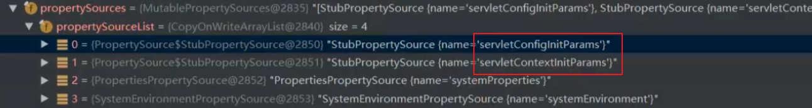

## 源码入口

```java
public ConfigurableApplicationContext run(String... args) {
	StopWatch stopWatch = new StopWatch();
	stopWatch.start();
	ConfigurableApplicationContext context = null;
	Collection<SpringBootExceptionReporter> exceptionReporters = new ArrayList<>();
	configureHeadlessProperty();
	SpringApplicationRunListeners listeners = getRunListeners(args);
	listeners.starting();
	try {
		ApplicationArguments applicationArguments = new DefaultApplicationArguments(args);
		ConfigurableEnvironment environment = prepareEnvironment(listeners, applicationArguments);
		configureIgnoreBeanInfo(environment);
		Banner printedBanner = printBanner(environment);
		context = createApplicationContext();
		exceptionReporters = getSpringFactoriesInstances(SpringBootExceptionReporter.class,
				new Class[] { ConfigurableApplicationContext.class }, context);
         // springboot启动类的bean定义sh
		prepareContext(context, environment, listeners, applicationArguments, printedBanner);
		refreshContext(context);
		afterRefresh(context, applicationArguments);
		stopWatch.stop();
		if (this.logStartupInfo) {
			new StartupInfoLogger(this.mainApplicationClass).logStarted(getApplicationLog(), stopWatch);
		}
		listeners.started(context);
		callRunners(context, applicationArguments);
	}
	catch (Throwable ex) {
		handleRunFailure(context, ex, exceptionReporters, listeners);
		throw new IllegalStateException(ex);
	}
	try {
		listeners.running(context);
	}
	catch (Throwable ex) {
		handleRunFailure(context, ex, exceptionReporters, null);
		throw new IllegalStateException(ex);
	}
	return context;
}
```


启动类的bean定义是什么时候被设置的？

```
LoggingApplicationListener
BackgroundPreinitializer
```



```
ConfigFileApplicationListener
```


## 自动装配原理

### **简介** 

不知道大家第一次搭SpringBoot环境的时候，有没有觉得非常简单。无须各种的配置文件，无须各种繁杂的pom坐标，一个main方法，就能run起来了。与其他框架整合也贼方便，使用EnableXXXXX注解就可以搞起来了！所以今天来讲讲SpringBoot是如何实现自动配置的

1. **@Import**
2. **从spring.factories文件加载配置类**
3. **通过@Conditional过滤**
4. 

**自动配置流程图** 

https://www.processon.com/view/link/5fc0abf67d9c082f447ce49b 

**从启动类开始入手**

### @SpringBootApplication

标注在某个类上说明这个类是SpringBoot的主配置类，SpringBoot需要运行这个类的main方法来启动SpringBoot应用

```java
@Target(ElementType.TYPE)
// 当注解标注的类编译以什么方式保留
//	RetentionPolicy.RUNTIME: 会被jvm加载
@Retention(RetentionPolicy.RUNTIME)
@Documented
@Inherited
// 标注在某个类上，表示这是一个Spring Boot的配置类
//	内部使用: @Configuration
//		内部使用: @Component
@SpringBootConfiguration
// 开启自动配置功能，以前我们需要配置的东西，Spring Boot帮我们自动配置(自动去加载'自动配置类')；
@EnableAutoConfiguration
// 相当于在spring.xml 配置中<context:comonent-scan>，但是并没有指定basepackage
// 如果没有指定，spring底层会自动扫描当前配置类所有在的包
@ComponentScan(excludeFilters = { 
    // springboot对外提供的扩展类， 可以供我们去按照我们的方式进行排除
    @Filter(type = FilterType.CUSTOM, classes = TypeExcludeFilter.class),
    // 排除所有配置类并且是自动配置类中里面的其中一个
	@Filter(type = FilterType.CUSTOM, classes = AutoConfigurationExcludeFilter.class) })
public @interface SpringBootApplication {
    ...
}
```

### @EnableAutoConfiguration

```java
@Target(ElementType.TYPE)
@Retention(RetentionPolicy.RUNTIME)
@Documented
@Inherited
// 将当前配置类所在包保存在BasePackages的Bean中。供Spring内部使用
//	内部使用：@Import(AutoConfigurationPackages.Registrar.class)
//		注册了一个保存当前配置类所在包的一个Bean
@AutoConfigurationPackage
// 关键点
// AutoConfigurationImportSelector 实现了 DeferredImportSelector
@Import(AutoConfigurationImportSelector.class)
public @interface EnableAutoConfiguration {
...
}
```

spring内部在解析@import的时候会调用selectImports # getAutoConfigurationEntry方法进行扫描具有META-INF/spring.factories文件的jar包

```java
protected AutoConfigurationEntry getAutoConfigurationEntry(AnnotationMetadata annotationMetadata) {
	if (!isEnabled(annotationMetadata)) {
		return EMPTY_ENTRY;
	}
	AnnotationAttributes attributes = getAttributes(annotationMetadata);
    // 从META‐INF/spring.factories中获得候选的自动配置类
	List<String> configurations = getCandidateConfigurations(annotationMetadata, attributes);
    // 排重
	configurations = removeDuplicates(configurations);
    // 根据EnableAutoConfiguration注解中属性，获取不需要自动装配的类名单，一般不用
	Set<String> exclusions = getExclusions(annotationMetadata, attributes);
	checkExcludedClasses(configurations, exclusions);
	configurations.removeAll(exclusions);
    // 通过自动配置类中的OnBeanCondition\OnClassCondition\OnWebApplicationCondition进行过滤
    // 
	configurations = getConfigurationClassFilter().filter(configurations);
    // 实例化实现了AutoConfigurationImportListener的bean.
    // 循环调用onAutoConfigurationImportEvent方法
    // 分别把候选的配置名单，和排除的配置名单传进去做扩展
	fireAutoConfigurationImportEvents(configurations, exclusions);
	return new AutoConfigurationEntry(configurations, exclusions);
}
```

**spring.factories文件**

存在两个包中：spring-boot、spring-boot-autoconfigure

spring.factories文件是Key=Value形式，多个Value时使用‘,’隔开，该文件中定义了关于初始化，监听器等信息，而真正使自动配置生效的key是org.springframework.boot.autoconfigure.EnableAutoConfiguration

```properties
## spring-boot-configure
# Auto Configure
org.springframework.boot.autoconfigure.EnableAutoConfiguration=\
org.springframework.boot.autoconfigure.admin.SpringApplicationAdminJmxAutoConfiguration,\
org.springframework.boot.autoconfigure.aop.AopAutoConfiguration,\
org.springframework.boot.autoconfigure.amqp.RabbitAutoConfiguration,\
org.springframework.boot.autoconfigure.batch.BatchAutoConfiguration,\
...
```

每一个这样的 xxxAutoConfiguration类都是容器中的一个组件，都加入到容器中；用他们来做自动配置

[springboot所有自动配置类列表](https://docs.spring.io/spring-boot/docs/current/reference/html/auto-configuration-classes.html#appendix.auto-configuration-classes)

后续： @EnableAutoConfiguration注解通过@SpringBootApplication被间接的标记在了Spring Boot的启动类上。在 SpringApplication.run(...)的内部就会执行selectImports()方法，找到所有JavaConfig自动配置类的全限定名对应的class，然后将所有自动配置类加载到Spring容器中

### @AutoConfigurationPackage

在传统的SpringMvc中，需要通过@ComponentScan注解指定我们自己包的路径，然后开始递归扫描，而Springboot中则是通过@AutoConfigurationPackage（在@SpringBootApplication中）注解，自动扫描配置了该注解的类的当前包开始扫描，不需要我们再去手动配置扫描器，简化了我们的开发流程

进入到AutoConfigurationPackage，发现它导入了另外一个类

```java
@Import(AutoConfigurationPackages.Registrar.class)
```

该内部类的代码如下所示

```java
static class Registrar implements ImportBeanDefinitionRegistrar, DeterminableImports {
	@Override
	public void registerBeanDefinitions(AnnotationMetadata metadata, BeanDefinitionRegistry registry) {
         // 通过getPackageNames，spring boot可以找到@SpringBootApplication所在类的包
		register(registry, new PackageImports(metadata).getPackageNames().toArray(new String[0]));
	}
	@Override
	public Set<Object> determineImports(AnnotationMetadata metadata) {
		return Collections.singleton(new PackageImports(metadata));
	}
}
```


### 分析一个简单的自动配置类

https://blog.csdn.net/lxd_113/article/details/87103430?spm=1001.2014.3001.5502


### 入口


### 

我们可以通过设置配置文件中：启用 debug=true属性；来让控制台打印自动配置报告，这样我们就可以很方便的知道哪些自动配置类生效

```sh
 Positive matches:‐‐‐**表示自动配置类启用的** 
 ‐‐‐‐‐‐‐‐‐‐‐‐‐‐‐‐‐ 
 ...省略... 
 
 Negative matches:‐‐‐**没有匹配成功的自动配置类** 
 ‐‐‐‐‐‐‐‐‐‐‐‐‐‐‐‐‐ 
 ...省略...
```


## 自定义Starter


## 集成Tomcat

整体流程


AbstractApplicationContext # refresh # onRefresh

这个onRefresh在spring mvc中是空的方法，在spring boot中有了实现ServletWebServerApplicationContext，tomcat就是在这完成实例化

```java
@Override
protected void onRefresh() {
	super.onRefresh();
	try {
         // 开始创建WebServer
		createWebServer();
	}
	catch (Throwable ex) {
		throw new ApplicationContextException("Unable to start web server", ex);
	}
}
```

```java
private void createWebServer() {
	WebServer webServer = this.webServer;
	ServletContext servletContext = getServletContext();
	if (webServer == null && servletContext == null) {
         // 在spring的Bean工厂(DefaultListableBeanFactory)中找到类型是ServletWebServerFactory.class的
         // 	bean定义tomcatServletWebServerFactory,并实例化
		ServletWebServerFactory factory = getWebServerFactory();
         // 开始创建tomcat的各个组件
		this.webServer = factory.getWebServer(getSelfInitializer());
		getBeanFactory().registerSingleton("webServerGracefulShutdown",
				new WebServerGracefulShutdownLifecycle(this.webServer));
		getBeanFactory().registerSingleton("webServerStartStop",
				new WebServerStartStopLifecycle(this, this.webServer));
	}
	else if (servletContext != null) {
		try {
			getSelfInitializer().onStartup(servletContext);
		}
		catch (ServletException ex) {
			throw new ApplicationContextException("Cannot initialize servlet context", ex);
		}
	}
	initPropertySources();
}
```


**那么问题来了，这个bean定义是什么时候被导入的？**

自动装配的时候（@import解析的时候）：只要配置了spring-boot-starter-web就会匹配到下面的自动配置类

```properties
org.springframework.boot.autoconfigure.web.servlet.ServletWebServerFactoryAutoConfiguration
```

TomcatServletWebServerFactory # getWebServer

```java
@Override
public WebServer getWebServer(ServletContextInitializer... initializers) {
	if (this.disableMBeanRegistry) {
		Registry.disableRegistry();
	}
    // 创建tomcat对象
	Tomcat tomcat = new Tomcat();
    // 创建临时目录
	File baseDir = (this.baseDirectory != null) ? this.baseDirectory : createTempDir("tomcat");
	tomcat.setBaseDir(baseDir.getAbsolutePath());
    // org.apache.coyote.http11.Http11NioProtocol
	Connector connector = new Connector(this.protocol);
	connector.setThrowOnFailure(true);
    // 创建service(StandardServer)并且绑定connector
	tomcat.getService().addConnector(connector);
    // 配置连接器：端口。。。
	customizeConnector(connector);
	tomcat.setConnector(connector);
    // 创建engine(StandardEngine)
    // 创建host(StandardHost)
    // engine设置host
	tomcat.getHost().setAutoDeploy(false);
	configureEngine(tomcat.getEngine());
	for (Connector additionalConnector : this.additionalTomcatConnectors) {
		tomcat.getService().addConnector(additionalConnector);
	}
	prepareContext(tomcat.getHost(), initializers);
    // 实例化TomcatWebServer, 并且初始化tomcat的各个组件
	return getTomcatWebServer(tomcat);
}
```

临时目录


初始化tomcat的各个组件

```java
private void initialize() throws WebServerException {
    // springboot应用中打印的tomcat日志
	logger.info("Tomcat initialized with port(s): " + getPortsDescription(false));
	synchronized (this.monitor) {
		try {
			addInstanceIdToEngineName();
			Context context = findContext();
			context.addLifecycleListener((event) -> {
				if (context.equals(event.getSource()) && Lifecycle.START_EVENT.equals(event.getType())) {
					// Remove service connectors so that protocol binding doesn't
					// happen when the service is started.
					removeServiceConnectors();
				}
			});
			// Start the server to trigger initialization listeners
             // 执行组件的生命周期方法
			this.tomcat.start();
			// We can re-throw failure exception directly in the main thread
			rethrowDeferredStartupExceptions();
			try {
				ContextBindings.bindClassLoader(context, context.getNamingToken(), getClass().getClassLoader());
			}
			catch (NamingException ex) {
				// Naming is not enabled. Continue
			}
			// Unlike Jetty, all Tomcat threads are daemon threads. We create a
			// blocking non-daemon to stop immediate shutdown
			startDaemonAwaitThread();
		}
		catch (Exception ex) {
			stopSilently();
			destroySilently();
			throw new WebServerException("Unable to start embedded Tomcat", ex);
		}
	}
}
```

组件的生命周期方法LifecycleBase # start


## @Import原理


## @EnableConfigurationProperties

将用@ConfigurationProperties标记了的类放入spring容器，且会将配置注入到该类的属性


## @Conditional原理

必须是@Conditional指定的条件成立，才给容器中添加组件，配置配里面的所有内容才生效；

| 扩展注解作用                    | （判断是否满足当前指定条件）                     |
| ------------------------------- | ------------------------------------------------ |
| @ConditionalOnJava              | 系统的java版本是否符合要求                       |
| @ConditionalOnBean              | 容器中存在指定Bean；                             |
| @ConditionalOnMissingBean       | 容器中不存在指定Bean；                           |
| @ConditionalOnExpression        | 满足SpEL表达式指定                               |
| @ConditionalOnClass             | 系统中有指定的类，当给定的类名在类路径上存在     |
| @ConditionalOnMissingClass      | 系统中没有指定的类                               |
| @ConditionalOnSingleCandidate   | 容器中只有一个指定的Bean，或者这个Bean是首选Bean |
| @ConditionalOnProperty          | 系统中指定的属性是否有指定的值                   |
| @ConditionalOnResource          | 类路径下是否存在指定资源文件                     |
| @ConditionalOnWebApplication    | 当前是web环境                                    |
| @ConditionalOnNotWebApplication | 当前不是web环境                                  |
| @ConditionalOnJndi              | JNDI存在指定项                                   |

