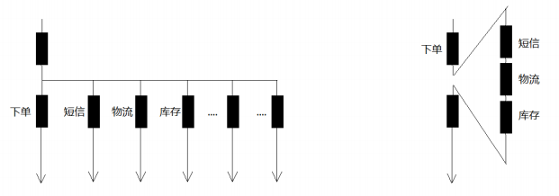
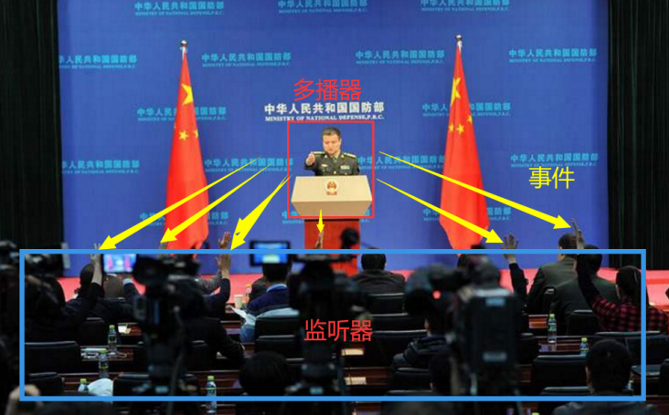
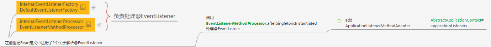

## 使用Spring事件

Spring事件体系包括三个组件：事件，事件监听器，事件广播器

### 事件

**Spring内置事件** 

内置事件中由系统内部进行发布，只需注入监听器

| Event                 | 说明                                                         |
| --------------------- | ------------------------------------------------------------ |
| ContextRefreshedEvent | 当容器被实例化或refreshed时发布。如调用refresh()方法, 此处的实例化是指所有的bean都已被加载，后置处理器都被激活，所有单例bean都已被实例化, 所有的容器对象都已准备好可使用. 如果容器 支持热重载,则refresh可以被触发多次(XmlWebApplicatonContext支持热刷新,而 GenericApplicationContext则不支持) |
| ContextStartedEvent   | 当容器启动时发布,即调用start()方法, 已启用意味着所有的Lifecycle bean都已显式接收到了start 信号 |
| ContextStoppedEvent   | 当容器停止时发布,即调用stop()方法, 即所有的Lifecycle bean都已显式接收到了stop信号 , 关闭 的容器可以通过start()方法重启 |
| ContextClosedEvent    | 当容器关闭时发布,即调用close方法, 关闭意味着所有的单例bean都已被销毁.关闭的容器不能被重启 或refresh |
| RequestHandledEvent   | 这只在使用spring的DispatcherServlet时有效,当一个请求被处理完成时发布 |

**自定义事件** 

事件类需要继承ApplicationEvent，代码如下：

```java
public class BigEvent extends ApplicationEvent { 
    private String name; 
    public BigEvent(Object source, String name) { 
        super(source); 
        this.name = name; 
    } 
    
    public String getName() { 
        return name; 
    } 
}
```

### 事件监听器

**事件监听器-基于接口**

```java
@Component 
public class HelloEventListener implements ApplicationListener<OrderEvent> { 
    @Override 
    public void onApplicationEvent(OrderEvent event) { 
        if(event.getName().equals("减库存")){
            System.out.println("减库存......."); 
        } 
    } 
}
```

事件监听器需要实现ApplicationListener接口，这是个泛型接口，泛型类类型就是事件类型，其次需要是spring容器托管的bean，所以这里加了@component，只有一个方法，就是onApplicationEvent

**事件监听器-基于注解**

```java
@Component 
public class OrderEventListener { 
    @EventListener(OrderEvent.class) 
    public void onApplicationEvent(OrderEvent event) { 
        if(event.getName().equals("减库存")){ 
            System.out.println("减库存......."); 
        } 
    } 
}
```

### 事件广播器

事件发布方式很简单

```java
applicationContext.publishEvent(new HelloEvent(this,"lgb"));
```

然后调用方法就能看到

```sh
2020‐9‐22 19:08:00.052 INFO 284928 ‐‐‐ [nio‐5577‐exec‐3] l.b.e.c.s.event.HelloEventListener : r eceive lgb say hello!
```

### **疑问**

1. 同样的事件能有多个监听器 -- 可以的 

2. 事件监听器一定要写一个类去实现吗 -- 其实是可以不需要的，spring有个注解@EventListener，修饰在方法上，稍后给出使用方法 

3. 事件监听操作和发布事件的操作是同步的吗？ -- 是的，所以如果有事务，监听操作也在事务内 

4. 可以作为异步处理吗？ --可以 看源码有解释。：

   ```java
   @Bean(name = "applicationEventMulticaster") 
   public ApplicationEventMulticaster simpleApplicationEventMulticaster() { 
       SimpleApplicationEventMulticaster eventMulticaster 
           = new SimpleApplicationEventMulticaster(); 
       eventMulticaster.setTaskExecutor(new SimpleAsyncTaskExecutor()); 
       return eventMulticaster; 
   }
   ```


## 事件的意义

抽离耦合的业务，让业务流程更具有可扩展性




## Spring事务原理

原理：观察者模式 的升级 发布订阅模式

spring的事件监听有三个部分组成： 

- **事件**（ApplicationEvent) 负责对应相应监听器事件源发生某事件是特定事件监听器被触发的原因。 
- **监听器(**ApplicationListener) 对应于观察者模式中的**观察者**。监听器监听特定事件,并在内部定义了事件发生后的响应逻辑。 
- **事件发布器**（ApplicationEventMulticaster ）对应于观察者模式中的**被观察者/主题， 负责通知观察者** 对外提供发布事件和增删事件监听器的接口,维护事件和事件监听器之间的映射关系,并在事件发生时负责通知相关监听器



**也就是说上面代码中发布者调用**applicationEventPublisher.publishEvent(msg); **是会将事件发送给了EventMultiCaster， 而EventMultiCaster注册着所有的Listener，然后根据事件类型决定转发给那个Listener**

## Spring事件源码

Spring在ApplicationContext接口的抽象实现类AbstractApplicationContext中完成了事件体系的搭建。 

AbstractApplicationContext拥有一个applicationEventMulticaster成员变量， 

applicationEventMulticaster提供了容器监听器的注册表。 

AbstractApplicationContext在refresh()这个容器启动方法中搭建了事件的基础设施,其中 

AbstractApplicationContext的refresh方法实现如下:

### 1 事件广播器初始化

AbstractApplicationContext#refresh

```java
// Initialize event multicaster for this context.
// 初始化事件多播器
// 这里是传统观察者模式的升级 发布订阅
//		传统观察者模式：被观察者、观察者，被观察者自己添加观察者，被观察者自己触发观察者的调用
//		spring 中 发布订阅：监听器、事件、多播器、事件源，是又事件驱动，多播器控制
// 一个监听器是如何处理多个类型的事件的？
//		想要一个监听器处理多个类型，那么这多个类型都有同一个父类即可
initApplicationEventMulticaster();
```

```java
 /** 
 * Initialize the ApplicationEventMulticaster. 
 * Uses SimpleApplicationEventMulticaster if none defined in the context. 
 * @see org.springframework.context.event.SimpleApplicationEventMulticaster 
 */ 
protected void initApplicationEventMulticaster() { 
    ConfigurableListableBeanFactory beanFactory = getBeanFactory(); 
    // 用户可以在配置文件中为容器定义一个自定义的事件广播器
    // 关键字 applicationEventMulticaster
    if (beanFactory.containsLocalBean(APPLICATION_EVENT_MULTICASTER_BEAN_NAME)) { 
        this.applicationEventMulticaster = 
            beanFactory.getBean(APPLICATION_EVENT_MULTICASTER_BEAN_NAME, ApplicationEventMulticaster.class); 
        if (logger.isDebugEnabled()) { 
            logger.debug("Using ApplicationEventMulticaster [" + this.applicationEventMulticaster + "]"); 
        } 
    } 
    // 如果没有找到配置的外部事件广播器， Spring默认使用SimpleApplicationEventMulticaster作为事件广播器
    else { 
        this.applicationEventMulticaster = new SimpleApplicationEventMulticaster(beanFactory); 
        beanFactory.registerSingleton(APPLICATION_EVENT_MULTICASTER_BEAN_NAME, this.applicationEventMulticas ter); 
        if (logger.isDebugEnabled()) { 
            logger.debug("Unable to locate ApplicationEventMulticaster with name '" + 
                         APPLICATION_EVENT_MULTICASTER_BEAN_NAME + 
                         "': using default [" + this.applicationEventMulticaster + "]"); 
        } 
    } 
}
```

### 2 注册事件监听器

Spring根据反射机制，使用DefaultListableBeanFactory的getBeanNamesForType方法，从BeanDefinitionRegistry中找出所有实现 org.springframework.context.ApplicationListener的Bean，将它们注册为容器的事件监听器，实际的操作就是将其添加到事件广播器所提供的监听器注册表中

在事件广播初始化之前有一个地方注册了关于监听器的bpp

AbstractApplicationContext#refresh#prepareBeanFactory

```java
// Register early post-processor for detecting inner beans as ApplicationListeners.
// 注册早期的Bean后置处理器，用于处理实现了ApplicationListeners的Bean
beanFactory.addBeanPostProcessor(new ApplicationListenerDetector(this));
```

AbstractApplicationContext#refresh

```java
/** 
* Add beans that implement ApplicationListener as listeners. 
* Doesn't affect other listeners, which can be added without being beans. 
*/ 
protected void registerListeners() { 
    // Register statically specified listeners first. 
    for (ApplicationListener<?> listener : getApplicationListeners()) { 
        getApplicationEventMulticaster().addApplicationListener(listener); 
    } 
    // Do not initialize FactoryBeans here: We need to leave all regular beans 
    // uninitialized to let post‐processors apply to them! 
    String[] listenerBeanNames = getBeanNamesForType(ApplicationListener.class, true, false); 
    for (String listenerBeanName : listenerBeanNames) { 
        getApplicationEventMulticaster().addApplicationListenerBean(listenerBeanName); 
    } 
    // Publish early application events now that we finally have a multicaster... 
    Set<ApplicationEvent> earlyEventsToProcess = this.earlyApplicationEvents;
    this.earlyApplicationEvents = null; 
    if (earlyEventsToProcess != null) { 
        for (ApplicationEvent earlyEvent : earlyEventsToProcess) { 
            getApplicationEventMulticaster().multicastEvent(earlyEvent); 
        } 
    } 
}
```

**为什么registerListeners注册了一遍监听器，还要在BeanPostProcessor中又注册一遍呢？**

为了懒加载的漏网之鱼


### 3 发布事件

跟着 finishRefresh();方法进入publishEvent(new ContextRefreshedEvent(this));方法如下:

```java
protected void publishEvent(Object event, @Nullable ResolvableType eventType) {
	Assert.notNull(event, "Event must not be null");
	// Decorate event as an ApplicationEvent if necessary
	ApplicationEvent applicationEvent;
	if (event instanceof ApplicationEvent) {
		applicationEvent = (ApplicationEvent) event;
	}
	else {
		applicationEvent = new PayloadApplicationEvent<>(this, event);
		if (eventType == null) {
			eventType = ((PayloadApplicationEvent<?>) applicationEvent).getResolvableType();
		}
	}
	// Multicast right now if possible - or lazily once the multicaster is initialized
	if (this.earlyApplicationEvents != null) {
		this.earlyApplicationEvents.add(applicationEvent);
	}
	else {
         // 广播事件到监听器
		getApplicationEventMulticaster().multicastEvent(applicationEvent, eventType);
	}
	// Publish event via parent context as well...
	if (this.parent != null) {
		if (this.parent instanceof AbstractApplicationContext) {
			((AbstractApplicationContext) this.parent).publishEvent(event, eventType);
		}
		else {
			this.parent.publishEvent(event);
		}
	}
}
```

### 4 修改事件广播器为异步

Spring默认的事件广播器SimpleApplicationEventMulticaster

```java
@Override
	public void multicastEvent(final ApplicationEvent event, @Nullable ResolvableType eventType) {
		ResolvableType type = (eventType != null ? eventType : resolveDefaultEventType(event));
		Executor executor = getTaskExecutor();
		// getApplicationListeners 这里是如何根据事件类型匹配到监听器的？？？
		//
		for (ApplicationListener<?> listener : getApplicationListeners(event, type)) {
			if (executor != null) {
				executor.execute(() -> invokeListener(listener, event));
			}
			else {
				invokeListener(listener, event);
			}
		}
	}
```

遍历注册的每个监听器，并启动来调用每个监听器的onApplicationEvent方法。由于 SimpleApplicationEventMulticaster的taskExecutor的实现类是SyncTaskExecutor，因此，事件监听器对事件的处理，是同步进行的

从代码可以看出，applicationContext.publishEvent()方法，需要同步等待各个监听器处理完之后，才返回。

也就是说，Spring提供的事件机制，默认是同步的。如果想用异步的，可以自己实现ApplicationEventMulticaster接口，并在Spring容器中注册id为applicationEventMulticaster的Bean。

**方式一：**

```java
public class AsyncApplicationEventMulticaster extends AbstractApplicationEventMulticaster { 
    private TaskExecutor taskExecutor = new SimpleAsyncTaskExecutor(); 
    public void setTaskExecutor(TaskExecutor taskExecutor) { 
        this.taskExecutor = (taskExecutor != null ? taskExecutor : new SimpleAsyncTaskExecutor()); 
    } 
    protected TaskExecutor getTaskExecutor() { 
        return this.taskExecutor; 
    } 
    @SuppressWarnings("unchecked") 
    public void multicastEvent(final ApplicationEvent event) { 
        for (Iterator<ApplicationListener> it = getApplicationListeners().iterator(); it.hasNext();) { 
            final ApplicationListener listener = it.next(); 
            getTaskExecutor().execute(new Runnable() { 
                public void run() { 
                    listener.onApplicationEvent(event); 
                } 
            }); 
        } 
    } 
}
```

**方式二：**

```java
@Bean(name = "applicationEventMulticaster") 
public ApplicationEventMulticaster simpleApplicationEventMulticaster() { 
    SimpleApplicationEventMulticaster eventMulticaster 
        = new SimpleApplicationEventMulticaster(); 
    //ThreadPoolTaskExecutor 
    eventMulticaster.setTaskExecutor(new SimpleAsyncTaskExecutor());
    return eventMulticaster; 
}
```

### 解析@EventListener

