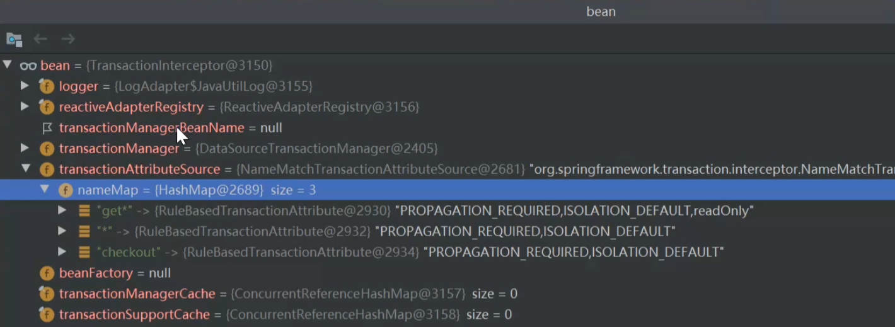

## XML方式事务原理

1、开启注解驱动

```java

```

```
spring-tx.jar META-INF spring.handlers

org.springframework.transaction.config.TxNamespaceHandler
```

```
org.springframework.beans.factory.xml.AbstractBeanDefinitionParser # parse

org.springframework.beans.factory.xml.AbstractSingleBeanDefinitionParser # parseInternal
```

```java
protected final AbstractBeanDefinition parseInternal(Element element, ParserContext parserContext) {
	BeanDefinitionBuilder builder = BeanDefinitionBuilder.genericBeanDefinition();
	String parentName = getParentName(element);
	if (parentName != null) {
		builder.getRawBeanDefinition().setParentName(parentName);
	}
    // org.springframework.transaction.config.TxAdviceBeanDefinitionParser 返回 TransactionInterceptor.class;
	Class<?> beanClass = getBeanClass(element);
	if (beanClass != null) {
		builder.getRawBeanDefinition().setBeanClass(beanClass);
	}
	else {
		String beanClassName = getBeanClassName(element);
		if (beanClassName != null) {
			builder.getRawBeanDefinition().setBeanClassName(beanClassName);
		}
	}
	builder.getRawBeanDefinition().setSource(parserContext.extractSource(element));
	BeanDefinition containingBd = parserContext.getContainingBeanDefinition();
	if (containingBd != null) {
		// Inner bean definition must receive same scope as containing bean.
		builder.setScope(containingBd.getScope());
	}
	if (parserContext.isDefaultLazyInit()) {
		// Default-lazy-init applies to custom bean definitions as well.
		builder.setLazyInit(true);
	}
    // TxAdviceBeanDefinitionParser # doParse
	doParse(element, parserContext, builder);
	return builder.getBeanDefinition();
}
```

```java
@Override
protected void doParse(Element element, ParserContext parserContext, BeanDefinitionBuilder builder) {
	builder.addPropertyReference("transactionManager", TxNamespaceHandler.getTransactionManagerName(element));
    // 解析tx:Attributes标签
	List<Element> txAttributes = DomUtils.getChildElementsByTagName(element, ATTRIBUTES_ELEMENT);
	if (txAttributes.size() > 1) {
		parserContext.getReaderContext().error(
				"Element <attributes> is allowed at most once inside element <advice>", element);
	}
	else if (txAttributes.size() == 1) {
		// Using attributes source.
		Element attributeSourceElement = txAttributes.get(0);
        // 解析tx:Attributes标签内的method标签
		RootBeanDefinition attributeSourceDefinition = parseAttributeSource(attributeSourceElement, parserContext);
		builder.addPropertyValue("transactionAttributeSource", attributeSourceDefinition);
	}
	else {
		// Assume annotations source.
		builder.addPropertyValue("transactionAttributeSource",
				new RootBeanDefinition("org.springframework.transaction.annotation.AnnotationTransactionAttributeSource"));
	}
}
```

解析tx:Attributes标签

解析 tx:method标签

创建NameMatchTransactionAttributeSource Bean定义，放入 TransactionInterceptor


此时端点到refresh最后，查看生成好的实例对象


在invokeBeanFactoryPostProcessors中 处理配置文件中的占位符


通过以下BFPP处理


Spring事务是基于AOP的，所以会首先通过 AspectJAwareAdvisorAutoProxyCreator 创建Advisor Advice等


创建Advisor前先创建advice


具体参考AOP源码


在遇到第一个需要被创建动态代理的类时，开始实例化 TransactionInterceptor


AspectJProxyUtils # isAspectJAdvice(advisor)  #  advisor.getAdvice()





## 注解方式事务原理

### 事务代理入口

SpringBoot的自动装配文件中有TransactionAutoConfiguration，如果项目中导入JDBC包，那么这个自动装配类就会满足条件

事务自动装配中指定了 @EnableTransactionManagement，而它又导入了 TransactionManagementConfigurationSelector，最终会导入一个AOP的MethodInterceptor(Advice的一种)**TransactionInterceptor**的通知


### @Transactional

SpringBoot大行其道的今天，基于XML配置的Spring Framework的使用方式注定已成为过去式。 

注解驱动应用，面向元数据编程已然成受到越来越多开发者的偏好了，毕竟它的便捷程度、优势都是XML方式不可比拟的。 

对SpringBoot有多了解，其实就是看你对Spring Framework有多熟悉~ 比如SpringBoot大量的模块装配的设计模式，其实它属于Spring Framework提供的能力


## Spring事务调用流程

### 被代理方法入口

标注了@Transaction的方法会被代理，那么在调用这些方法的时候，实际上是调用 CglibAopProxy # DynamicAdvisedInterceptor # intercept

```java
public Object intercept(Object proxy, Method method, Object[] args, MethodProxy methodProxy) throws Throwable {
	Object oldProxy = null;
	boolean setProxyContext = false;
	Object target = null;
	TargetSource targetSource = this.advised.getTargetSource();
	try {
		if (this.advised.exposeProxy) {
			// Make invocation available if necessary.
			oldProxy = AopContext.setCurrentProxy(proxy);
			setProxyContext = true;
		}
		// Get as late as possible to minimize the time we "own" the target, in case it comes from a pool...
		target = targetSource.getTarget();
		Class<?> targetClass = (target != null ? target.getClass() : null);
        // 获取该方法匹配的动态代理链
		List<Object> chain = this.advised.getInterceptorsAndDynamicInterceptionAdvice(method, targetClass);
		Object retVal;
		// Check whether we only have one InvokerInterceptor: that is,
		// no real advice, but just reflective invocation of the target.
		if (chain.isEmpty() && Modifier.isPublic(method.getModifiers())) {
			// We can skip creating a MethodInvocation: just invoke the target directly.
			// Note that the final invoker must be an InvokerInterceptor, so we know
			// it does nothing but a reflective operation on the target, and no hot
			// swapping or fancy proxying.
			Object[] argsToUse = AopProxyUtils.adaptArgumentsIfNecessary(method, args);
			retVal = methodProxy.invoke(target, argsToUse);
		}
		else {
			// We need to create a method invocation...
             // 开始调用代理链
			retVal = new CglibMethodInvocation(proxy, target, method, args, targetClass, chain, methodProxy).proceed();
		}
		retVal = processReturnType(proxy, target, method, retVal);
		return retVal;
	}
	finally {
		if (target != null && !targetSource.isStatic()) {
			targetSource.releaseTarget(target);
		}
		if (setProxyContext) {
			// Restore old proxy.
			AopContext.setCurrentProxy(oldProxy);
		}
	}
}
```

### 拦截器链调用

```java
// proceed # proceed
public Object proceed() throws Throwable {
	// We start with an index of -1 and increment early.
    // 当拦截器链执行到最后一个之后，这里开始调用被代理的方法
	if (this.currentInterceptorIndex == this.interceptorsAndDynamicMethodMatchers.size() - 1) {
		return invokeJoinpoint();
	}
    // 遍历拦截器链（）
	Object interceptorOrInterceptionAdvice =
			this.interceptorsAndDynamicMethodMatchers.get(++this.currentInterceptorIndex);
	if (interceptorOrInterceptionAdvice instanceof InterceptorAndDynamicMethodMatcher) {
		// Evaluate dynamic method matcher here: static part will already have
		// been evaluated and found to match.
		InterceptorAndDynamicMethodMatcher dm =
				(InterceptorAndDynamicMethodMatcher) interceptorOrInterceptionAdvice;
		Class<?> targetClass = (this.targetClass != null ? this.targetClass : this.method.getDeclaringClass());
		if (dm.methodMatcher.matches(this.method, targetClass, this.arguments)) {
			return dm.interceptor.invoke(this);
		}
		else {
			// Dynamic matching failed.
			// Skip this interceptor and invoke the next in the chain.
			return proceed();
		}
	}
	else {
		// It's an interceptor, so we just invoke it: The pointcut will have
		// been evaluated statically before this object was constructed.
		return ((MethodInterceptor) interceptorOrInterceptionAdvice).invoke(this);
	}
}
```

拦截器链的第一个是 ExposeInvocationInterceptor # invoke 用来支持整条链的开始的

```java
public Object invoke(MethodInvocation mi) throws Throwable {
	MethodInvocation oldInvocation = invocation.get();
	invocation.set(mi);  // 设置 CglibMethodInvocation
	try {
		return mi.proceed();  // mi 是 CglibMethodInvocation ，那么调用proceed，继续下一个拦截链
	}
	finally {
		invocation.set(oldInvocation);
	}
}
```

如果我们没有配置其他的Advice，那么下一个就是 TransactionInterceptor # invoke 

```java
public Object invoke(MethodInvocation invocation) throws Throwable {
	// Work out the target class: may be {@code null}.
	// The TransactionAttributeSource should be passed the target class
	// as well as the method, which may be from an interface.
    // 获取被代理的对象
	Class<?> targetClass = (invocation.getThis() != null ? AopUtils.getTargetClass(invocation.getThis()) : null);
	// Adapt to TransactionAspectSupport's invokeWithinTransaction...
	return invokeWithinTransaction(invocation.getMethod(), targetClass, invocation::proceed);
}
```


### 开始事务代理方法

TransactionInterceptor

```java
protected Object invokeWithinTransaction(Method method, @Nullable Class<?> targetClass,
		final InvocationCallback invocation) throws Throwable {
	// If the transaction attribute is null, the method is non-transactional.
    // 获取事务属性源对象（内部是一个所有自定义事务配置的map）
    // 如果是通过xml的tx标签配置：NameMatchTransactionAttributeSource
    // 如果是声明式事务：
	TransactionAttributeSource tas = getTransactionAttributeSource();
    // 通过事务树形源对象获取到当前方法的事务属性信息
    // 比如：传播特性、超时时间、是否只读等事务配置
	final TransactionAttribute txAttr = (tas != null ? tas.getTransactionAttribute(method, targetClass) : null);
    // 获取事务管理器（含用户名、密码、驱动、url等信息）
	final TransactionManager tm = determineTransactionManager(txAttr);
    
    ... 响应式相关代码，跳过
        
    // 将事务管理器转成父接口 PlatformTransactionManager
	PlatformTransactionManager ptm = asPlatformTransactionManager(tm);
    // 获取连接点：通过class获取方法的全限定名
	final String joinpointIdentification = methodIdentification(method, targetClass, txAttr);
	if (txAttr == null || !(ptm instanceof CallbackPreferringPlatformTransactionManager)) {
		// Standard transaction demarcation with getTransaction and commit/rollback calls.
         // 创建事务信息
		TransactionInfo txInfo = createTransactionIfNecessary(ptm, txAttr, joinpointIdentification);
		Object retVal;
		try {
			// This is an around advice: Invoke the next interceptor in the chain.
			// This will normally result in a target object being invoked.
             // 创建事务完成后，继续执行增强链，直到最后一个增强链会调用真正的业务代码
			retVal = invocation.proceedWithInvocation();
		}
		catch (Throwable ex) {
			// target invocation exception
			completeTransactionAfterThrowing(txInfo, ex);
			throw ex;
		}
		finally {
			cleanupTransactionInfo(txInfo); // 执行完被代理方法后，清空当前事务信息，恢复被挂起的事务信息
		}
		if (retVal != null && vavrPresent && VavrDelegate.isVavrTry(retVal)) {
			// Set rollback-only in case of Vavr failure matching our rollback rules...
			TransactionStatus status = txInfo.getTransactionStatus();
			if (status != null && txAttr != null) {
				retVal = VavrDelegate.evaluateTryFailure(retVal, txAttr, status);
			}
		}
		commitTransactionAfterReturning(txInfo); // 提交事务
		return retVal;
	}
	else {
		Object result;
		final ThrowableHolder throwableHolder = new ThrowableHolder();
		// It's a CallbackPreferringPlatformTransactionManager: pass a TransactionCallback in.
		try {
			result = ((CallbackPreferringPlatformTransactionManager) ptm).execute(txAttr, status -> {
				TransactionInfo txInfo = prepareTransactionInfo(ptm, txAttr, joinpointIdentification, status);
				try {
					Object retVal = invocation.proceedWithInvocation();
					if (retVal != null && vavrPresent && VavrDelegate.isVavrTry(retVal)) {
						// Set rollback-only in case of Vavr failure matching our rollback rules...
						retVal = VavrDelegate.evaluateTryFailure(retVal, txAttr, status);
					}
					return retVal;
				}
				catch (Throwable ex) {
					if (txAttr.rollbackOn(ex)) {
						// A RuntimeException: will lead to a rollback.
						if (ex instanceof RuntimeException) {
							throw (RuntimeException) ex;
						}
						else {
							throw new ThrowableHolderException(ex);
						}
					}
					else {
						// A normal return value: will lead to a commit.
						throwableHolder.throwable = ex;
						return null;
					}
				}
				finally {
					cleanupTransactionInfo(txInfo);
				}
			});
		}
		catch (ThrowableHolderException ex) {
			throw ex.getCause();
		}
		catch (TransactionSystemException ex2) {
			if (throwableHolder.throwable != null) {
				logger.error("Application exception overridden by commit exception", throwableHolder.throwable);
				ex2.initApplicationException(throwableHolder.throwable);
			}
			throw ex2;
		}
		catch (Throwable ex2) {
			if (throwableHolder.throwable != null) {
				logger.error("Application exception overridden by commit exception", throwableHolder.throwable);
			}
			throw ex2;
		}
		// Check result state: It might indicate a Throwable to rethrow.
		if (throwableHolder.throwable != null) {
			throw throwableHolder.throwable;
		}
		return result;
	}
}
```


### 创建事务信息

```java
protected TransactionInfo createTransactionIfNecessary(@Nullable PlatformTransactionManager tm,
      @Nullable TransactionAttribute txAttr, final String joinpointIdentification) {
   // If no name specified, apply method identification as transaction name.
   if (txAttr != null && txAttr.getName() == null) {
      txAttr = new DelegatingTransactionAttribute(txAttr) {
         @Override
         public String getName() {
            return joinpointIdentification;
         }
      };
   }
    
   // 创建事务状态（保存点：主要用来记录需要回滚的点，比如事务由5条记录组成，我只想回滚2条记录）
   // 标记事务状态，配合事务传播特性使用
   TransactionStatus status = null;
   if (txAttr != null) {
      if (tm != null) {
         // 根据事务属性从事务管理器获取事务状态
         status = tm.getTransaction(txAttr);
      }
      else {
         if (logger.isDebugEnabled()) {
            logger.debug("Skipping transactional joinpoint [" + joinpointIdentification +
                  "] because no transaction manager has been configured");
         }
      }
   }
   // 准备事务信息
   return prepareTransactionInfo(tm, txAttr, joinpointIdentification, status);
}
```

**TransactionStatus 事务状态**

- newTransaction：新事务
- isRollbackOnly：标记了回滚
- isCompleted：已完成

### 获取事务

```java
public final TransactionStatus getTransaction(@Nullable TransactionDefinition definition)
		throws TransactionException {
	// Use defaults if no transaction definition given.
    // 如果没有定义事务信息，使用默认的
	TransactionDefinition def = (definition != null ? definition : TransactionDefinition.withDefaults());
    // 获取事务
	Object transaction = doGetTransaction();
	boolean debugEnabled = logger.isDebugEnabled();
    // 判断当前线程是否存在事务：当前线程的连接(ConnectionHolder)不为空，且连接中的transactionActive属性不为空
	if (isExistingTransaction(transaction)) {
		// Existing transaction found -> check propagation behavior to find out how to behave.
         // 当前线程已经存在事务，走以下方法处理
		return handleExistingTransaction(def, transaction, debugEnabled);
	}
    
	// 检查配置中事务属性的值
    // 事务超时配置的验证 -1
	if (def.getTimeout() < TransactionDefinition.TIMEOUT_DEFAULT) {
		throw new InvalidTimeoutException("Invalid transaction timeout", def.getTimeout());
	}
	// 如果当前事务传播为MANDATORY，而又没有事务，则直接报错
	if (def.getPropagationBehavior() == TransactionDefinition.PROPAGATION_MANDATORY) {
		throw new IllegalTransactionStateException(
				"No existing transaction found for transaction marked with propagation 'mandatory'");
	}
	else if (def.getPropagationBehavior() == TransactionDefinition.PROPAGATION_REQUIRED ||
			def.getPropagationBehavior() == TransactionDefinition.PROPAGATION_REQUIRES_NEW ||
			def.getPropagationBehavior() == TransactionDefinition.PROPAGATION_NESTED) {
         //
		SuspendedResourcesHolder suspendedResources = suspend(null);
		if (debugEnabled) {
			logger.debug("Creating new transaction with name [" + def.getName() + "]: " + def);
		}
		try {
             // 开始创建事务
			return startTransaction(def, transaction, debugEnabled, suspendedResources);
		}
		catch (RuntimeException | Error ex) {
			resume(null, suspendedResources);
			throw ex;
		}
	}
	else {
		// Create "empty" transaction: no actual transaction, but potentially synchronization.
		if (def.getIsolationLevel() != TransactionDefinition.ISOLATION_DEFAULT && logger.isWarnEnabled()) {
			logger.warn("Custom isolation level specified but no actual transaction initiated; " +
					"isolation level will effectively be ignored: " + def);
		}
         // newSynchronization true表示需要将事务信息同步到事务同步器的ThreadLocal
		boolean newSynchronization = (getTransactionSynchronization() == SYNCHRONIZATION_ALWAYS);
		return prepareTransactionStatus(def, null, true, newSynchronization, debugEnabled, null);
	}
}
```


### 获取线程已有事务

DataSourceTransactionManager # doGetTransaction

```java
protected Object doGetTransaction() {
    // 创建一个空的数据源事务对象，保存数据库连接、隔离级别、只读、保存点等信息
	DataSourceTransactionObject txObject = new DataSourceTransactionObject();
    
    // 设置对象的属性
    // 是否允许当前事务设置保持点（默认true，构造函数中设置）
	txObject.setSavepointAllowed(isNestedTransactionAllowed());
    // TransactionSynchronizationManager 事务同步管理器(该类中都是局部线程变量)
    // getResource
	ConnectionHolder conHolder =
			(ConnectionHolder) TransactionSynchronizationManager.getResource(obtainDataSource());
    // 如果获取到连接，证明是线程在之前的方法中创建了连接，此时将当前数据源事务对象标记为 非新建状态
	txObject.setConnectionHolder(conHolder, false);
	return txObject;
}
```

如果是第一次进入方法，只是创建 DataSourceTransactionObject ，其他啥都基本没做


用于管理线程的连接

- resources ：线程私有事务资源
- synchronizations：事务同步
- currentTransactionName：当前事务的名称
- currentTransactionReadOnly：当前事务是否只读
- currentTransactionIsolationLevel：当前事务隔离级别
- actualTransactionActive：实际事务是否激活


### 创建新事务

DefaultTransactionStatus 事务状态 包含 DataSourceTransactionObject 数据源事务对象 持有 数据库连接

```java
private TransactionStatus startTransaction(TransactionDefinition definition, Object transaction,
		boolean debugEnabled, @Nullable SuspendedResourcesHolder suspendedResources) {
    // 新同步事务 true = 0 != 2
	boolean newSynchronization = (getTransactionSynchronization() != SYNCHRONIZATION_NEVER);
    // 创建新事务状态信息  (newSynchronization 新同步？？)
    // 注意这里的第三个参数标志了 newTransaction = true，后续commit的时候会依靠这个参数
    // 也就是说事务状态中newTransaction=true的事务信息对象最终可以真正执行commit
	DefaultTransactionStatus status = newTransactionStatus(
			definition, transaction, true, newSynchronization, debugEnabled, suspendedResources);
    // 根据事务属性创建数据库连接，且开启事务 setAutoCommit(false)
	doBegin(transaction, definition);
    // 准备同步，如果事务状态对象是新同步，那么同步到当前线程
	prepareSynchronization(status, definition);
	return status;
}
```

```java
protected void doBegin(Object transaction, TransactionDefinition definition) {
    // 首次获取事务对象时，创建了一个空的 DataSourceTransactionObject，所以这里可以强转
	DataSourceTransactionObject txObject = (DataSourceTransactionObject) transaction;
	Connection con = null;
	try {
		if (!txObject.hasConnectionHolder() || // 没有连接持有器 或 
				txObject.getConnectionHolder().isSynchronizedWithTransaction()) {
             // 这里拿到了一个连接，如果使用了连接池（Druid）那么会从Druid中拿连接
             // 想看连接池源码可以跟这里
			Connection newCon = obtainDataSource().getConnection();
			if (logger.isDebugEnabled()) {
				logger.debug("Acquired Connection [" + newCon + "] for JDBC transaction");
			}
             // 将连接用ConnectionHolder包装，然后放入数据源事务对象
			txObject.setConnectionHolder(new ConnectionHolder(newCon), true);
		}
         // 标记当前连接是一个同步事务
		txObject.getConnectionHolder().setSynchronizedWithTransaction(true);
		con = txObject.getConnectionHolder().getConnection();
        
         // 根据事务属性设置连接的只读属性和隔离级别
		Integer previousIsolationLevel = DataSourceUtils.prepareConnectionForTransaction(con, definition);
         // txObject 填充 隔离级别、只读
		txObject.setPreviousIsolationLevel(previousIsolationLevel);
		txObject.setReadOnly(definition.isReadOnly());
		// Switch to manual commit if necessary. This is very expensive in some JDBC drivers,
		// so we don't want to do it unnecessarily (for example if we've explicitly
		// configured the connection pool to set it already).
		if (con.getAutoCommit()) { // 关闭自动提交 ---- 事务开始
			txObject.setMustRestoreAutoCommit(true);
			if (logger.isDebugEnabled()) {
				logger.debug("Switching JDBC Connection [" + con + "] to manual commit");
			}
			con.setAutoCommit(false);
		}
         // 如果配置了只读，那这里需要在事务开头执行一条事务设置sql
		prepareTransactionalConnection(con, definition);
		txObject.getConnectionHolder().setTransactionActive(true);  // 标记事务激活
		int timeout = determineTimeout(definition);   // 设置超时
		if (timeout != TransactionDefinition.TIMEOUT_DEFAULT) {
			txObject.getConnectionHolder().setTimeoutInSeconds(timeout);
		}
		// Bind the connection holder to the thread.
		if (txObject.isNewConnectionHolder()) {
             // 将当前数据源和连接绑定到当前线程
             // 当调用到其他方法的时候，如果是同一个数据源那么就不会再创建连接，如果不是同一个数据源才会再次创建
			TransactionSynchronizationManager.bindResource(obtainDataSource(), txObject.getConnectionHolder());
		}
	}
	catch (Throwable ex) {
		if (txObject.isNewConnectionHolder()) {
			DataSourceUtils.releaseConnection(con, obtainDataSource());
			txObject.setConnectionHolder(null, false);
		}
		throw new CannotCreateTransactionException("Could not open JDBC Connection for transaction", ex);
	}
}
```


### 准备TransactionInfo

包装了所有事务信息

```java
protected TransactionInfo prepareTransactionInfo(@Nullable PlatformTransactionManager tm,
		@Nullable TransactionAttribute txAttr, String joinpointIdentification,
		@Nullable TransactionStatus status) {
    
    // 创建对象
	TransactionInfo txInfo = new TransactionInfo(tm, txAttr, joinpointIdentification);
	if (txAttr != null) {
		// We need a transaction for this method...
		if (logger.isTraceEnabled()) {
			logger.trace("Getting transaction for [" + txInfo.getJoinpointIdentification() + "]");
		}
		// The transaction manager will flag an error if an incompatible tx already exists.
		txInfo.newTransactionStatus(status);
	}
	else {
		// The TransactionInfo.hasTransaction() method will return false. We created it only
		// to preserve the integrity of the ThreadLocal stack maintained in this class.
		if (logger.isTraceEnabled()) {
			logger.trace("No need to create transaction for [" + joinpointIdentification +
					"]: This method is not transactional.");
		}
	}
	// We always bind the TransactionInfo to the thread, even if we didn't create
	// a new transaction here. This guarantees that the TransactionInfo stack
	// will be managed correctly even if no transaction was created by this aspect.
    // 将新的事务信息对象绑定到当前线程，且保留老事务信息
    // 当新事务执行完后，用老事务信息恢复
	txInfo.bindToThread();
	return txInfo;
}
```


### 第二个事务方法

如果是同一个数据源，那么就不需要重新创建连接，直接复用


### 已有事务处理

```java
private TransactionStatus handleExistingTransaction(
		TransactionDefinition definition, Object transaction, boolean debugEnabled)
		throws TransactionException {
    // 处理 Never 传播特性：如果外部有事务直接报错
	if (definition.getPropagationBehavior() == TransactionDefinition.PROPAGATION_NEVER) {
		throw new IllegalTransactionStateException(
				"Existing transaction found for transaction marked with propagation 'never'");
	}
    // 处理 NOT_SUPPORTED 传播特性：不使用外部事务，且自己也不开启事务
	if (definition.getPropagationBehavior() == TransactionDefinition.PROPAGATION_NOT_SUPPORTED) {
		if (debugEnabled) {
			logger.debug("Suspending current transaction");
		}
		Object suspendedResources = suspend(transaction);
		boolean newSynchronization = (getTransactionSynchronization() == SYNCHRONIZATION_ALWAYS);
		return prepareTransactionStatus(
				definition, null, false, newSynchronization, debugEnabled, suspendedResources);
	}
    // 处理 REQUIRES_NEW 传播特性：挂起外部事务，自己开启新事务
	if (definition.getPropagationBehavior() == TransactionDefinition.PROPAGATION_REQUIRES_NEW) {
		if (debugEnabled) {
			logger.debug("Suspending current transaction, creating new transaction with name [" +
					definition.getName() + "]");
		}
		SuspendedResourcesHolder suspendedResources = suspend(transaction); // 挂起事务
		try {  // 开启新事务，注意：这里的最后一个参数终于有了值，就是挂起的
			return startTransaction(definition, transaction, debugEnabled, suspendedResources);
		}
		catch (RuntimeException | Error beginEx) {
			resumeAfterBeginException(transaction, suspendedResources, beginEx);
			throw beginEx;
		}
	}
    // 处理 NESTED 传播特性：
	if (definition.getPropagationBehavior() == TransactionDefinition.PROPAGATION_NESTED) {
		if (!isNestedTransactionAllowed()) {  // 没开启配置报错
			throw new NestedTransactionNotSupportedException(
					"Transaction manager does not allow nested transactions by default - " +
					"specify 'nestedTransactionAllowed' property with value 'true'");
		}
		if (debugEnabled) {
			logger.debug("Creating nested transaction with name [" + definition.getName() + "]");
		}
		if (useSavepointForNestedTransaction()) {  // 嵌套事务处理
			// Create savepoint within existing Spring-managed transaction,
			// through the SavepointManager API implemented by TransactionStatus.
			// Usually uses JDBC 3.0 savepoints. Never activates Spring synchronization.
             // 创建新事务状态
			DefaultTransactionStatus status =
					prepareTransactionStatus(definition, transaction, false, false, debugEnabled, null);
             // 给事务状态创建保存点，这个保存点是数据库驱动实现
             // 是给数据库连接设置保存点:SAVEPOINT_1  (1是一个计数器，spring事务实现的)
			status.createAndHoldSavepoint(); 
			return status;
		}
		else {
			// Nested transaction through nested begin and commit/rollback calls.
			// Usually only for JTA: Spring synchronization might get activated here
			// in case of a pre-existing JTA transaction.
			return startTransaction(definition, transaction, debugEnabled, null);
		}
	}
	// Assumably PROPAGATION_SUPPORTS or PROPAGATION_REQUIRED.
	if (debugEnabled) {
		logger.debug("Participating in existing transaction");
	}
	if (isValidateExistingTransaction()) {
		if (definition.getIsolationLevel() != TransactionDefinition.ISOLATION_DEFAULT) {
			Integer currentIsolationLevel = TransactionSynchronizationManager.getCurrentTransactionIsolationLevel();
			if (currentIsolationLevel == null || currentIsolationLevel != definition.getIsolationLevel()) {
				Constants isoConstants = DefaultTransactionDefinition.constants;
				throw new IllegalTransactionStateException("Participating transaction with definition [" +
						definition + "] specifies isolation level which is incompatible with existing transaction: " +
						(currentIsolationLevel != null ?
								isoConstants.toCode(currentIsolationLevel, DefaultTransactionDefinition.PREFIX_ISOLATION) :
								"(unknown)"));
			}
		}
		if (!definition.isReadOnly()) {
			if (TransactionSynchronizationManager.isCurrentTransactionReadOnly()) {
				throw new IllegalTransactionStateException("Participating transaction with definition [" +
						definition + "] is not marked as read-only but existing transaction is");
			}
		}
	}
	boolean newSynchronization = (getTransactionSynchronization() != SYNCHRONIZATION_NEVER);
    // 如果是Requied 这里的第三个参数是false，表示newConnection = false，后续对这个事务信息提交的时候会直接跳过
    // 等到第一个创建连接的事务一起提交
	return prepareTransactionStatus(definition, transaction, false, newSynchronization, debugEnabled, null);
}
```

#### 保存点

就是事务回滚的一个记录点


### 挂起事务

```java
protected final SuspendedResourcesHolder suspend(@Nullable Object transaction) throws TransactionException {
	if (TransactionSynchronizationManager.isSynchronizationActive()) { // 是否是同步活跃状态
		List<TransactionSynchronization> suspendedSynchronizations = doSuspendSynchronization();
		try {
			Object suspendedResources = null;
			if (transaction != null) {
                 // 挂起事务
                 // 解除 数据源事务对象 和 Connection的关系
                 // 事务同步管理器 删除 DataSrouce对象 和 ConnectionHolder
				suspendedResources = doSuspend(transaction);  
			}
             // 将当前线程中关联的事务信息取出，然后清空ThreadLocal
			String name = TransactionSynchronizationManager.getCurrentTransactionName();
			TransactionSynchronizationManager.setCurrentTransactionName(null);
			boolean readOnly = TransactionSynchronizationManager.isCurrentTransactionReadOnly();
			TransactionSynchronizationManager.setCurrentTransactionReadOnly(false);
			Integer isolationLevel = TransactionSynchronizationManager.getCurrentTransactionIsolationLevel();
			TransactionSynchronizationManager.setCurrentTransactionIsolationLevel(null);
			boolean wasActive = TransactionSynchronizationManager.isActualTransactionActive();
			TransactionSynchronizationManager.setActualTransactionActive(false);
             // 返回一个事务挂起器，用于后续恢复
			return new SuspendedResourcesHolder(
					suspendedResources, suspendedSynchronizations, name, readOnly, isolationLevel, wasActive);
		}
		catch (RuntimeException | Error ex) {
			// doSuspend failed - original transaction is still active...
			doResumeSynchronization(suspendedSynchronizations);
			throw ex;
		}
	}
	else if (transaction != null) {
		// Transaction active but no synchronization active.
		Object suspendedResources = doSuspend(transaction);
		return new SuspendedResourcesHolder(suspendedResources);
	}
	else {
		// Neither transaction nor synchronization active.
		return null;
	}
}
```


### 恢复挂起事务

cleanupTransactionInfo，当一个被TransactionInterceptor代理的方法执行完成后，需要清空当前事务，恢复被挂机事务

```java
protected void cleanupTransactionInfo(@Nullable TransactionInfo txInfo) {
	if (txInfo != null) {
		txInfo.restoreThreadLocalStatus();
	}
}

private void restoreThreadLocalStatus() {
	// Use stack to restore old transaction TransactionInfo.
	// Will be null if none was set.
	transactionInfoHolder.set(this.oldTransactionInfo);
}
```

当前事务信息


旧事务信息


### 开始事务提交

commitTransactionAfterReturning(txInfo)

```java
protected void commitTransactionAfterReturning(@Nullable TransactionInfo txInfo) {
   if (txInfo != null && txInfo.getTransactionStatus() != null) {
      if (logger.isTraceEnabled()) {
         logger.trace("Completing transaction for [" + txInfo.getJoinpointIdentification() + "]");
      }
      
      txInfo.getTransactionManager().commit(txInfo.getTransactionStatus());
   }
}
```

```java
public final void commit(TransactionStatus status) throws TransactionException {
	if (status.isCompleted()) { // 事务已提交
		throw new IllegalTransactionStateException(
				"Transaction is already completed - do not call commit or rollback more than once per transaction");
	}
	DefaultTransactionStatus defStatus = (DefaultTransactionStatus) status;
	if (defStatus.isLocalRollbackOnly()) {  // 当前事务状态回滚标记处理
		if (defStatus.isDebug()) {
			logger.debug("Transactional code has requested rollback");
		}
		processRollback(defStatus, false);
		return;
	}
	if (!shouldCommitOnGlobalRollbackOnly() && defStatus.isGlobalRollbackOnly()) {  // 全局回滚标记处理
		if (defStatus.isDebug()) {
			logger.debug("Global transaction is marked as rollback-only but transactional code requested commit");
		}
         // 处理回滚
		processRollback(defStatus, true);
		return;
	}
	processCommit(defStatus); // 处理提交
}
```

### 处理事务提交

嵌套的Required在这里等于只是设置了一个已提交的状态

```java
private void processCommit(DefaultTransactionStatus status) throws TransactionException {
	try {
		boolean beforeCompletionInvoked = false;
		try {
			boolean unexpectedRollback = false;
			prepareForCommit(status);
			triggerBeforeCommit(status);
			triggerBeforeCompletion(status);
			beforeCompletionInvoked = true;
            
			if (status.hasSavepoint()) { // 状态保存点判断，Nested 传播特性才有
				if (status.isDebug()) {
					logger.debug("Releasing transaction savepoint");
				}
				unexpectedRollback = status.isGlobalRollbackOnly();
				status.releaseHeldSavepoint();
			}
			else if (status.isNewTransaction()) { // 判断是否是新事物，无嵌套事务方法的时候这里是true
				if (status.isDebug()) {
					logger.debug("Initiating transaction commit");
				}
				unexpectedRollback = status.isGlobalRollbackOnly();
                 // 当返回到创建连接的第一个事务时
                 // 如果没有嵌套事务方法，可以直接提交事务了
				doCommit(status);  
			}
			else if (isFailEarlyOnGlobalRollbackOnly()) {
				unexpectedRollback = status.isGlobalRollbackOnly();
			}
			// Throw UnexpectedRollbackException if we have a global rollback-only
			// marker but still didn't get a corresponding exception from commit.
			if (unexpectedRollback) {
				throw new UnexpectedRollbackException(
						"Transaction silently rolled back because it has been marked as rollback-only");
			}
		}
		catch (UnexpectedRollbackException ex) {
			// can only be caused by doCommit
			triggerAfterCompletion(status, TransactionSynchronization.STATUS_ROLLED_BACK);
			throw ex;
		}
		catch (TransactionException ex) {
			// can only be caused by doCommit
			if (isRollbackOnCommitFailure()) {
				doRollbackOnCommitException(status, ex);
			}
			else {
				triggerAfterCompletion(status, TransactionSynchronization.STATUS_UNKNOWN);
			}
			throw ex;
		}
		catch (RuntimeException | Error ex) {
			if (!beforeCompletionInvoked) {
				triggerBeforeCompletion(status);
			}
			doRollbackOnCommitException(status, ex);
			throw ex;
		}
		// Trigger afterCommit callbacks, with an exception thrown there
		// propagated to callers but the transaction still considered as committed.
		try {
			triggerAfterCommit(status);  // 触发提交后回调
		}
		finally {
			triggerAfterCompletion(status, TransactionSynchronization.STATUS_COMMITTED);
		}
	}
	finally {
		cleanupAfterCompletion(status);  // 修改当前事务状态为已提交
	}
}
```

### 异常回滚

completeTransactionAfterThrowing(txInfo, ex)

内层Requried事务异常时，调用回滚只是设置了一个 RollbackOnly

```java
protected void completeTransactionAfterThrowing(@Nullable TransactionInfo txInfo, Throwable ex) {
	if (txInfo != null && txInfo.getTransactionStatus() != null) {
		if (logger.isTraceEnabled()) {
			logger.trace("Completing transaction for [" + txInfo.getJoinpointIdentification() +
					"] after exception: " + ex);
		}
         // 事务配置属性不为空 且 当中的rollbackOn属性配置的值是当前异常
         // 如果没指定rollbackOn属性，那么追踪判断是否是运行时异常 或者 是 Error
		if (txInfo.transactionAttribute != null && txInfo.transactionAttribute.rollbackOn(ex)) {
			try {
                  // 回滚处理
				txInfo.getTransactionManager().rollback(txInfo.getTransactionStatus());
			}
			catch (TransactionSystemException ex2) {
				logger.error("Application exception overridden by rollback exception", ex);
				ex2.initApplicationException(ex);
				throw ex2;
			}
			catch (RuntimeException | Error ex2) {
				logger.error("Application exception overridden by rollback exception", ex);
				throw ex2;
			}
		}
		else {
			// We don't roll back on this exception.
			// Will still roll back if TransactionStatus.isRollbackOnly() is true.
			try {
				txInfo.getTransactionManager().commit(txInfo.getTransactionStatus());
			}
			catch (TransactionSystemException ex2) {
				logger.error("Application exception overridden by commit exception", ex);
				ex2.initApplicationException(ex);
				throw ex2;
			}
			catch (RuntimeException | Error ex2) {
				logger.error("Application exception overridden by commit exception", ex);
				throw ex2;
			}
		}
	}
}
```

```java
public final void rollback(TransactionStatus status) throws TransactionException {
	if (status.isCompleted()) {
		throw new IllegalTransactionStateException(
				"Transaction is already completed - do not call commit or rollback more than once per transaction");
	}
	DefaultTransactionStatus defStatus = (DefaultTransactionStatus) status;
	processRollback(defStatus, false);  // 回滚处理
}
```

```java
private void processRollback(DefaultTransactionStatus status, boolean unexpected) {
	try {
		boolean unexpectedRollback = unexpected;
		try {
			triggerBeforeCompletion(status);
			if (status.hasSavepoint()) { // 只有Nested会有保存点
				if (status.isDebug()) {
					logger.debug("Rolling back transaction to savepoint");
				}
                 // 重点：将当前事务回滚到SAVEPOINT
                 // 这里会向数据库请求发送回滚SAVEPOINT命令
				status.rollbackToHeldSavepoint(); 
			}
			else if (status.isNewTransaction()) {  // 只有创建连接的事务信息对象才是True
				if (status.isDebug()) {
					logger.debug("Initiating transaction rollback");
				}
				doRollback(status);
			}
			else {
				// Participating in larger transaction
				if (status.hasTransaction()) {
                      // 默认 isGlobalRollbackOnParticipationFailure=true
					if (status.isLocalRollbackOnly() || isGlobalRollbackOnParticipationFailure()) {
						if (status.isDebug()) {
							logger.debug("Participating transaction failed - marking existing transaction as rollback-only");
						}
						doSetRollbackOnly(status); // 将事务状态中的RollbackOnly设true
					}
					else {
						if (status.isDebug()) {
							logger.debug("Participating transaction failed - letting transaction originator decide on rollback");
						}
					}
				}
				else {
					logger.debug("Should roll back transaction but cannot - no transaction available");
				}
				// Unexpected rollback only matters here if we're asked to fail early
				if (!isFailEarlyOnGlobalRollbackOnly()) {
					unexpectedRollback = false;
				}
			}
		}
		catch (RuntimeException | Error ex) {
			triggerAfterCompletion(status, TransactionSynchronization.STATUS_UNKNOWN);
			throw ex;
		}
		triggerAfterCompletion(status, TransactionSynchronization.STATUS_ROLLED_BACK);
		// Raise UnexpectedRollbackException if we had a global rollback-only marker
		if (unexpectedRollback) {
			throw new UnexpectedRollbackException(
					"Transaction rolled back because it has been marked as rollback-only");
		}
	}
	finally {
		cleanupAfterCompletion(status);
	}
}
```

#### 保存点回滚

```java
public void rollbackToHeldSavepoint() throws TransactionException {
	Object savepoint = getSavepoint();
	if (savepoint == null) {
		throw new TransactionUsageException(
				"Cannot roll back to savepoint - no savepoint associated with current transaction");
	}
	getSavepointManager().rollbackToSavepoint(savepoint);
	getSavepointManager().releaseSavepoint(savepoint);
	setSavepoint(null);
}
```

org.springframework.jdbc.datasource # JdbcTransactionObjectSupport # rollbackToSavepoint

```java
public void rollbackToSavepoint(Object savepoint) throws TransactionException {
	ConnectionHolder conHolder = getConnectionHolderForSavepoint();
	try {
         // java.sql.Connection # rollback(Savepoint savepoint)
		conHolder.getConnection().rollback((Savepoint) savepoint);
		conHolder.resetRollbackOnly(); // 将需要回滚标志重置，后续不需要回滚
	}
	catch (Throwable ex) {
		throw new TransactionSystemException("Could not roll back to JDBC savepoint", ex);
	}
}
```

Nested嵌套事务混滚到保存点，重置这里的回滚标志

**如果上层事务捕获了该异常，那么后续事务整体还会提交**
