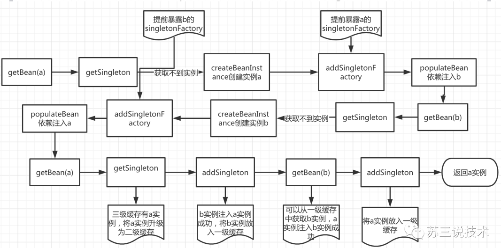

## 问题： 

1.Spring怎么解决循环依赖 

2.为什么要二级缓存和三级缓存 

3.Spring有没有解决构造函数的循环依赖 

4.Spring有没有解决多例下的循环依赖


## 什么是循环依赖

所谓的循环依赖是指，A 依赖 B，B 又依赖 A，它们之间形成了循环依赖。或者是 A 依赖 B，B 依赖 C，C 又依赖 A。它们之间的依赖关系如下


## 三级缓存

DefaultSingletonBeanRegistry

```java
/** 一级缓存 这个就是我们大名鼎鼎的单例缓存池 用于保存我们所有的单实例bean */
private final Map<String, Object> singletonObjects = new ConcurrentHashMap<>(256);
/** 三级缓存 该map用于缓存 key为 beanName value 为ObjectFactory(包装为早期对象) */
private final Map<String, ObjectFactory<?>> singletonFactories = new HashMap<>(16);
/** 二级缓存 ，用于缓存我们的key为beanName value是我们的早期对象(对象属性还没有来得及进行赋值) */
private final Map<String, Object> earlySingletonObjects = new ConcurrentHashMap<>(16);
// 二级缓存earlySingletonObjects它里面的数据什么时候添加什么移除？？?
// 添加：向里面添加数据只有一个地方，就是上面说的getSingleton()里从三级缓存里挪过来
// 移除：addSingleton、addSingletonFactory、removeSingleton从语义中可以看出添加单例、添加单例工厂ObjectFactory的时候都会删除二级缓存里面对应的缓存值，是互斥的


/** Names of beans that are currently in creation. */
	// 这个缓存也十分重要：它表示bean创建过程中都会在里面呆着~
	// 它在Bean开始创建时放值，创建完成时会将其移出~
private final Set<String> singletonsCurrentlyInCreation = Collections.newSetFromMap(new ConcurrentHashMap<>(16));

/** Names of beans that have already been created at least once. */
// 当这个Bean被创建完成后，会标记为这个 注意：这里是set集合 不会重复
// 至少被创建了一次的  都会放进这里~~~~
private final Set<String> alreadyCreated = Collections.newSetFromMap(new ConcurrentHashMap<>(256));
```


## 如何解决循环依赖

一级缓存放最终状态bean

二级缓存放创建中状态bean

三级缓存放获取bean的工厂

	- 无AOP代理：返回普通bean
	- 有AOP代理：根据后置处理器创建代理，返回，并且把代理类放入二级缓存


一级、二级缓存可以解决普通bean的循环依赖问题

三级缓存可以解决被代理bean的循环依赖问题


### 创建原始 bean 对象

```java
instanceWrapper = createBeanInstance(beanName, mbd, args); 
final Object bean = (instanceWrapper != null ? instanceWrapper.getWrappedInstance() : null);
```

### 暴露早期引用

该方法用于把早期对象包装成一个ObjectFactory 暴露到三级缓存中 用于将解决循环依赖..

```java


// singletonFactory 中包含了还未初始化的Bean
protected void addSingletonFactory(String beanName, ObjectFactory<?> singletonFactory) { 
    ... 
        //加入到三级缓存中，，，，，暴露早期对象用于解决循环依赖 
        this.singletonFactories.put(beanName, singletonFactory); 
    ... 
}
```

doCreateBean

```java
protected Object  doCreateBean(String beanName, RootBeanDefinition mbd, @Nullable Object[] args)
			throws BeanCreationException {
    // Instantiate the bean.
		// ##############
		// 实例化bean
		// ##############
		BeanWrapper instanceWrapper = null;
		if (mbd.isSingleton()) {
			// 如果另外单独配置了factoryBean所管理的类，那么会覆盖 factoryBeanInstanceCache
			instanceWrapper = this.factoryBeanInstanceCache.remove(beanName);
		}
		if (instanceWrapper == null) {
			// 创建Bean实例
			instanceWrapper = createBeanInstance(beanName, mbd, args);
		}
		Object bean = instanceWrapper.getWrappedInstance();
		Class<?> beanType = instanceWrapper.getWrappedClass();
		if (beanType != NullBean.class) {
			mbd.resolvedTargetType = beanType;
		}

		// Allow post-processors to modify the merged bean definition.
		// 补充bean定义的bean后置处理器
		// CommonAnnotationBeanPostProcessor
		// 	@PostConstruct @PreDestroy @Resource
		// AutowiredAnnotationBeanPostProcessor
		//	@Autowired @Value @Inject
		synchronized (mbd.postProcessingLock) {
			if (!mbd.postProcessed) {
				try {
					applyMergedBeanDefinitionPostProcessors(mbd, beanType, beanName);
				}
				catch (Throwable ex) {
					throw new BeanCreationException(mbd.getResourceDescription(), beanName,
							"Post-processing of merged bean definition failed", ex);
				}
				mbd.postProcessed = true;
			}
		}

		// ##############
		// 初始化
		// ##############

		// Eagerly cache singletons to be able to resolve circular references
		// even when triggered by lifecycle interfaces like BeanFactoryAware.
		// ####################
		// 循环依赖和AOP的处理
		// ####################
		// 判断bean 是否需要提前曝光
		// 提前缓存单利
		boolean earlySingletonExposure = (mbd.isSingleton() && this.allowCircularReferences &&
				isSingletonCurrentlyInCreation(beanName));
		if (earlySingletonExposure) {
			if (logger.isTraceEnabled()) {
				logger.trace("Eagerly caching bean '" + beanName +
						"' to allow for resolving potential circular references");
			}
			// 添加三级缓存，所有bean都添加
			// 	这个三级缓存中存放的是一个函数式接口
			//	这个接口内的 getEarlyBeanReference 方法就是 SmartInstantiationAwareBeanPostProcessor 后置处理器的调用
			//
			//	AOP就是基于这个beanPostProcessor接口来做的扩展，将传入的bean定义参数创建出一个代理
			//  如果容器没有实现该接口的后置处理器，那么就直接返回入参的第三个参数bean对象（无AOP时）
			//	当然就算接入了AOP类库，那么这个后置处理器内部通过aspectj匹配需要创建代理的类，不匹配的仍然是返回入参的bean对象
			//  #####
			//  	由以上可以看出，假如没有AOP那么这个方法其实是多余的，就是说没有AOP的话，循环依赖只需要二级缓存就可以实现了
			//		如果有AOP但没有这个三级缓存内的创建代理方法，那么就要在这里将原始的Bean实例放入二级缓存，假设A->B->A
			//		那么第一轮B内的A就是原始对象而不是代理对象，那么就是有问题的
			//  #####
			//  这里返回的bean对象会直接放入二级缓存
			addSingletonFactory(beanName, () -> getEarlyBeanReference(beanName, mbd, bean));
		}

		// Initialize the bean instance.
		Object exposedObject = bean;
		try {
			// 属性赋值
			// 	给普通对象的属性设置了AOP的动态代理
			populateBean(beanName, mbd, instanceWrapper);
			// 初始化
			// 如果存在AOP，那么方法内部会调用 BPP 后置处理器的 postProcessAfterInitialization 方法来创建代理
			// 返回的是一个AOP动态代理对象，而这个动态代理的属性并没有设置到动态代理
			exposedObject = initializeBean(beanName, exposedObject, mbd);
		}
		catch (Throwable ex) {
			if (ex instanceof BeanCreationException && beanName.equals(((BeanCreationException) ex).getBeanName())) {
				throw (BeanCreationException) ex;
			}
			else {
				throw new BeanCreationException(
						mbd.getResourceDescription(), beanName, "Initialization of bean failed", ex);
			}
		}

		if (earlySingletonExposure) {
			Object earlySingletonReference = getSingleton(beanName, false);
			if (earlySingletonReference != null) {
				if (exposedObject == bean) {
					exposedObject = earlySingletonReference;
				}
				else if (!this.allowRawInjectionDespiteWrapping && hasDependentBean(beanName)) {
					String[] dependentBeans = getDependentBeans(beanName);
					Set<String> actualDependentBeans = new LinkedHashSet<>(dependentBeans.length);
					for (String dependentBean : dependentBeans) {
						if (!removeSingletonIfCreatedForTypeCheckOnly(dependentBean)) {
							actualDependentBeans.add(dependentBean);
						}
					}

					// 如果没有三级缓存，又使用了AOP会报以下异常
					// 	依赖类的动态代理类，和依赖类的引用被搞混了
					if (!actualDependentBeans.isEmpty()) {
						throw new BeanCurrentlyInCreationException(beanName,
								"Bean with name '" + beanName + "' has been injected into other beans [" +
								StringUtils.collectionToCommaDelimitedString(actualDependentBeans) +
								"] in its raw version as part of a circular reference, but has eventually been " +
								"wrapped. This means that said other beans do not use the final version of the " +
								"bean. This is often the result of over-eager type matching - consider using " +
								"'getBeanNamesForType' with the 'allowEagerInit' flag turned off, for example.");
					}
				}
			}
		}

		// Register bean as disposable.
		// 注册销毁相关
		try {
			registerDisposableBeanIfNecessary(beanName, bean, mbd);
		}
		catch (BeanDefinitionValidationException ex) {
			throw new BeanCreationException(
					mbd.getResourceDescription(), beanName, "Invalid destruction signature", ex);
		}

		return exposedObject;
	}
```

```java
// 根据bean定义判断是返回原始对象 或者是 代理对象
protected Object getEarlyBeanReference(String beanName, RootBeanDefinition mbd, Object bean) {
		Object exposedObject = bean;
    	// mbd.isSynthetic 判断bean是否需要被代理
		if (!mbd.isSynthetic() && hasInstantiationAwareBeanPostProcessors()) {
			for (SmartInstantiationAwareBeanPostProcessor bp : getBeanPostProcessorCache().smartInstantiationAware) {
				exposedObject = bp.getEarlyBeanReference(exposedObject, beanName);
			}
		}
		return exposedObject;
	}
```


```java
// 标识当前是不是循环依赖 如果正在创建并且从一级缓存中没有拿到是不是说明是依赖 
private static Set<String> singletonsCurrentlyInCreation = 
    Collections.newSetFromMap(new ConcurrentHashMap<>(16)); 

/** 
* 创建Bean 
* @param beanName 
* @return 
*/ 
private static Object getBean(String beanName) throws Exception { 
    Class<?> beanClass = Class.forName(beanName); 
    Object bean=getSingleton(beanName); 
    if(bean!=null){ 
        return bean; 
    } 
    // 开始创建Bean 
    singletonsCurrentlyInCreation.add(beanName); 
    // 1.实例化 
    Object beanInstanc = beanClass.newInstance(); 
    ObjectFactory factory= () ‐> { 
        JdkProxyBeanPostProcessor beanPostProcessor=new JdkProxyBeanPostProcessor(); 
        return beanPostProcessor.getEarlyBeanReference(bean,beanName); 
    }; 
    factoryEarlySingletonObjects.put(beanName,factory); 
    // 只是循环依赖才创建动态代理？ //创建动态代理 
    // Spring 为了解决 aop下面循环依赖会在这个地方创建动态代理 Proxy.newProxyInstance 
    // Spring 是不会将aop的代码跟ioc写在一起 
    // 不能直接将Proxy存入二级缓存中 
    // 是不是所有的Bean都存在循环依赖 当存在循环依赖才去调用aop的后置处理器创建动态代理 
    // 存入二级缓存 
    // earlySingletonObjects.put(beanName,beanInstanc); 
    // 2.属性赋值 解析Autowired 
    // 拿到所有的属性名 
    Field[] declaredFields = beanClass.getDeclaredFields();
    // 循环所有属性 
    for (Field declaredField : declaredFields) { 
        // 从属性上拿到@Autowired 
        Autowired annotation = declaredField.getAnnotation(Autowired.class); 
        // 说明属性上面有@Autowired 
        if(annotation!=null){ 
            Class<?> type = declaredField.getType(); 
            //com.tuling.circulardependencies.InstanceB 
            getBean(type.getName()); 
        } 
    } 
    // 3.初始化 (省略） 
    // 创建动态代理 
    // 存入到一级缓存 
    singletonObjects.put(beanName,beanInstanc); 
    return beanInstanc; 
} 

private static Object getSingleton(String beanName){ 
    Object bean = singletonObjects.get(beanName); 
    // 如果一级缓存没有拿到 是不是就说明当前是循环依赖创建 
    if(bean==null && singletonsCurrentlyInCreation.contains(beanName)){ 
        // 调用bean的后置处理器创建动态代理 
        bean=earlySingletonObjects.get(beanName); 
        if(bean==null){ 
            ObjectFactory factory = factoryEarlySingletonObjects.get(beanName); 
            factory.getObject(); 
        } 
    } 
    return bean; 
} 

private static Object getEarlyBeanReference(String beanName, Object bean){ 
    JdkProxyBeanPostProcessor beanPostProcessor=new JdkProxyBeanPostProcessor(); 
    return beanPostProcessor.getEarlyBeanReference(bean,beanName); 
}
```

### 为什么需要三级缓存

bean a 依赖 bean b

bean b 依赖 bean a



像示例的这种情况，a 和 b 都是普通类，不需要被代理只用二级缓存是没有问题的

每次调用三级缓存后把对象放入二级缓存：

因为如果有a和多个属性有循环依赖关系，如b,c,d，那么只要在b中计算一次a的三级缓存函数式接口，那么c,d直接从二级缓存中就可以拿到了，否则，b,c,d 各自引用的a都不是一个对象，特别在a需要被代理的情况下，不可能分别创建三次代理对象


但是涉及到需要创建代理对象，那就不行了


### [多个案例解析](https://zhuanlan.zhihu.com/p/162316846)