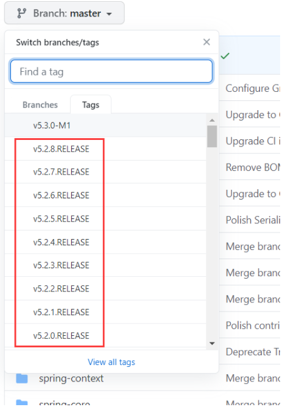
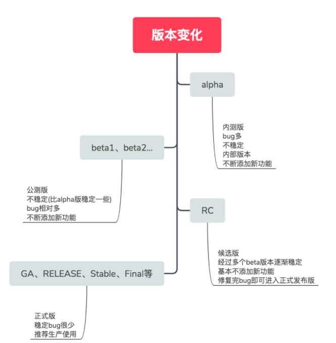

## **准备工作**

**本示例基于 SpringV5.2.7****RELEASE****+GradleWapper+jdk1.8.0_131编译**

### **环境准备**

- maven
- jdk8+
- idea

###  **源码下载**

1. 进入https://github.com/spring-projects/spring-framework

   Spring的源码是发布在github上面的

2. 下载最新版发布版源码



**稍微介绍版本代号** 



**M：**

M1，M2，…中的M是milestone的简写，意思是里程碑，代表着有重大改进的版本

### **构建工具准备**

**安装源码对应的gradle版本（也可不安装），建议使用****gradleWraper****中的gradle。**

**Gadle介绍：**

> Gradle是个构建系统，能够简化你的编译、打包、测试过程。熟悉Java的同学，可以把Gradle类比成Maven
>
> Gradle Wrapper的作用是简化Gradle本身的安装、部署。不同版本的项目可能需要不同版本的Gradle，手工部署的话比较麻烦，而且可能产生冲突，所以需要Gradle Wrapper帮你搞定这些事情。Gradle Wrapper是Gradle项目的一部分。

**gradleWraper****在该文件中有体现，相当于远程自动下载gradle到本地（所以你可以下载gradle，也可以不下，因为可以使用****gradleWraper****远程的统一版本）：**spring-framework-5.2.7.RELEASE\gradle\wrapper\gradle-wrapper.properties，所以如果你需要下载也最好下载该链接对应的gradle版本

**修改build.gradle**  

这个文件就相当于我们Maven的pom.xml 管理项目的依赖等信息...

**设置镜像**	

```txt
repositories {
			maven{ url 'https://maven.aliyun.com/nexus/content/groups/public/'}
            	maven{ url 'https://maven.aliyun.com/nexus/content/repositories/jcenter'}
			mavenCentral()
			maven { url "https://repo.spring.io/libs-spring-framework-build" }
		}
```

### 按照官网的方式编译

> 使用gradlew（gradle-wrapper命令）  先编译oxm:compileTest Java：  Precompile spring-oxm with ./gradlew :spring-oxm:compileTestJava


https://note.youdao.com/ynoteshare/index.html?id=c18f0f8b8bae3dd7e4ff292f043fe932&type=note&_time=1648784360118