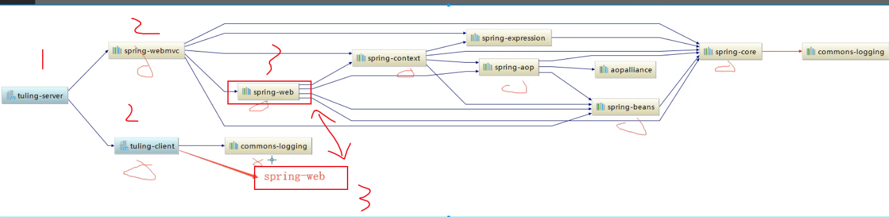
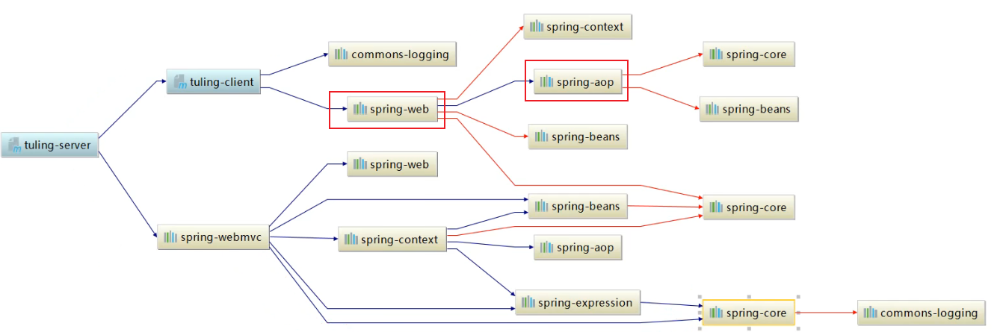
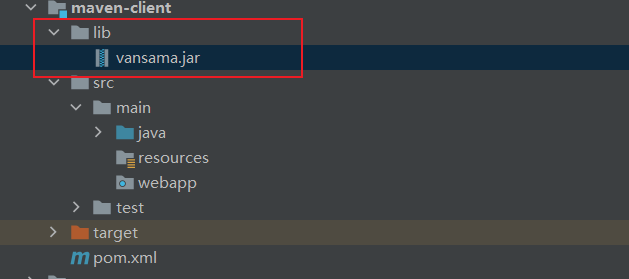
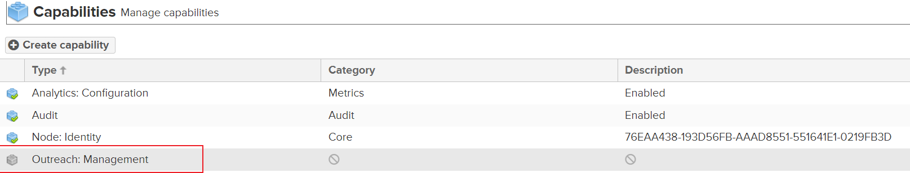
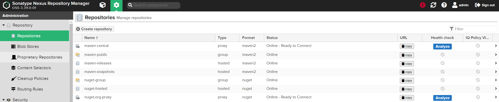
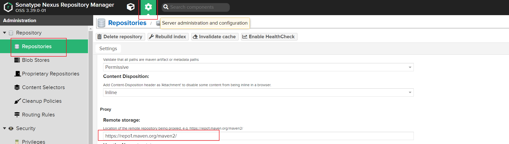
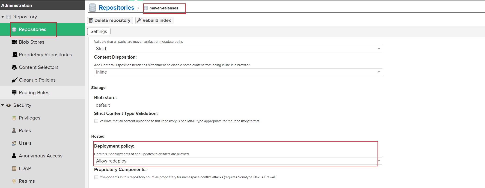

## 介绍

[maven入门文档](https://maven.apache.org/guides/getting-started/index.html)

[3.6.3官方文档](https://maven.apache.org/ref/3.6.3/)


## Maven配置

### 配置文件优先级

~/.m2/settings.xml 优先 环境变量中配置的maven_home/config/settings.xml

### 本地仓库路径

默认 ~/.m2/repository

可以通过配置 settings.xml 来指定

```xml
<!-- Default: ${user.home}/.m2/repository -->
<localRepository>/path/to/local/repo</localRepository>
```


## Pom

默认的编译目录：pom所在目录找 src/main/java

默认编译后的代码目录：pom所在的目录找 target/classes/your-package

默认的测试用例目录：pom所在的目录找 src/test/java

默认的静态文件目录：pom所在的目录找 resources


### 依赖原则

- 第一原则：最短路径优先，离项目越近越优先

- 第二原则：相同路径，配置在前优先，在dependencies节点中，写在前面的优先

- 第三原则：在同一个pom中，相同的包，谁在后面谁优先，相当于覆盖了前面的

  


### 依赖冲突示例



- spring-aop包跟下面的spring-aop包路径一样，所以选优先配置的
- 


### 可选依赖

非必须依赖，可选依赖不会被传递，遇到冲突会被直接忽略

```xml
<dependency>
    ...
    <options>true</options>
</dependency>
```


### 排除

```xml
<dependencies>
    <dependency>
        <groupId>org.springframework</groupId>
        <artifactId>spring-web</artifactId>
        <version>5.3.20</version>
    </dependency>
    <dependency>
        <groupId>org.example</groupId>
        <artifactId>maven-server</artifactId>
        <version>1.0-SNAPSHOT</version>
        <exclusions>
            <exclusion>
                <groupId>org.springframework</groupId>
                <artifactId>spring-web</artifactId>
            </exclusion>
        </exclusions>
    </dependency>
</dependencies>
```


### 范围

```xml
<dependency>
    <groupId>junit</groupId>
    <artifactId>junit</artifactId>
    <version>4.13.1</version>
    <scope>test</scope>
</dependency>
```

- compile（默认）：编译，编译和打包都会依赖

- provided：提供，编译时依赖，但不会打包进去，如：servlet-api

- runtime：运行时，打包时依赖，编译不会，如：mysql-connector-java

- test：测试，编译运行测试用例依赖，不会打包，如：junit

- system：表示由系统中CLASSPATH指定。编译时依赖，不会打包进去。配合<systemPath>一起使用，如：JAVA_HOME下的tool.jar

  

**system**除了可以用于引入系统classpath中的包，也可以引入系统非maven仓库的第三方jar包，做法是将第三方jar放置在项目的lib目录下，然后配置相对路径，但因system不会打包进去所以需要配合maven-dependency-plugin插件配合使用。当然推荐大家还是通过将第三方jar手动install到maven私服

- 引入jdk包

  ```xml
  <dependency>
      <groupId>com.sun</groupId>
      <artifactId>tools</artifactId>
      <version>${java.version}</version>
      <systemPath>${java.home}/../lib/tools.jar</systemPath>
      <scope>system</scope>
      <optional>true</optional>
  </dependency>
  ```

- 引入项目中的包

  ```xml
  <dependency>
      <groupId>vansama</groupId>
      <artifactId>vansama</artifactId>
      <version>1.0.0</version>
      <systemPath>${basedir}/lib/vansama.jar</systemPath>
      <scope>test</scope>
      <optional>true</optional>
  </dependency>
  ```

  

如果对项目打包，这个system的依赖不会被打包

通过maven插件将system依赖打包

```xml
<build>
    <plugins>
        <plugin>
            <groupId>org.apache.maven.plugins</groupId>
            <artifactId>maven-dependency-plugin</artifactId>
            <version>2.8</version>
            <executions>
                <execution>
                    <id>cory-dependencies1</id>
                    <phase>compile</phase>
                    <goals>
                        <goal>cory-dependencies</goal>
                    </goals>
                    <configuration>
                        <outputDirectory>${project.build.directory}/${project.build.finalName}/WEB-INF/lib</outputDirectory>
                        <includeScope>system</includeScope>
                        <!--排除system范围中groupid是com.sun的包-->
                        <excludeGroupIds>com.sun</excludeGroupIds>
                    </configuration>
                </execution>
            </executions>
        </plugin>
    </plugins>
</build>
```


### 继承

继承maven父工程后

- 依赖继承
  - 强依赖：dependencies，子模块直接继承，如果不要需要通过exclusions排除
  - 弱依赖：dependencyManagement > dependencies，子模块自己选择是否要继承，可以省略version
- 属性继承
- 插件继承

以上的配置子工程可以再次进行自定义重写

```xml
<parent>
    <artifactId>maven-demo</artifactId>
    <groupId>org.example</groupId>
    <version>1.0-SNAPSHOT</version>
</parent>
```


**父工程**

```xml
<modelVersion>4.0.0</modelVersion>
<groupId>org.example</groupId>
<artifactId>maven-demo</artifactId>
<packaging>pom</packaging>
<version>1.0-SNAPSHOT</version>
<!--指定子模块-->
<modules>
    <module>maven-client</module>
    <module>maven-server</module>
</modules>
<!--属性继承-->
<properties>
    <maven.compiler.source>8</maven.compiler.source>
    <maven.compiler.target>8</maven.compiler.target>
</properties>
<!--强依赖-->
<dependencies>
    <dependency>
        <groupId>com.alibaba</groupId>
        <artifactId>fastjson</artifactId>
        <version>1.2.76</version>
    </dependency>
</dependencies>
<!--弱依赖-->
<dependencyManagement>
    <dependencies>
        <dependency>
            <groupId>org.projectlombok</groupId>
            <artifactId>lombok</artifactId>
            <version>1.18.16</version>
        </dependency>
    </dependencies>
</dependencyManagement>
```


### 项目构建

- 构建资源配置
- 编译插件
- profile指定编译环境


### 构建资源配置

```xml
<build>
	<resources>
        <resource>
            <directory>src/main/java</directory>
            <includes>
                <!--有时mybatis的xml文件放在了 src/main/java/dao 中-->
                <include>**/*.XML</include>
            </includes>
        </resource>
        <resource>
            <directory>src/main/resources</directory>
            <includes>
                <include>**/*.properties</include>
            </includes>
            <!--会替换properties文件中的占位符，如：name=${my.name}-->
            <!--my.name是在pom的<properties>中-->
            <filtering>true</filtering>
		</resource>
	</resources>
</build>
```

说明：

- resources，build过程中涉及的资源文件
  - targetPath，资源文件的目标路径
  - directory，资源文件的路径，默认位于${basedir}/src/main/resources/目录下
  - includes，一组文件名的匹配模式，被匹配的资源文件将被构建过程处理
  - excludes，一组文件名的匹配模式，被匹配的资源文件将被构建过程忽略。同时被includes和excludes匹配的资源文件将被忽略
  - filtering，默认false，true表示通过参数对资源文件中的${key}在编译时进行动态变更。替换的源可以是-Dkey和pom中的<properties>值或<filters>中指定的properties文件


## 生命周期

### default生命周期

maven生命周期的默认实现

### 生命周期和插件的关系

生命周期的phase（阶段）组成了项目构建的完整过程，但这些过程具体由谁来实现？是插件，maven的核心部分代码量其实很少，其大部分实现都是由插件来完成的。比如：test 阶段就是由 `maven-surefire-plugin`实现。在`pom.xml`中我们可以设定插件目标（gogal?goals）的执行。一个插件有时会实现多个phase，比如：`maven-compiler-plugin`插件分别实现了`compile`和`testCompile`

### phase默认绑定

一些关键的phase都绑定了默认的插件实现

MAVEN_HOME/lib/maven-core-3.6.3.jar 中 META-INF\plexus\default-bindings.xml 指定了phase的绑定关系和packaging的绑定关系


## 插件

```sh
# 查看项目依赖关系
mvn dependency:tree
mvn dependency:list
```


### 插件坐标

插件跟jar包一样需要配置一组坐标信息

```xml
<groupId>org.apache.maven.plugins</groupId>
<artifactId>maven-dependency-plugin</artifactId>
<version>2.8</version>
```

maven自带的一个拷贝jar包插件

```xml
<build>
    <plugins>
        <plugin>
            <groupId>org.apache.maven.plugins</groupId>
            <artifactId>maven-dependency-plugin</artifactId>
            <version>2.8</version>
            <executions>
                <execution>
                    <id>copy-dependencies</id>
                    <!--插件作用的范围-->
                    <phase>compile</phase>
                    <!--插件要实现的目标(具体干的事情)-->
                    <goals>
                        <goal>copy-dependencies</goal>
                    </goals>
                    <!--给-->
                    <configuration>
                        <!--将jar拷贝到以下目录-->
                        <outputDirectory>${project.build.directory}/${project.build.finalName}/WEB-INF/lib</outputDirectory>
                        <includeScope>system</includeScope>
                        <!--排除system范围中groupid是com.sun的包-->
                        <excludeGroupIds>com.sun</excludeGroupIds>
                    </configuration>
                </execution>
            </executions>
        </plugin>
    </plugins>
</build>
```


### 通过命令快速创建项目

```sh
# archetypeArtifactId=maven-archetype-webapp 使用插件提供的项目结构模板
mvn archetype:generate -DgroupId=org.example -DartifactId=quick-webapp -DarchetypeArtifactId=maven-archetype-webapp -DinteractiveMode=false
```


## 命令

### 编译

```sh
maven compile
```


### 测试

```sh
maven test
```

以上命令等价：maven compile test


### 打包

```sh
maven package
```

以上命令等价：maven compile test package


### 清理

```sh
maven clean
```


## 测试

maven默认找src/test/java中执行以 `test*` 开头的方法

```sh
maven test
```

如果有符合规则的类和方法名，那么在测试完后会在 target/surefire-reports 生成测试报告


## Nexus OSS

maven免费私服，[下载地址](http://download.sonatype.com/nexus/3/latest-unix.tar.gz)


### 搭建

安装openJDK

```sh
yum -y install java-1.8.0-openjdk java-1.8.0-openjdk-devel
```

创建nexus目录

```sh
mkdir -p /data/nexus-data /opt/nexus
```

下载nexus，具体可以上官网下载最新版本

```sh
wget -O /tmp/nexus.tar.gz http://download.sonatype.com/nexus/3/latest-unix.tar.gz
```

解压

```sh
tar zxf /tmp/nexus.tar.gz -C /opt
# 修改nexus目录名称
mv nexus-3.39.0-01 nexus
```

创建nexus运行用户

```sh
sudo useradd --system --no-create-home nexus
mkdir -p /home/nexus/.java/.userPrefs

chown -R nexus:nexus /opt/nexus
chown -R nexus:nexus /data/nexus-data
chown -R nexus:nexus /home/nexus/.java/.userPrefs
```

配置环境变量

```sh
vim /etc/profile

# 在/etc/profile底部添加
export JAVA_HOME=/usr/lib/jvm/java-1.8.0-openjdk-1.8.0.332.b09-1.el7_9.x86_64
export NEXUS_HOME=/opt/nexus
export PATH=$PATH:$JAVA_HOME/bin

# 刷新环境变量
source /etc/profile
```

按机器配置调整nexus的jvm启动项、修改数据的存储目录到/data/nexus-data

```sh
vim $NEXUS_HOME/bin/nexus.vmoptions
```

```properties
-Xms512m
-Xmx1g
-XX:MaxDirectMemorySize=1g
-XX:+UnlockDiagnosticVMOptions
-XX:+LogVMOutput
-XX:LogFile=/data/nexus-data/nexus3/log/jvm.log
-XX:-OmitStackTraceInFastThrow
-Djava.net.preferIPv4Stack=true
-Dkaraf.home=.
-Dkaraf.base=.
-Dkaraf.etc=etc/karaf
-Djava.util.logging.config.file=etc/karaf/java.util.logging.properties
-Dkaraf.data=/data/nexus-data/nexus3
-Dkaraf.log=/data/nexus-data/nexus3/log
-Djava.io.tmpdir=/data/nexus-data/nexus3/tmp
-Dkaraf.startLocalConsole=false
-Djdk.tls.ephemeralDHKeySize=2048
```

修改socket端口 

```sh
vim $NEXUS_HOME/etc/nexus-default.properties
```

```properties
# 端口
application-port=56565
application-host=0.0.0.0
nexus-args=${jetty.etc}/jetty.xml,${jetty.etc}/jetty-http.xml,${jetty.etc}/jetty-requestlog.xml
nexus-context-path=/

# Nexus section
nexus-edition=nexus-pro-edition
nexus-features=\
 nexus-pro-feature

nexus.hazelcast.discovery.isEnabled=true

# 修复报头太大的错误
jetty.request.header.size=32768
jetty.response.header.size=32768
```

配置nexus服务启动账号

```sh
vim $NEXUS_HOME/bin/nexus.rc
```

```properties
run_as_user="nexus"
```

为nexus创建linux服务

```properties
[Unit]
Description=Nexus Server
After=syslog.target network.target

[Service]
Type=forking
LimitNOFILE=65536
ExecStart=/opt/nexus/bin/nexus start
ExecStop=/opt/nexus/bin/nexus stop
User=nexus
Group=nexus
Restart=on-failure

[Install]
WantedBy=multi-user.target
```

**启动**

```sh
systemctl start nexus & systemctl enable nexus
```

**访问**

在浏览器通过 `http:/IP:56565/` 访问

右上角使用管理员账号登录，账号admin，默认密码：

```sh
vim /data/nexus-data/nexus3/admin.password
```


### HTTPS

通过nginx反向代理实现，[示例](https://blog.yasithab.com/centos/install-nexus-repository-oss-on-centos-7/)


### 管理

将neuxs的广告关闭

进入/system/capabilities页面，将红圈项禁用




仓库介绍



- maven-central：标准第三方jar包，如果本地仓库没有就回去这个仓库远程下载
- maven-releases：存放自己公司maven项目中以RELEASE版本后缀结尾的项目
- maven-snapshots：存放自己公司maven项目中以SNAPSHOT版本后缀结尾的项目
- maven-public：是group类型，包含了以上三个仓库，公司用这个仓库的地址来配置


将远程仓库设置为国内的仓库地址：http://maven.aliyun.com/nexus/content/groups/public




### 本地配置

修改本地maven的settings.xml文件

```xml
<!--很怪，3.6.3版本mirror和profiles都配置了才能在nexus下载jar-->
<mirror>
  <id>nexus-public</id>
  <mirrorOf>*</mirrorOf>
  <name>nexus-public</name>
  <url>http://ip:port/repository/maven-public/</url>
</mirror>

<servers>
  <server>
    <!--这个id需要与maven工程pom中的distributionManagement repository id 一样-->
    <id>maven-public</id>
    <!--具有deploy权限的账号就可以-->
    <username>admin</username>
    <password>****</password>
  </server>
  <server>
    <!--如果关闭的访客模式，那么这里需要配置profiles的-->
    <id>nexus-public</id>
    <username>admin</username>
    <password>****</password>
  </server>
</servers>

<!--配置项目从哪个仓库拉包，如果配置了profile，那么项目的pom中就不需要配置repositories了-->
<profiles>
  <profile>
    <id>nexus-public</id>
    <repositories>
      <repository>
        <id>maven-public</id>
        <url>http://ip:port/repository/maven-public/</url>
        <releases><enabled>true</enabled></releases>
        <snapshots><enabled>true</enabled></snapshots>
      </repository>
    </repositories>
    <pluginRepositories>
      <pluginRepository>
        <id>maven-public</id>
        <url>http://ip:port/repository/maven-central/</url>
        <releases><enabled>true</enabled></releases>
        <snapshots><enabled>true</enabled></snapshots>
      </pluginRepository>
    </pluginRepositories>
  </profile>
</profiles>
<!--表示启用的profiles-->
<activeProfiles>
  <activeProfile>nexus-public</activeProfile>
</activeProfiles>
```


修改maven工程的pom.xml，注意：如果想通过父工程一次性部署，不单止父工程需要配置，子工程也要配置才会有作用

```xml
<distributionManagement>
    <repository>
        <id>maven-public</id>
        <url>http://ip:port/repository/maven-releases/</url>
    </repository>
    <snapshotRepository>
        <id>maven-public</id>
        <url>http://ip:port/repository/maven-snapshots/</url>
    </snapshotRepository>
</distributionManagement>
```


修改release仓库

默认release仓库只允许提交仓库，不允许修改仓库（不允许再次部署相同版本的jar包），如果不设置在部署时会报一下错误

400 Repository does not allow updating assets: maven-releases


