# SSM搭建

jdk：oracle 1.8

maven：3.6.3

tomcat：9.0.62 [download](https://tomcat.apache.org/download-90.cgi)

idea：2021.03 

注意：使用openjdk1.8 maven无法下载依赖包


创建项目

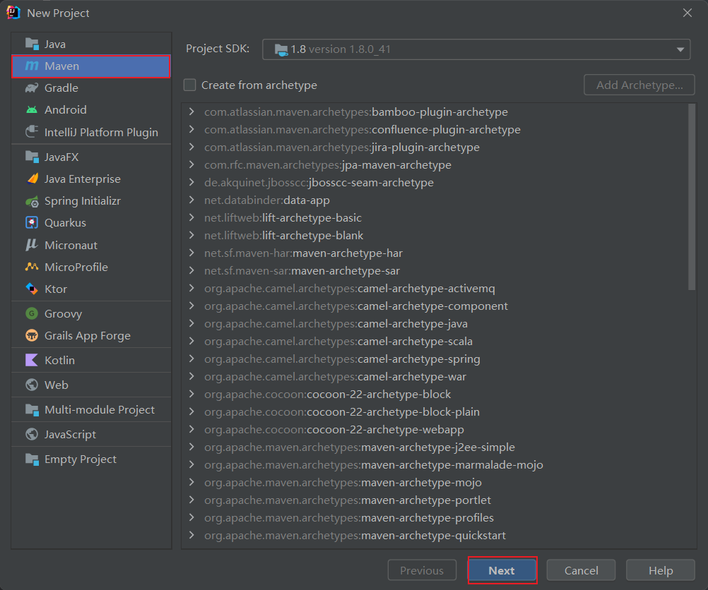


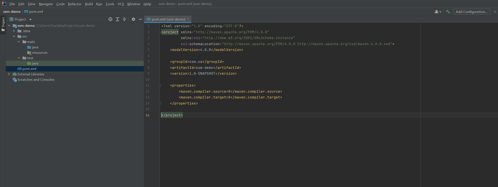

添加 servlet 4.0 web

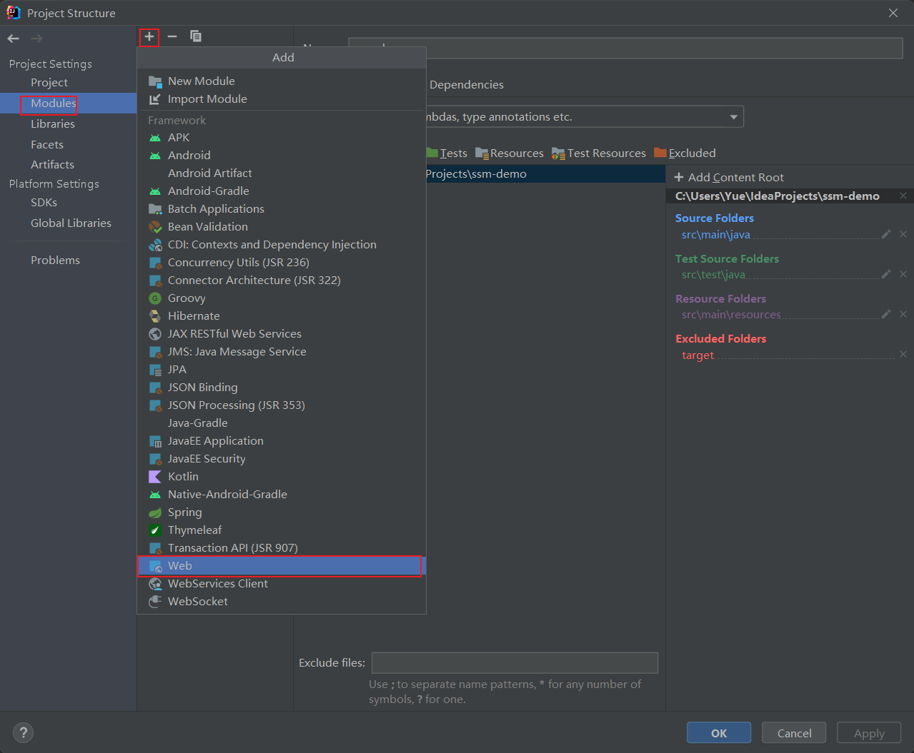


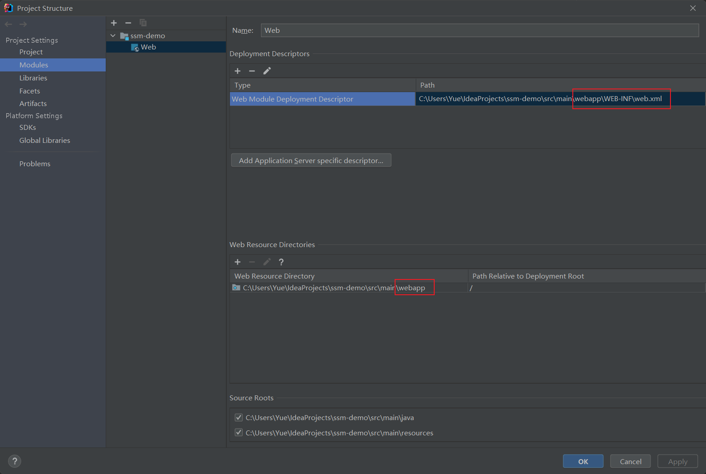

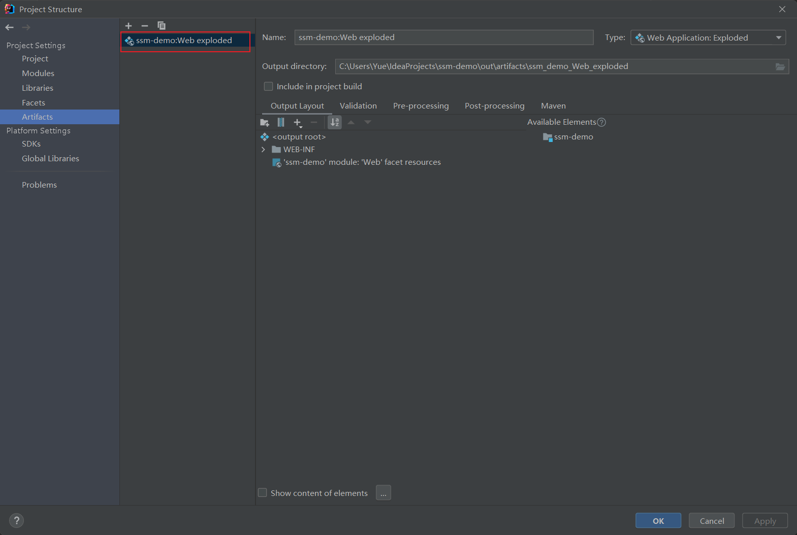

基础的idea maven项目搭建完成

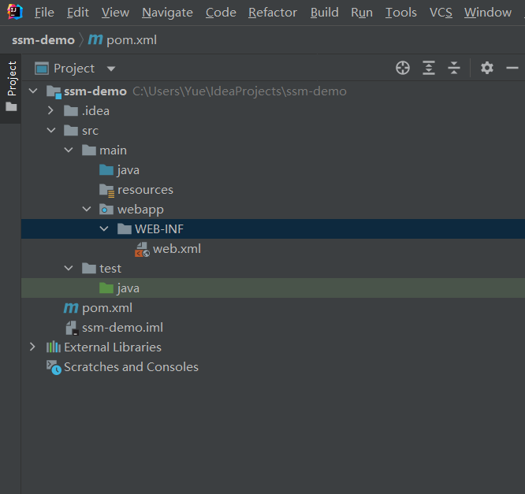

创建基础的目录和文件

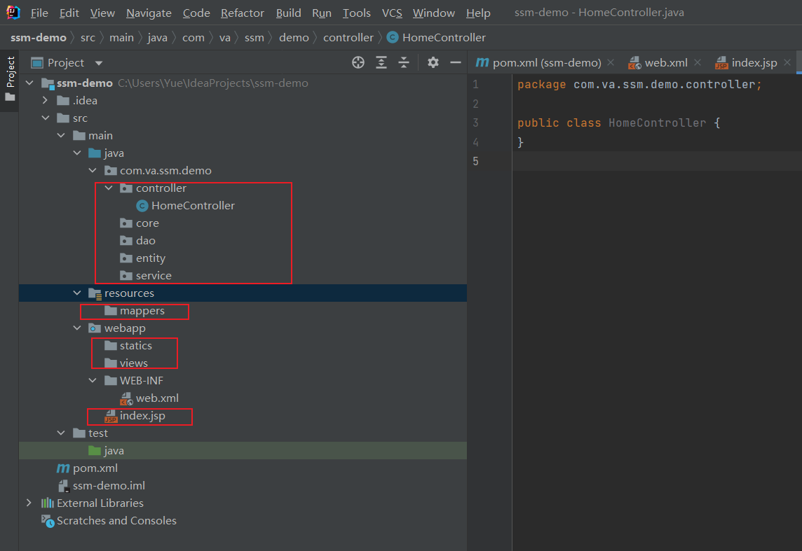

添加maven依赖

```xml
<!-- servlet -->
<dependency>
    <groupId>javax.servlet</groupId>
    <artifactId>javax.servlet-api</artifactId>
    <version>4.0.1</version>
    <scope>provided</scope>
</dependency>
<!-- jsp -->
<dependency>
    <groupId>javax.servlet.jsp</groupId>
    <artifactId>javax.servlet.jsp-api</artifactId>
    <version>2.3.3</version>
    <scope>provided</scope>
</dependency>
<dependency>
    <groupId>javax.servlet</groupId>
    <artifactId>jstl</artifactId>
    <version>1.2</version>
</dependency>
<!-- spring -->
<dependency>
    <groupId>org.springframework</groupId>
    <artifactId>spring-webmvc</artifactId>
    <version>5.3.18</version>
</dependency>
<!--        spring-orm-->
<!-- mybatis -->
<dependency>
    <groupId>org.mybatis</groupId>
    <artifactId>mybatis</artifactId>
    <version>3.5.9</version>
</dependency>
<!--        mybatis-spring-->
<!-- mysql -->
<dependency>
    <groupId>mysql</groupId>
    <artifactId>mysql-connector-java</artifactId>
    <version>8.0.28</version>
</dependency>
<!-- connect pool -->
<dependency>
    <groupId>com.alibaba</groupId>
    <artifactId>druid</artifactId>
    <version>1.2.8</version>
</dependency>
<!-- log -->
<dependency>
    <groupId>ch.qos.logback</groupId>
    <artifactId>logback-classic</artifactId>
    <version>1.2.11</version>
    <scope>test</scope>
</dependency>
<!-- unit test -->
<dependency>
    <groupId>org.junit.jupiter</groupId>
    <artifactId>junit-jupiter-api</artifactId>
    <version>5.8.2</version>
    <scope>test</scope>
</dependency>
```

每次添加新的包都要手动移过去

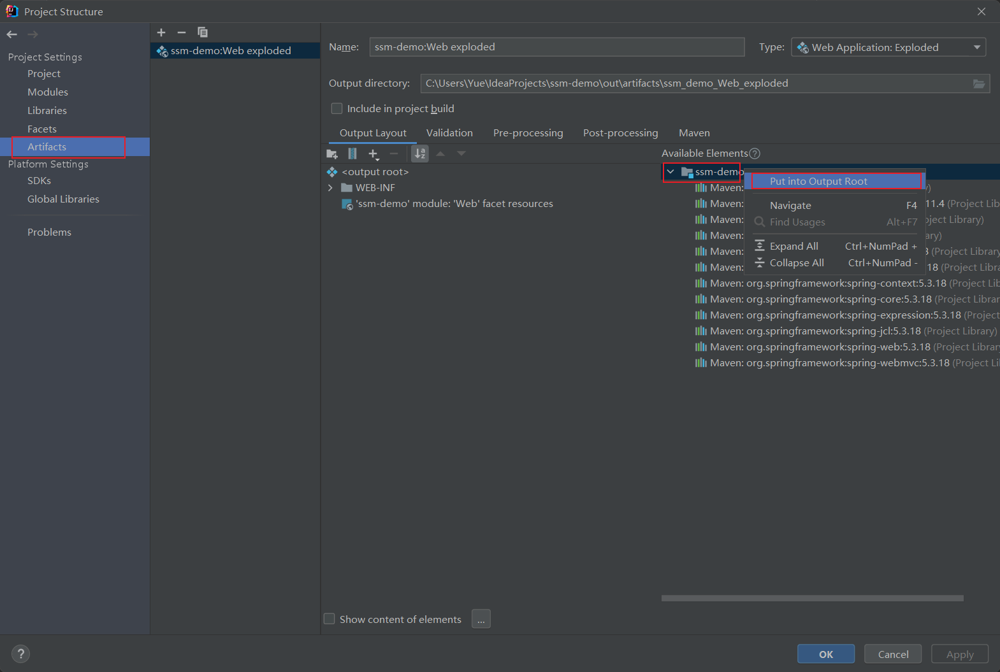

## 配置tomcat

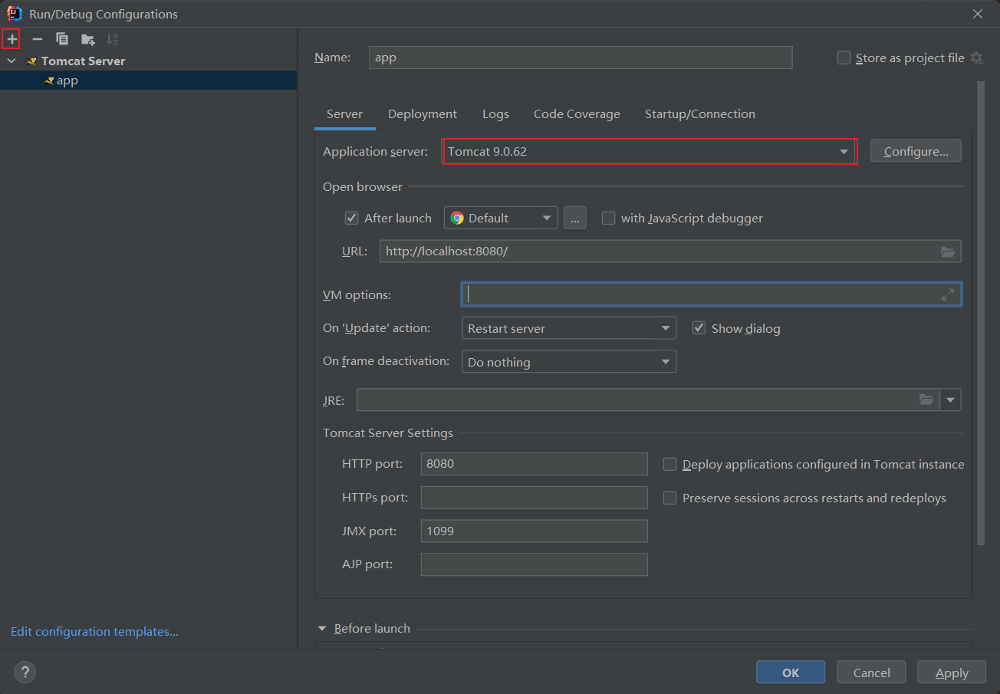

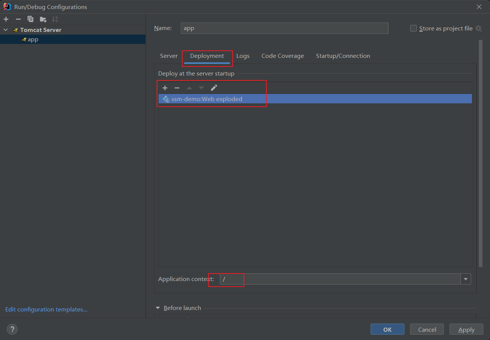

### IDEA 日志输出乱码

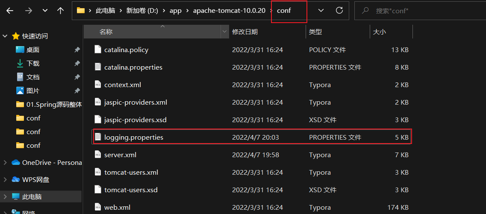

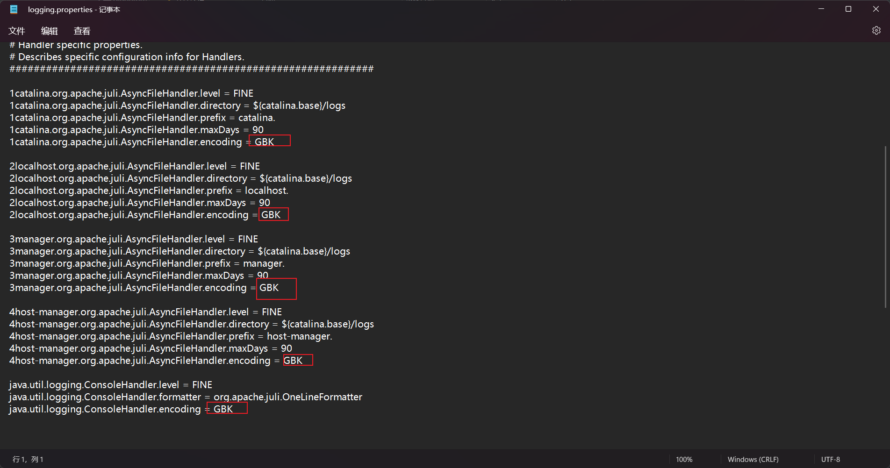

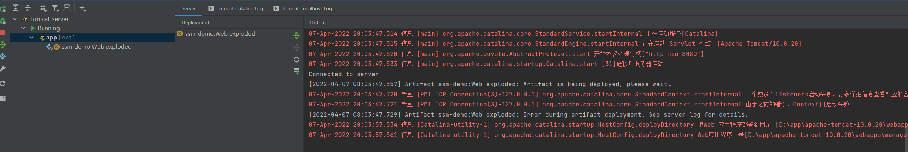

## 配置Spring MVC

### 配置Servlet

WEB-INF/web.xml

```xml
<?xml version="1.0" encoding="UTF-8"?>
<web-app xmlns="http://xmlns.jcp.org/xml/ns/javaee"
         xmlns:xsi="http://www.w3.org/2001/XMLSchema-instance"
         xsi:schemaLocation="http://xmlns.jcp.org/xml/ns/javaee http://xmlns.jcp.org/xml/ns/javaee/web-app_4_0.xsd"
         version="4.0">
    <listener>
        <listener-class>org.springframework.web.context.ContextLoaderListener</listener-class>
    </listener>

    <!--post时中文乱码处理-->
    <filter>
        <filter-name>CharacterEncodingFilter</filter-name>
        <filter-class>org.springframework.web.filter.CharacterEncodingFilter</filter-class>
        <init-param>
            <param-name>encoding</param-name>
            <param-value>UTF-8</param-value>
        </init-param>
    </filter>
    <filter-mapping>
        <filter-name>CharacterEncodingFilter</filter-name>
        <servlet-name>app</servlet-name>
    </filter-mapping>
    <!--servlet添加支持delete, put等-->
    <filter>
        <filter-name>HiddenHttpMethodFilter</filter-name>
        <filter-class>org.springframework.web.filter.HiddenHttpMethodFilter</filter-class>
    </filter>
    <filter-mapping>
        <filter-name>HiddenHttpMethodFilter</filter-name>
        <servlet-name>app</servlet-name>
    </filter-mapping>

    <context-param>
        <param-name>contextConfigLocation</param-name>
        <param-value>/WEB-INF/app-context.xml</param-value>
    </context-param>

    <servlet>
        <servlet-name>app</servlet-name>
        <servlet-class>org.springframework.web.servlet.DispatcherServlet</servlet-class>
        <init-param>
            <param-name>contextConfigLocation</param-name>
            <param-value>/WEB-INF/app-context.xml</param-value>
        </init-param>
        <load-on-startup>1</load-on-startup>
    </servlet>

    <servlet-mapping>
        <servlet-name>app</servlet-name>
        <url-pattern>/</url-pattern>
    </servlet-mapping>
</web-app>
```


### 配置Spring

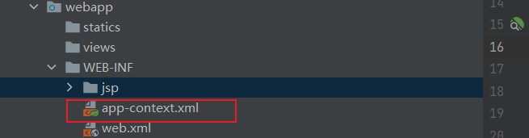

```xml
<?xml version="1.0" encoding="UTF-8"?>
<beans xmlns="http://www.springframework.org/schema/beans"
       xmlns:xsi="http://www.w3.org/2001/XMLSchema-instance"
       xmlns:mvc="http://www.springframework.org/schema/mvc"
       xmlns:context="http://www.springframework.org/schema/context"
       xsi:schemaLocation="
       http://www.springframework.org/schema/beans
       http://www.springframework.org/schema/beans/spring-beans.xsd
       http://www.springframework.org/schema/context
       http://www.springframework.org/schema/context/spring-context.xsd
       http://www.springframework.org/schema/mvc
       https://www.springframework.org/schema/mvc/spring-mvc.xsd">

    <!--包扫描-->
    <context:component-scan base-package="com.va.ssm.demo"/>

    <!--视图解析器-->
    <bean id="viewResolver" class="org.springframework.web.servlet.view.InternalResourceViewResolver">
        <property name="viewClass" value="org.springframework.web.servlet.view.JstlView"/>
        <property name="prefix" value="/WEB-INF/jsp/"/>
        <property name="suffix" value=".jsp"/>
    </bean>
</beans>
```


### 创建测试控制器

```java
import org.springframework.stereotype.Controller;
import org.springframework.ui.Model;
import org.springframework.web.bind.annotation.GetMapping;

@Controller
public class HomeController {

    @GetMapping("/hello")
    public String home(Model model){
        model.addAttribute("message", "Hello World!");
        model.addAttribute("kaka", "LOL!!!!!!!!!");
        System.out.println("home controller");
        return "hello";
    }
}
```


### 创建测试jsp

WEB-INFO/jsp/hello.jsp

```html
<%@ page contentType="text/html;charset=UTF-8" language="java" %>
<html>
<head>
    <title>Hello</title>
</head>
<body>
<h1>${message}</h1>
<h1>${kaka}</h1>
</body>
</html>
```

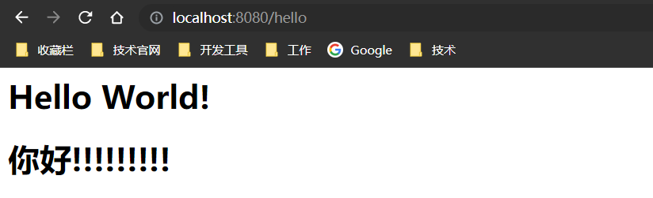

### 显示图片

```html

```


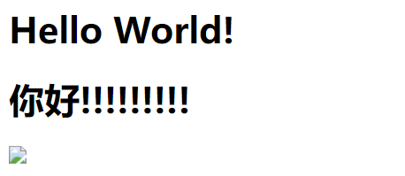

图片也dispatcher匹配到了

app-context.xml

```xml
<!--设置静态资源不过滤-->
<mvc:annotation-driven/>
<mvc:resources mapping="/statics/css/**" location="statics/image"/>
<mvc:resources mapping="/statics/js/**" location="statics/js/"/>
<mvc:resources mapping="/statics/image/**" location="statics/image/"/>
```


### 容器隔离

web.xml

```xml
<?xml version="1.0" encoding="UTF-8"?>
<web-app xmlns="http://xmlns.jcp.org/xml/ns/javaee"
         xmlns:xsi="http://www.w3.org/2001/XMLSchema-instance"
         xsi:schemaLocation="http://xmlns.jcp.org/xml/ns/javaee http://xmlns.jcp.org/xml/ns/javaee/web-app_4_0.xsd"
         version="4.0">
    <context-param>
        <param-name>contextConfigLocation</param-name>
        <param-value>/WEB-INF/root-context.xml</param-value>
    </context-param>

    <listener>
        <!--spring 入口：读取配置文件，实例化spring容器等-->
        <!--读取context-param:contextConfigLocation用于创建root webApplicationContext-->
        <listener-class>org.springframework.web.context.ContextLoaderListener</listener-class>
    </listener>

    <!--post时中文乱码处理-->
    <filter>
        <filter-name>CharacterEncodingFilter</filter-name>
        <filter-class>org.springframework.web.filter.CharacterEncodingFilter</filter-class>
        <init-param>
            <param-name>encoding</param-name>
            <param-value>UTF-8</param-value>
        </init-param>
    </filter>
    <filter-mapping>
        <filter-name>CharacterEncodingFilter</filter-name>
        <servlet-name>app</servlet-name>
    </filter-mapping>
    <!--servlet添加支持delete, put等-->
    <filter>
        <filter-name>HiddenHttpMethodFilter</filter-name>
        <filter-class>org.springframework.web.filter.HiddenHttpMethodFilter</filter-class>
    </filter>
    <filter-mapping>
        <filter-name>HiddenHttpMethodFilter</filter-name>
        <servlet-name>app</servlet-name>
    </filter-mapping>

    <servlet>
        <servlet-name>app</servlet-name>
        <servlet-class>org.springframework.web.servlet.DispatcherServlet</servlet-class>
        <init-param>
            <param-name>contextConfigLocation</param-name>
            <!--默认读取： webapps WEB-INF servletName-servlet.xml-->
            <!--注意：容器隔离的时候不能省略-->
            <param-value>/WEB-INF/app-context.xml</param-value>
        </init-param>
        <load-on-startup>1</load-on-startup>
    </servlet>

    <servlet-mapping>
        <servlet-name>app</servlet-name>
        <url-pattern>/</url-pattern>
    </servlet-mapping>
</web-app>
```

app-context.xml

```xml
<?xml version="1.0" encoding="UTF-8"?>
<beans xmlns="http://www.springframework.org/schema/beans"
       xmlns:xsi="http://www.w3.org/2001/XMLSchema-instance"
       xmlns:mvc="http://www.springframework.org/schema/mvc"
       xmlns:context="http://www.springframework.org/schema/context"
       xsi:schemaLocation="
       http://www.springframework.org/schema/beans
       http://www.springframework.org/schema/beans/spring-beans.xsd
       http://www.springframework.org/schema/context
       http://www.springframework.org/schema/context/spring-context.xsd
       http://www.springframework.org/schema/mvc
       https://www.springframework.org/schema/mvc/spring-mvc.xsd">

    <!--包扫描-->
    <context:component-scan base-package="com.va.ssm.demo.controller"/>

    <!--视图解析器-->
    <bean id="viewResolver" class="org.springframework.web.servlet.view.InternalResourceViewResolver">
        <property name="viewClass" value="org.springframework.web.servlet.view.JstlView"/>
        <property name="prefix" value="/WEB-INF/jsp/"/>
        <property name="suffix" value=".jsp"/>
    </bean>

    <!--设置静态资源不过滤-->
    <mvc:annotation-driven/>
    <mvc:resources mapping="/statics/css/**" location="statics/image"/>
    <mvc:resources mapping="/statics/js/**" location="statics/js/"/>
    <mvc:resources mapping="/statics/image/**" location="statics/image/"/>

</beans>
```

root-context.xml

```xml
<?xml version="1.0" encoding="UTF-8"?>
<beans xmlns="http://www.springframework.org/schema/beans"
       xmlns:xsi="http://www.w3.org/2001/XMLSchema-instance"
       xmlns:context="http://www.springframework.org/schema/context"
       xsi:schemaLocation="
       http://www.springframework.org/schema/beans
       http://www.springframework.org/schema/beans/spring-beans.xsd
       http://www.springframework.org/schema/context
       http://www.springframework.org/schema/context/spring-context.xsd">

    <!--包扫描-->
    <context:component-scan base-package="com.va.ssm.demo"/>
</beans>
```

创建一个测试服务类，检测是否能从根容器中获取到对象

```java
import org.springframework.stereotype.Service;

@Service
public class TestService {
    public String getText(){
        return "Text !!!!!!!!!!!!!!!!!!!!!!!!!!!!!!!";
    }
}
```

HomeController

```java
import com.va.ssm.demo.service.TestService;
import org.springframework.beans.factory.annotation.Autowired;
import org.springframework.stereotype.Controller;
import org.springframework.ui.Model;
import org.springframework.web.bind.annotation.GetMapping;

@Controller
public class HomeController {

    @Autowired
    TestService testService;

    @GetMapping("/hello")
    public String home(Model model){
        model.addAttribute("message", "Hello World!");
        model.addAttribute("kaka", "你好!!!!!!!!!");
        model.addAttribute("test", testService.getText());
        System.out.println("home controller");
        return "hello";
    }
}
```

hello.jsp

```html
<h1>${test}</h1>
```


## 配置Mybatis

[spring-mybatis doc](http://mybatis.org/spring/zh/index.html)

```xml
<dependency>
    <groupId>org.mybatis</groupId>
    <artifactId>mybatis-spring</artifactId>
    <version>2.0.7</version>
</dependency>
```


### 配置数据源

[durid doc](https://github.com/alibaba/druid/wiki/DruidDataSource%E9%85%8D%E7%BD%AE)

root-context.xml

```xml
<bean id="dataSource" class="com.alibaba.druid.pool.DruidDataSource" init-method="init" destroy-method="close">
    <property name="url" value="${jdbc_url}" />
    <property name="username" value="${jdbc_user}" />
    <property name="password" value="${jdbc_password}" />
    <property name="filters" value="stat" />
    <!-- 配置初始化大小、最小、最大 -->
    <property name="initialSize" value="1" />
    <property name="minIdle" value="1" />
    <property name="maxActive" value="20" />
    <!-- 配置获取连接等待超时的时间 -->
    <property name="maxWait" value="6000" />
    <!-- 配置间隔多久才进行一次检测，检测需要关闭的空闲连接，单位是毫秒 -->
    <property name="timeBetweenEvictionRunsMillis" value="60000" />
    <!-- 配置一个连接在池中最小生存的时间，单位是毫秒 -->
    <property name="minEvictableIdleTimeMillis" value="300000" />
    <property name="testWhileIdle" value="true" />
    <property name="testOnBorrow" value="false" />
    <property name="testOnReturn" value="false" />
    <property name="poolPreparedStatements" value="true" />
    <property name="maxOpenPreparedStatements" value="20" />
    <property name="asyncInit" value="true" />
</bean>
<bean id="sqlSessionFactory" class="org.mybatis.spring.SqlSessionFactoryBean">
    <property name="dataSource" ref="dataSource" />
</bean>
```

mapper示例

```xml
<?xml version="1.0" encoding="UTF-8" ?>
<!DOCTYPE mapper
        PUBLIC "-//mybatis.org//DTD Mapper 3.0//EN"
        "http://mybatis.org/dtd/mybatis-3-mapper.dtd">
<mapper namespace="com.va.ssm.demo.dao.UserDao">

</mapper>
```

