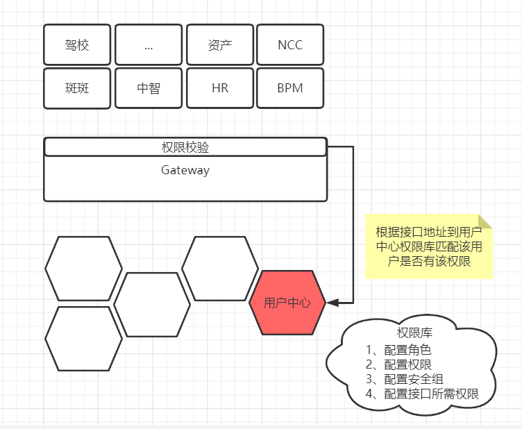

# 用户中心（身份服务中心）


### 文档说明

移除URL编码，增加换行符，增强可读性

参数标 * 表示必须


### 目录

[API概要（v1.0）](API概览.md)

[OAuth2协议简介（待完善）](概念介绍/OAuth2.md)

[OpenId Connect协议简介（待完善）](概念介绍/OpenId Connect.md)


### 功能清单

* 单点登录
* API访问控制
* 外部认证（微信）
* 应用管理
* 用户管理
* 审计日志
* 认证授权
* OAuth2、OpenId Connect 实现
* AD 域集成


## 补充

##### 问题一：jwt 验证

获取 jwt 公钥 jwk (json web key)，该公钥可以解开用户中心下发的所有jwt，能解开即可证明是有效的jwt

```http
Get /.well-known/openid-configuration/jwts
```

jwk 示例

```json
{
    "keys":	
    [       
        { 
            "kty":"RSA",
            "use":"sig",
            "kid":"DFC37130B55CDA1270EF5877ED19C4DB",
            "e":"AQAB",
            "n":"uP_luEtBhxWT7cvBmB_lpIDtxfHKzqU5QE-4XD1BPOAm4AOjn6LfF1PyKmeVLRyulotGDSGoF9WoMviLurWH4qG4e7ZivZqiK9i2jAra2c7FmyU25hfrLynpnGgaZro_Nz2iT4G3-c6CvSEHY3ZI_cW-Se8hNci8eGpE2SM6i0qS34SLfYxTjD27cFjxqz_7HPuc9N_Vfl18aGUNYeCB_boX5vm7U52Fi7gr_rNeLQGlMm64jV6kGM5te2Isz1HCe-a5WfPqWjmOkwbh8CPyPUJI6F2IblqeqG3xMoy_JTfmYvZbNcRzDDuAqzGdnlzQdN1i8wMPeq5mzC688lRteQ",
            "alg":"RS256"
        }
    ]
}
```

| 参数 | 描述                                                         |
| ---- | ------------------------------------------------------------ |
| kty  | Key Type 密钥类型，标识与密钥一起使用的加密算法，如“RSA”或“EC” |
| use  | 用于指示是否使用公钥加密数据或验证数据上的签名，sig（验证）、enc（加密） |
| alg  | 秘钥算法                                                     |
| kid  | 参数用于匹配特定的密钥，keys是数组，可能包含多个对象         |
| n    | 秘钥本身                                                     |


##### 如何解密

由于是标准的 jwks + jwt，所以任何语言都有现成实现

c# net core：自带认证中间件默认实现

c# net framework：Microsoft.IdentityModel.Tokens、System.IdentityModel.Tokens.Jwt [实现示例](https://stackoverflow.com/questions/58601556/how-to-validate-jwt-token-using-jwks-in-dot-net-core)

java：[Auth0](https://auth0.com/)


 jwk 应该被缓存起来

方式一：可以在每个应用程序启动时请求用户中心获取jwk并且缓存

方式二：可以缓存在redis中

方式三：在网关缓存 jwk 对所有请求验证，后续的服务默认认为 jwt 有效，解析即用

方式四：istio 过滤器对所有请求验证 jwk，后续的所有处理程序默认认为 jwt 有效，解析即用

## 


##### 问题二：权限校验

判断当前的接口请求是否有权限

用户中心目前的权限控制粒度在该用户是否能访问该服务，更细的比如：服务内的某API，主要还是由当前服务自身决定

为了缩短自研系统开发周期，可以提供一套默认的鉴权逻辑。

