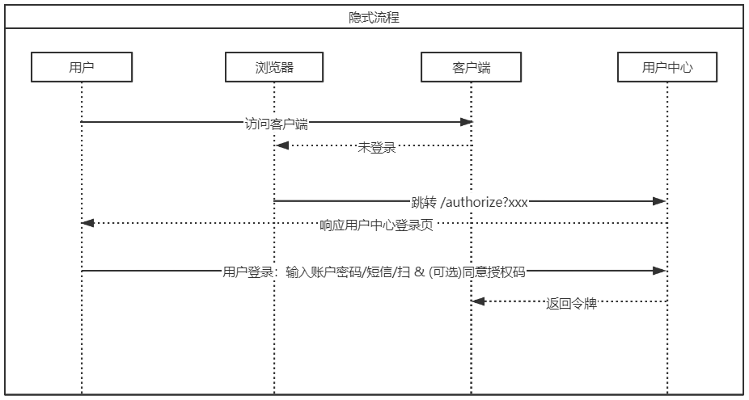

# Implicit

用于前后端分离架构的前端(spa)接入，无需后台交互、不包含刷新令牌

### 时序图



### 请求

```http
 GET /connect/authorize?
 
    response_type=token
    client_id=6731de76-14a6-49ae-97bc-6eba6914391e
    &response_type=id_token
    &redirect_uri=http%3A%2F%2Flocalhost%2Fmyapp%2F
    &scope=openid
    &state=12345
    &nonce=678910
```

| 参数            |  说明                                                         |
| :-------------- |  :----------------------------------------------------------- |
| `*client_id`     | 分配给应用的应用程序（客户端）ID。                           |
| `*response_type` |  此处是 `token`，如果走 OpenID Connect 协议则为`id_token` 。  |
| `*redirect_uri`  |  应用的 redirect_uri，应用可向其发送及从其接收身份验证响应。 它必须完全符合在门户中注册的其中一个 redirect_uris，否则必须是编码的 url。 |
| `*scope`         |  [范围](https://docs.microsoft.com/zh-cn/azure/active-directory/develop/v2-permissions-and-consent)的空格分隔列表。 如果走 OpenID Connect 协议则必须包含 `openid`。 或者，也可以包含 `email` 和 `profile` 范围，以获取对其他用户数据的访问权限。 |
| `*state`         |  同样随令牌响应返回的请求中所包含的值。 可以是想要的任何内容的字符串。 随机生成的唯一值通常用于 [防止跨站点请求伪造攻击](https://tools.ietf.org/html/rfc6749#section-10.12)。 该 state 也用于在身份验证请求出现之前，于应用中编码用户的状态信息，例如之前所在的网页或视图。 |
| `*nonce`         |  由应用程序生成且包含在请求中的值，以声明方式包含在生成的 id_token 中。 应用程序接着便可确认此值，以减少令牌重新执行攻击。 此值通常是随机的唯一字符串，可用以识别请求的来源。 只有请求 id_token 时才是必需的。 |


### 响应

注意这里返回的access_token是在#号后面而不是querystring

```http
 HTTP/1.1 302 Found
     Location: http://example.com/cb#access_token=2YotnFZFEjr1zCsicMWpAA
               &state=xyz&token_type=Bearer&expires_in=3600
```

| 参数           | 说明                                                         |
| :------------- | :----------------------------------------------------------- |
| `access_token` | 如果 `response_type` 包含 `token`，则包含该参数。 应用请求的访问令牌。 访问令牌不得进行解码或检查，应当作为不透明字符串对待。 |
| `token_type`   | 如果 `response_type` 包含 `token`，则包含该参数。 始终为 `Bearer`。 |
| `expires_in`   | 如果 `response_type` 包含 `token`，则包含该参数。 表示令牌有效的秒数（针对缓存目的）。 |
| `scope`        | 如果 `response_type` 包含 `token`，则包含该参数。 表示 access_token 的有效范围。 不能包括请求的所有范围，如果它们不适用于用户，则在使用个人帐户登录) 时请求仅限 Azure AD 作用域的情况下 (。 |
| `id_token`     | 有符号 JSON Web 令牌 (JWT)。 应用可以解码此令牌的段，以请求已登录用户的相关信息。 应用可以缓存并显示值，但不应依赖于这些值来获取任何授权或安全边界。 有关 id_tokens 的详细信息，请参阅 [`id_token reference`](https://docs.microsoft.com/zh-cn/azure/active-directory/develop/id-tokens)。 **注意：** 仅当已请求 `openid` 作用域时提供。 |
| `state`        | 如果请求中包含 state 参数，响应中就应该出现相同的值。 应用应该验证请求和响应中的 state 值是否完全相同。 |

### 刷新令牌

隐式授权不提供刷新令牌。 `id_token` 和 `access_token` 很快就会过期，因此应用必须准备好定期刷新这些令牌。 通过隐藏IFrame刷新。

