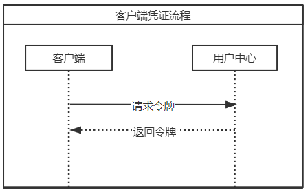

# Client Credentials

### 时序图



 请求

```http
 POST /connect/token HTTP/1.1
     Content-Type: application/x-www-form-urlencoded

	 clientId=2112e2dqd&
     grant_type=client_credentials
```

##### 响应

```http
HTTP/1.1 200 OK
     Content-Type: application/json;charset=UTF-8
     Cache-Control: no-store
     Pragma: no-cache

     {
       "access_token":"2YotnFZFEjr1zCsicMWpAA",
       "expires_in":3600,
     }
```

