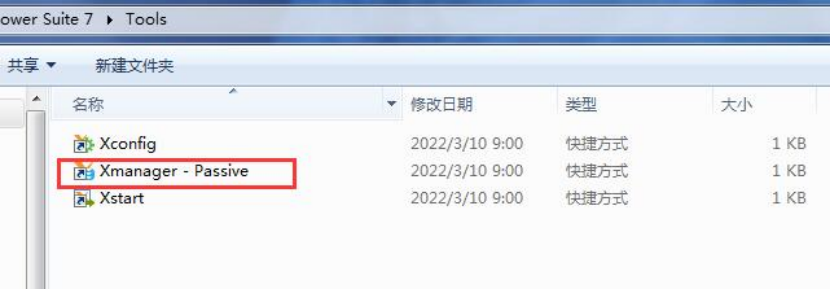
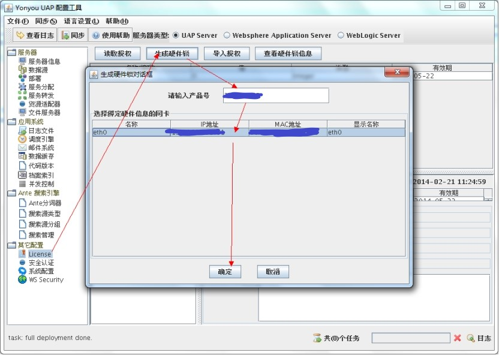
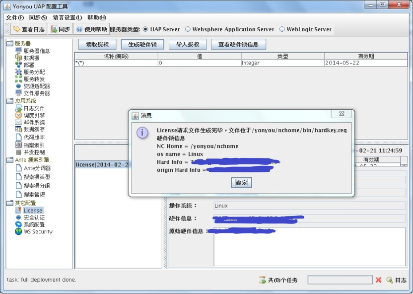
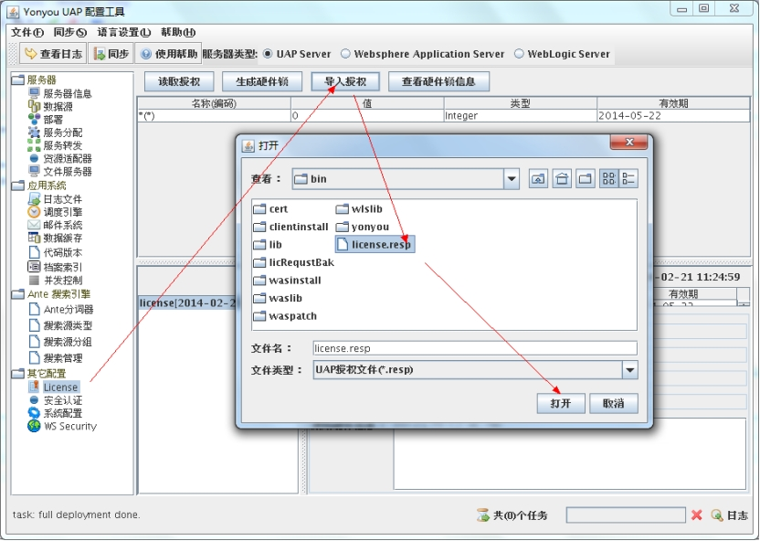

## XManager

可以将整个UNIX/Linux桌面环境带到Windows PC上。或者使用内置的Xstart工具快速访问单个X应用程序，并让它们与Windows应用程序并排运行。

通过XManager可以打开在linux环境中的图形化软件

## 案例

NCC安装在CentIOS7.4中，里面有一个图形化的配置工具需要运行

1. 打开XManager工具

   

2. 打开xshell，ssh远程链接上linux

3. 输入命令配置环境（export DISPLAY=windows本机IP:0.0）

4. ./sysConfig.sh，打开配置界面

5. 生成硬件锁

   

6. 导出hardkey，之后发给用友运维人员索要license

   

7. 拿到license之后

8. 用工具Xftp将license.resp文件放入服务器$nchome/bin目录

9. 在配置界面中导入license，点授权

   

10. ./stop.sh停止服务

11. ./startup.sh &  启动服务 

**操作过程所有命令**

 405  cd ncchome

 406  ll

 407  pwd

 408  cd bin

 409  ./sysConfig.sh 

 410  xhost +

 411  yum -y install xhost +

 412  ll

 413  pwd

 414  ./sysConfig.sh 

 415  xhost +

 416  export DISPLAY=10.11.109.111:0.0

 417  xhost +

 418  ./sysConfig.sh 

 419  cd ..

 420  \

 421  ./stop.sh 

 422  ps -ef|grep java

 423  kill -9 5760 5905 6200

 424  ps -ef|grep java

 425  ll

 426  rm -rf startlog-20*

 427  ll

 428  cd ..

 429  ll

 430  cd ..

 431  ll

 432  cd ufida

 433  ls

 434  cd ncchomes

 435  cd ncchome

 436  ls

 437  ./startup.sh &

  