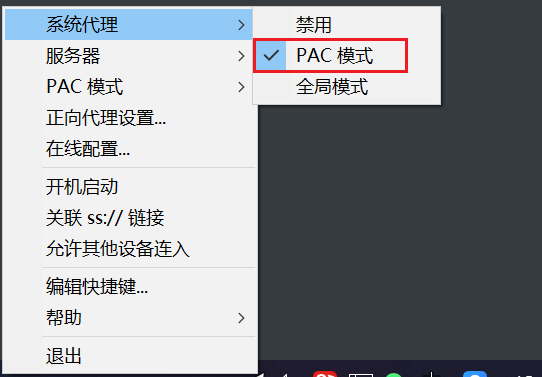
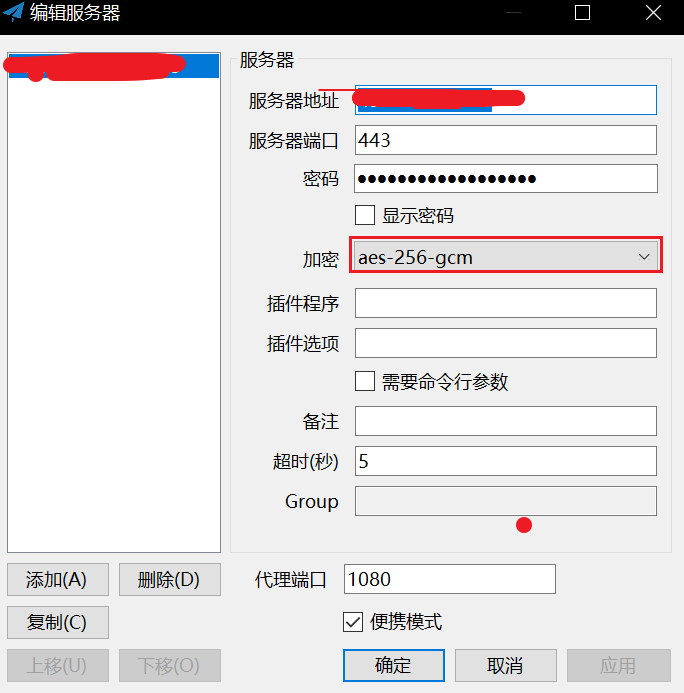

## 服务端

环境：centos7.6

硬件：2C2G，30M腾讯云轻量应用服务器，香港节点

1. 按照官方文档安装shadowsocks

   [官方安装文档]

2. 安装加密插件：[libsodium官方网站](https://doc.libsodium.org/installation/)

   ```sh
   # 下载最新版
   wget https://github.com/jedisct1/libsodium/releases/download/1.0.11/libsodium-1.0.11.tar.gz
   # 解压
   tar xf libsodium-1.0.11.tar.gz && cd libsodium-1.0.11
   # 编译配置
   ./configure
   make && make check
   # make Clean 是删除已编译内容
   make install
   # 添加运行库位置并加载运行库
   echo /usr/local/lib > /etc/ld.so.conf.d/usr_local_lib.conf
   ldconfig
   ```

3. 启动

   ```sh
   ssserver -p 443 -k password -m aes-256-gcm
   ```

   如果要后台运行：

   ```sh
   sudo ssserver -p 443 -k password -m rc4-md5 --user nobody -d start
   ```

   如果要停止：

   ```sh
   sudo ssserver -d stop
   ```


## 客户端

[window客户端](https://github.com/shadowsocks/shadowsocks-windows/wiki/Shadowsocks-Windows-%E4%BD%BF%E7%94%A8%E8%AF%B4%E6%98%8E#%E5%9F%BA%E6%9C%AC%E4%BD%BF%E7%94%A8)

[其他客户端](https://github.com/shadowsocks/shadowsocks/wiki/Ports-and-Clients#windows)

全局模式，国内网站访问不了，选PAC模式可以访问国内外网站



安装加密插件就是为了使用aes-256-gcm的加密方式

