# 调优工具

参考官方文档：https://dev.mysql.com/doc/refman/5.7/en/explain-output.html 

## Explain

- 使用EXPLAIN关键字可以模拟优化器执行SQL语句，分析你的查询语句或是结构的性能瓶颈

- 在 select 语句之前增加 explain 关键字，MySQL 会在查询上设置一个标记，执行查询会返回**执行计划**的信息，而不是 

  执行这条SQL 

- 注意：如果 from 中包含子查询，仍会执行该子查询，将结果放入临时表中

## 示例

```sql
-- 示例表：
DROP TABLE IF EXISTS `actor`;
CREATE TABLE `actor` (
    `id` int(11) NOT NULL,
    `name` varchar(45) DEFAULT NULL,
    `update_time` datetime DEFAULT NULL,
    PRIMARY KEY (`id`)
) ENGINE=InnoDB DEFAULT CHARSET=utf8;

INSERT INTO `actor` (`id`, `name`, `update_time`) VALUES (1,'a','2017‐12‐22 15:27:18'), (2,'b','2017‐12‐22 15:27:18'), (3,'c','2017‐12‐22 15:27:18');

DROP TABLE IF EXISTS `film`;
CREATE TABLE `film` (
    `id` int(11) NOT NULL AUTO_INCREMENT,
    `name` varchar(10) DEFAULT NULL,
    PRIMARY KEY (`id`),
    KEY `idx_name` (`name`)
) ENGINE=InnoDB DEFAULT CHARSET=utf8;

INSERT INTO `film` (`id`, `name`) VALUES (3,'film0'),(1,'film1'),(2,'film2');

DROP TABLE IF EXISTS `film_actor`; 
CREATE TABLE `film_actor` (
    `id` int(11) NOT NULL,
    `film_id` int(11) NOT NULL,
    `actor_id` int(11) NOT NULL,
    `remark` varchar(255) DEFAULT NULL,
    PRIMARY KEY (`id`),
    KEY `idx_film_actor_id` (`film_id`,`actor_id`)
) ENGINE=InnoDB DEFAULT CHARSET=utf8;

INSERT INTO `film_actor` (`id`, `film_id`, `actor_id`) VALUES (1,1,1),(2,1,2),(3,2,1);
```

测试

在查询中的每个表会输出一行，如果有两个表通过 join 连接查询，那么会输出两行

```sh
explain select * from actor;
```

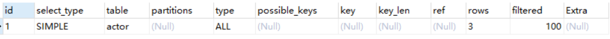

## Explain 两个变种 (5.7后被移除)

1. **explain extended**：会在 explain 的基础上额外提供一些查询优化的信息。紧随其后通过 show warnings 命令可以得到优化后的查询语句，从而看出优化器优化了什么。分析连接查询时，额外还有 filtered 列，是一个百分比的值，rows * filtered/100 可以**估算**出将要和 explain 中前一个表进行连接的行数（前一个表指 explain 中的id值比当前表id值小的表）。

   ```sql
   explain extended select * from film where id = 1;
   show warnings;
   ```

   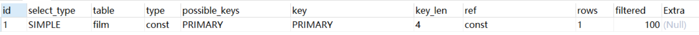

   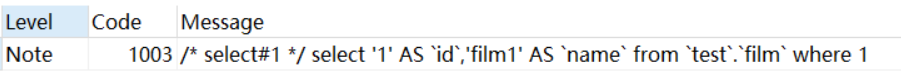

2. **explain partitions**：相比 explain 多了个 partitions 字段，如果查询是基于分区表的话，会显示查询将访问的分 

   区。

## Explain中的列

- id

  - id列的编号是 select 的序列号，有几个 select 就有几个id，并且id的顺序是按 select 出现的顺序增长的。 
  - id列越大执行优先级越高，id相同则从上往下执行，id为NULL最后执行。 

- select_type

  select_type 表示对应行是简单还是复杂的查询。

  - simple：简单查询。查询不包含子查询和union

    ```sql
    explain select * from film where id = 2;
    ```

    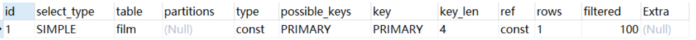

  - primary：复杂查询中最外层的 select

  - subquery：包含在 select 中的子查询（不在 from 子句中） 

  - derived：包含在 from 子句中的子查询。MySQL会将结果存放在一个临时表中，也称为衍生表（derived的英文含义）

    - 用这个例子来了解 primary、subquery 和 derived 类型

      ```sql
      -- 关闭mysql5.7新特性对衍生表的合并优化
      set session optimizer_switch='derived_merge=off';
      explain select (select 1 from actor where id = 1) from (select * from film where id = 1) der;
      ```

      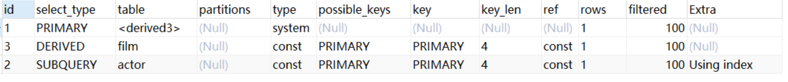

  - union：在 union 中的第二个和随后的 select 

    ```sql
    explain select 1 union all select 1;
    ```

    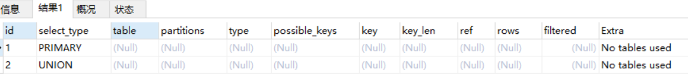

- table

  这一列表示 explain 的一行正在访问哪个表。当 from 子句中有子查询时，table列是 <derivenN> 格式，表示当前查询依赖 id=N查询，于是先执行 id=N 的查询。当有 union 时，UNION RESULT 的 table 列的值为<union1,2>，1和2表示参与 union 的 select 行id。

- type

  - 这一列表示**关联类型或访问类型**，即MySQL决定如何查找表中的行，查找数据行记录的大概范围。

  - 依次从最优到最差分别为：**system > const > eq_ref > ref > range > index > ALL** 

  - 一般来说，**得保证查询达到range级别，最好达到ref** 

    1. **NULL**：mysql能够在优化阶段分解查询语句，在执行阶段用不着再访问表或索引。例如：在索引列中选取最小值，可以单独查找索引来完成，不需要在执行时访问表 

       ```sql
        explain select min(id) from film;
       ```

       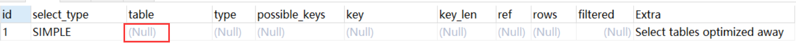

    2. **const, system**：mysql能对查询的某部分进行优化并将其转化成一个常量（可以看show warnings 的结果）。用于primary key 或 unique key 的所有列与常数比较时，所以表最多有一个匹配行，读取1次，速度比较快。**system是const的特例**，表里只有一条元组匹配时为system

       ```sql
       explain select * from (select * from film where id = 1) tmp;
       show warnings;
       ```

       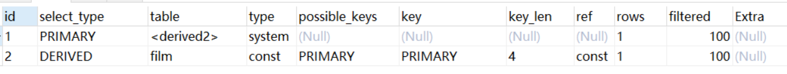

       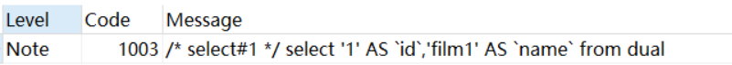

    3. **eq_ref**：primary key 或 unique key 索引的所有部分被连接使用 ，最多只会返回一条符合条件的记录。这可能是在 

       const 之外最好的联接类型了，简单的 select 查询不会出现这种 type。 

       ```sql
        explain select * from film_actor left join film on film_actor.film_id = film.id;
       ```

       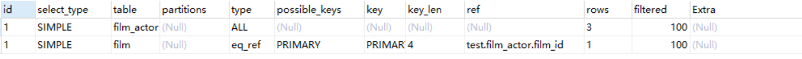

    4. **ref**：相比 eq_ref，不使用唯一索引，而是使用普通索引或者唯一性索引的部分前缀，索引要和某个值相比较，可能会找到多个符合条件的行。

       1. . 简单 select 查询，name是普通索引（非唯一索引） 

          ```sql
          explain select * from film where name = 'film1';
          ```

          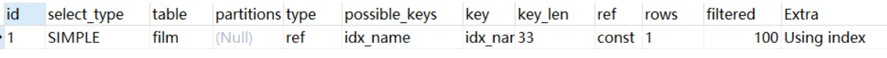

       2. 关联表查询，idx_film_actor_id是film_id和actor_id的联合索引，这里使用到了film_actor的左边前缀film_id部分。

          ```sql
           explain select film_id from film left join film_actor on film.id = film_actor.fi lm_id;
          ```

          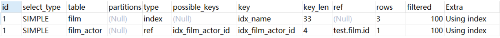

    5. **range**：范围扫描通常出现在 in(), between ,> ,<, >= 等操作中。使用一个索引来检索给定范围的行。

       ```sql
       explain select * from actor where id > 1;
       ```

       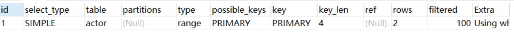

    6. **index**：扫描全索引就能拿到结果，一般是扫描某个二级索引，这种扫描不会从索引树根节点开始快速查找，而是直接 

       对二级索引的叶子节点遍历和扫描，速度还是比较慢的，这种查询一般为使用**覆盖索引**，二级索引一般比较小，所以这 

       种通常比ALL快一些

       ```sql
       -- film表只有两个字段，并且name字段做了索引（二级索引），这条语句被mysql优化器优化为从二级索引查询整张表
       explain select * from film;
       ```

       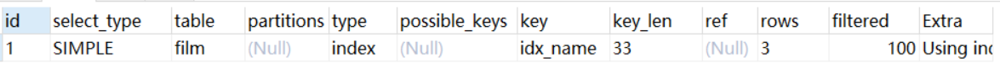

    7. **ALL**：即全表扫描，扫描你的聚簇索引的所有叶子节点。通常情况下这需要增加索引来进行优化了

       ```sql
       explain select * from actor;
       ```

       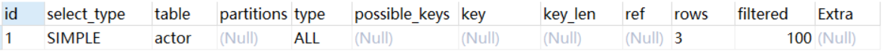

- possible_keys
  
- 这一列显示查询可能使用哪些索引来查找
  
  - explain 时可能出现 possible_keys 有列，而 key 显示 NULL 的情况，这种情况是因为表中数据不多，mysql认为索引对此查询帮助不大，选择了全表查询
- 如果该列是NULL，则没有相关的索引。在这种情况下，可以通过检查 where 子句看是否可以创造一个适当的索引来提高查询性能，然后用 explain 查看效果
  
- key

  - 这一列显示mysql实际采用哪个索引来优化对该表的访问
  - 如果没有使用索引，则该列是 NULL。如果想强制mysql使用或忽视possible_keys列中的索引，在查询中使用 force index、ignore index

- key_len

  - 这一列显示了mysql在索引里使用的字节数，通过这个值可以算出具体使用了索引中的哪些列

  - 举例来说，film_actor的联合索引 idx_film_actor_id 由 film_id 和 actor_id 两个int列组成，并且每个int是4字节。通过结果中的key_len=4可推断出查询使用了第一个列：film_id列来执行索引查找

    ```sql
     explain select * from film_actor where film_id = 2;
    ```

    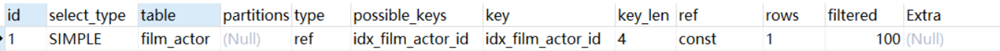

  - key_len计算规则如下：

    - 字符串，char(n)和varchar(n)，5.0.3以后版本中，**n均代表字符数，而不是字节数，**如果是utf-8，一个数字或字母占1个字节，一个汉字占3个字节 

      - char(n)：如果存汉字长度就是 **3n** 字节
      - varchar(n)：如果存汉字则长度是 **3n + 2** 字节，加的2字节用来存储字符串长度，因为varchar是变长字符

    - 数值类型

      - tinyint：1字节 
      - smallint：2字节 
      - int：4字节 
      - bigint：8字节

    - 时间类型

      - date：3字节
      - timestamp：4字节
      - datetime：8字节

    - **如果字段允许为 NULL，需要1字节记录是否为 NULL**

    - 索引最大长度是768字节，当字符串过长时，mysql会做一个类似左前缀索引的处理，将前半部分的字符提取出来做索 

      引

- ref列

  这一列显示了在key列记录的索引中，表查找值所用到的列或常量，常见的有：const（常量），字段名（例：film.id）

- rows

  这一列是mysql估计要读取并检测的行数，注意这个不是结果集里的行数

- extra

  这一列展示的是额外信息。常见的重要值如下

  1. **Using index**：使用覆盖索引

     ```sql
      explain select film_id from film_actor where film_id = 1;
     ```

     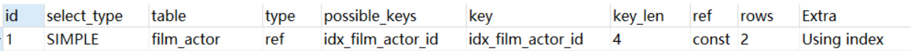

  2. **Using where**：使用 where 语句来处理结果，并且查询的列未被索引覆盖 

     ```sql
     explain select * from actor where name = 'a';
     ```

     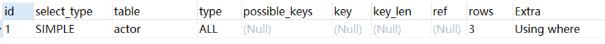

  3. **Using index condition**：查询的列不完全被索引覆盖，where条件中是一个前导列的范围；

     ```sql
     -- 联合索引的第二个未使用
     explain select * from film_actor where film_id > 1;
     ```

     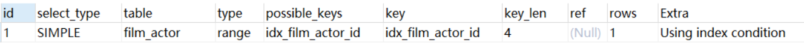

  4. **Using temporary**：mysql需要创建一张临时表来处理查询。出现这种情况一般是要进行优化的，首先是想到用索引来优化

     1. actor.name没有索引，此时创建了张临时表来distinct 

        ```sql
        explain select distinct name from actor;
        ```

        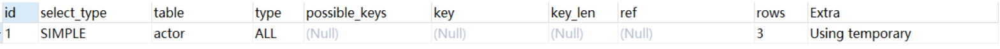

     2. film.name建立了idx_name索引，此时查询时extra是using index,没有用临时表 

        ```sql
        explain select distinct name from film;
        ```

        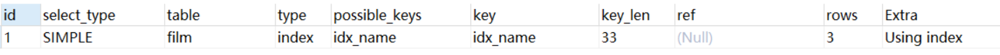

  5. **Using filesort**：将用外部排序而不是索引排序，数据较小时从内存排序，否则需要在磁盘完成排序。这种情况下一般也是要考虑使用索引来优化的

     1. actor.name未创建索引，会浏览actor整个表，保存排序关键字name和对应的id，然后排序name并检索行记录

        ```sql
         explain select * from actor order by name;
        ```

        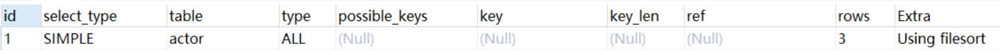

     2. film.name建立了idx_name索引,此时查询时extra是using index 

        ```sql
        explain select * from film order by name;
        ```

        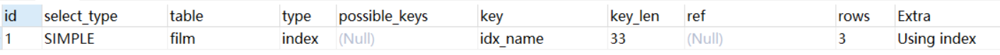

  6. **Select tables optimized away**：使用某些聚合函数（比如 max、min）来访问存在索引的某个字段是

     ```sql
      explain select min(id) from film;
     ```

     


## 索引最佳实践

示例表：

```sql
CREATE TABLE `employees` (
    `id` int(11) NOT NULL AUTO_INCREMENT,
    `name` varchar(24) NOT NULL DEFAULT '' COMMENT '姓名',
    `age` int(11) NOT NULL DEFAULT '0' COMMENT '年龄',
    `position` varchar(20) NOT NULL DEFAULT '' COMMENT '职位',
    `hire_time` timestamp NOT NULL DEFAULT CURRENT_TIMESTAMP COMMENT '入职时间',
    PRIMARY KEY (`id`),
    KEY `idx_name_age_position` (`name`,`age`,`position`) USING BTREE
) ENGINE=InnoDB AUTO_INCREME     NT=4 DEFAULT CHARSET=utf8 COMMENT='员工记录表';

INSERT INTO employees(name,age,position,hire_time) VALUES('LiLei',22,'manager',NOW());
INSERT INTO employees(name,age,position,hire_time) VALUES('HanMeimei', 23,'dev',NOW());
INSERT INTO employees(name,age,position,hire_time) VALUES('Lucy',23,'dev',NOW());
```

### 全值匹配

```sql
EXPLAIN SELECT * FROM employees WHERE name= 'LiLei';
```

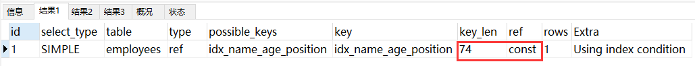

```sql
EXPLAIN SELECT * FROM employees WHERE name= 'LiLei' AND age = 22;
```

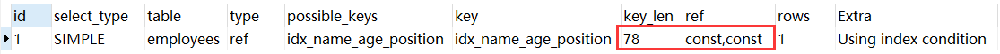

```sql
EXPLAIN SELECT * FROM employees WHERE name= 'LiLei' AND age = 22 AND position ='manage r';
```

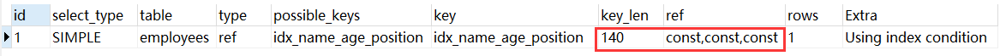

###  **最左前缀法则**

**如果索引了多列，要遵守最左前缀法则。指的是查询从索引的最左前列开始并且不跳过索引中的列**

```sql
EXPLAIN SELECT * FROM employees WHERE name = 'Bill' and age = 31;
EXPLAIN SELECT * FROM employees WHERE age = 30 AND position = 'dev';
EXPLAIN SELECT * FROM employees WHERE position = 'manager';
```

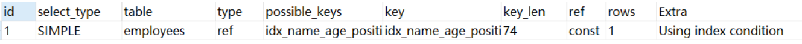

### **不在索引列上做任何操作（计算、函数、（自动or手动）类型转换），会导致索引失效而转向全表扫描**

  ```sql
EXPLAIN SELECT * FROM employees WHERE left(name,3) = 'LiLei';
  ```

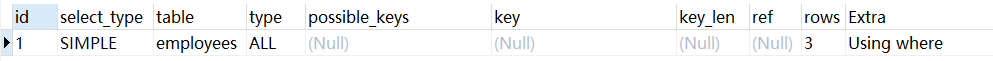

给hire_time增加一个普通索引：

```sql
ALTER TABLE `employees` ADD INDEX `idx_hire_time` (`hire_time`) USING BTREE ;
EXPLAIN select * from employees where date(hire_time) ='2018‐09‐30';
```

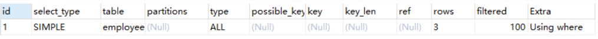

转化为日期范围查询，有可能（数据量大，范围相对小）会走索引： 

```sql
EXPLAIN select * from employees where hire_time >='2018‐09‐30 00:00:00' and hire_time < ='2018‐09‐30 23:59:59';
```

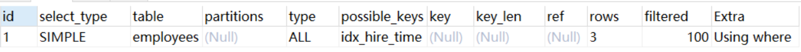

还原最初索引状态，删除索引

```sql
ALTER TABLE `employees` DROP INDEX `idx_hire_time`;
```

### **存储引擎不能使用索引中范围条件右边的列** 

```sql
EXPLAIN SELECT * FROM employees WHERE name= 'LiLei' AND age = 22 AND position ='manager';
EXPLAIN SELECT * FROM employees WHERE name= 'LiLei' AND age > 22 AND position ='manager';
```

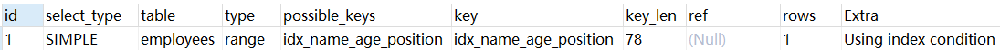

### **尽量使用覆盖索引（只访问索引的查询（索引列包含查询列）），减少 select \* 语句**

```sql
EXPLAIN SELECT name,age FROM employees WHERE name= 'LiLei' AND age = 23 AND position ='manager';
```

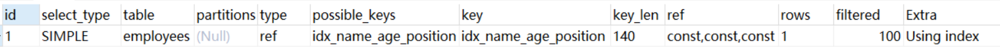

```sql
EXPLAIN SELECT * FROM employees WHERE name= 'LiLei' AND age = 23 AND position ='manager';
```

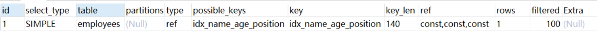

### mysql在使用不等于（!=或者<>），not in，not exists的时候无法使用索引会导致全表扫描<小于、 **>** **大于、** <=、>=这些，mysql内部优化器会根据检索比例、表大小等多个因素整体评估是否使用索引

```sql
EXPLAIN SELECT * FROM employees WHERE name != 'LiLei';
```

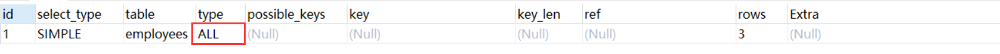

### is null,is not null 一般情况下也无法使用索引

```sql
EXPLAIN SELECT * FROM employees WHERE name is null
```

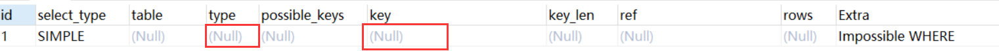

### like以通配符开头（'%abc...'）mysql索引失效会变成全表扫描操作

```sql
EXPLAIN SELECT * FROM employees WHERE name like '%Lei'
```

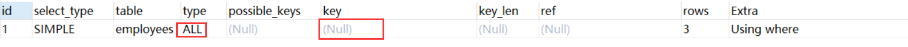

```sql
EXPLAIN SELECT * FROM employees WHERE name like 'Lei%'
```

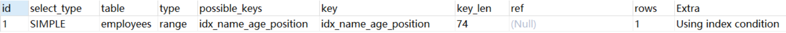

### 字符串不加单引号索引失效

```SQL
EXPLAIN SELECT * FROM employees WHERE name = '1000';
-- 如果主键类型不相同，mysql内部相当于对条件使用了函数转换，使用了函数的都无法走索引
EXPLAIN SELECT * FROM employees WHERE name = 1000;
```

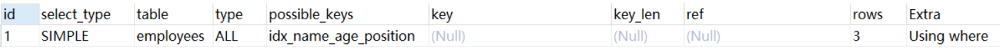

### 少用or或in

用它查询时，mysql不一定使用索引，mysql内部优化器会根据检索比例、表大小等多个因素整体评估是否使用索引，详见范围查询优化

```sql
EXPLAIN SELECT * FROM employees WHERE name = 'LiLei' or name = 'HanMeimei';
```

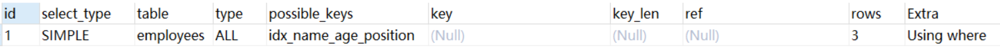

### 范围查询优化

给年龄添加单值索引

```sql
ALTER TABLE `employees` ADD INDEX `idx_age` (`age`) USING BTREE ;
explain select * from employees where age >=1 and ag
```

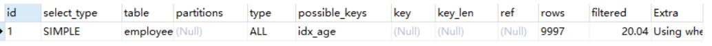

没走索引原因：mysql内部优化器会根据检索比例、表大小等多个因素整体评估是否使用索引。比如这个例子，可能是由于单次数据量查询过大导致优化器最终选择不走索引 

优化方法：可以将大的范围拆分成多个小范围 

```sql
explain select * from employees where age >=1 and age <=1000;
explain select * from employees where age >=1001 and age <=2000;
```

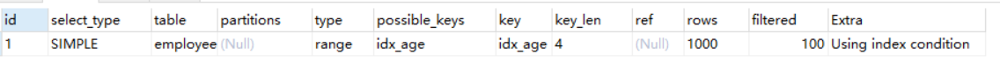


## 总结


like KK%相当于=常量，%KK和%KK% 相当于范围 


这里给大家补充一个概念，索引下推（Index Condition Pushdown，ICP**）**, like KK%其实就是用到了索引下推优化 

**什么是索引下推了？** 

对于辅助的联合索引(name,age,position)，正常情况按照最左前缀原则，SELECT \* FROM employees WHERE name like 'LiLei%' AND age = 22 AND position ='manager' 这种情况只会走name字段索引，因为根据name字段过滤完，得到的索引行里的age和position是无序的，无法很好的利用索引

在MySQL5.6之前的版本，这个查询只能在联合索引里匹配到名字是 **'LiLei' 开头**的索引，然后拿这些索引对应的主键逐个回表，到主键索引上找出相应的记录，再比对**age**和**position**这两个字段的值是否符合

MySQL 5.6引入了索引下推优化，可以在索引遍历过程中，对索引中包含的所有字段先做判断，过滤掉不符合条件的记录之后再回表，可以有效的减少回表次数。使用了索引下推优化后，上面那个查询在联合索引里匹配到名字是 'LiLei' 开头的索引之后，同时还会在索引里过滤age和position这两个字段，拿着过滤完剩下的索引对应的主键id再回表查整行数据。 

索引下推会减少回表次数，对于innodb引擎的表索引下推只能用于二级索引，innodb的主键索引（聚簇索引）树叶子节点上保存的是全行数据，所以这个时候索引下推并不会起到减少查询全行数据的效果。 

**为什么范围查找Mysql没有用索引下推优化？** 

估计应该是Mysql认为范围查找过滤的结果集过大，like KK% 在绝大多数情况来看，过滤后的结果集比较小，所以这里Mysql选择给 like KK% 用了索引下推优化，当然这也不是绝对的，有时like KK% 也不一定就会走索引下推。 