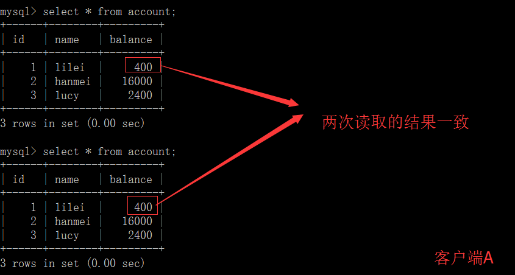
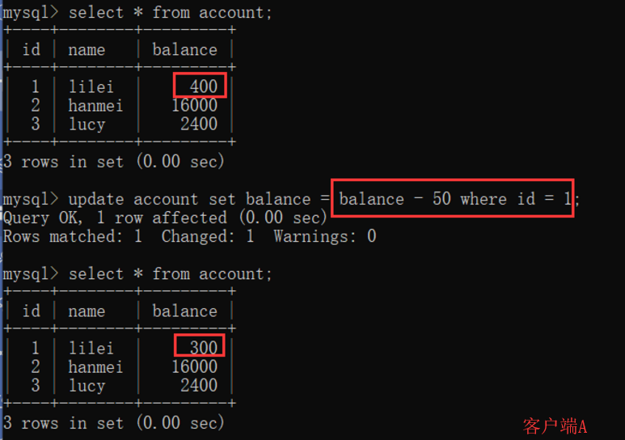
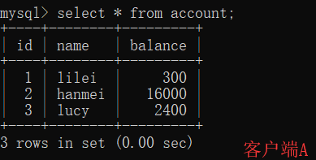
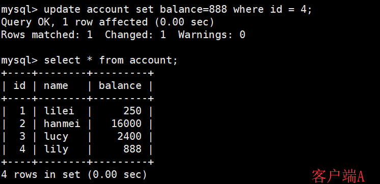
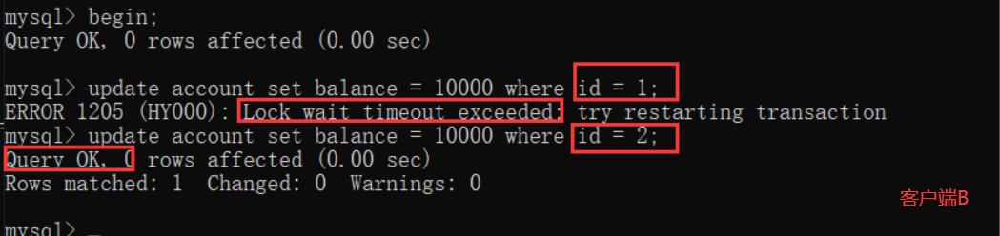
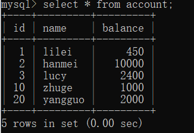
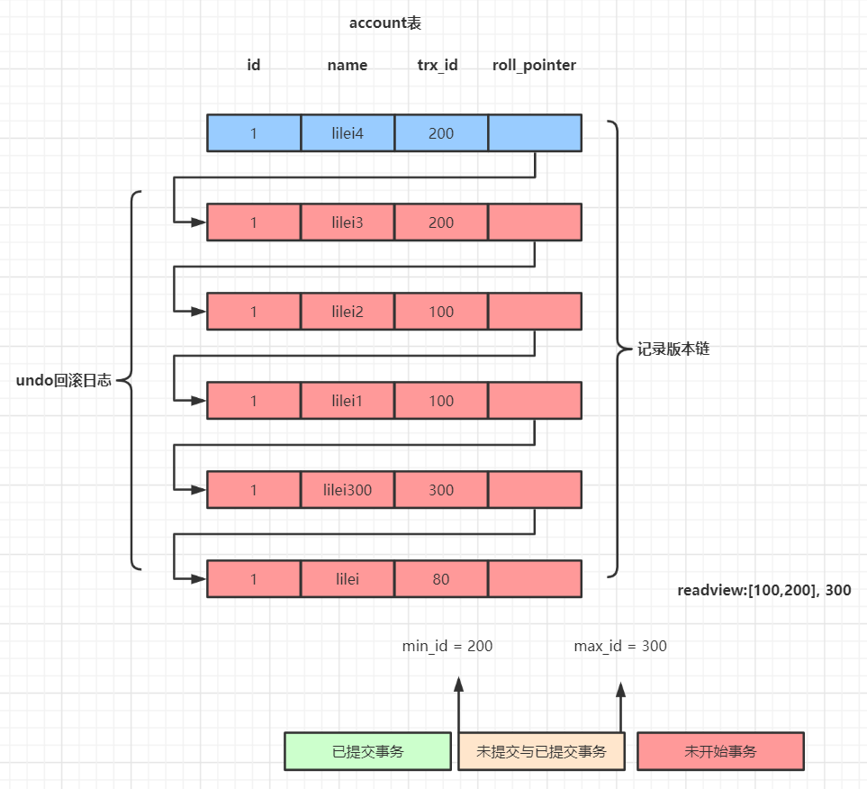
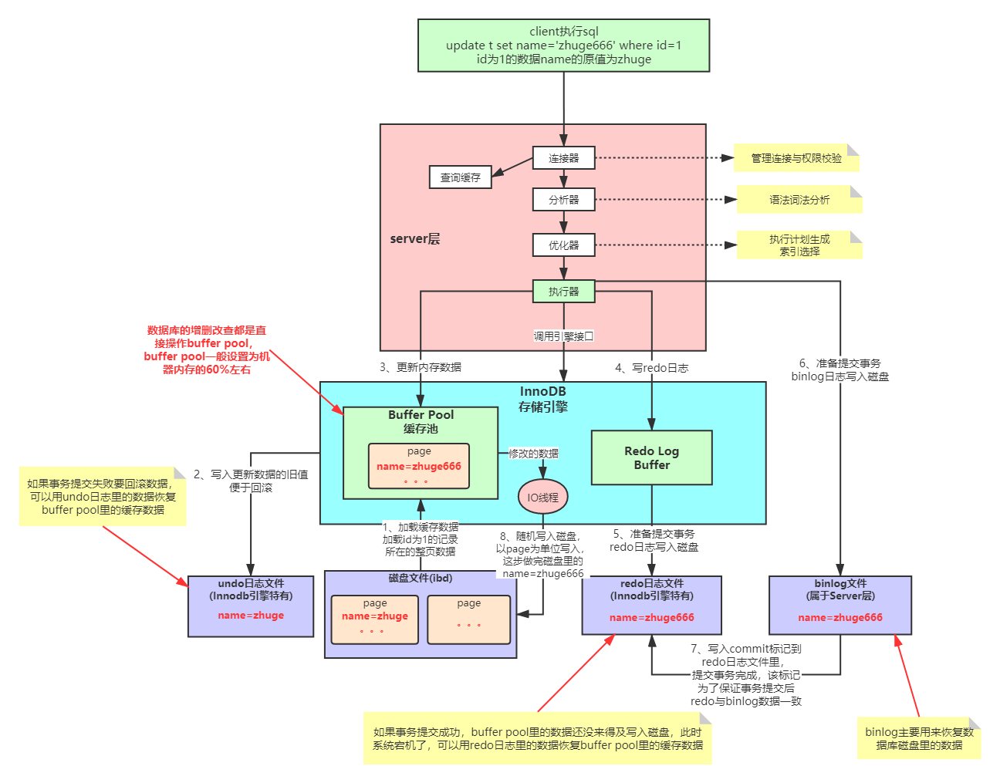

# 锁机制

我们的数据库一般都会并发执行多个事务，多个事务可能会并发的对相同的一批数据进行增删改查操作，可能就会导致我们说的脏写、脏读、不可重复读、幻读这些问题。 

这些问题的本质都是数据库的多事务并发问题，为了解决多事务并发问题，数据库设计了事务**隔离机制、锁机制、MVCC多版本并发控制隔离机制**，用一整套机制来**解决多事务并发问题**。接下来，我们会深入讲解这些机制，让大家彻底理解数据库内部的执行原理

## 事务及其ACID属性

事务是由一组SQL语句组成的逻辑处理单元,事务具有以下4个属性,通常简称为事务的ACID属性

- 原子性(Atomicity) ：事务是一个原子操作单元,其对数据的修改,要么全都执行,要么全都不执行
- 一致性(Consistent) ：在事务开始和完成时,数据都必须保持一致状态。这意味着所有相关的数据规则都必须应用于事务的修改,以保持数据的完整性
- 立”环境执行。这意味着事务处理过程中的中间状态对外部是不可见的,反之亦然隔离性(Isolation) ：数据库系统提供一定的隔离机制,保证事务在不受外部并发操作影响的“独
- 持久性(Durable) ：事务完成之后,它对于数据的修改是永久性的,即使出现系统故障也能够保持

## 并发事务处理带来的问题

- **更新丢失(Lost Update)或脏写**

  当两个或多个事务选择同一行，然后基于最初选定的值更新该行时，由于每个事务都不知道其他事务的存在，就会发生丢失更新问题–**最后的更新覆盖了由其他事务所做的更新**

- **脏读（Dirty Reads）**

  一个事务正在对一条记录做修改，在这个事务完成并提交前，这条记录的数据就处于不一致的状态；这时，另一个事务也来读取同一条记录，如果不加控制，第二个事务读取了这些“脏”数据，并据此作进一步的处理，就会产生未提交的数据依赖关系。这种现象被形象的叫做“脏读”

  一句话：**事务A读取到了事务B已经修改但尚未提交的数据**，还在这个数据基础上做了操作。此时，如果B事务回滚，A读取的数据无效，不符合一致性要求

- **不可重读（Non-Repeatable Reads）** 

  一个事务在读取某些数据后的某个时间，再次读取以前读过的数据，却发现其读出的数据已经发生了改变、或某些记录已经被删除了！这种现象就叫做“不可重复读”

  一句话：**事务A内部的相同查询语句在不同时刻读出的结果不一致，不符合隔离性**

- **幻读（Phantom Reads）**

  一个事务按相同的查询条件重新读取以前检索过的数据，却发现其他事务插入了满足其查询条件的新数据，这种现象就称为“幻读”

  一句话：**事务A读取到了事务B提交的新增数据，不符合隔离性**


## 事务隔离级别

“脏读”、“不可重复读”和“幻读”,其实都是数据库读一致性问题,必须由数据库提供一定的事务隔离机制 来解决


数据库的事务隔离越严格,并发副作用越小,但付出的代价也就越大,因为事务隔离实质上就是使事务在一定程度上“串行化”进行,这显然与“并发”是矛盾的

同时,不同的应用对读一致性和事务隔离程度的要求也是不同的,比如许多应用对“不可重复读"和“幻读”并不敏感,可能更关心数据并发访问的能力

```sql
-- 常看当前数据库的事务隔离级别
show variables like 'tx_isolation';
-- 设置事务隔离级别
set tx_isolation='REPEATABLE-READ';
```

**Mysql默认的事务隔离级别是可重复读，用Spring开发程序时，如果不设置隔离级别默认用Mysql设置的隔离级别，如果Spring设置了就用已经设置的隔离级别**

## 锁详解

锁是计算机协调多个进程或线程并发访问某一资源的机制在数据库中，除了传统的计算资源（如CPU、RAM、I/O等）的争用以外，数据也是一种供需要用户共享的资源。如何保证数据并发访问的一致性、有效性是所有数据库必须解决的一个问题，锁冲突也是影响数据库并发访问性能的一个重要因素

```sql
-- 示例
CREATE TABLE `mylock` (
    `id` INT (11) NOT NULL AUTO_INCREMENT,
    `NAME` VARCHAR (20) DEFAULT NULL,
    PRIMARY KEY (`id`)
) ENGINE = MyISAM DEFAULT CHARSET = utf8;

‐‐ 插入数据
INSERT INTO`test`.`mylock` (`id`, `NAME`) VALUES ('1', 'a');
INSERT INTO`test`.`mylock` (`id`, `NAME`) VALUES ('2', 'b');
INSERT INTO`test`.`mylock` (`id`, `NAME`) VALUES ('3', 'c');
INSERT INTO`test`.`mylock` (`id`, `NAME`) VALUES ('4', 'd');
```

**表锁**

每次操作锁住整张表。开销小，加锁快；不会出现死锁；锁定粒度大，发生锁冲突的概率最高，并发度最低； 一般用在整表数据迁移的场景

- 手动增加表锁：lock table 表名称 read(write),表名称2 read(write);
- 查看表上加过的锁：show open tables;
- 删除表锁：unlock tables;

### 意向锁

是InnoDB的表锁

**当我需要对一张表加锁的时候，需要扫描全表查看哪些行被锁定，如果没有锁定才能锁表？**

事务进行锁行的时候，首先会给表设置意向锁，这样别的事务直接通过意向锁就能判断是否可以直接锁表，提高效率


**行锁**

每次操作锁住一行数据。开销大，加锁慢；会出现死锁；锁定粒度最小，发生锁冲突的概率最低，并发度最高

InnoDB与MYISAM的最大不同有两点：

1. **InnoDB支持事务（TRANSACTION）**
2. **InnoDB支持行级锁**

**总结**

- MyISAM在执行查询语句SELECT前，会自动给涉及的所有表加读锁,在执行update、insert、delete操作会自动给涉及的表加写锁
- InnoDB在执行查询语句SELECT时(非串行隔离级别)，不会加锁。但是update、insert、delete操作会加行锁

简而言之，就是**读锁会阻塞写，但是不会阻塞读。而写锁则会把读和写都阻塞**

## 行锁与事务隔离级别案例分析 

```sql
-- 示例
CREATE TABLE `account` (
    `id` INT (11) NOT NULL AUTO_INCREMENT,
    `NAME` VARCHAR (20) DEFAULT NULL,
    `balance` int(11) DEFAULT NULL,
    PRIMARY KEY (`id`)
) ENGINE = InnoDB DEFAULT CHARSET = utf8;

‐‐ 插入数据
INSERT INTO `test`.`account` (`name`, `balance`) VALUES ('lilei', '450');
INSERT INTO `test`.`account` (`name`, `balance`) VALUES ('hanmei', '16000');
INSERT INTO `test`.`account` (`name`, `balance`) VALUES ('lucy', '2400');
```

**读未提交**

**读已提交**

**可重复读**

1. 打开一个客户端A，并设置当前事务模式为repeatable read，查询表account的所有记录 

   ```sql
   set tx_isolation='repeatable-read';
   ```

   

2. 在客户端A的事务提交之前，打开另一个客户端B，更新表account并提交 

   

3. 在客户端A查询表account的所有记录，与步骤（1）查询结果一致，没有出现不可重复读的问题

   

4. 在客户端A，接着执行update account set balance = balance - 50 where id = 1，balance没有变成400-50=350，lilei的balance值用的是步骤2中的350来算的，所以是300，数据的一致性倒是没有被破坏。可重复读的隔离级别下使用了MVCC(multi-version ==concurrency control)机制，select操作不会更新版本号，是快照读（历史版本）；insert、update和delete会更新版本号，是当前（当前版本）

   

5. 重新打开客户端B，插入一条新数据后提交

   

6. 在客户端A查询表account的所有记录，没有查出新增数据，所以没有出现幻读？？

   

7. 验证幻读

   在客户端A执行update account set balance=888 where id = 4;能更新成功，再次查询能查到客户端B新增的数据

   

**串行化**

1. 打开一个客户端A，并设置当前事务模式为serializable，查询表account的初始值：

   ```sql
   **set tx_isolation='**serializable**';**
   ```

   

   

2. 打开一个客户端B，并设置当前事务模式为serializable，更新相同的id为1的记录会被阻塞等待，更新id为2的记录可以成功，说明在串行模式下innodb的查询也会被加上行锁。如果客户端A执行的是一个范围查询，那么该**范围内的所有行包括每行记录所在的间隙区间范围**(就算该行数据还未被插入也会加锁，这种是间隙锁)**都会被加锁**。此时如果客户端B在该范围内插入数据都会被阻塞，所以就避免了幻读

   这种隔离级别并发性极低，开发中很少会用到

   

3. 


## 间隙锁(Gap Lock) 

间隙锁，锁的就是两个值之间的空隙。Mysql默认级别是repeatable-read，有办法解决幻读问题吗？间隙锁 在某些情况下可以解决幻读问题

假设account表里数据如下：



那么间隙就有 id 为 (3,10)，(10,20)，(20,正无穷) 这三个区间，在Session_1下面执行 update account set name = 'zhuge' where id > 8 and id <18;，则其他Session没法在这个**范围所包含的所有行记录(包括间隙行记录)以及行记录所在的间隙**里插入或修改任何数据，即id在(3,20]区间都无法修改数据，注意最后那个20也是包含在内的**。 间隙锁是在可重复读隔离级别下才会生效**

## 临键锁(Next-key Locks) 

Next-Key Locks是行锁与间隙锁的组合。像上面那个例子里的这个(3,20]的整个区间可以叫做临键锁

**无索引行锁会升级为表锁**

锁主要是加在索引上，如果对非索引字段更新，行锁可能会变表锁 

1. session1 执行：update account set balance = 800 where name = 'lilei';
2. session2 对该表任一行操作都会阻塞住 

**InnoDB的行锁是针对索引加的锁，不是针对记录加的锁。并且该索引不能失效，否则都会从行锁升级为表锁**

锁定某一行还可以用lock in share mode(共享锁) 和for update(排它锁)，例如：select * from test_innodb_lock where a = 2 for update; 这样其他session只能读这行数据，修改则会被阻塞，直到锁定行的session提交

## 行锁分析

通过检查InnoDB_row_lock状态变量来分析系统上的行锁的争夺情况

```sql
show status like 'innodb_row_lock%';
```

对各个状态量的说明如下：

- Innodb_row_lock_current_waits: 当前正在等待锁定的数量
- Innodb_row_lock_time: 从系统启动到现在锁定总时间长度 
- Innodb_row_lock_time_avg: 每次等待所花平均时间
- Innodb_row_lock_time_max：从系统启动到现在等待最长的一次所花时间
- Innodb_row_lock_waits:系统启动后到现在总共等待的次数 

尤其是当等待次数很高，而且每次等待时长也不小的时候，我们就需要分析系统中为什么会有如此多的等待，然后根据分析结果着手制定优化计划

**查看INFORMATION_SCHEMA系统库锁相关数据表**

```sql
‐‐ 查看事务
select * from INFORMATION_SCHEMA.INNODB_TRX;
‐‐ 查看锁
select * from INFORMATION_SCHEMA.INNODB_LOCKS;
‐‐ 查看锁等待
select * from INFORMATION_SCHEMA.INNODB_LOCK_WAITS;
‐‐ 释放锁，trx_mysql_thread_id可以从INNODB_TRX表里查看到
kill trx_mysql_thread_id
‐‐ 查看锁等待详细信息
show engine innodb status\G;
```

## 死锁

```sql
set tx_isolation='repeatable-read';
-- Session_1执行：
select * from account where id=1 for update;
-- Session_2执行：
select * from account where id=2 for update;
-- Session_1执行：
select * from account where id=2 for update;
-- Session_2执行：
select * from account where id=1 for update;

-- 查看近期死锁日志信息：
show engine innodb status\G;
```

**大多数情况mysql可以自动检测死锁并回滚产生死锁的那个事务，但是有些情况mysql没法自动检测死锁**

**锁优化建议**

- 尽可能让所有数据检索都通过索引来完成，避免无索引行锁升级为表锁
- 合理设计索引，尽量缩小锁的范围
- 尽可能减少检索条件范围，避免间隙锁
- 尽量控制事务大小，减少锁定资源量和时间长度，涉及事务加锁的sql尽量放在事务最后执行
- 尽可能低级别事务隔离

## MVCC多版本并发控制机制

Mysql在可重复读隔离级别下如何保证事务较高的隔离性，我们上节课给大家演示过，同样的sql查询语句在一个事务里多次执行查询结果相同，就算其它事务对数据有修改也不会影响当前事务sql语句的查询结果。这个隔离性就是靠MVCC(**Multi-Version Concurrency Control**)机制来保证的，对一行数据的读和写两个操作默认是不会通过加锁互斥来保证隔离性，避免了频繁加锁互斥，而在串行化隔离级别为了保证较高的隔离性是通过将所有操 作加锁互斥来实现的。Mysql在读已提交和可重复读隔离级别下都实现了MVCC机制

**undo日志版本链与read view机制详解**

undo日志版本链是指一行数据被多个事务依次修改过后，在每个事务修改完后，Mysql会保留修改前的数据undo回滚日志，并且用两个隐藏字段trx_id和roll_pointer把这些undo日志串联起来形成一个历史记录版本链(见下图，需参考视频里的例子理解)



在**可重复读隔离级别**，当事务开启，执行任何查询sql时会生成当前事务的**一致性视图read-view，**该视图在事务结束之前都不会变化(**如果是读已提交隔离级别在每次执行查询sql时都会重新生成**)，这个视图由执行查询时所有未提交事 务id数组（数组里最小的id为min_id）和已创建的最大事务id（max_id）组成，事务里的任何sql查询结果需要从对应版本链里的最新数据开始逐条跟read-view做比对从而得到最终的快照结果。 

**版本链比对规则：** 

1. 如果 row 的 trx_id 落在绿色部分( trx_id<min_id )，表示这个版本是已提交的事务生成的，这个数据是可见的； 
2. 如果 row 的 trx_id 落在红色部分( trx_id>max_id )，表示这个版本是由将来启动的事务生成的，是不可见的(若 row 的 trx_id 就是当前自己的事务是可见的）；3. 如果 row 的 trx_id 落在黄色部分(min_id <=trx_id<= max_id)，那就包括两种情况
   1. 若 row 的 trx_id 在视图数组中，表示这个版本是由还没提交的事务生成的，不可见(若 row 的 trx_id 就是当前自己的事务是可见的)； 
   2. 若 row 的 trx_id 不在视图数组中，表示这个版本是已经提交了的事务生成的，可见

**总结：** 

MVCC机制的实现就是通过read-view机制与undo版本链比对机制，使得不同的事务会根据数据版本链对比规则读取同一条数据在版本链上的不同版本数据

## BufferPool



**为什么Mysql不能直接更新磁盘上的数据而且设置这么一套复杂的机制来执行SQL了？** 

因为来一个请求就直接对磁盘文件进行随机读写，然后更新磁盘文件里的数据性能可能相当差。

因为磁盘随机读写的性能是非常差的，所以直接更新磁盘文件是不能让数据库抗住很高并发的。 Mysql这套机制看起来复杂，但它可以保证每个更新请求都是**更新内存BufferPool**，然后**顺序写日志文件**，同时还能保证各种异常情况下的数据一致性。 更新内存的性能是极高的，然后顺序写磁盘上的日志文件的性能也是非常高的，要远高于随机读写磁盘文件。正是通过这套机制，才能让我们的MySQL数据库在较高配置的机器上每秒可以抗下几干的读写请求