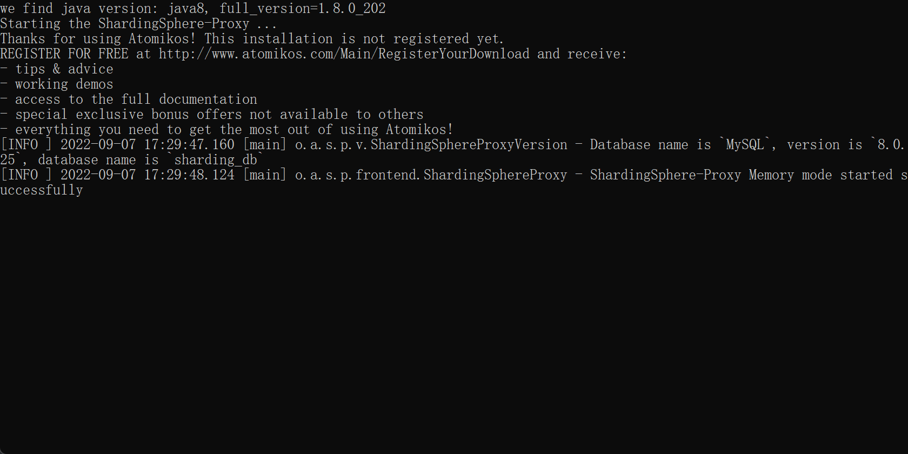
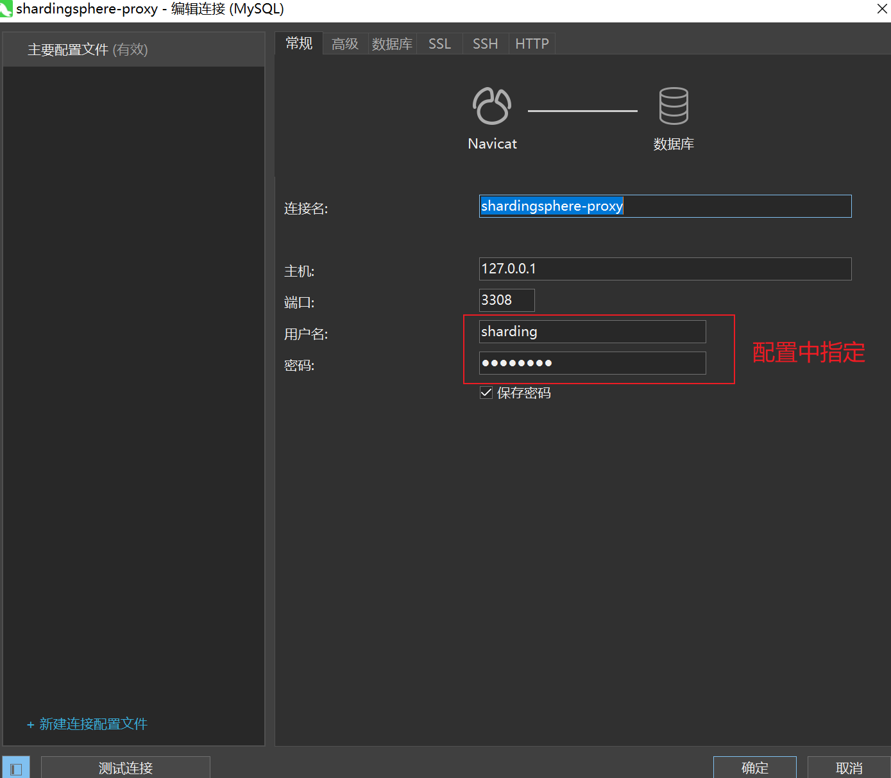
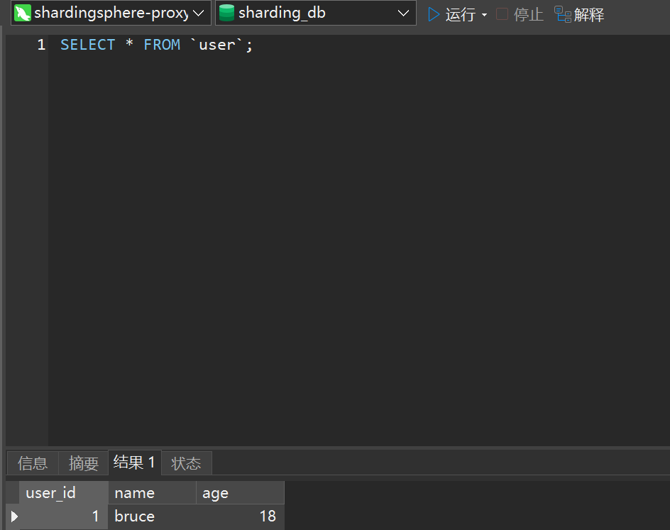
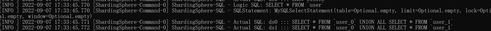
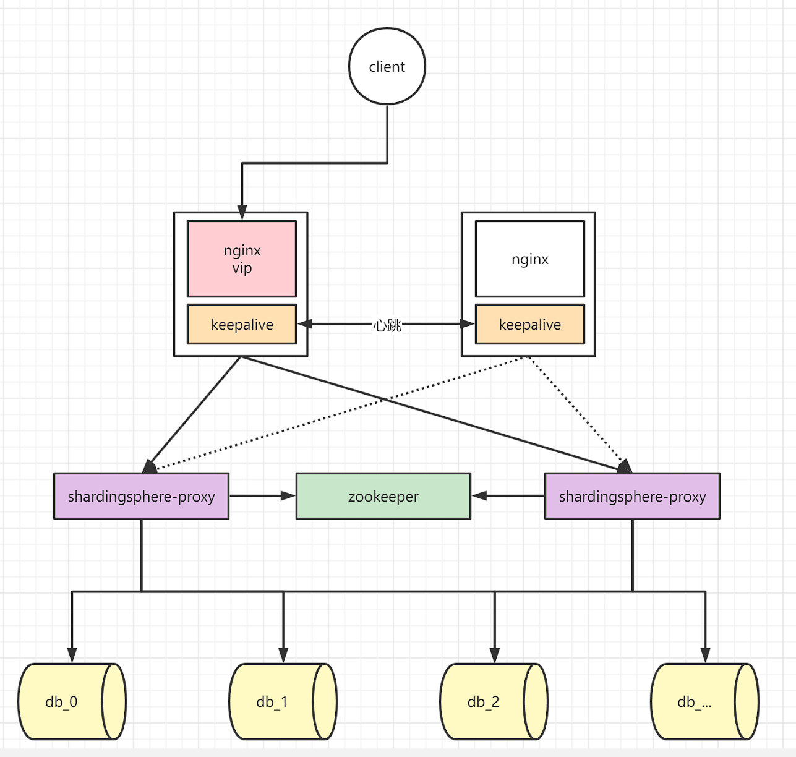

# Shardingshpere-proxy

[官网](https://shardingsphere.apache.org/document/)

版本：5.1.2

## 简介

ShardingSphere-Proxy 定位为透明化的数据库代理端，通过实现数据库二进制协议，对异构语言提供支持。 目前提供 MySQL 和 PostgreSQL 协议，透明化数据库操作，对 DBA 更加友好

1. 向应用程序完全透明，可直接当做 MySQL/PostgreSQL 使用
2. 连接池的统一管理，提高数据库连接的使用率，控制和减少无效的连接占用
3. 提高分库分表数据定位效率，通过数据库客户端工具直连shardingshpere-proxy进行对数据进行定位
4. 提高分库分表算法问题排查效率， 通过数据库客户端工具直连shardingshpere-proxy进行测试
5. 分片算法统一管理，对客户端透明
6. 分片数量动态调整，无需重启服务（原使用shardingshpere-jdbc的服务添加新分表需要修改代码，重新发版）
7. 支持读写分离，通过sql解析动态使用读库或写库
8. 数据脱敏统一处理，配合入口网关做数据脱敏，对服务透明（基于插件模式开发）


|            | ShardingSphere-JDBC | ShardingSphere-Proxy |
| :--------- | :------------------ | -------------------- |
| 数据库     | `任意`              | MySQL/PostgreSQL     |
| 连接消耗数 | `高`                | 低                   |
| 异构语言   | `仅 Java`           | 任意                 |
| 性能       | `损耗低`            | 损耗略高             |
| 无中心化   | `是`                | 否                   |
| 静态入口   | `无`                | 有                   |


## 搭建

以下测试使用内存模式

下载shardingsphere-proxy：https://shardingsphere.apache.org/document/current/cn/user-manual/shardingsphere-proxy/startup/bin/

配置 conf/service.yaml

```yaml
# 不配置默认是内存模式
#mode:
#  type: Standalone # Standalone, Cluster
#  repository:
#    type: File # File (基于 H2 的持久化), ZooKeeper/etcd(需要额外jar包)
##    props:
##      namespace: governance_ds  # 注册中心命名空间
##      server-lists: localhost:2181  # 注册中心连接地址
##      retryIntervalMilliseconds: 500
##      timeToLiveSeconds: 60
##      maxRetries: 3
##      operationTimeoutMilliseconds: 500
#  overwrite: false  # 是否使用本地配置覆盖持久化配置

rules:
  - !AUTHORITY
    users:
      - root@localhost:root
      - sharding@%:sharding
    provider:
      type: ALL_PERMITTED  # ALL_PERMITTED：授予所有权限，不鉴权，DATABASE_PERMITTED：为用户授予指定逻辑库的权限，通过 user-database-mappings 进行映射

  - !TRANSACTION
    defaultType: LOCAL  # 本地事务LOCAL, 强一致XA, 柔性BASE
#    providerType: Atomikos  # XA:Atomikos/Narayana, BASE:Seata
#    # When the provider type is Narayana, the following properties can be configured or not
#    props:
#      recoveryStoreUrl: jdbc:mysql://127.0.0.1:3306/jbossts
#      recoveryStoreDataSource: com.mysql.jdbc.jdbc2.optional.MysqlDataSource
#      recoveryStoreUser: root
#      recoveryStorePassword: 12345678

#  - !SQL_PARSER
#    sqlCommentParseEnabled: false  # 是否解析 SQL 注释
#    sqlStatementCache:        # SQL 语句本地缓存配置项
#      initialCapacity: 2000   # 本地缓存初始容量
#      maximumSize: 65535      # 本地缓存最大容量
#    parseTreeCache:           # 解析树本地缓存配置项
#      initialCapacity: 128
#      maximumSize: 1024

props:
  proxy-default-port: 3308
  # 一次查询请求在每个数据库实例中所能使用的最大连接数
#  max-connections-size-per-query: 1
  # 用于设置任务处理线程池的大小。每个 ShardingSphereDataSource 使用一个独立的线程池，同一个 JVM 的不同数据源不共享线程池
  kernel-executor-size: 16  # Infinite by default.
  # 设置传输数据条数的 IO 刷新阈值
#  proxy-frontend-flush-threshold: 128  # The default value is 128.
  # 使用 Hint 会将 Proxy 的线程处理模型由 IO 多路复用变更为每个请求一个独立的线程，会降低 Proxy 的吞吐量
#  proxy-hint-enabled: false
  # 是否在日志中打印 SQL。如果开启配置，日志将使用 Topic ShardingSphere-SQL，日志级别是 INFO
  sql-show: true
  # 是否在日志中打印简单风格的 SQL
  sql-simple: false
  show-process-list-enabled: false
  # Proxy 后端与数据库交互的每次获取数据行数（使用游标的情况下）。数值增大可能会增加 ShardingSphere Proxy 的内存使用。默认值为 -1，代表设置为 JDBC 驱动的最小值
#  proxy-backend-query-fetch-size: -1
  # 在程序启动和更新时，是否检查分片元数据的结构一致性 （开启后如果报空指针异常，一：排查数据源配置是否正确，二：排查表结构是否一致）
  check-table-metadata-enabled: true
  # 在程序启动和更新时，是否检查重复表
  check-duplicate-table-enabled: true
  # Proxy 前端 Netty 线程池线程数量，默认值 0 代表使用 Netty 默认值
  proxy-frontend-executor-size: 0
  # OLTP 选项可能会减少向客户端写入数据包的时间开销，但如果客户端连接数超过 proxy-frontend-executor-size，
  # 尤其是执行慢 SQL 时，它可能会增加 SQL 执行的延迟甚至阻塞其他客户端的连接
  proxy-backend-executor-suitable: OLAP # OLAP、OLTP
  # 允许连接 Proxy 的最大客户端数量，默认值 0 代表不限制
  proxy-frontend-max-connections: 0
#  # 是否开启 federation 查询
  sql-federation-enabled: false
  # Available proxy backend driver type: JDBC (default), ExperimentalVertx
  proxy-backend-driver-type: JDBC
  proxy-netty-backlog: 1024 # Proxy netty backlog.

```

配置 conf/conf-sharding.yaml

```yaml
# config-开头的yaml文件都是一个逻辑数据库
databaseName: sharding_db

# 数据源
dataSources:
  ds0:
    url: jdbc:mysql://ip:3306/ds0?serverTimezone=UTC&useSSL=false
    username: root
    password:  # 密码
    connectionTimeoutMilliseconds: 30000
    idleTimeoutMilliseconds: 60000
    maxLifetimeMilliseconds: 1800000
    maxPoolSize: 50
    minPoolSize: 1
  ds1:
    url: jdbc:mysql://ip:3306/ds1?serverTimezone=UTC&useSSL=false
    username: root
    password:  # 密码
    connectionTimeoutMilliseconds: 30000
    idleTimeoutMilliseconds: 60000
    maxLifetimeMilliseconds: 1800000
    maxPoolSize: 50
    minPoolSize: 1

rules:
  - !SHARDING
    tables: # 数据分片规则配置
      user: # 逻辑表名
        actualDataNodes: ds${0..1}.user_${0..1}  # 各个库中真实表名
        keyGenerateStrategy: # id自动生成器
          column: user_id
          keyGeneratorName: snowflake
        tableStrategy: # 分表策略，同分库策略
          standard:
            shardingColumn: user_id
            shardingAlgorithmName: user_inline  # 引用已定义分片算法
      user_favorite:
        actualDataNodes: ds${0..1}.user_favorite_${0..1}
        keyGenerateStrategy:
          column: user_favorite_id
          keyGeneratorName: snowflake
        tableStrategy:
          standard:
            shardingColumn: user_favorite_id
            shardingAlgorithmName: user_favorite_inline

    # 绑定表
    bindingTables:
      - user,user_favorite

    # 默认策略
    defaultDatabaseStrategy:
      standard:
        shardingColumn: user_id  # 按用户id分库
        shardingAlgorithmName: db_inline
    defaultTableStrategy:
      none:

    # 分片算法定义
    shardingAlgorithms:
      db_inline:
        type: INLINE # 内置分片算法
        props:
          algorithm-expression: ds${user_id % 2}
      #    db_user_inline:  # 因为主表定义的主键名字和子表不同，导致需要额外定义，建议主键命名一致 user_id
      #      type: INLINE
      #      props:
      #        algorithm-expression: db${id % 2}
      user_inline:
        type: INLINE
        props:
          algorithm-expression: user_${user_id % 2}
      user_favorite_inline:
        type: INLINE
        props:
          algorithm-expression: user_favorite_${user_favorite_id % 2}

    # id生成器定义
    keyGenerators:
      snowflake: # id生成器定义名
        type: SNOWFLAKE

#  # 广播表
#  broadcastTables:
#    - t_address

#  scalingName: default_scaling
#  scaling:
#    default_scaling:
#      input:
#        workerThread: 40
#        batchSize: 1000
#      output:
#        workerThread: 40
#        batchSize: 1000
#      streamChannel:
#        type: MEMORY
#        props:
#          block-queue-size: 10000
#      completionDetector:
#        type: IDLE
#        props:
#          incremental-task-idle-seconds-threshold: 1800
#      dataConsistencyChecker:
#        type: DATA_MATCH
#        props:
#          chunk-size: 1000
```

启动

```sh
sh %SHARDINGSPHERE_PROXY_HOME%/bin/start.sh
```



通过客户端连接



执行查询



查询日志




## 持久化

zookeeper


## 集群方案

### 搭建zookeeper集群 （此处不扩展）

集群节点管理、配置和规则存储


### 搭建shardingshpere-proxy节点集群

修改 server.yaml（每个节点修改）

```yaml
mode:
  type: Cluster
  repository:
    type: ZooKeeper
    props:
      namespace: governance_ds
      server-lists: zk_ip1:zk_port1,zk_ip2:zk_port2,zk_ip3:zk_port3
      retryIntervalMilliseconds: 500
      timeToLiveSeconds: 60
      maxRetries: 3
      operationTimeoutMilliseconds: 500
  overwrite: false
```

启动proxy节点

```sh
# 节点1
sh %SHARDINGSPHERE_PROXY_HOME%/bin/start.sh 3307
# 节点2
sh %SHARDINGSPHERE_PROXY_HOME%/bin/start.sh 3308
# 节点3
sh %SHARDINGSPHERE_PROXY_HOME%/bin/start.sh 3309
```

结果

```sql
mysql> SHOW INSTANCE LIST;
+----------------+-----------+------+---------+
| instance_id    | host      | port | status  |
+----------------+-----------+------+---------+
| ip@3309 | ip | 3309 | enabled |
| ip@3308 | ip | 3308 | enabled |
| ip@3307 | ip | 3307 | enabled |
+----------------+-----------+------+---------+
```

### 通过DistSQL配置规则

#### 动态定义资源

#### 动态定义规则


## 高可用


对于读写分离，当用户写库或读库关系发生变化时，支持动态的感知和纠正内部的主从关系，保证读流量和写流量的正确路由，如果从库宕机，可动态纠正存储节点的状态，保证读流量分发正常

### 使用限制

- 支持
  - MySQL MGR 单主模式
  - MySQL 主从复制模式
- 不支持
  - MySQL MGR 多主模式


## 负载均衡方案




## 动态管理资源和规则

### 属性管理

查看所有属性

```sql
SHOW ALL VARIABLES
```

查看指定属性

```sql
SHOW VARIABLE SQL_SHOW
```

修改代理属性

```sql
SET VARIABLE SQL_SHOW = true;
```


#### 使用限制

以下参数可以通过 SET VARIABLE 语句进行修改，但新值仅在 Proxy 重启后生效：

- kernel_executor_size
- proxy_frontend_executor_size
- proxy_backend_driver_type

以下参数为只读，不可修改：

cached_connections


### 存储节点管理

- ADD RESOURCE
- ALTER RESOURCE
- DROP RESOURCE
- SHOW SCHEMA RESOURCES

`RESOURCE` 相关语句仅作用于**逻辑库**，因此在操作之前，需要先创建并使用 `USE` 命令成功选择一个逻辑库：

```sql
DROP DATABASE IF EXISTS sharding_db;
 
CREATE DATABASE sharding_db;
 
USE sharding_db;
```

### ADD RESOURCE

```sql
ADD RESOURCE resource_1 (
    URL="jdbc:mysql://127.0.0.1:3306/db1?serverTimezone=UTC&useSSL=false",
    USER=root,
    PASSWORD=root,
    PROPERTIES("maximumPoolSize"=10,"idleTimeout"="30000")
);

# PROPERTIES参数用于指定 Proxy 与存储节点间连接池的属性配置
```

### **ALTER RESOURCE**

`ALTER RESOURCE` 用于修改已有存储节点的连接信息，如改变连接池大小、修改 JDBC 连接参数等

```sql

ALTER RESOURCE resource_3 (
    URL="jdbc:mysql://127.0.0.1:3306/db3?serverTimezone=GMT&useSSL=false",
    USER=root,
    PASSWORD=root,
    PROPERTIES("maximumPoolSize"=50,"idleTimeout"="30000")
);
```

由于修改存储节点可能导致元数据变更或应用数据异常 `ALTER RESOURCE ` 不能修改连接的目标 DB

### **DROP RESOURCE**

`DROP RESOURCE` 用于从逻辑库中删除存储节点，不会删除存储节点中的任何数据。语法示例如下：

```sql
DROP RESOURCE resource_0, resource_1;
```

### **SHOW SCHEMA RESOURCES**

`SHOW SCHEMA RESOURCES` 用于查询逻辑库中的存储节点，支持以下语法形式：

```sql
# 查询当前 use 的逻辑库中的存储节点
SHOW SCHEMA RESOURCES;
# 查询指定逻辑库中的存储节点
SHOW SCHEMA RESOURCES FROM sharding_db;
```


## 可观测性

 Tracing（链路跟踪）、Metrics（指标监控）和 Logging（日志）

使用说明：https://shardingsphere.apache.org/document/current/cn/user-manual/shardingsphere-proxy/observability/


## 性能测试


## 使用限制

兼容全部常用的路由至单数据节点的 SQL； 路由至多数据节点的 SQL 由于场景复杂，分为稳定支持、实验性支持和不支持这三种情况

### 稳定支持

全面支持 DML、DDL、DCL、TCL 和常用 DAL。 支持分页、去重、排序、分组、聚合、表关联等复杂查询（需要提供分片键，否则全库全表笛卡尔积）

#### 子查询

子查询和外层查询同时指定分片键，且分片键的值保持一致时，由内核提供稳定支持

```sql
SELECT * FROM (SELECT * FROM t_order WHERE order_id = 1) o WHERE o.order_id = 1;
```

#### 分页查询

```sql
SELECT * FROM t_order o ORDER BY id LIMIT ? OFFSET ?
```

#### 运算表达式中包含分片键 （不支持）

当分片键处于运算表达式中时，无法通过 SQL `字面` 提取用于分片的值，将导致全路由。 例如，假设 `create_time` 为分片键

```sql
SELECT * FROM t_order WHERE to_date(create_time, 'yyyy-mm-dd') = '2019-01-01';
```


### 实验性支持

实验性支持特指使用 Federation 执行引擎提供支持。 该引擎处于快速开发中，用户虽基本可用，但仍需大量优化，是实验性产品

```yaml
# 开启 Federation 执行引擎
sql-federation-enabled: true
```

#### 子查询

子查询和外层查询未同时指定分片键，或分片键的值不一致时，由 Federation 执行引擎提供支持

```sql
SELECT * FROM (SELECT * FROM t_order) o;

SELECT * FROM (SELECT * FROM t_order) o WHERE o.order_id = 1;

SELECT * FROM (SELECT * FROM t_order WHERE order_id = 1) o;

SELECT * FROM (SELECT * FROM t_order WHERE order_id = 1) o WHERE o.order_id = 2;
```

#### 跨库关联查询

### 不支持

#### CASE WHEN

以下 CASE WHEN 语句不支持：

- CASE WHEN 中包含子查询
- CASE WHEN 中使用逻辑表名（请使用表别名）
  - SELECT MAX(tbl_name.col1) FROM tbl_name
